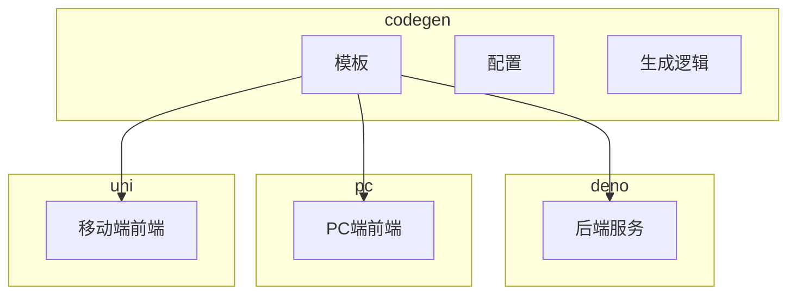
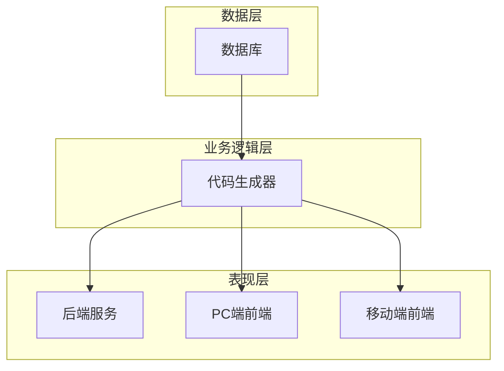
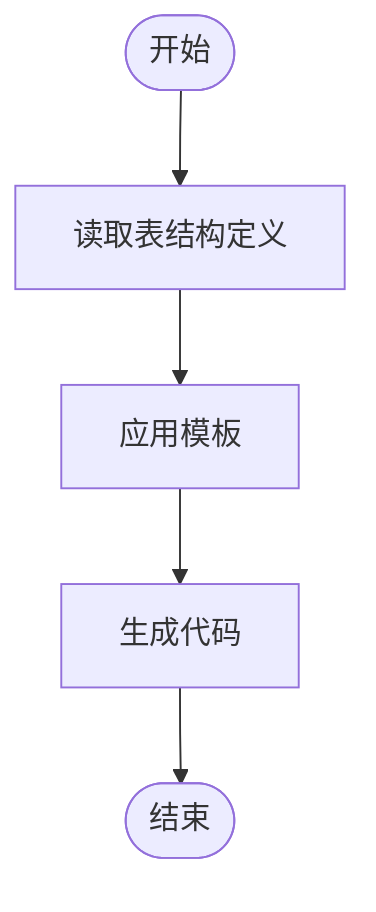
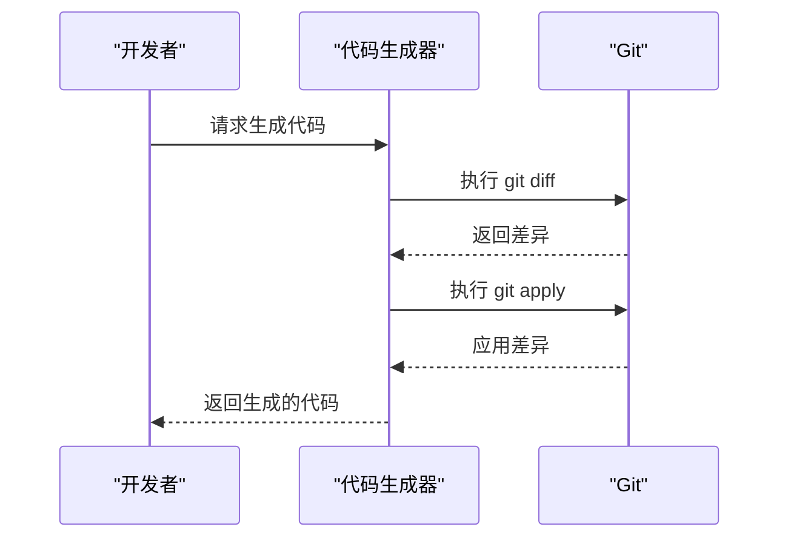
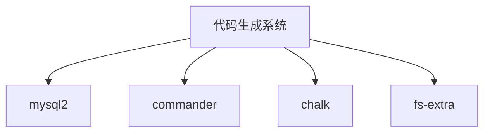

# 代码生成系统

**本文档引用的文件**   
- [codegen.ts](https://github.com/sail-sail/nest/blob/main/codegen/src/bin/codegen.ts)
- [codegen.ts](https://github.com/sail-sail/nest/blob/main/codegen/src/lib/codegen.ts)
- [information_schema.ts](https://github.com/sail-sail/nest/blob/main/codegen/src/lib/information_schema.ts)
- [tables.ts](https://github.com/sail-sail/nest/blob/main/codegen/src/tables/tables.ts)
- [config.ts](https://github.com/sail-sail/nest/blob/main/codegen/src/config.ts)
- [base.sql](https://github.com/sail-sail/nest/blob/main/codegen/src/tables/base/base.sql)
- [base.ts](https://github.com/sail-sail/nest/blob/main/codegen/src/tables/base/base.ts) - *新增当前租户字段*
- [config.ts](https://github.com/sail-sail/nest/blob/main/codegen/src/config.ts) - *新增外键搜索方式配置*
- [List.vue](https://github.com/sail-sail/nest/blob/main/codegen/src/template/pc/src/views/[[mod_slash_table]]/List.vue) - *前端搜索功能增强*
- [dict.dao.ts](https://github.com/sail-sail/nest/blob/main/codegen/__out__/deno/gen/base/dict/dict.dao.ts) - *新增关键词搜索功能*
- [dict.graphql.ts](https://github.com/sail-sail/nest/blob/main/codegen/__out__/deno/gen/base/dict/dict.graphql.ts) - *新增关键词搜索功能*

## 更新摘要
**变更内容**   
- 新增了基表 `base_tenant` 的 `is_current_tenant` 字段说明
- 为DAO层添加了基于关键词的搜索功能
- 升级了代码生成系统的依赖包并优化了升级工具
- 在代码生成配置中添加了外键搜索方式的新选项 `isSearchBySelectInput`
- 更新了相关配置文件和模板以支持新功能

## 目录
1. [简介](#简介)
2. [项目结构](#项目结构)
3. [核心组件](#核心组件)
4. [架构概述](#架构概述)
5. [详细组件分析](#详细组件分析)
6. [依赖分析](#依赖分析)
7. [性能考虑](#性能考虑)
8. [故障排除指南](#故障排除指南)
9. [结论](#结论)

## 简介
本系统是一个基于 Nest.js 框架的全栈代码自动生成系统，旨在通过数据库模式定义（如 base.sql 和 tables.ts）自动生成前后端代码。系统采用增量更新机制，利用 git diff 和 git apply 技术保留开发者的手动修改，解决了传统代码生成器的痛点。通过定义清晰的模式语法，系统能够生成完整的业务模块，包括后端的 DAO、Service、Resolver 和前端的 Api、Model、组件等。该系统支持自定义模板，允许开发者根据特定需求扩展或修改现有模板。

## 项目结构
项目结构清晰地分为多个模块，每个模块负责不同的功能。主要模块包括 codegen、deno、pc 和 uni。codegen 模块是代码生成的核心，包含模板、配置和生成逻辑。deno 模块负责后端服务的生成，pc 模块负责 PC 端前端的生成，uni 模块负责移动端前端的生成。

**图示来源**
- [codegen.ts](https://github.com/sail-sail/nest/blob/main/codegen/src/bin/codegen.ts#L1-L124)
- [codegen.ts](https://github.com/sail-sail/nest/blob/main/codegen/src/lib/codegen.ts#L1-L748)

**本节来源**
- [codegen.ts](https://github.com/sail-sail/nest/blob/main/codegen/src/bin/codegen.ts#L1-L124)
- [codegen.ts](https://github.com/sail-sail/nest/blob/main/codegen/src/lib/codegen.ts#L1-L748)

## 核心组件
核心组件包括代码生成器、模板引擎和增量更新机制。代码生成器读取数据库模式定义，应用模板生成代码。模板引擎支持多种模板，包括后端服务、PC端前端和移动端前端。增量更新机制利用 git diff 和 git apply 技术，确保生成的代码不会覆盖开发者的手动修改。

**本节来源**
- [codegen.ts](https://github.com/sail-sail/nest/blob/main/codegen/src/bin/codegen.ts#L1-L124)
- [codegen.ts](https://github.com/sail-sail/nest/blob/main/codegen/src/lib/codegen.ts#L1-L748)

## 架构概述
系统架构采用分层设计，分为数据层、业务逻辑层和表现层。数据层负责与数据库交互，业务逻辑层处理业务规则，表现层负责用户界面。代码生成器位于业务逻辑层，通过读取数据层的模式定义，生成表现层的代码。

**图示来源**
- [information_schema.ts](https://github.com/sail-sail/nest/blob/main/codegen/src/lib/information_schema.ts#L1-L799)
- [codegen.ts](https://github.com/sail-sail/nest/blob/main/codegen/src/lib/codegen.ts#L1-L748)

## 详细组件分析
### 代码生成器分析
代码生成器是系统的核心，负责读取数据库模式定义并生成代码。它通过读取 tables.ts 文件中的表定义，结合模板生成相应的代码。

#### 代码生成流程

**图示来源**
- [codegen.ts](https://github.com/sail-sail/nest/blob/main/codegen/src/bin/codegen.ts#L1-L124)
- [codegen.ts](https://github.com/sail-sail/nest/blob/main/codegen/src/lib/codegen.ts#L1-L748)

**本节来源**
- [codegen.ts](https://github.com/sail-sail/nest/blob/main/codegen/src/bin/codegen.ts#L1-L124)
- [codegen.ts](https://github.com/sail-sail/nest/blob/main/codegen/src/lib/codegen.ts#L1-L748)

### 增量更新机制分析
增量更新机制确保生成的代码不会覆盖开发者的手动修改。它通过 git diff 和 git apply 技术实现。

#### 增量更新流程

**图示来源**
- [codegen.ts](https://github.com/sail-sail/nest/blob/main/codegen/src/lib/codegen.ts#L1-L748)
- [information_schema.ts](https://github.com/sail-sail/nest/blob/main/codegen/src/lib/information_schema.ts#L1-L799)

**本节来源**
- [codegen.ts](https://github.com/sail-sail/nest/blob/main/codegen/src/lib/codegen.ts#L1-L748)
- [information_schema.ts](https://github.com/sail-sail/nest/blob/main/codegen/src/lib/information_schema.ts#L1-L799)

### 新增功能分析
#### 关键词搜索功能
系统为DAO层添加了基于关键词的搜索功能，允许在多个字段上进行模糊搜索。

**本节来源**
- [dict.dao.ts](https://github.com/sail-sail/nest/blob/main/codegen/__out__/deno/gen/base/dict/dict.dao.ts)
- [dict.graphql.ts](https://github.com/sail-sail/nest/blob/main/codegen/__out__/deno/gen/base/dict/dict.graphql.ts)

#### 外键搜索方式配置
在代码生成配置中新增了 `isSearchBySelectInput` 选项，允许配置外键字段的搜索方式。

**本节来源**
- [config.ts](https://github.com/sail-sail/nest/blob/main/codegen/src/config.ts)
- [List.vue](https://github.com/sail-sail/nest/blob/main/codegen/src/template/pc/src/views/[[mod_slash_table]]/List.vue)

#### 当前租户字段
在基表配置中新增了 `is_current_tenant` 字段，用于标识当前租户。

**本节来源**
- [base.ts](https://github.com/sail-sail/nest/blob/main/codegen/src/tables/base/base.ts)

## 依赖分析
系统依赖于多个外部库，包括 mysql2、commander、chalk 和 fs-extra。这些库提供了数据库连接、命令行解析、颜色输出和文件操作等功能。近期已升级相关依赖包并优化了升级工具。

**图示来源**
- [package.json](https://github.com/sail-sail/nest/blob/main/codegen/package.json#L1-L20)
- [codegen.ts](https://github.com/sail-sail/nest/blob/main/codegen/src/bin/codegen.ts#L1-L124)

**本节来源**
- [package.json](https://github.com/sail-sail/nest/blob/main/codegen/package.json#L1-L20)
- [npmUpgradeAll.ts](https://github.com/sail-sail/nest/blob/main/codegen/src/util/npmUpgradeAll.ts)

## 性能考虑
系统在设计时考虑了性能优化，特别是在代码生成和增量更新方面。通过缓存数据库模式定义和使用高效的模板引擎，系统能够快速生成代码。增量更新机制减少了不必要的文件覆盖，提高了开发效率。新增的关键词搜索功能通过优化SQL查询提升了搜索性能。

## 故障排除指南
### 常见问题
1. **代码生成失败**：检查数据库连接是否正常，确保 tables.ts 文件中的表定义正确。
2. **增量更新失败**：检查 git 状态，确保没有未提交的更改。
3. **关键词搜索无效**：确认表配置中已正确设置 `searchByKeyword` 选项。
4. **外键搜索方式不生效**：检查 `isSearchBySelectInput` 配置是否正确应用。

**本节来源**
- [codegen.ts](https://github.com/sail-sail/nest/blob/main/codegen/src/lib/codegen.ts#L1-L748)
- [information_schema.ts](https://github.com/sail-sail/nest/blob/main/codegen/src/lib/information_schema.ts#L1-L799)

## 结论
本代码生成系统通过自动化生成前后端代码，显著提高了开发效率。其增量更新机制确保了开发者的手动修改不会被覆盖，解决了传统代码生成器的痛点。通过自定义模板，系统能够满足不同项目的需求，具有很高的灵活性和可扩展性。新增的功能进一步增强了系统的搜索能力和配置灵活性。