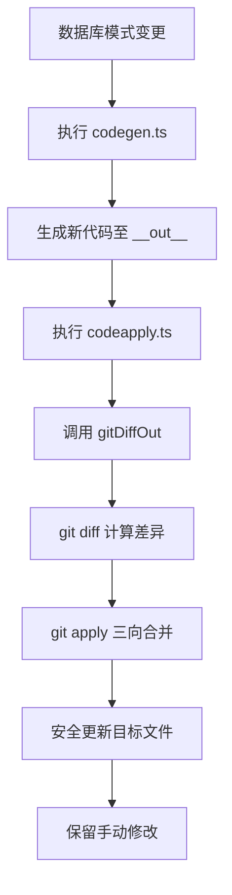
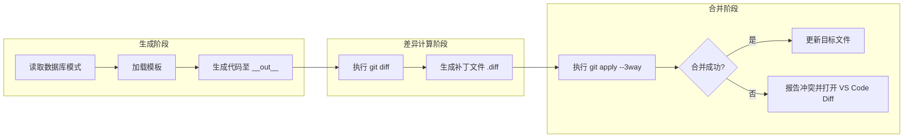
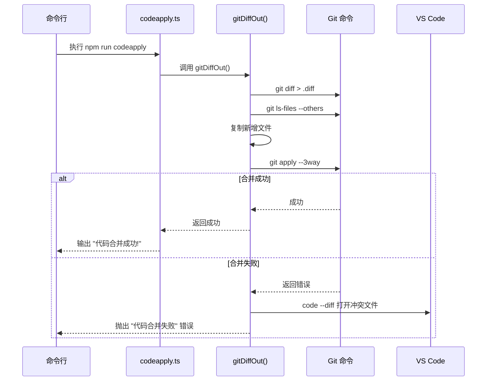
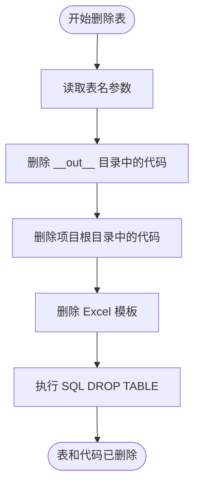
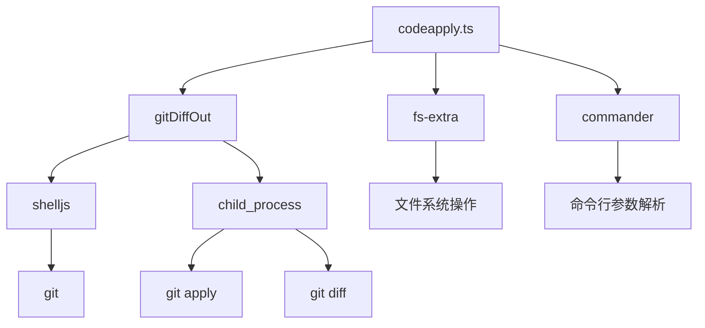

# 增量更新机制


**本文档引用文件**  
- [codeapply.ts](https://github.com/sail-sail/nest/blob/main/codegen/src/bin/codeapply.ts)
- [coderemove.ts](https://github.com/sail-sail/nest/blob/main/codegen/src/bin/coderemove.ts)
- [codegen.ts](https://github.com/sail-sail/nest/blob/main/codegen/src/lib/codegen.ts)
- [coderemove_lib.ts](https://github.com/sail-sail/nest/blob/main/codegen/src/lib/coderemove.ts)
- [cache](https://github.com/sail-sail/nest/blob/main/codegen/cache)


## 目录

1. [引言](#引言)  
2. [项目结构](#项目结构)  
3. [核心组件](#核心组件)  
4. [架构概览](#架构概览)  
5. [详细组件分析](#详细组件分析)  
6. [依赖分析](#依赖分析)  
7. [性能考量](#性能考量)  
8. [故障排除指南](#故障排除指南)  
9. [结论](#结论)

## 引言

本技术文档旨在深入解析 Nest 代码生成系统中的**增量更新机制**，解决传统代码生成器在重复生成时覆盖开发者手动修改的痛点。通过结合 `git diff` 与 `git apply` 技术，系统实现了智能代码合并，确保在数据库模式变更后，仅生成最小化变更集并安全地更新现有代码，同时保留所有已有修改。

文档将详细阐述 `codeapply.ts` 和 `coderemove.ts` 的工作原理、`cache` 目录的作用，并通过具体场景演示增量更新流程。同时提供开发者使用指南、最佳实践及常见问题解决方案。

## 项目结构

项目根目录 `` 包含多个子模块，其中 `codegen` 是代码生成的核心模块。其关键目录结构如下：

```
codegen/
├── __out__/                  # 临时输出目录，存放生成的中间代码
├── cache/                    # 缓存目录，存储生成前后代码快照用于差异计算
├── src/
│   ├── bin/
│   │   ├── codeapply.ts      # 增量更新主入口，执行 git diff 和 apply
│   │   ├── codegen.ts        # 代码生成主逻辑
│   │   └── coderemove.ts     # 删除表及对应代码
│   ├── lib/
│   │   ├── codegen.ts        # 核心生成逻辑，包含 gitDiffOut
│   │   └── coderemove.ts     # 删除逻辑实现
│   └── config.ts             # 生成配置
└── template/                 # 模板文件目录
```

生成的代码最终通过 `__out__` 目录合并到 `deno/`, `pc/`, `uni/` 等目标项目中。



**图示来源**  
- [codeapply.ts](https://github.com/sail-sail/nest/blob/main/codegen/src/bin/codeapply.ts)
- [codegen.ts](https://github.com/sail-sail/nest/blob/main/codegen/src/lib/codegen.ts)

## 核心组件

系统的核心在于利用 Git 的版本控制能力实现非破坏性更新。主要组件包括：

- **`gitDiffOut` 函数**：位于 `codegen.ts`，是增量更新的核心。它生成当前工作区与 `__out__` 目录的差异，并尝试应用补丁。
- **`codeapply.ts`**：命令行入口，调用 `gitDiffOut` 执行整个增量更新流程。
- **`cache` 目录**：存储代码生成前的快照，用于与新生成代码进行精确对比。
- **`__out__` 目录**：作为代码生成的“沙箱”，所有新代码首先在此生成，再通过 Git 合并到主项目。

这些组件协同工作，确保了代码生成的幂等性和安全性。

**本节来源**  
- [codeapply.ts](https://github.com/sail-sail/nest/blob/main/codegen/src/bin/codeapply.ts)
- [codegen.ts](https://github.com/sail-sail/nest/blob/main/codegen/src/lib/codegen.ts)
- [cache](https://github.com/sail-sail/nest/blob/main/codegen/cache)

## 架构概览

整个增量更新机制的架构可以分为三个主要阶段：**生成 (Generate)**、**差异计算 (Diff)** 和 **合并 (Apply)**。



该架构的关键优势在于利用了 Git 的三向合并（three-way merge）算法，能够智能地处理代码块的插入、修改和删除，极大降低了手动修改被覆盖的风险。

**图示来源**  
- [codegen.ts](https://github.com/sail-sail/nest/blob/main/codegen/src/lib/codegen.ts#L700-L748)
- [codeapply.ts](https://github.com/sail-sail/nest/blob/main/codegen/src/bin/codeapply.ts#L1-L14)

## 详细组件分析

### codeapply.ts 分析

`codeapply.ts` 是增量更新的启动脚本。它非常简洁，主要职责是调用 `lib/codegen` 中的 `gitDiffOut` 函数，并处理可能的异常。

```typescript
import { gitDiffOut } from "../lib/codegen";

async function exec() {
  await gitDiffOut();
}

(async function() {
  try {
    await exec();
  } catch(err) {
    console.error(err);
  } finally {
    process.exit(0);
  }
})();
```

其工作流程如下：
1.  导入 `gitDiffOut` 函数。
2.  执行 `gitDiffOut`。
3.  捕获并打印任何错误。
4.  无论成功与否，最终退出进程。

**本节来源**  
- [codeapply.ts](https://github.com/sail-sail/nest/blob/main/codegen/src/bin/codeapply.ts#L1-L14)

### codegen.ts 中的 gitDiffOut 分析

`gitDiffOut` 函数是整个机制的核心，其实现逻辑复杂且精巧。

#### 工作流程

1.  **执行差异计算**：
    ```typescript
    const diffStr = `git diff --full-index ./* > ${projectPh}/${ diffFile }`;
    execSync(diffStr, { cwd: projectPh });
    ```
    此命令在项目根目录 (`projectPh`) 执行 `git diff`，将当前工作区（包含旧代码）与 `__out__` 目录（包含新代码）的差异输出到一个临时 `.diff` 文件中。

2.  **处理新增文件**：
    ```typescript
    const arr = execSync("git ls-files --others --exclude-standard", { cwd: projectPh })
      .toString()
      .split("\n")
      .filter((item: string) => item);
    ```
    使用 `git ls-files --others` 查找所有未被 Git 跟踪的新文件（即 `__out__` 中新增的文件），并将它们直接复制到项目根目录。

3.  **准备补丁**：
    ```typescript
    str = str.replace(/\/codegen\/__out__\//gm, "/");
    ```
    由于 `git diff` 生成的路径是相对于 `__out__` 的，此步骤将路径修正为相对于项目根目录，以便 `git apply` 能正确应用。

4.  **应用补丁**：
    ```typescript
    exec(
      `git apply ${ diffFile } --3way --ignore-space-change --binary --whitespace=nowarn`,
      ...
    );
    ```
    这是最关键的一步。`--3way` 参数启用三向合并，Git 会利用其内部的合并算法，结合当前版本、目标版本和公共祖先（即 `cache` 中的快照），智能地合并代码。`--ignore-space-change` 忽略空格差异，`--binary` 支持二进制文件（如 Excel 模板）。

5.  **冲突处理**：
    如果 `git apply` 失败（例如，同一行代码被生成器和开发者同时修改），系统会捕获错误，并通过 `code --diff` 命令在 VS Code 中打开差异视图，让开发者手动解决冲突。



**图示来源**  
- [codegen.ts](https://github.com/sail-sail/nest/blob/main/codegen/src/lib/codegen.ts#L700-L748)
- [codeapply.ts](https://github.com/sail-sail/nest/blob/main/codegen/src/bin/codeapply.ts#L1-L14)

### cache 目录的作用

`cache` 目录是实现精确差异计算的基石。它存储了代码生成前各个文件的快照（通常以文件内容的哈希值命名，如 `004261c468e74506318cb8d39f73d887.js`）。

当系统需要判断一个文件是否真的发生了变化时，它会：
1.  计算当前生成的新代码的哈希值。
2.  在 `cache` 目录中查找同名文件的旧哈希值。
3.  比较两个哈希值。

只有当哈希值不同时，系统才会认为该文件需要更新，并将其写入 `__out__` 目录。这避免了因文件时间戳或无关空格变化而触发不必要的更新，确保了 `git diff` 计算出的差异是真正有意义的代码变更。

**本节来源**  
- [cache](https://github.com/sail-sail/nest/blob/main/codegen/cache)
- [codegen.ts](https://github.com/sail-sail/nest/blob/main/codegen/src/lib/codegen.ts#L500-L550)

### coderemove.ts 分析

`coderemove.ts` 负责安全地删除一个数据库表及其所有相关代码。



其逻辑清晰：
1.  接收命令行参数 `--table` 指定要删除的表。
2.  使用 `fs/promises` 的 `rm` 函数，递归强制删除 `__out__` 和项目根目录中与该表对应的所有生成文件（如 `deno/gen/table/`, `pc/src/views/table/`）。
3.  最后，执行 `DROP TABLE` SQL 语句从数据库中删除该表。

这种方式确保了代码和数据库的同步删除。

**本节来源**  
- [coderemove.ts](https://github.com/sail-sail/nest/blob/main/codegen/src/bin/coderemove.ts#L1-L38)
- [coderemove_lib.ts](https://github.com/sail-sail/nest/blob/main/codegen/src/lib/coderemove.ts#L1-L41)

## 依赖分析

该系统依赖于多个关键的外部工具和库：



- **Git**：核心依赖，提供 `diff` 和 `apply` 命令，是实现智能合并的基础。
- **shelljs**：用于执行 Git 命令和文件系统操作。
- **fs-extra**：提供增强的文件系统操作 API，如 `copy`, `mkdir`, `readdir`。
- **commander**：用于解析 `coderemove.ts` 的命令行参数。

**图示来源**  
- [codeapply.ts](https://github.com/sail-sail/nest/blob/main/codegen/src/bin/codeapply.ts)
- [codegen.ts](https://github.com/sail-sail/nest/blob/main/codegen/src/lib/codegen.ts)
- [coderemove.ts](https://github.com/sail-sail/nest/blob/main/codegen/src/bin/coderemove.ts)

## 性能考量

- **缓存机制**：`cache` 目录的哈希比较避免了对未变更文件的重复处理，显著提升了性能。
- **批量操作**：`treeDir` 函数递归处理整个目录，减少了 I/O 操作的开销。
- **Git 效率**：`git diff` 和 `git apply` 是高度优化的 C 程序，处理大型代码库时效率很高。
- **潜在瓶颈**：当 `__out__` 目录与工作区差异巨大时，`git apply` 的三向合并可能消耗较多内存和 CPU。

## 故障排除指南

| 问题 | 可能原因 | 解决方案 |
| :--- | :--- | :--- |
| **代码合并失败** | 同一行代码被生成器和开发者同时修改，导致 Git 合并冲突。 | 根据错误提示，使用 VS Code 手动解决冲突，然后重新运行 `codeapply`。 |
| **找不到 git 命令** | 系统未安装 Git 或 Git 未加入环境变量 PATH。 | 安装 Git 并确保其可从命令行访问。 |
| **生成的文件未更新** | `cache` 目录中的快照与当前文件内容一致，系统认为无变更。 | 检查数据库模式或模板是否确实发生了变化。 |
| **新增文件未被复制** | `git ls-files --others` 命令执行失败或路径处理错误。 | 检查 `__out__` 目录的权限和路径是否正确。 |

**本节来源**  
- [codegen.ts](https://github.com/sail-sail/nest/blob/main/codegen/src/lib/codegen.ts#L720-L740)
- [codeapply.ts](https://github.com/sail-sail/nest/blob/main/codegen/src/bin/codeapply.ts)

## 结论

Nest 代码生成系统的增量更新机制通过巧妙地结合 Git 的版本控制能力，成功解决了传统代码生成器的“覆盖修改”难题。其核心思想是将代码生成视为一次“提交”，利用 `git diff` 和 `git apply --3way` 来安全地合并变更。`cache` 目录提供了精确的变更检测，而 `codeapply.ts` 和 `coderemove.ts` 则提供了清晰的命令行接口。

这一设计不仅保证了开发者手动修改的安全性，还通过自动化流程极大地提升了开发效率。对于需要频繁进行数据库模式迭代的项目，该机制是不可或缺的生产力工具。