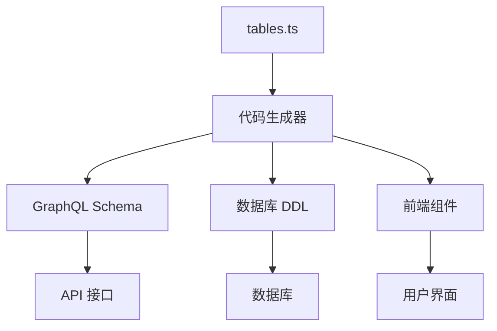
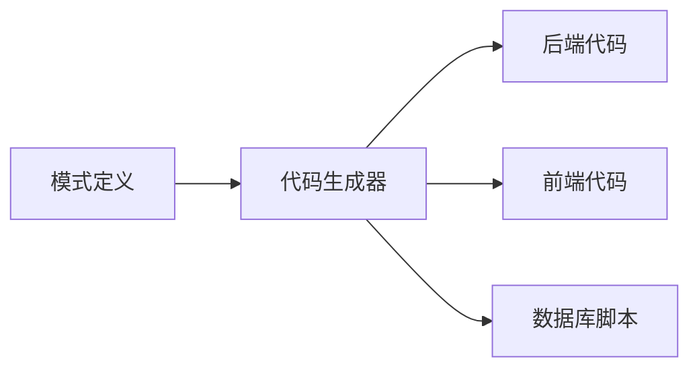
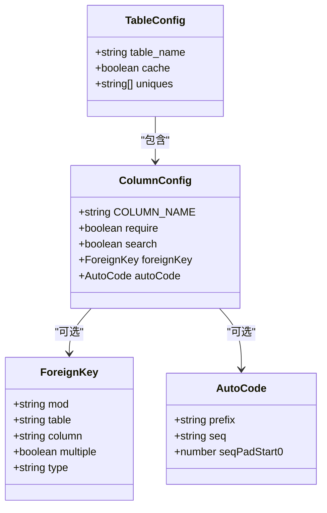
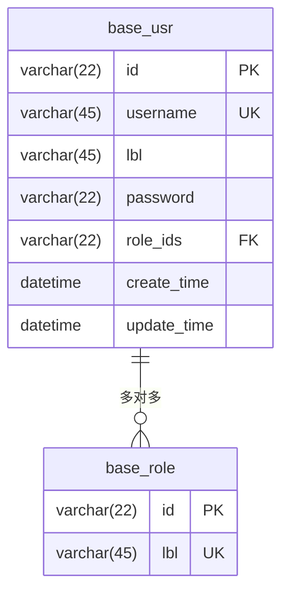
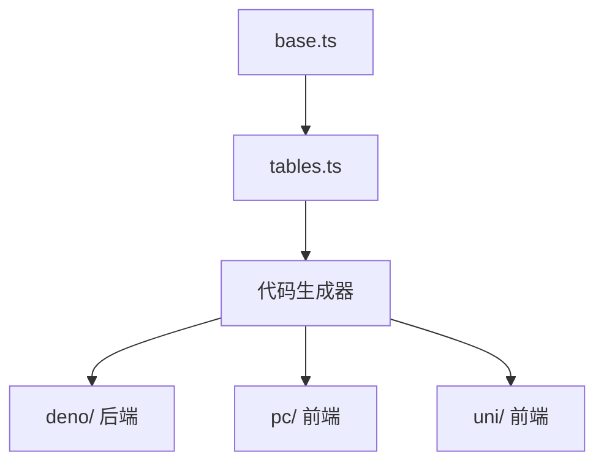

# 模式定义


**本文档引用文件**  
- [TABLE_RULES.md](https://github.com/sail-sail/nest/blob/main/codegen/.github/TABLE_RULES.md)
- [config.ts](https://github.com/sail-sail/nest/blob/main/codegen/src/config.ts)
- [tables.ts](https://github.com/sail-sail/nest/blob/main/codegen/src/tables/tables.ts)
- [base.ts](https://github.com/sail-sail/nest/blob/main/codegen/src/tables/base/base.ts)


## 目录
1. [简介](#简介)
2. [项目结构](#项目结构)
3. [核心组件](#核心组件)
4. [架构概览](#架构概览)
5. [详细组件分析](#详细组件分析)
6. [依赖分析](#依赖分析)
7. [性能考虑](#性能考虑)
8. [故障排除指南](#故障排除指南)
9. [结论](#结论)

## 简介
本开发模式定义文档详细阐述了 Nest 代码生成系统的数据模式定义语法与规则。重点说明如何在 `tables.ts` 和 `base.ts` 文件中定义数据库表结构，包括字段类型（如 VARCHAR、TEXT、BIGINT）、约束（主键、外键、唯一性）和特殊标记（如 @auto、@index）。文档还解释了 `TABLE_RULES.md` 中规定的命名规范和建表约定，如表名前缀、字段命名规则等。通过具体示例展示如何定义基础表（如 usr、dept、role）和业务表，以及如何表示表间关系（一对多、多对多）。同时，说明模式定义如何映射到生成的 GraphQL 类型、数据库 DDL 语句和前端模型，并为开发者提供最佳实践建议，如字段设计原则、索引策略和数据类型选择。

## 项目结构
Nest 代码生成系统采用模块化设计，主要结构如下：
- `codegen/`：代码生成器核心逻辑
  - `.github/`：包含建表规范 `TABLE_RULES.md`
  - `src/tables/`：存放表结构定义文件
  - `src/config.ts`：定义字段配置接口
- `deno/`：后端生成代码
- `pc/` 和 `uni/`：前端生成代码

该结构支持从单一模式定义自动生成前后端完整 CRUD 功能。



**图表来源**
- [tables.ts](https://github.com/sail-sail/nest/blob/main/codegen/src/tables/tables.ts)
- [config.ts](https://github.com/sail-sail/nest/blob/main/codegen/src/config.ts)

**本节来源**
- [tables.ts](https://github.com/sail-sail/nest/blob/main/codegen/src/tables/tables.ts)
- [TABLE_RULES.md](https://github.com/sail-sail/nest/blob/main/codegen/.github/TABLE_RULES.md)

## 核心组件
系统的核心是基于 TypeScript 的模式定义系统，通过 `defineConfig` 函数定义数据库表结构。每个表由 `opts`（选项）和 `columns`（字段列表）组成。字段定义遵循统一接口 `TableCloumn`，包含字段名、类型、约束、外键关系等元数据。

**本节来源**
- [config.ts](https://github.com/sail-sail/nest/blob/main/codegen/src/config.ts)
- [base.ts](https://github.com/sail-sail/nest/blob/main/codegen/src/tables/base/base.ts)

## 架构概览
整个系统采用“定义即代码”理念，开发者只需在 `tables.ts` 中声明表结构，代码生成器会自动产出：
- 后端：GraphQL Schema、DAO、Service、Resolver
- 前端：Vue 组件、API 调用、路由配置
- 数据库：DDL 建表语句



**图表来源**
- [tables.ts](https://github.com/sail-sail/nest/blob/main/codegen/src/tables/tables.ts)
- [config.ts](https://github.com/sail-sail/nest/blob/main/codegen/src/config.ts)

## 详细组件分析

### 表结构定义分析
表结构通过对象字面量定义，键名为表名（如 `base_usr`），值包含 `opts` 和 `columns`。

#### 字段定义示例
```typescript
{
  COLUMN_NAME: "username",
  require: true,
  search: true,
  width: 140,
  align: "center"
}
```
此定义表示 `username` 字段为必填、可搜索、宽度 140px、居中对齐。

#### 外键关系定义
```typescript
foreignKey: {
  mod: "base",
  table: "org",
  column: "id",
  lbl: "lbl",
  multiple: true,
  type: "many2many"
}
```
表示该字段关联 `base` 模块的 `org` 表，多对多关系，显示标签为 `lbl`。



**图表来源**
- [config.ts](https://github.com/sail-sail/nest/blob/main/codegen/src/config.ts)
- [base.ts](https://github.com/sail-sail/nest/blob/main/codegen/src/tables/base/base.ts)

**本节来源**
- [config.ts](https://github.com/sail-sail/nest/blob/main/codegen/src/config.ts)
- [base.ts](https://github.com/sail-sail/nest/blob/main/codegen/src/tables/base/base.ts)

### 基础表定义分析
`base.ts` 文件定义了系统基础表，如用户、角色、租户等。这些表遵循统一的审计字段规范。

#### 用户表 (base_usr) 字段分析
| 字段名 | 类型 | 说明 |
|--------|------|------|
| id | varchar(22) | 主键，Base64 编码 UUID |
| username | varchar(45) | 用户名，唯一 |
| password | varchar(22) | 密码（加密存储） |
| role_ids | varchar(22) | 角色ID列表（外键） |
| create_time | datetime | 创建时间 |



**图表来源**
- [base.ts](https://github.com/sail-sail/nest/blob/main/codegen/src/tables/base/base.ts)

**本节来源**
- [base.ts](https://github.com/sail-sail/nest/blob/main/codegen/src/tables/base/base.ts)

## 依赖分析
系统依赖关系清晰，代码生成器依赖模式定义文件，前端和后端代码均依赖生成器输出。



**图表来源**
- [tables.ts](https://github.com/sail-sail/nest/blob/main/codegen/src/tables/tables.ts)
- [base.ts](https://github.com/sail-sail/nest/blob/main/codegen/src/tables/base/base.ts)

**本节来源**
- [tables.ts](https://github.com/sail-sail/nest/blob/main/codegen/src/tables/tables.ts)
- [base.ts](https://github.com/sail-sail/nest/blob/main/codegen/src/tables/base/base.ts)

## 性能考虑
- **索引设计**：所有可搜索字段（`search: true`）自动创建索引
- **缓存机制**：`opts.cache = true` 的表在服务端缓存
- **字段冗余**：外键关联自动冗余 `lbl` 字段，避免频繁 JOIN 查询
- **软删除**：所有表支持软删除，避免数据丢失

## 故障排除指南
常见问题及解决方案：

1. **字段未生成**
   - 检查是否设置了 `onlyCodegenDeno: true`
   - 确认字段名是否在 `ignoreCodegen` 列表中

2. **外键关联不显示**
   - 检查 `foreignKey` 配置是否正确
   - 确认关联表是否存在且已定义

3. **自动编码不生效**
   - 确保同时定义了 `code` 和 `code_seq` 字段
   - 检查 `autoCode` 配置的 `seq` 字段是否存在

**本节来源**
- [config.ts](https://github.com/sail-sail/nest/blob/main/codegen/src/config.ts)
- [base.ts](https://github.com/sail-sail/nest/blob/main/codegen/src/tables/base/base.ts)

## 结论
Nest 代码生成系统通过统一的模式定义实现了高效、一致的全栈开发。开发者只需关注业务表结构定义，系统自动处理前后端代码生成和数据库同步。遵循 `TABLE_RULES.md` 中的命名和设计规范，可确保系统可维护性和扩展性。建议在新表定义时优先参考 `base` 模块中的基础表实现模式。