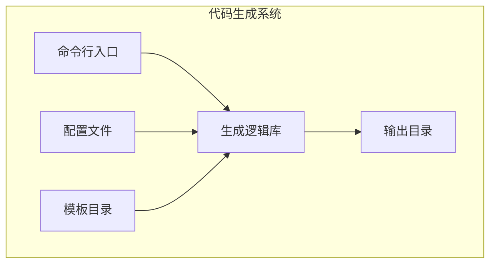
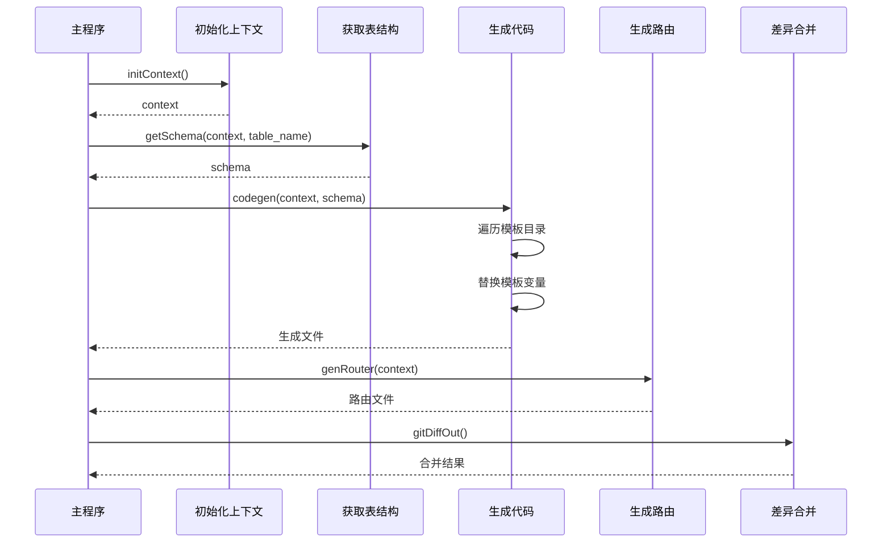
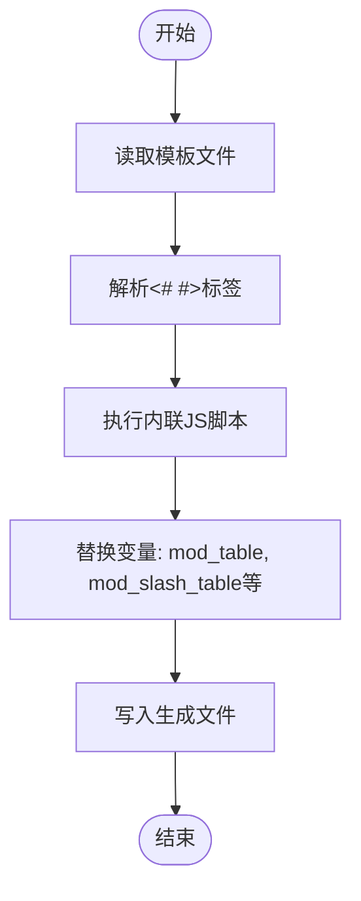
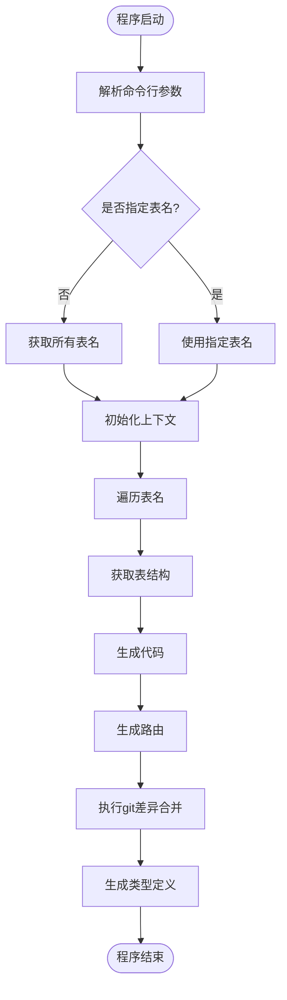

# 生成配置


**本文档引用的文件**
- [codegen.ts](https://github.com/sail-sail/nest/blob/main/codegen\src\bin\codegen.ts)
- [config.ts](https://github.com/sail-sail/nest/blob/main/codegen\src\config.ts)
- [codegen.ts](https://github.com/sail-sail/nest/blob/main/codegen\src\lib\codegen.ts)
- [create_mod.md](https://github.com/sail-sail/nest/blob/main/codegen\.github\create_mod.md)


## 目录
1. [项目结构分析](#项目结构分析)
2. [核心生成逻辑](#核心生成逻辑)
3. [配置参数详解](#配置参数详解)
4. [命令行工具使用](#命令行工具使用)
5. [模块创建规范](#模块创建规范)
6. [生成流程与案例](#生成流程与案例)
7. [最佳实践建议](#最佳实践建议)

## 项目结构分析

代码生成系统位于 `codegen` 目录下，采用分层架构设计。系统主要由配置、模板、生成逻辑和输出目录四部分组成。



**图示来源**
- [codegen.ts](https://github.com/sail-sail/nest/blob/main/codegen\src\bin\codegen.ts)
- [config.ts](https://github.com/sail-sail/nest/blob/main/codegen\src\config.ts)

**本节来源**
- [codegen.ts](https://github.com/sail-sail/nest/blob/main/codegen\src\bin\codegen.ts)
- [config.ts](https://github.com/sail-sail/nest/blob/main/codegen\src\config.ts)

## 核心生成逻辑

### 解析配置与读取表结构

代码生成器的核心逻辑位于 `src/lib/codegen.ts` 文件中，通过 `codegen` 函数实现。该函数接收上下文、表结构和表名列表作为参数，遍历所有表并生成相应代码。



**图示来源**
- [codegen.ts](https://github.com/sail-sail/nest/blob/main/codegen\src\lib\codegen.ts#L100-L300)

**本节来源**
- [codegen.ts](https://github.com/sail-sail/nest/blob/main/codegen\src\lib\codegen.ts)

### 模板引擎应用

系统使用自定义模板引擎处理 `.ftl` 格式的模板文件。模板支持 JavaScript 表达式嵌入，通过 `includeFtl` 函数解析。



**图示来源**
- [codegen.ts](https://github.com/sail-sail/nest/blob/main/codegen\src\lib\codegen.ts#L200-L250)

## 配置参数详解

### 输出路径配置

配置文件 `config.ts` 定义了代码生成的输出路径和基础设置：

- **out**: 生成文件输出目录 `__out__`
- **rootPh**: 模板文件根目录 `template`
- **projectPh**: 项目根目录

```typescript
const out = resolve(`${ __dirname }/../../__out__/`).replace(/\\/gm, "/");
const rootPh = resolve(`${ __dirname }/../template`).replace(/\\/gm, "/");
const projectPh = resolve(`${ __dirname }/../../../`).replace(/\\/gm, "/");
```

### 数据库连接信息

系统通过 `initContext()` 函数初始化数据库连接上下文，获取表结构信息。连接信息通常从环境变量或配置文件中读取。

### 模块配置项

`TablesConfigItem` 接口定义了详细的模块配置参数：

**表级配置**
- `mod`: 模块名称
- `table`: 表名
- `table_comment`: 表注释
- `defaultSort`: 默认排序字段
- `hasTenant_id`: 是否包含租户ID
- `hasOrgId`: 是否包含组织ID
- `cache`: 是否启用缓存
- `log`: 是否启用日志记录

**字段级配置**
- `ignoreCodegen`: 忽略代码生成
- `onlyCodegenDeno`: 仅生成后端代码
- `noAdd`: 前端不允许新增
- `noList`: 前端不允许在表格中显示
- `isImg`: 是否为图片字段
- `isAtt`: 是否为附件字段
- `isPassword`: 是否为密码字段
- `dict`: 系统字典关联
- `dictbiz`: 业务字典关联
- `foreignKey`: 外键关联配置
  - `isSearchBySelectInput`: 外键搜索方式是否使用选择输入框（新增配置项）
- `keyword`: 列表页是否启用关键词搜索功能（新增配置项）

**本节来源**
- [config.ts](https://github.com/sail-sail/nest/blob/main/codegen\src\config.ts#L50-L500)

## 命令行工具使用

### 命令行参数

`codegen.ts` 作为命令行入口，支持以下参数：

- `-t, --table [value]`: 指定要生成的表名，多个表名用逗号分隔

### 执行流程



**本节来源**
- [codegen.ts](https://github.com/sail-sail/nest/blob/main/codegen\src\bin\codegen.ts)

## 模块创建规范

### 模块目录结构

根据 `create_mod.md` 文档，新模块应遵循以下目录结构：

```
pc/src/views/[模块名]/
├── [表名]/
│   ├── List.vue
│   ├── Detail.vue
│   ├── ForeignTabs.vue
│   └── SelectList.vue
```

### 命名规范

- 模块名使用小写字母
- 表名使用下划线分隔
- Vue组件首字母大写
- 路由路径与表名一致

### 配置要求

新模块需在 `tables.ts` 中定义配置，包括字段信息、外键关系、字典关联等。

**本节来源**
- [create_mod.md](https://github.com/sail-sail/nest/blob/main/codegen\.github\create_mod.md)

## 生成流程与案例

### 全量生成

当不指定表名时，系统会生成所有配置表的代码：

```bash
npm run codegen
```

流程：
1. 获取所有表名
2. 遍历每张表
3. 读取表结构
4. 应用模板生成代码
5. 生成路由配置
6. 合并git差异

### 增量生成

指定特定表进行生成：

```bash
npm run codegen -t user,role
```

流程：
1. 解析表名参数
2. 只处理指定表
3. 其余流程与全量生成相同

### 差异处理机制

系统通过 `gitDiffOut()` 函数处理代码差异：

```typescript
function gitDiffOut() {
  // 生成git差异文件
  execSync("git diff --full-index ./* > __test__.diff");
  
  // 复制新增文件
  const arr = execSync("git ls-files --others --exclude-standard");
  for (const item of arr) {
    await copy(`${out}/${file}`, `${projectPh}/${file}`);
  }
  
  // 应用差异补丁
  execSync("git apply __test__.diff --3way");
}
```

**本节来源**
- [codegen.ts](https://github.com/sail-sail/nest/blob/main/codegen\src\lib\codegen.ts#L500-L700)

## 最佳实践建议

### 环境隔离

- 开发、测试、生产环境使用不同的配置文件
- 敏感信息通过环境变量注入
- 使用 `.env` 文件管理环境变量

### 敏感信息保护

- 数据库密码等敏感信息不应硬编码
- 使用加密存储或密钥管理服务
- git忽略敏感配置文件

### 性能调优

- 合理使用缓存配置
- 避免生成不必要的代码
- 定期清理缓存目录
- 优化模板解析性能

### 错误处理

- 完善的异常捕获机制
- 生成失败时自动恢复
- 详细的错误日志输出
- git状态检查防止冲突

**本节来源**
- [codegen.ts](https://github.com/sail-sail/nest/blob/main/codegen\src\bin\codegen.ts#L80-L120)
- [codegen.ts](https://github.com/sail-sail/nest/blob/main/codegen\src\lib\codegen.ts#L700-L749)