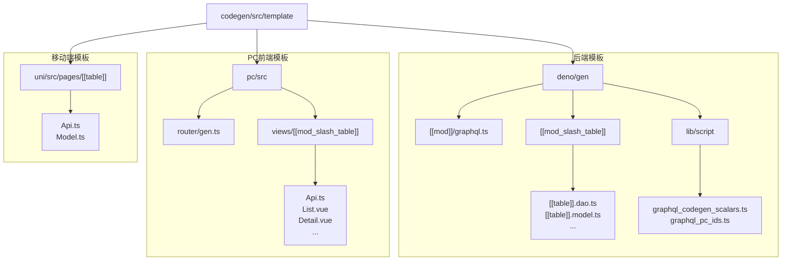
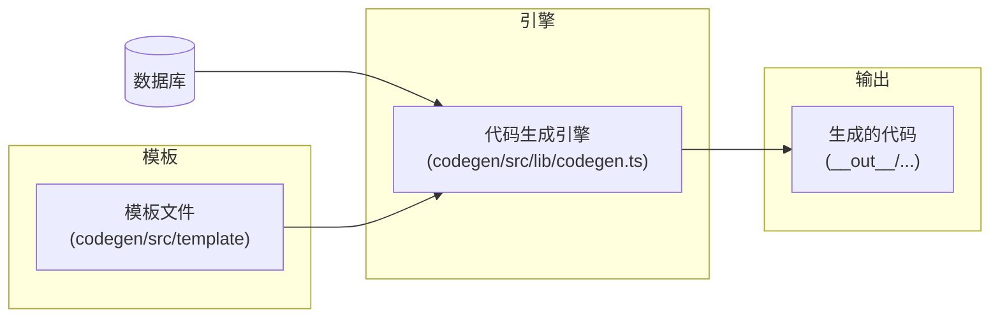
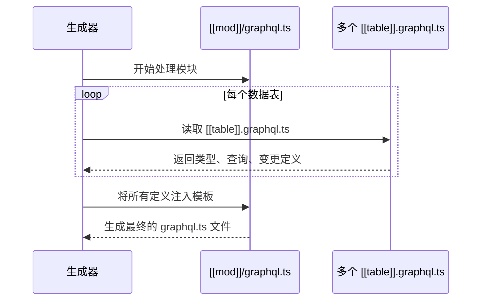
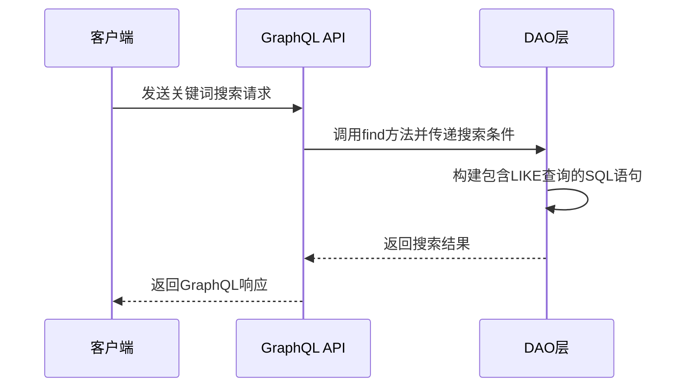
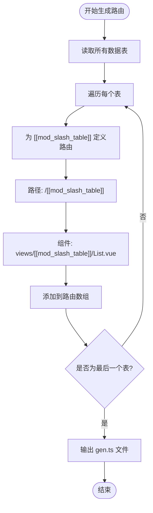
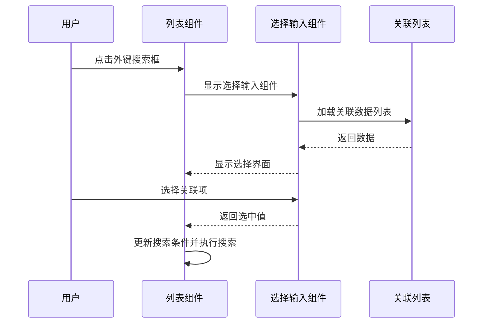
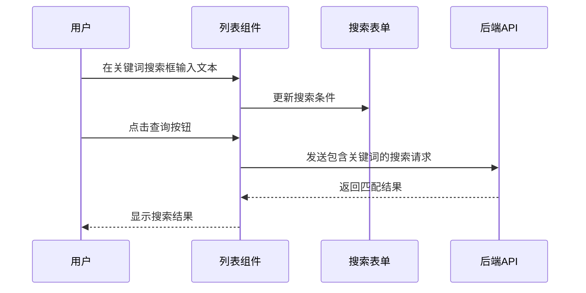
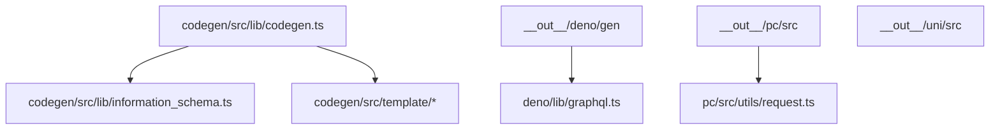

# 自定义模板


**本文档引用的文件**  
- [codegen/src/template/deno/gen/[[mod]]/graphql.ts](https://github.com/sail-sail/nest/blob/main/codegen/src/template/deno/gen/[[mod]]/graphql.ts) - *更新以支持关键词搜索*
- [codegen/src/template/deno/gen/[[mod_slash_table]]/[[table]].dao.ts](https://github.com/sail-sail/nest/blob/main/codegen/src/template/deno/gen/[[mod_slash_table]]/[[table]].dao.ts) - *新增关键词搜索功能*
- [codegen/src/template/deno/gen/[[mod_slash_table]]/[[table]].graphql.ts](https://github.com/sail-sail/nest/blob/main/codegen/src/template/deno/gen/[[mod_slash_table]]/[[table]].graphql.ts) - *新增关键词搜索功能*
- [codegen/src/template/pc/src/router/gen.ts](https://github.com/sail-sail/nest/blob/main/codegen/src/template/pc/src/router/gen.ts)
- [codegen/src/template/pc/src/views/[[mod_slash_table]]/Api.ts](https://github.com/sail-sail/nest/blob/main/codegen/src/template/pc/src/views/[[mod_slash_table]]/Api.ts)
- [codegen/src/template/pc/src/views/[[mod_slash_table]]/Detail.vue](https://github.com/sail-sail/nest/blob/main/codegen/src/template/pc/src/views/[[mod_slash_table]]/Detail.vue)
- [codegen/src/template/pc/src/views/[[mod_slash_table]]/List.vue](https://github.com/sail-sail/nest/blob/main/codegen/src/template/pc/src/views/[[mod_slash_table]]/List.vue) - *更新以支持外键弹窗搜索和关键词搜索*
- [codegen/src/template/pc/src/views/[[mod_slash_table]]/Model.ts](https://github.com/sail-sail/nest/blob/main/codegen/src/template/pc/src/views/[[mod_slash_table]]/Model.ts)
- [codegen/src/template/uni/src/pages/[[table]]/Api.ts](https://github.com/sail-sail/nest/blob/main/codegen/src/template/uni/src/pages/[[table]]/Api.ts)
- [codegen/src/template/uni/src/pages/[[table]]/Model.ts](https://github.com/sail-sail/nest/blob/main/codegen/src/template/uni/src/pages/[[table]]/Model.ts)


## 更新摘要
**变更内容**   
- 更新了后端DAO和GraphQL模板以支持关键词搜索功能
- 更新了前端列表组件模板以支持外键弹窗搜索和关键词搜索
- 新增了关键词搜索的配置选项和实现逻辑
- 修正了外键搜索方式的模板逻辑

## 目录
1. [简介](#简介)
2. [项目结构](#项目结构)
3. [核心组件](#核心组件)
4. [架构概述](#架构概述)
5. [详细组件分析](#详细组件分析)
6. [依赖分析](#依赖分析)
7. [性能考虑](#性能考虑)
8. [故障排除指南](#故障排除指南)
9. [结论](#结论)

## 简介
本文档旨在为开发者提供一份全面的自定义模板开发指南，用于扩展和修改基于 Nest 框架的代码生成系统。文档详细解析了代码生成器（codegen）中模板的目录结构、语法规范、占位符使用方法以及与生成引擎的集成机制。通过具体示例，指导开发者如何创建新模板或修改现有模板以满足特定业务需求，例如添加自定义组件、调整 API 客户端逻辑或修改 GraphQL 查询结构。同时，文档还涵盖了高级开发实践，确保自定义模板的兼容性与可维护性。

## 项目结构
代码生成系统的模板文件集中存放在 `codegen/src/template` 目录下，按目标平台（后端、PC前端、移动端）进行组织。这种分层结构清晰地分离了不同技术栈的代码生成逻辑。



**图示来源**
- [codegen/src/template/deno](https://github.com/sail-sail/nest/blob/main/codegen/src/template/deno)
- [codegen/src/template/pc/src](https://github.com/sail-sail/nest/blob/main/codegen/src/template/pc/src)
- [codegen/src/template/uni/src](https://github.com/sail-sail/nest/blob/main/codegen/src/template/uni/src)

**本节来源**
- [codegen/src/template](https://github.com/sail-sail/nest/blob/main/codegen/src/template)

## 核心组件
代码生成系统的核心在于其模板引擎，该引擎通过解析模板文件中的占位符（如 `[[mod]]`, `[[table]]`）并将其替换为实际的模块和表名，从而动态生成代码。模板文件本身是标准的 TypeScript 或 Vue 文件，但嵌入了特定的标记，使其具备了“可生成”的特性。核心组件包括后端（Deno）的 GraphQL 模型与服务、PC 前端的路由与视图组件，以及移动端（UniApp）的页面逻辑。

**本节来源**
- [codegen/src/template/deno/gen](https://github.com/sail-sail/nest/blob/main/codegen/src/template/deno/gen)
- [codegen/src/template/pc/src/views](https://github.com/sail-sail/nest/blob/main/codegen/src/template/pc/src/views)
- [codegen/src/template/uni/src/pages](https://github.com/sail-sail/nest/blob/main/codegen/src/template/uni/src/pages)

## 架构概述
整个代码生成系统采用模块化设计，其架构可以分为三个主要部分：模板定义、生成引擎和输出目标。模板定义位于 `codegen/src/template`，是代码生成的蓝图。生成引擎（位于 `codegen/src/lib/codegen.ts` 等文件中）负责读取数据库元数据、解析模板文件并执行替换逻辑。最终，生成的代码被输出到 `__out__` 目录下的对应位置，如 `__out__/deno`、`__out__/pc/src` 等。



**图示来源**
- [codegen/src/lib/codegen.ts](https://github.com/sail-sail/nest/blob/main/codegen/src/lib/codegen.ts)
- [codegen/src/template](https://github.com/sail-sail/nest/blob/main/codegen/src/template)
- [__out__](https://github.com/sail-sail/nest/blob/main/__out__)

## 详细组件分析
本节将深入分析各个平台的模板文件，揭示其内部结构和工作原理。

### 后端模板（Deno）分析
后端模板位于 `codegen/src/template/deno`，主要负责生成基于 Deno 和 GraphQL 的后端服务代码。

#### 模型与服务模板
`[[mod_slash_table]]` 目录下的文件是生成单个数据表对应服务的核心。例如，`[[table]].model.ts` 定义了数据模型，`[[table]].dao.ts` 封装了数据库访问逻辑，`[[table]].resolver.ts` 和 `[[table]].graphql.ts` 共同定义了 GraphQL 的查询、变更和订阅接口。

```mermaid
classDiagram
class [[table]]Model {
+id : string
+createdAt : Date
+updatedAt : Date
+[其他字段]
}
class [[table]]DAO {
+find(query) : Promise<[[table]]Model[]>
+findOne(id) : Promise<[[table]]Model>
+create(data) : Promise<[[table]]Model>
+update(id, data) : Promise<[[table]]Model>
+delete(id) : Promise<boolean>
}
class [[table]]Resolver {
-dao : [[table]]DAO
+[[table]](id) : [[table]]Model
+[[table]]s(query) : [[table]]Model[]
+create[[table]](input) : [[table]]Model
+update[[table]](id, input) : [[table]]Model
+delete[[table]](id) : boolean
}
[[table]]Resolver --> [[table]]DAO : "使用"
[[table]]DAO --> [[table]]Model : "返回"
```

**图示来源**
- [codegen/src/template/deno/gen/[[mod_slash_table]]/[[table]].model.ts](https://github.com/sail-sail/nest/blob/main/codegen/src/template/deno/gen/[[mod_slash_table]]/[[table]].model.ts)
- [codegen/src/template/deno/gen/[[mod_slash_table]]/[[table]].dao.ts](https://github.com/sail-sail/nest/blob/main/codegen/src/template/deno/gen/[[mod_slash_table]]/[[table]].dao.ts)
- [codegen/src/template/deno/gen/[[mod_slash_table]]/[[table]].resolver.ts](https://github.com/sail-sail/nest/blob/main/codegen/src/template/deno/gen/[[mod_slash_table]]/[[table]].resolver.ts)

#### GraphQL Schema 生成
`[[mod]]/graphql.ts` 模板负责生成一个模块内所有表的 GraphQL Schema 汇总。它会将所有 `[[table]].graphql.ts` 文件中定义的类型、查询和变更聚合到一个统一的 Schema 中。



**图示来源**
- [codegen/src/template/deno/gen/[[mod]]/graphql.ts](https://github.com/sail-sail/nest/blob/main/codegen/src/template/deno/gen/[[mod]]/graphql.ts)
- [codegen/src/template/deno/gen/[[mod_slash_table]]/[[table]].graphql.ts](https://github.com/sail-sail/nest/blob/main/codegen/src/template/deno/gen/[[mod_slash_table]]/[[table]].graphql.ts)

#### 关键词搜索功能
后端模板现在支持关键词搜索功能，允许在指定字段上进行模糊搜索。此功能通过 `opts.searchByKeyword` 配置项启用。



**图示来源**
- [codegen/src/template/deno/gen/[[mod_slash_table]]/[[table]].dao.ts](https://github.com/sail-sail/nest/blob/main/codegen/src/template/deno/gen/[[mod_slash_table]]/[[table]].dao.ts)
- [codegen/src/template/deno/gen/[[mod_slash_table]]/[[table]].graphql.ts](https://github.com/sail-sail/nest/blob/main/codegen/src/template/deno/gen/[[mod_slash_table]]/[[table]].graphql.ts)

**本节来源**
- [codegen/src/template/deno/gen](https://github.com/sail-sail/nest/blob/main/codegen/src/template/deno/gen)

### PC前端模板（PC）分析
PC前端模板位于 `codegen/src/template/pc/src`，用于生成基于 Vue 的管理后台界面。

#### 视图组件模板
`views/[[mod_slash_table]]` 目录下的文件定义了每个数据表的标准管理界面，包括列表页（`List.vue`）和详情页（`Detail.vue`）。`Api.ts` 提供了与后端 GraphQL API 交互的客户端方法，`Model.ts` 定义了前端使用的数据模型。

```mermaid
classDiagram
class [[mod_slash_table]]Api {
+fetch[[table]]s(query) : Promise<Response>
+fetch[[table]](id) : Promise<Response>
+create[[table]](data) : Promise<Response>
+update[[table]](id, data) : Promise<Response>
+delete[[table]](id) : Promise<Response>
}
class [[mod_slash_table]]Model {
+id : string
+[其他字段]
}
class ListVue {
+api : [[mod_slash_table]]Api
+model : [[mod_slash_table]]Model[]
+onSearch()
+onCreate()
+onEdit(id)
+onDelete(id)
}
class DetailVue {
+api : [[mod_slash_table]]Api
+model : [[mod_slash_table]]Model
+onSave()
+onCancel()
}
ListVue --> [[mod_slash_table]]Api : "调用"
ListVue --> [[mod_slash_table]]Model : "显示"
DetailVue --> [[mod_slash_table]]Api : "调用"
DetailVue --> [[mod_slash_table]]Model : "绑定"
```

**图示来源**
- [codegen/src/template/pc/src/views/[[mod_slash_table]]/Api.ts](https://github.com/sail-sail/nest/blob/main/codegen/src/template/pc/src/views/[[mod_slash_table]]/Api.ts)
- [codegen/src/template/pc/src/views/[[mod_slash_table]]/Model.ts](https://github.com/sail-sail/nest/blob/main/codegen/src/template/pc/src/views/[[mod_slash_table]]/Model.ts)
- [codegen/src/template/pc/src/views/[[mod_slash_table]]/List.vue](https://github.com/sail-sail/nest/blob/main/codegen/src/template/pc/src/views/[[mod_slash_table]]/List.vue)
- [codegen/src/template/pc/src/views/[[mod_slash_table]]/Detail.vue](https://github.com/sail-sail/nest/blob/main/codegen/src/template/pc/src/views/[[mod_slash_table]]/Detail.vue)

#### 路由生成
`router/gen.ts` 模板负责生成前端应用的动态路由配置，确保每个数据表的视图组件都能通过特定的 URL 访问。



**图示来源**
- [codegen/src/template/pc/src/router/gen.ts](https://github.com/sail-sail/nest/blob/main/codegen/src/template/pc/src/router/gen.ts)

#### 外键弹窗搜索
前端列表组件现在支持外键弹窗搜索功能，允许用户通过弹窗选择关联数据。此功能通过 `foreignKey.isSearchBySelectInput` 配置项启用。



**图示来源**
- [codegen/src/template/pc/src/views/[[mod_slash_table]]/List.vue](https://github.com/sail-sail/nest/blob/main/codegen/src/template/pc/src/views/[[mod_slash_table]]/List.vue)

#### 关键词搜索功能
前端列表组件实现了关键词搜索功能，允许用户在指定字段上进行全局搜索。此功能通过 `opts.searchByKeyword` 配置项启用。



**图示来源**
- [codegen/src/template/pc/src/views/[[mod_slash_table]]/List.vue](https://github.com/sail-sail/nest/blob/main/codegen/src/template/pc/src/views/[[mod_slash_table]]/List.vue)

**本节来源**
- [codegen/src/template/pc/src](https://github.com/sail-sail/nest/blob/main/codegen/src/template/pc/src)

### 移动端模板（UniApp）分析
移动端模板位于 `codegen/src/template/uni/src/pages`，用于生成 UniApp 项目的页面。

#### 页面逻辑模板
`pages/[[table]]` 目录下的 `Api.ts` 和 `Model.ts` 文件为移动端提供了与 PC 前端类似的数据访问和模型定义能力，但其具体实现会针对移动端的网络环境和用户交互进行优化。

```mermaid
classDiagram
class [[table]]Api {
+fetch[[table]]s(query) : Promise<UniApp.RequestSuccessCallbackResult>
+fetch[[table]](id) : Promise<UniApp.RequestSuccessCallbackResult>
+syncData() : Promise<boolean>
}
class [[table]]Model {
+id : string
+[移动端特有字段]
}
[[table]]Api --> [[table]]Model : "处理"
```

**图示来源**
- [codegen/src/template/uni/src/pages/[[table]]/Api.ts](https://github.com/sail-sail/nest/blob/main/codegen/src/template/uni/src/pages/[[table]]/Api.ts)
- [codegen/src/template/uni/src/pages/[[table]]/Model.ts](https://github.com/sail-sail/nest/blob/main/codegen/src/template/uni/src/pages/[[table]]/Model.ts)

**本节来源**
- [codegen/src/template/uni/src/pages](https://github.com/sail-sail/nest/blob/main/codegen/src/template/uni/src/pages)

## 依赖分析
代码生成系统内部的依赖关系清晰。`codegen/src/lib/codegen.ts` 是核心引擎，它依赖于 `codegen/src/lib/information_schema.ts` 来获取数据库结构信息，并依赖于模板文件。生成的代码（在 `__out__` 中）则依赖于项目自身的库，如 `deno/lib` 中的 `graphql.ts`、`util` 工具等。前端生成的代码依赖于 `pc/src/utils/request.ts` 进行网络请求。



**图示来源**
- [codegen/src/lib/codegen.ts](https://github.com/sail-sail/nest/blob/main/codegen/src/lib/codegen.ts)
- [codegen/src/lib/information_schema.ts](https://github.com/sail-sail/nest/blob/main/codegen/src/lib/information_schema.ts)
- [codegen/src/template](https://github.com/sail-sail/nest/blob/main/codegen/src/template)
- [deno/lib/graphql.ts](https://github.com/sail-sail/nest/blob/main/deno/lib/graphql.ts)
- [pc/src/utils/request.ts](https://github.com/sail-sail/nest/blob/main/pc/src/utils/request.ts)

**本节来源**
- [codegen/src/lib](https://github.com/sail-sail/nest/blob/main/codegen/src/lib)
- [deno/lib](https://github.com/sail-sail/nest/blob/main/deno/lib)
- [pc/src/utils](https://github.com/sail-sail/nest/blob/main/pc/src/utils)

## 性能考虑
虽然模板本身不直接涉及运行时性能，但其生成的代码质量至关重要。建议在自定义模板时：
1.  **避免冗余代码**：确保生成的 DAO 和 API 方法是必要的。
2.  **优化 GraphQL 查询**：在 `*.graphql.ts` 模板中，只请求前端实际需要的字段。
3.  **合理使用缓存**：在前端 `Api.ts` 模板中，可以考虑加入简单的内存缓存逻辑以减少重复请求。
4.  **按需加载**：对于大型应用，可以修改 `router/gen.ts` 模板以支持路由的懒加载。
5.  **关键词搜索优化**：在使用关键词搜索时，应限制搜索字段数量，避免全表扫描导致性能下降。

## 故障排除指南
当自定义模板出现问题时，请按以下步骤排查：
1.  **检查占位符拼写**：确保 `[[mod]]`、`[[table]]`、`[[mod_slash_table]]` 等占位符拼写完全正确。
2.  **验证模板语法**：确保模板文件本身的 TypeScript 或 Vue 语法是正确的，即使占位符存在，也应保证语法结构完整。
3.  **查看生成日志**：运行代码生成命令，仔细阅读控制台输出的错误信息，通常会指出模板解析失败的具体文件和行号。
4.  **对比标准模板**：将自定义模板与系统自带的标准模板进行对比，检查结构和关键标记是否一致。
5.  **检查路径映射**：确保 `[[mod_slash_table]]` 这样的路径占位符在生成时能正确映射到目标目录。
6.  **关键词搜索配置**：检查 `opts.searchByKeyword` 配置是否正确，包括 `prop` 和 `fields` 字段。
7.  **外键搜索方式**：确认 `foreignKey.isSearchBySelectInput` 配置是否符合预期。

**本节来源**
- [codegen/src/lib/codegen.ts](https://github.com/sail-sail/nest/blob/main/codegen/src/lib/codegen.ts)
- [codegen/src/template](https://github.com/sail-sail/nest/blob/main/codegen/src/template)

## 结论
通过深入理解 `codegen/src/template` 目录下的文件结构和占位符机制，开发者可以高效地扩展和定制代码生成系统。本文档提供的分析和示例为创建符合特定需求的模板奠定了坚实基础。遵循最佳实践，不仅可以提高开发效率，还能保证生成代码的一致性和质量。未来的工作可以集中在开发更复杂的自定义组件模板和优化生成逻辑上。