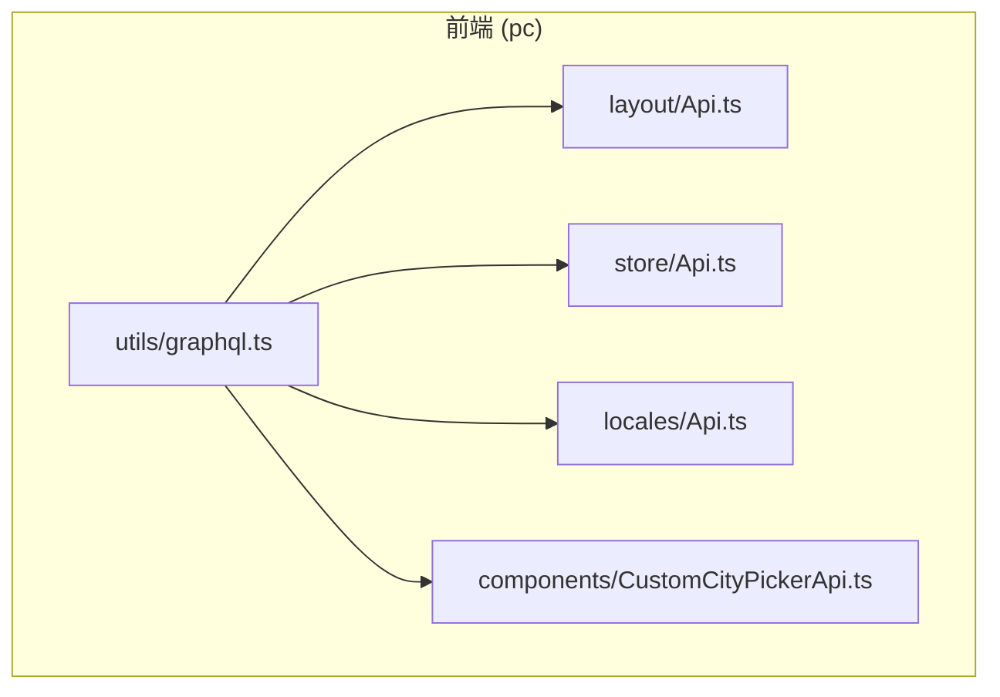
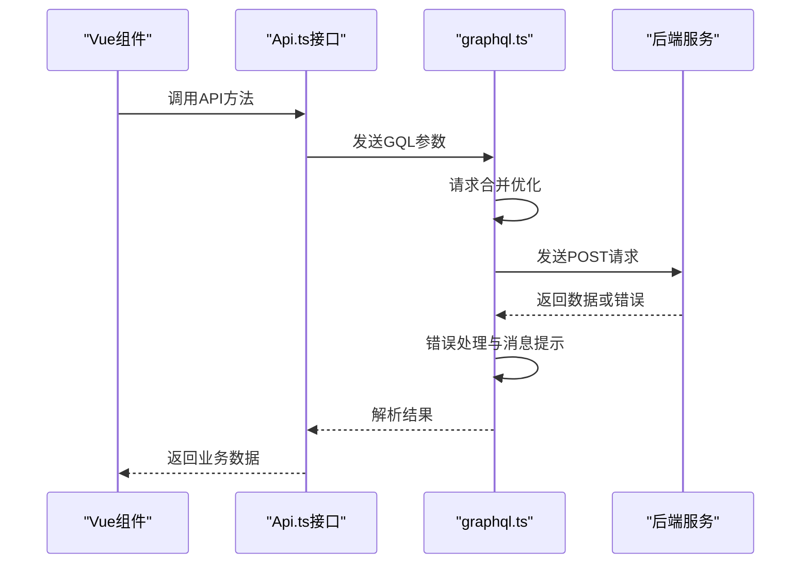
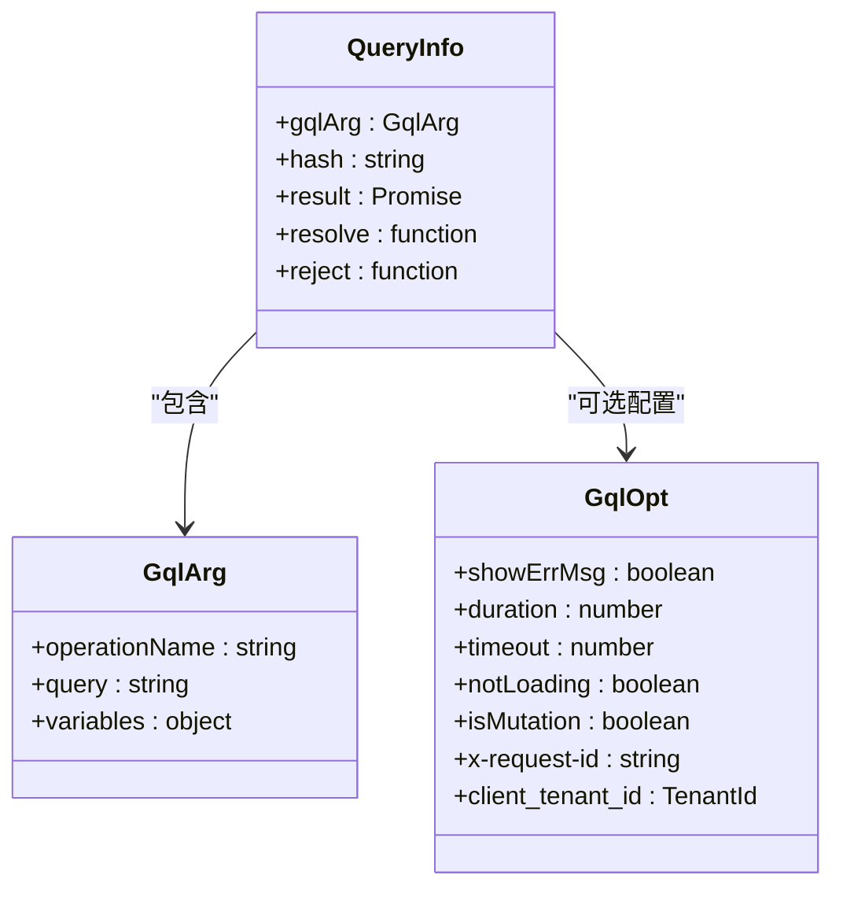
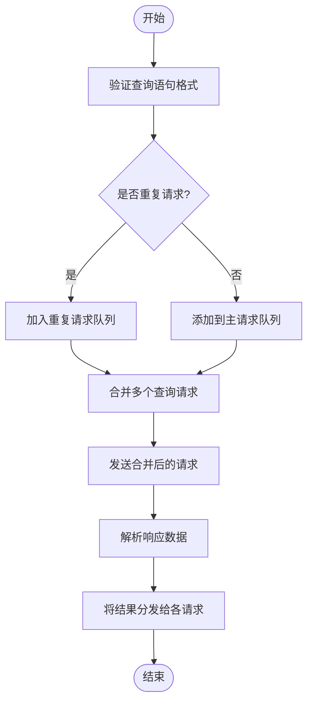
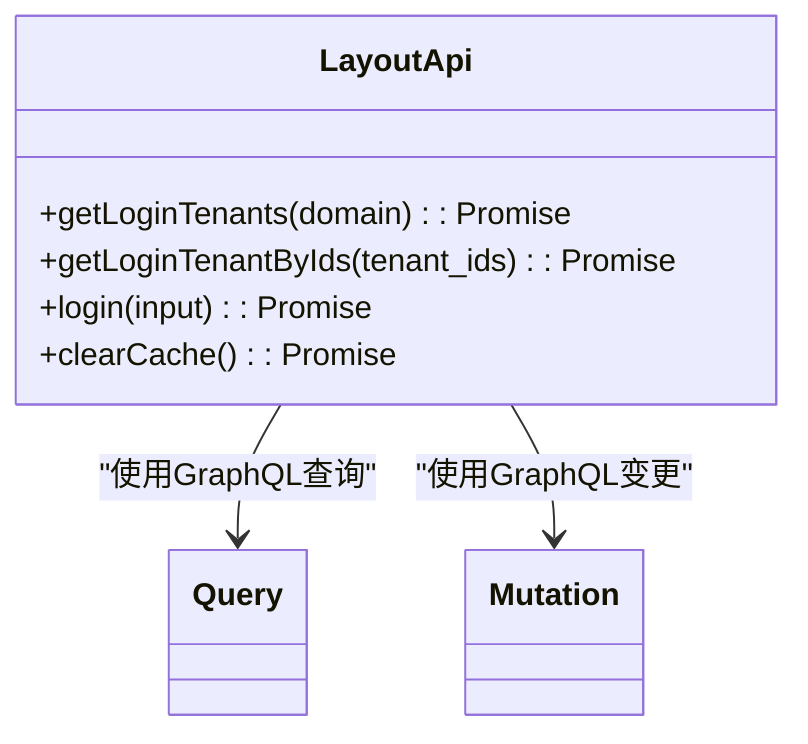
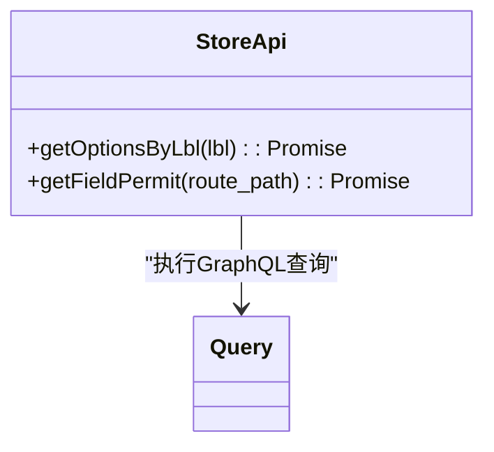
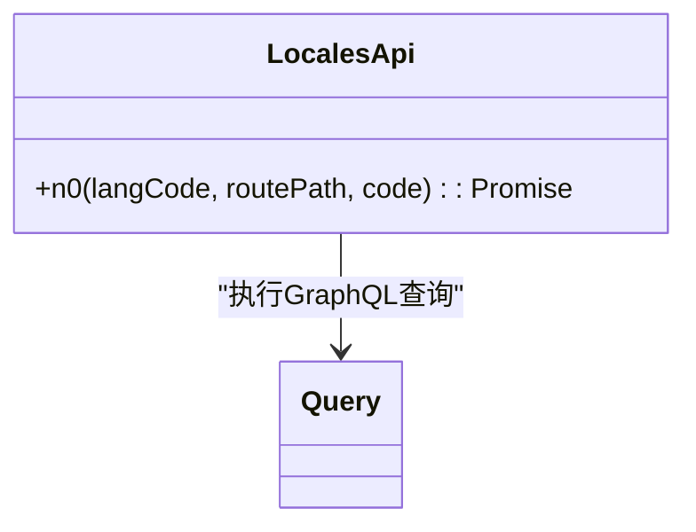
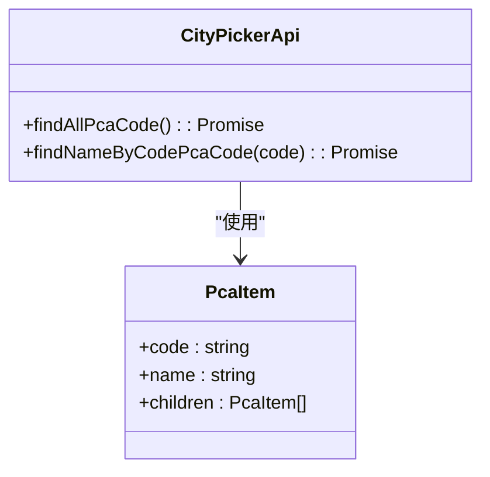
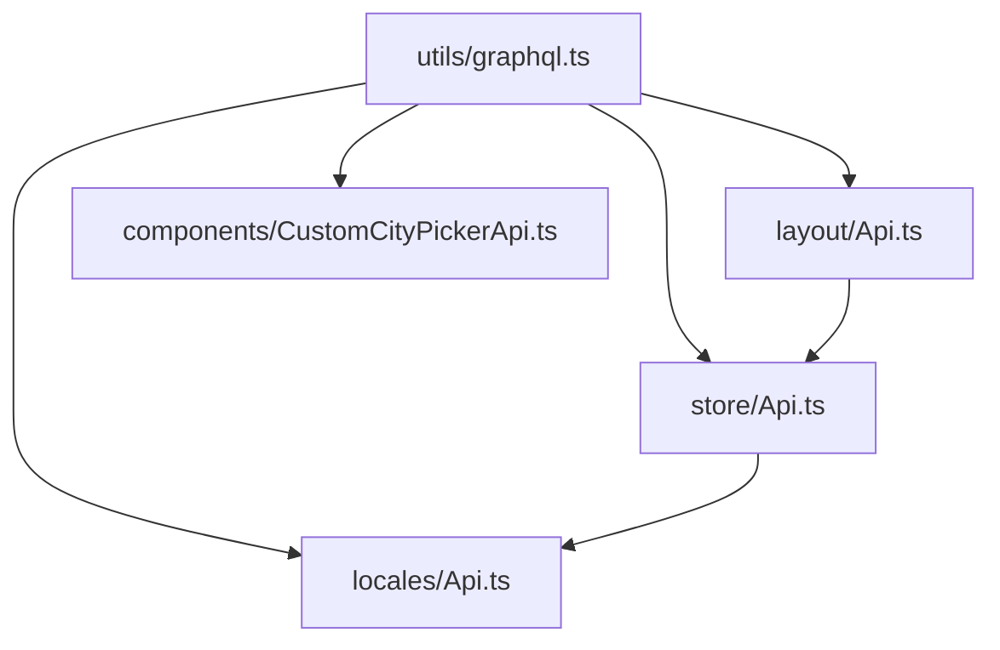

# API集成

**本文档引用的文件**   
- [graphql.ts](https://github.com/sail-sail/nest/blob/main/pc/src/utils/graphql.ts#L0-L413)
- [layout/Api.ts](https://github.com/sail-sail/nest/blob/main/pc/src/layout/Api.ts#L0-L106)
- [store/Api.ts](https://github.com/sail-sail/nest/blob/main/pc/src/store/Api.ts#L0-L51)
- [locales/Api.ts](https://github.com/sail-sail/nest/blob/main/pc/src/locales/Api.ts#L0-L30)
- [CustomCityPickerApi.ts](https://github.com/sail-sail/nest/blob/main/pc/src/components/CustomCityPickerApi.ts#L0-L47)

## 目录
1. [简介](#简介)
2. [项目结构](#项目结构)
3. [核心组件](#核心组件)
4. [架构概述](#架构概述)
5. [详细组件分析](#详细组件分析)
6. [依赖分析](#依赖分析)
7. [性能考虑](#性能考虑)
8. [故障排除指南](#故障排除指南)
9. [结论](#结论)

## 简介
本文档详细解析了PC端GraphQL API的集成方案，涵盖客户端配置、接口定义规范、错误处理机制及最佳实践。重点阐述了`utils/graphql.ts`中Apollo Client的替代实现，包括HTTP链接管理、错误处理和缓存策略。同时说明了`Api.ts`文件的接口定义方式，展示了如何为不同模块组织GraphQL查询和变更操作，并提供在组件中使用GraphQL的标准模式。

## 项目结构
项目采用分层架构设计，主要分为codegen（代码生成）、deno（后端服务）、pc（前端应用）和uni（跨平台应用）四大模块。其中pc目录下的src包含前端核心代码，utils目录存放工具类，store管理状态，layout处理布局相关逻辑，components包含可复用组件。

**图示来源**
- [graphql.ts](https://github.com/sail-sail/nest/blob/main/pc/src/utils/graphql.ts#L0-L413)

## 核心组件
核心组件包括GraphQL请求处理器、布局相关API、状态管理API、国际化API和城市选择器API。这些组件共同构成了前端与后端交互的基础架构。

**组件来源**
- [graphql.ts](https://github.com/sail-sail/nest/blob/main/pc/src/utils/graphql.ts#L0-L413)
- [layout/Api.ts](https://github.com/sail-sail/nest/blob/main/pc/src/layout/Api.ts#L0-L106)
- [store/Api.ts](https://github.com/sail-sail/nest/blob/main/pc/src/store/Api.ts#L0-L51)

## 架构概述
系统采用GraphQL作为主要的数据查询语言，通过自定义的query和mutation函数实现前后端通信。请求经过统一的graphql.ts处理层，该层负责请求合并、错误处理、加载状态管理和认证信息注入。

**图示来源**
- [graphql.ts](https://github.com/sail-sail/nest/blob/main/pc/src/utils/graphql.ts#L0-L413)
- [layout/Api.ts](https://github.com/sail-sail/nest/blob/main/pc/src/layout/Api.ts#L0-L106)

## 详细组件分析

### GraphQL客户端分析
`utils/graphql.ts`实现了自定义的GraphQL客户端，替代了标准的Apollo Client，提供了更符合项目需求的特性。

#### 主要功能实现

**图示来源**
- [graphql.ts](https://github.com/sail-sail/nest/blob/main/pc/src/utils/graphql.ts#L0-L413)

#### 请求处理流程

**图示来源**
- [graphql.ts](https://github.com/sail-sail/nest/blob/main/pc/src/utils/graphql.ts#L0-L413)

### 布局模块API分析
`layout/Api.ts`提供了与登录、租户管理相关的API接口。

**图示来源**
- [layout/Api.ts](https://github.com/sail-sail/nest/blob/main/pc/src/layout/Api.ts#L0-L106)

### 状态管理模块API分析
`store/Api.ts`提供了系统选项和字段权限相关的查询接口。

**图示来源**
- [store/Api.ts](https://github.com/sail-sail/nest/blob/main/pc/src/store/Api.ts#L0-L51)

### 国际化模块API分析
`locales/Api.ts`提供了基于语言代码的国际化文本查询功能。

**图示来源**
- [locales/Api.ts](https://github.com/sail-sail/nest/blob/main/pc/src/locales/Api.ts#L0-L30)

### 城市选择器API分析
`CustomCityPickerApi.ts`提供了省市区数据的加载和查询功能。

**图示来源**
- [CustomCityPickerApi.ts](https://github.com/sail-sail/nest/blob/main/pc/src/components/CustomCityPickerApi.ts#L0-L47)

## 依赖分析
各组件之间存在明确的依赖关系，graphql.ts作为基础层被所有API模块依赖，提供统一的请求处理能力。

**图示来源**
- [graphql.ts](https://github.com/sail-sail/nest/blob/main/pc/src/utils/graphql.ts#L0-L413)
- [layout/Api.ts](https://github.com/sail-sail/nest/blob/main/pc/src/layout/Api.ts#L0-L106)
- [store/Api.ts](https://github.com/sail-sail/nest/blob/main/pc/src/store/Api.ts#L0-L51)

## 性能考虑
系统在性能优化方面采取了多项措施：
1. **请求合并**：通过combinedQuery库将多个GraphQL查询合并为单个请求，减少网络开销
2. **缓存机制**：城市选择器数据采用内存缓存，避免重复加载
3. **防抖处理**：通过nextTick实现请求的批量处理
4. **错误处理**：统一的错误提示机制，避免重复弹窗

## 故障排除指南
常见问题及解决方案：

1. **GraphQL查询失败**
   - 检查查询语句是否以"query"开头
   - 验证变量类型和数量是否匹配
   - 确认认证信息是否有效

2. **权限相关错误**
   - 检查tenant_id是否正确设置
   - 确认用户是否有相应操作权限
   - 验证路由路径与权限配置是否匹配

3. **国际化文本显示异常**
   - 确认语言代码格式正确
   - 检查code值是否存在
   - 验证routePath参数是否准确

4. **加载状态异常**
   - 检查notLoading配置项
   - 确认loading计数器状态
   - 验证mutation操作的并发控制

**问题来源**
- [graphql.ts](https://github.com/sail-sail/nest/blob/main/pc/src/utils/graphql.ts#L0-L413)
- [layout/Api.ts](https://github.com/sail-sail/nest/blob/main/pc/src/layout/Api.ts#L0-L106)

## 结论
本API集成方案通过自定义的GraphQL客户端实现了高效、可靠的前后端通信。系统采用模块化设计，各功能组件职责清晰，依赖关系明确。通过请求合并、缓存优化等技术手段提升了应用性能，同时提供了完善的错误处理机制和开发调试支持。建议在实际使用中遵循统一的API调用规范，充分利用现有的优化特性，确保系统的稳定性和可维护性。