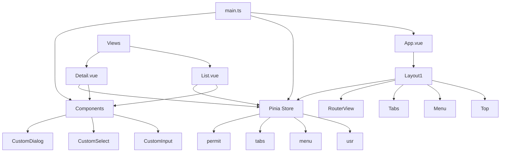
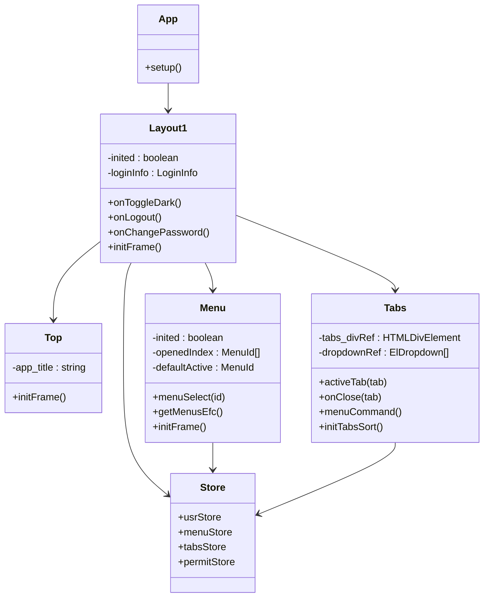

# PC端前端架构


**本文档引用文件**  
- [main.ts](https://github.com/sail-sail/nest/blob/main/pc/src/main.ts)
- [App.vue](https://github.com/sail-sail/nest/blob/main/pc/src/App.vue)
- [router/index.ts](https://github.com/sail-sail/nest/blob/main/pc/src/router/index.ts)
- [layout/layout1/index.vue](https://github.com/sail-sail/nest/blob/main/pc/src/layout/layout1/index.vue)
- [layout/layout1/Top.vue](https://github.com/sail-sail/nest/blob/main/pc/src/layout/layout1/Top.vue)
- [layout/layout1/Menu.vue](https://github.com/sail-sail/nest/blob/main/pc/src/layout/layout1/Menu.vue)
- [layout/layout1/Tabs.vue](https://github.com/sail-sail/nest/blob/main/pc/src/layout/layout1/Tabs.vue)
- [store/index.ts](https://github.com/sail-sail/nest/blob/main/pc/src/store/index.ts)
- [store/menu.ts](https://github.com/sail-sail/nest/blob/main/pc/src/store/menu.ts)
- [store/tabs.ts](https://github.com/sail-sail/nest/blob/main/pc/src/store/tabs.ts)
- [store/usr.ts](https://github.com/sail-sail/nest/blob/main/pc/src/store/usr.ts)
- [store/permit.ts](https://github.com/sail-sail/nest/blob/main/pc/src/store/permit.ts)
- [components/KFrame/core.ts](https://github.com/sail-sail/nest/blob/main/pc/src/components/KFrame/core.ts)
- [views/base/usr/List.vue](https://github.com/sail-sail/nest/blob/main/pc/src/views/base/usr/List.vue)
- [views/base/usr/Detail.vue](https://github.com/sail-sail/nest/blob/main/pc/src/views/base/usr/Detail.vue)
- [components/CustomInput.vue](https://github.com/sail-sail/nest/blob/main/pc/src/components/CustomInput.vue)
- [components/CustomSelect.vue](https://github.com/sail-sail/nest/blob/main/pc/src/components/CustomSelect.vue)
- [views/base/menu/List.vue](https://github.com/sail-sail/nest/blob/main/pc/src/views/base/menu/List.vue)
- [views/base/menu/TreeList.vue](https://github.com/sail-sail/nest/blob/main/pc/src/views/base/menu/TreeList.vue)
- [views/base/field_permit/TreeList.vue](https://github.com/sail-sail/nest/blob/main/pc/src/views/base/field_permit/TreeList.vue)
- [views/base/permit/TreeList.vue](https://github.com/sail-sail/nest/blob/main/pc/src/views/base/permit/TreeList.vue)
- [assets/style/common.scss](https://github.com/sail-sail/nest/blob/main/pc/src/assets/style/common.scss)


## 更新摘要
**变更内容**  
- 新增"仅当前租户"过滤功能，已在菜单、字段权限等模块中实现
- 更新列表页查询表单布局，支持新的搜索样式
- 在TreeList组件中添加租户过滤逻辑
- 优化公共样式文件以支持新的表单布局

## 目录
1. [项目结构](#项目结构)  
2. [应用入口与初始化流程](#应用入口与初始化流程)  
3. [路由系统设计](#路由系统设计)  
4. [布局体系与组件协作](#布局体系与组件协作)  
5. [状态管理机制](#状态管理机制)  
6. [自定义表单组件规范](#自定义表单组件规范)  
7. [列表页与详情页实现模式](#列表页与详情页实现模式)  
8. [核心架构图示](#核心架构图示)

## 项目结构

本项目采用模块化分层架构，主要目录结构如下：

```
pc/
├── src/
│   ├── components/          # 全局通用组件
│   ├── layout/              # 布局组件
│   ├── router/              # 路由配置
│   ├── store/               # 状态管理模块
│   ├── views/               # 页面视图
│   ├── utils/               # 工具函数
│   ├── locales/             # 国际化资源
│   ├── assets/              # 静态资源
│   ├── App.vue              # 根组件
│   └── main.ts              # 应用入口
```

**Section sources**  
- [main.ts](https://github.com/sail-sail/nest/blob/main/pc/src/main.ts)

## 应用入口与初始化流程

### 初始化流程分析

`main.ts` 是整个前端应用的入口文件，负责初始化 Vue 实例、注册插件、配置全局指令和挂载应用。

```typescript
import { createApp } from "vue";
import App from "./App.vue";
import router from "./router/index.ts";
import { headerOrderDragDirective } from "./components/TableHeaderOrderDrag.ts";
import { autoAnimatePlugin } from "@formkit/auto-animate/vue";

const app = createApp(App);

app.use(router);
app.directive("header-order-drag", headerOrderDragDirective);
app.use(autoAnimatePlugin);
app.mount("#app");
```

#### 初始化流程步骤：
1. 创建 Vue 应用实例
2. 引入并使用路由系统
3. 注册自定义指令（表头拖拽、表单自动动画等）
4. 挂载到 DOM 节点

#### 插件与配置：
- **Element Plus**：UI 组件库，已引入主题样式
- **UnoCSS**：原子化 CSS 引擎
- **@formkit/auto-animate**：列表动画插件
- **自定义指令**：支持表头排序、表格数据拖拽排序等功能

**Section sources**  
- [main.ts](https://github.com/sail-sail/nest/blob/main/pc/src/main.ts#L1-L37)

## 路由系统设计

### 路由配置

路由系统基于 Vue Router 实现，采用哈希模式（`createWebHashHistory`），支持动态路由生成。

```typescript
import { createRouter, createWebHashHistory } from "vue-router";
import { routesGen } from "./gen.ts";
import Layout1 from "@/layout/layout1/index.vue";

const routes = [
  ...routesGen,
  {
    path: "",
    redirect: "/index",
  },
  {
    path: "/index",
    component: Layout1,
    children: [
      {
        path: "",
        name: "首页",
        component: () => import("@/views/Index.vue"),
        meta: {
          closeable: true,
          icon: "iconfont-home-fill",
        },
      },
    ],
  },
];

const router = createRouter({
  history: createWebHashHistory(),
  routes,
});
```

#### 核心特性：
- **动态路由生成**：通过 `routesGen` 自动导入业务模块路由
- **布局嵌套**：使用 `Layout1` 作为主布局容器
- **元信息支持**：每个路由可配置 `closeable`（是否可关闭）、`icon`（图标）等属性
- **权限控制预留**：注释中包含权限校验逻辑，可根据菜单权限动态拦截

**Section sources**  
- [router/index.ts](https://github.com/sail-sail/nest/blob/main/pc/src/router/index.ts#L1-L60)

## 布局体系与组件协作

### 布局架构

系统采用 `KFrame` 组件为核心的布局体系，`layout1` 是默认布局实现，包含三大核心组件：

- **Top**：顶部标题栏
- **Menu**：侧边菜单栏
- **Tabs**：标签页导航

```vue
<template>
  <div v-else>
    <Top />
    <LeftMenu />
    <Tabs />
    <router-view />
  </div>
</template>
```

### 组件协作机制

#### Top 组件
负责显示应用标题，支持多租户动态标题。

```typescript
async function initFrame() {
  const tenant_id = usrStore.tenant_id;
  const tenant_model = await findByIdTenant(tenant_id);
  app_title = tenant_model.title;
  localStorage.setItem("app_title", app_title);
}
```

#### Menu 组件
实现可折叠侧边栏，支持菜单搜索与权限过滤。

- **折叠功能**：通过 `menuStore.isCollapse` 控制宽度（60px/250px）
- **搜索功能**：输入关键词实时过滤菜单项
- **权限控制**：根据用户权限动态加载菜单

```vue
<el-menu
  :default-active="defaultActive"
  :collapse="menuStore.isCollapse"
  @select="menuSelect"
>
  <AppSubMenu :children="menuStore.menus" />
</el-menu>
```

#### Tabs 组件
实现多标签页管理，支持拖拽排序、右键菜单操作。

```typescript
Sortable.create(tabs_divRef, {
  animation: 150,
  onEnd: (event) => {
    tabsStore.moveTab(event.oldIndex, event.newIndex);
  }
});
```

##### 支持操作：
- 单击切换标签
- 双击关闭标签
- 右键菜单：关闭/关闭其他/全部关闭
- 拖拽排序

**Section sources**  
- [layout/layout1/index.vue](https://github.com/sail-sail/nest/blob/main/pc/src/layout/layout1/index.vue#L1-L668)  
- [layout/layout1/Top.vue](https://github.com/sail-sail/nest/blob/main/pc/src/layout/layout1/Top.vue#L1-L46)  
- [layout/layout1/Menu.vue](https://github.com/sail-sail/nest/blob/main/pc/src/layout/layout1/Menu.vue#L1-L294)  
- [layout/layout1/Tabs.vue](https://github.com/sail-sail/nest/blob/main/pc/src/layout/layout1/Tabs.vue#L1-L286)

## 状态管理机制

### 模块化 Store 设计

使用 Pinia 实现模块化状态管理，核心模块包括：

- **usr**：用户信息与登录状态
- **menu**：菜单数据与状态
- **tabs**：标签页管理
- **permit**：权限列表
- **tenant**：租户信息

#### usr 模块
管理用户登录状态、权限令牌、个人信息。

```typescript
const usrStore = useUsrStore();
if (!usrStore.authorization) {
  return <Login />;
}
```

#### menu 模块
```typescript
const menus = useStorage<MenuModel[]>("store.menu.menus", []);
const isCollapse = useStorage<boolean>("store.menu.isCollapse", false);
```

- **持久化存储**：菜单数据与折叠状态保存在 localStorage
- **计算属性**：`pathMenuMap` 提供路径到菜单的快速映射
- **树形遍历**：`treeMenu` 方法支持递归遍历菜单树

#### tabs 模块
```typescript
const tabs = ref<TabInf[]>([]);
const actTab = computed(() => tabs.value.find(t => t.active));
```

- **标签管理**：增删改查、激活、排序
- **KeepAlive 集成**：通过 `keepAliveNames` 实现页面缓存
- **路由同步**：监听路由变化自动更新标签

#### permit 模块
```typescript
const permits = ref<string[]>([]);
```

- 存储用户权限码列表
- 支持细粒度权限控制

**Section sources**  
- [store/index.ts](https://github.com/sail-sail/nest/blob/main/pc/src/store/index.ts#L1-L127)  
- [store/menu.ts](https://github.com/sail-sail/nest/blob/main/pc/src/store/menu.ts#L1-L228)  
- [store/tabs.ts](https://github.com/sail-sail/nest/blob/main/pc/src/store/tabs.ts)  
- [store/usr.ts](https://github.com/sail-sail/nest/blob/main/pc/src/store/usr.ts)  
- [store/permit.ts](https://github.com/sail-sail/nest/blob/main/pc/src/store/permit.ts)

## 自定义表单组件规范

### CustomInput 组件

基础输入框组件，封装了常用属性与事件。

```vue
<CustomInput
  v-model="value"
  placeholder="请输入"
  clearable
  @change="handleChange"
/>
```

#### 属性：
- `v-model`：双向绑定值
- `placeholder`：占位符
- `clearable`：显示清空按钮
- `disabled`：禁用状态

#### 事件：
- `@change`：值改变时触发
- `@input`：输入时触发
- `@focus`：获得焦点
- `@blur`：失去焦点

### CustomSelect 组件

下拉选择组件，支持远程搜索、多选等功能。

```vue
<CustomSelect
  v-model="value"
  :options="options"
  filterable
  remote
  @remote-method="loadOptions"
/>
```

#### 特性：
- **数据源**：支持静态 `options` 或远程加载
- **搜索过滤**：本地或远程搜索
- **多选支持**：`multiple` 属性开启多选
- **字典集成**：可与 `dict` 模块无缝对接

#### 事件：
- `@change`：选项改变
- `@visible-change`：下拉框显隐
- `@remove-tag`：移除标签（多选）

### 其他自定义组件
- **CustomDatePicker**：日期选择器
- **CustomTreeSelect**：树形选择器
- **DictSelect**：基于字典的下拉选择
- **CustomDialog**：模态对话框封装

**Section sources**  
- [components/CustomInput.vue](https://github.com/sail-sail/nest/blob/main/pc/src/components/CustomInput.vue)  
- [components/CustomSelect.vue](https://github.com/sail-sail/nest/blob/main/pc/src/components/CustomSelect.vue)  
- [components/DictSelect.vue](https://github.com/sail-sail/nest/blob/main/pc/src/components/DictSelect.vue)

## 列表页与详情页实现模式

### 列表页 (List.vue)

标准列表页实现包含：查询表单、工具栏、数据表格、分页器。

```vue
<template>
  <div class="list-page">
    <!-- 查询表单 -->
    <el-form :model="query" inline>
      <el-form-item>
        <CustomInput v-model="query.name" placeholder="名称" />
      </el-form-item>
      <el-button type="primary" @click="search">查询</el-button>
    </el-form>

    <!-- 工具栏 -->
    <div class="toolbar">
      <el-button type="success" @click="add">新增</el-button>
    </div>

    <!-- 数据表格 -->
    <el-table :data="list" v-loading="loading">
      <el-table-column prop="name" label="名称" />
      <el-table-column label="操作">
        <template #default="{ row }">
          <el-button size="small" @click="edit(row)">编辑</el-button>
          <el-button size="small" type="danger" @click="remove(row)">删除</el-button>
        </template>
      </el-table-column>
    </el-table>

    <!-- 分页 -->
    <el-pagination
      v-model:current-page="page.current"
      v-model:page-size="page.size"
      :total="page.total"
      @current-change="loadData"
    />
  </div>
</template>
```

#### 标准功能：
- 条件查询
- 数据加载与分页
- 新增/编辑/删除操作
- 表格排序与筛选

### 详情页 (Detail.vue)

详情页支持新建、编辑、查看三种模式。

```vue
<template>
  <CustomDialog
    v-model="visible"
    :title="mode === 'add' ? '新增' : '编辑'"
    @confirm="save"
  >
    <el-form :model="form" label-width="100px">
      <el-form-item label="名称">
        <CustomInput v-model="form.name" />
      </el-form-item>
      <el-form-item label="状态">
        <CustomSelect v-model="form.status" dict="status" />
      </el-form-item>
    </el-form>
  </CustomDialog>
</template>
```

#### 实现要点：
- 使用 `CustomDialog` 封装弹窗
- 表单组件统一使用自定义组件
- `mode` 变量控制表单行为（add/edit/view）
- 提交前进行表单验证

**Section sources**  
- [views/base/usr/List.vue](https://github.com/sail-sail/nest/blob/main/pc/src/views/base/usr/List.vue)  
- [views/base/usr/Detail.vue](https://github.com/sail-sail/nest/blob/main/pc/src/views/base/usr/Detail.vue)

## 核心架构图示



**Diagram sources**  
- [main.ts](https://github.com/sail-sail/nest/blob/main/pc/src/main.ts)  
- [App.vue](https://github.com/sail-sail/nest/blob/main/pc/src/App.vue)  
- [layout/layout1/index.vue](https://github.com/sail-sail/nest/blob/main/pc/src/layout/layout1/index.vue)  
- [store/index.ts](https://github.com/sail-sail/nest/blob/main/pc/src/store/index.ts)  
- [components/CustomInput.vue](https://github.com/sail-sail/nest/blob/main/pc/src/components/CustomInput.vue)  
- [views/base/usr/List.vue](https://github.com/sail-sail/nest/blob/main/pc/src/views/base/usr/List.vue)  
- [views/base/usr/Detail.vue](https://github.com/sail-sail/nest/blob/main/pc/src/views/base/usr/Detail.vue)



**Diagram sources**  
- [App.vue](https://github.com/sail-sail/nest/blob/main/pc/src/App.vue)  
- [layout/layout1/index.vue](https://github.com/sail-sail/nest/blob/main/pc/src/layout/layout1/index.vue)  
- [layout/layout1/Top.vue](https://github.com/sail-sail/nest/blob/main/pc/src/layout/layout1/Top.vue)  
- [layout/layout1/Menu.vue](https://github.com/sail-sail/nest/blob/main/pc/src/layout/layout1/Menu.vue)  
- [layout/layout1/Tabs.vue](https://github.com/sail-sail/nest/blob/main/pc/src/layout/layout1/Tabs.vue)  
- [store/usr.ts](https://github.com/sail-sail/nest/blob/main/pc/src/store/usr.ts)  
- [store/menu.ts](https://github.com/sail-sail/nest/blob/main/pc/src/store/menu.ts)  
- [store/tabs.ts](https://github.com/sail-sail/nest/blob/main/pc/src/store/tabs.ts)  
- [store/permit.ts](https://github.com/sail-sail/nest/blob/main/pc/src/store/permit.ts)