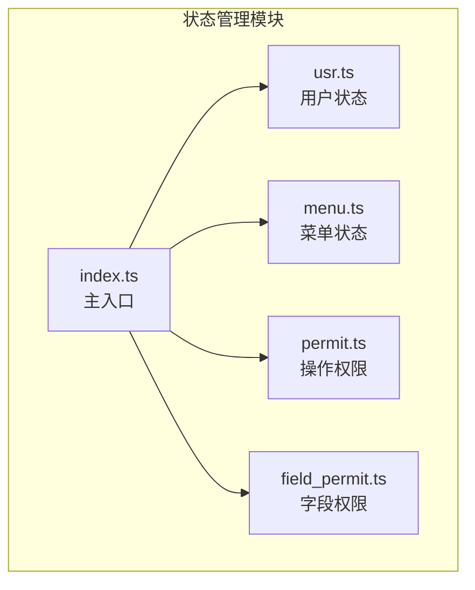
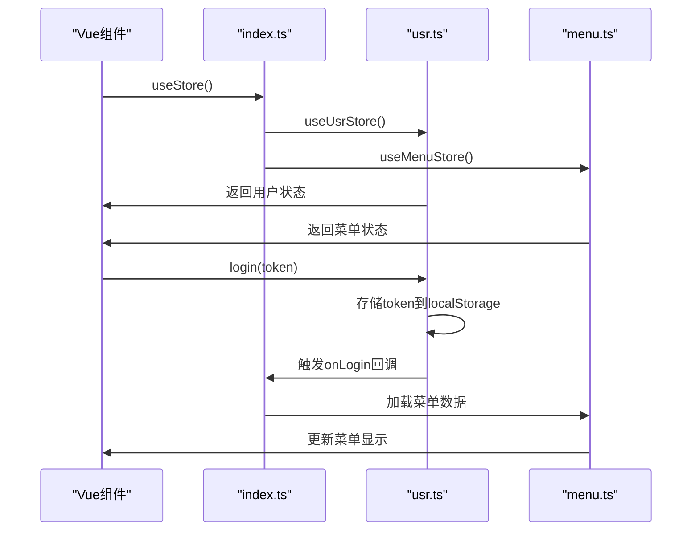
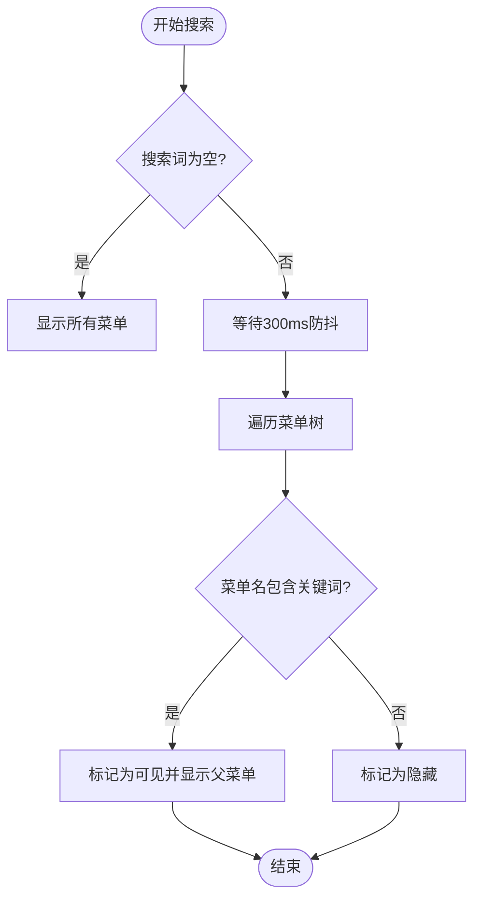
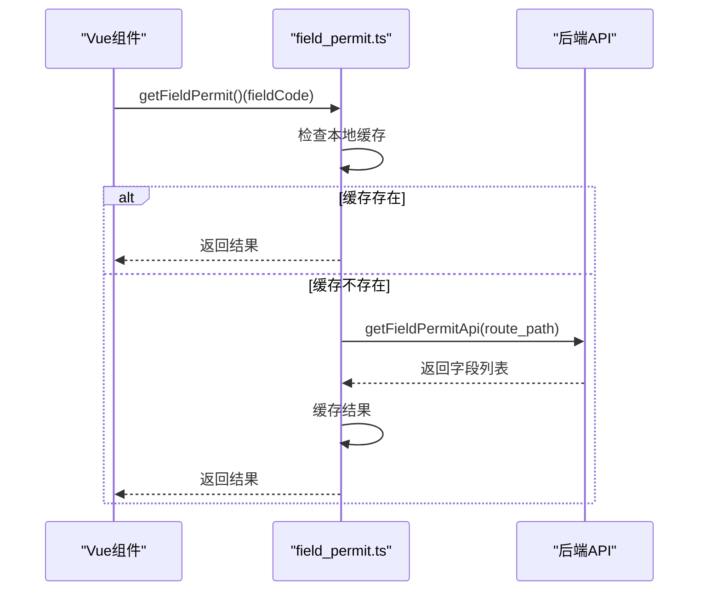
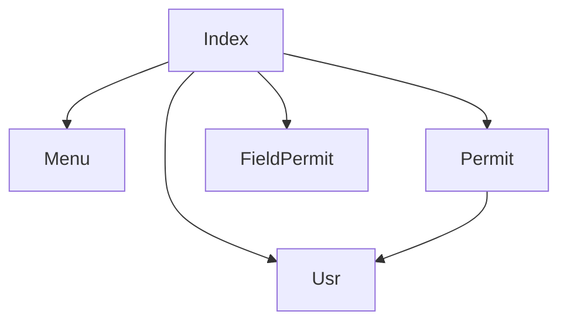

# 状态管理


**本文档引用的文件**   
- [index.ts](https://github.com/sail-sail/nest/blob/main/pc/src/store/index.ts)
- [usr.ts](https://github.com/sail-sail/nest/blob/main/pc/src/store/usr.ts)
- [menu.ts](https://github.com/sail-sail/nest/blob/main/pc/src/store/menu.ts)
- [permit.ts](https://github.com/sail-sail/nest/blob/main/pc/src/store/permit.ts)
- [field_permit.ts](https://github.com/sail-sail/nest/blob/main/pc/src/store/field_permit.ts)


## 目录
1. [简介](#简介)
2. [项目结构](#项目结构)
3. [核心组件](#核心组件)
4. [架构概览](#架构概览)
5. [详细组件分析](#详细组件分析)
6. [依赖分析](#依赖分析)
7. [性能考虑](#性能考虑)
8. [故障排除指南](#故障排除指南)
9. [结论](#结论)

## 简介
本文档详细解析了基于Vuex的模块化状态管理设计，重点阐述了PC端应用中`store/index.ts`的模块注册机制，以及`usr`、`menu`、`permit`等子模块的职责划分。深入分析了用户状态的持久化策略与登录状态管理、菜单权限的动态加载与过滤逻辑、字段级权限的细粒度控制实现。通过代码示例展示了在组件中使用`mapState`、`mapActions`的典型模式及异步操作的处理流程。

## 项目结构
项目中的状态管理模块位于`pc/src/store`目录下，采用模块化设计，每个功能模块独立成文件，由`index.ts`统一注册和导出。主要模块包括：
- `usr.ts`：用户状态管理，负责用户登录、权限、语言等信息的存储与操作。
- `menu.ts`：菜单状态管理，处理菜单数据的存储、搜索、折叠状态及父子菜单关系。
- `permit.ts`：操作权限管理，控制用户对特定路由路径的操作权限。
- `field_permit.ts`：字段级权限管理，实现表单或表格字段的显示/隐藏控制。
- `index.ts`：主入口文件，整合所有子模块并提供全局状态管理接口。



**图示来源**
- [index.ts](https://github.com/sail-sail/nest/blob/main/pc/src/store/index.ts)
- [usr.ts](https://github.com/sail-sail/nest/blob/main/pc/src/store/usr.ts)
- [menu.ts](https://github.com/sail-sail/nest/blob/main/pc/src/store/menu.ts)
- [permit.ts](https://github.com/sail-sail/nest/blob/main/pc/src/store/permit.ts)
- [field_permit.ts](https://github.com/sail-sail/nest/blob/main/pc/src/store/field_permit.ts)

**本节来源**
- [index.ts](https://github.com/sail-sail/nest/blob/main/pc/src/store/index.ts)
- [usr.ts](https://github.com/sail-sail/nest/blob/main/pc/src/store/usr.ts)

## 核心组件
核心组件包括用户状态管理、菜单状态管理、操作权限和字段权限管理。这些组件通过`useStorage`实现数据持久化，并通过计算属性和方法提供丰富的状态操作接口。

**本节来源**
- [usr.ts](https://github.com/sail-sail/nest/blob/main/pc/src/store/usr.ts#L1-L147)
- [menu.ts](https://github.com/sail-sail/nest/blob/main/pc/src/store/menu.ts#L1-L228)
- [permit.ts](https://github.com/sail-sail/nest/blob/main/pc/src/store/permit.ts#L1-L41)

## 架构概览
整个状态管理架构采用分层设计，`index.ts`作为顶层协调者，负责初始化和重置所有子模块。各子模块独立管理自身状态，通过暴露的API与外部交互。用户登录后，相关状态被持久化到`localStorage`，确保页面刷新后状态不丢失。



**图示来源**
- [index.ts](https://github.com/sail-sail/nest/blob/main/pc/src/store/index.ts#L1-L127)
- [usr.ts](https://github.com/sail-sail/nest/blob/main/pc/src/store/usr.ts#L1-L147)
- [menu.ts](https://github.com/sail-sail/nest/blob/main/pc/src/store/menu.ts#L1-L228)

## 详细组件分析

### 用户状态分析
`usr.ts`模块负责管理用户相关的所有状态，包括认证令牌、用户信息、当前租户和语言偏好。

#### 用户状态持久化
该模块使用`useStorage`将关键状态（如`authorization`、`username`、`loginInfo`）绑定到`localStorage`，实现持久化存储。当`loginInfo`更新时，会自动同步到本地存储。

```mermaid
classDiagram
class UsrStore {
+authorization : string
+username : string
+usr_id : UsrId
+tenant_id : TenantId
+lang : string
+loginInfo : GetLoginInfo | undefined
+isLogining : boolean
+refreshToken(token)
+login(token)
+logout()
+onLogin(callback)
+hasRole(role_code)
+isAdmin()
+reset()
}
UsrStore --> "localStorage" : 持久化
```

**图示来源**
- [usr.ts](https://github.com/sail-sail/nest/blob/main/pc/src/store/usr.ts#L1-L147)

#### 登录状态管理
登录流程通过`login`方法实现，接收授权令牌并触发一系列回调（如加载菜单、权限）。`logout`方法会清除所有用户相关状态。`onLogin`机制允许其他模块注册在登录后执行的回调函数。

**本节来源**
- [usr.ts](https://github.com/sail-sail/nest/blob/main/pc/src/store/usr.ts#L1-L147)

### 菜单权限分析
`menu.ts`模块管理应用的菜单结构，支持动态搜索和状态持久化。

#### 动态加载与过滤
菜单数据通过`menus`存储，支持树形遍历（`treeMenu`方法）。`search`功能允许用户搜索菜单项，匹配的菜单及其父菜单会被标记为可见（`_isShow`）。搜索使用防抖技术，避免频繁触发。



**图示来源**
- [menu.ts](https://github.com/sail-sail/nest/blob/main/pc/src/store/menu.ts#L1-L228)

#### 菜单状态管理
`isCollapse`和`hide`状态被持久化，用于记住用户的菜单折叠和隐藏偏好。`getParentIds`和`getParentMenus`方法用于处理菜单的父子关系。

**本节来源**
- [menu.ts](https://github.com/sail-sail/nest/blob/main/pc/src/store/menu.ts#L1-L228)

### 字段级权限分析
`field_permit.ts`模块实现了对表单或表格字段的细粒度访问控制。

#### 字段显示/隐藏控制
`getFieldPermit`函数返回一个检查器，用于判断指定字段码是否在当前路由的允许字段列表中。如果本地没有缓存，则会异步从API获取并缓存结果。



**图示来源**
- [field_permit.ts](https://github.com/sail-sail/nest/blob/main/pc/src/store/field_permit.ts#L1-L118)

#### 表格列权限控制
`setTableColumnsFieldPermit`方法可以直接过滤`tableColumns`数组，根据字段权限移除用户无权查看的列，实现动态列显示。

**本节来源**
- [field_permit.ts](https://github.com/sail-sail/nest/blob/main/pc/src/store/field_permit.ts#L1-L118)

## 依赖分析
各状态管理模块之间存在明确的依赖关系。`index.ts`依赖所有子模块，`permit.ts`依赖`usr.ts`以判断管理员权限。模块间通过`useStore`函数相互引用，形成一个松耦合但协同工作的系统。



**图示来源**
- [index.ts](https://github.com/sail-sail/nest/blob/main/pc/src/store/index.ts)
- [permit.ts](https://github.com/sail-sail/nest/blob/main/pc/src/store/permit.ts)
- [usr.ts](https://github.com/sail-sail/nest/blob/main/pc/src/store/usr.ts)

**本节来源**
- [index.ts](https://github.com/sail-sail/nest/blob/main/pc/src/store/index.ts#L1-L127)
- [permit.ts](https://github.com/sail-sail/nest/blob/main/pc/src/store/permit.ts#L1-L41)

## 性能考虑
- **持久化策略**：合理使用`localStorage`减少重复登录和数据加载。
- **防抖搜索**：菜单搜索使用`setTimeout`防抖，避免性能浪费。
- **缓存机制**：字段权限在首次获取后进行缓存，避免重复API调用。
- **计算属性**：使用`computed`创建`pathMenuMap`，提高菜单查找效率。

## 故障排除指南
- **登录后状态丢失**：检查`localStorage`是否被清除或`useStorage`的key是否正确。
- **菜单不显示**：确认`menus`数组是否已正确加载，检查`search`和`_isShow`状态。
- **权限不生效**：确保`permits`或`field_permits`已从后端正确加载，非管理员用户需依赖此数据。
- **异步权限检查问题**：首次检查字段权限时返回`true`是正常行为（乐观默认），实际结果在API返回后更新。

**本节来源**
- [usr.ts](https://github.com/sail-sail/nest/blob/main/pc/src/store/usr.ts#L1-L147)
- [menu.ts](https://github.com/sail-sail/nest/blob/main/pc/src/store/menu.ts#L1-L228)
- [field_permit.ts](https://github.com/sail-sail/nest/blob/main/pc/src/store/field_permit.ts#L1-L118)

## 结论
该状态管理设计结构清晰、职责分明，有效利用了模块化和持久化技术，为复杂的企业级应用提供了稳定可靠的状态管理方案。通过组合使用操作权限和字段权限，实现了灵活的细粒度访问控制。