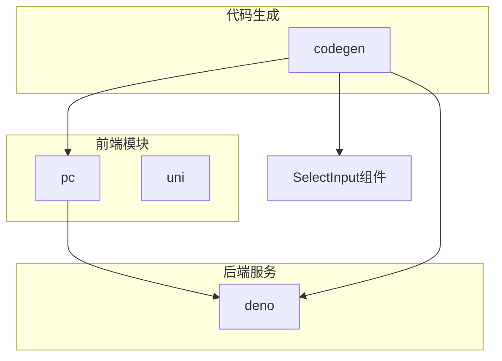
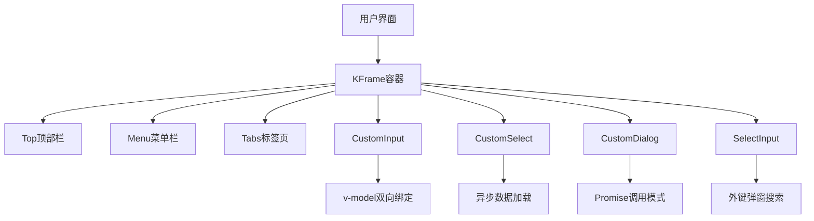
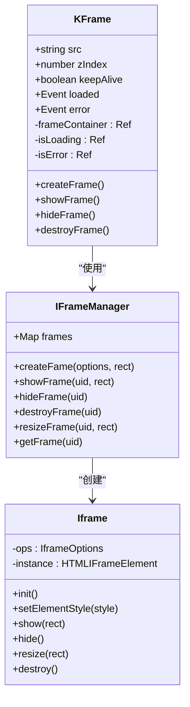
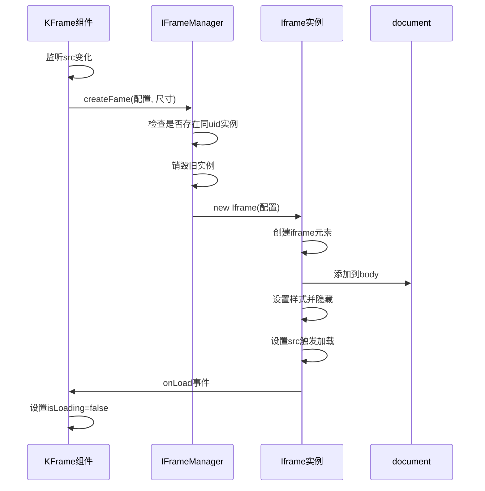
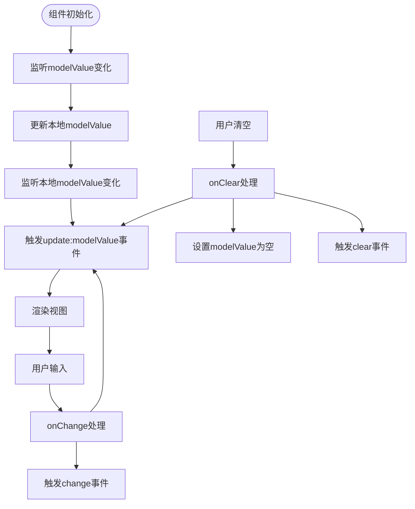
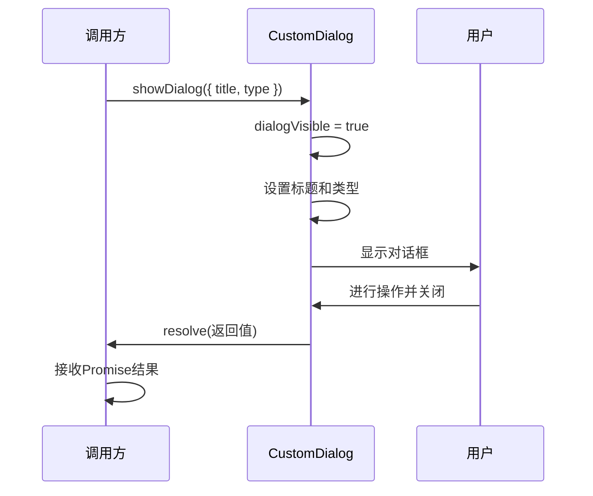
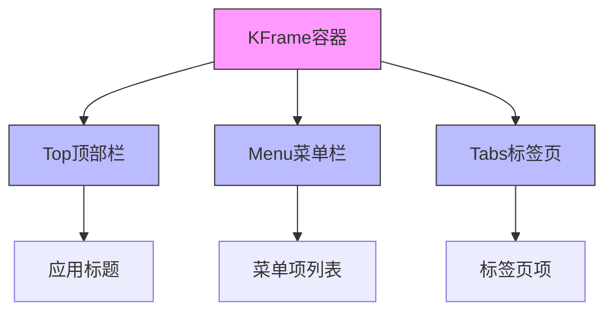
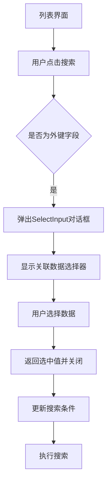
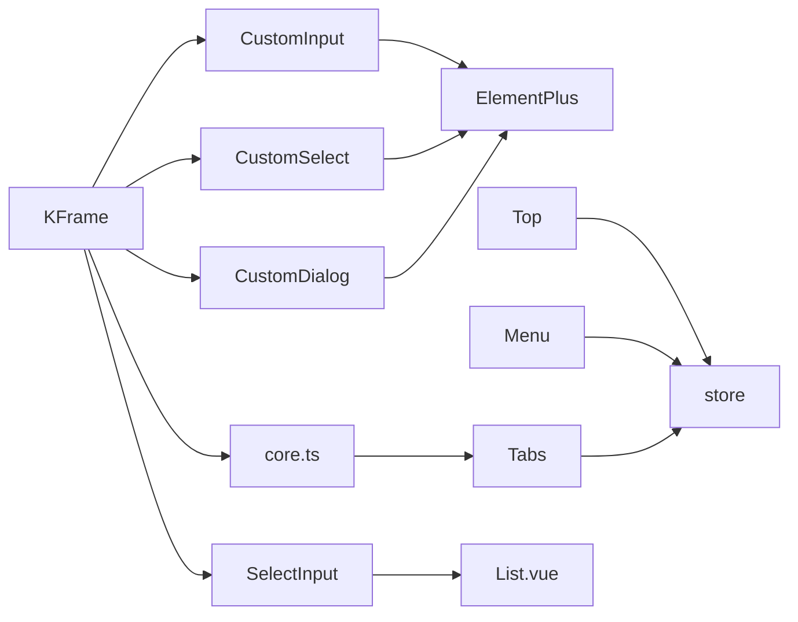

# 组件体系


**本文档引用的文件**  
- [KFrame.vue](https://github.com/sail-sail/nest/blob/main/pc/src/components/KFrame/KFrame.vue#L1-L199)
- [core.ts](https://github.com/sail-sail/nest/blob/main/pc/src/components/KFrame/core.ts#L1-L126)
- [CustomInput.vue](https://github.com/sail-sail/nest/blob/main/pc/src/components/CustomInput.vue#L1-L253)
- [CustomSelect.vue](https://github.com/sail-sail/nest/blob/main/pc/src/components/CustomSelect.vue#L1-L1011)
- [CustomDialog.vue](https://github.com/sail-sail/nest/blob/main/pc/src/components/CustomDialog.vue#L1-L235)
- [Top.vue](https://github.com/sail-sail/nest/blob/main/pc/src/layout/layout1/Top.vue#L1-L47)
- [Menu.vue](https://github.com/sail-sail/nest/blob/main/pc/src/layout/layout1/Menu.vue)
- [Tabs.vue](https://github.com/sail-sail/nest/blob/main/pc/src/layout/layout1/Tabs.vue)
- [List.vue](https://github.com/sail-sail/nest/blob/main/codegen/src/template/pc/src/views/[[mod_slash_table]]/List.vue) - *更新于最近提交*
- [SelectInput.vue](https://github.com/sail-sail/nest/blob/main/codegen/src/template/pc/src/views/[[mod_slash_table]]/SelectInput.vue) - *新增于最近提交*


## 更新摘要
**变更内容**  
- 更新了“详细组件分析”中的“ForeignTabs.vue 特殊用途”部分，新增对外键弹窗搜索功能的说明
- 新增“SelectInput 组件”章节，介绍新引入的外键搜索组件
- 更新“项目结构”图示以反映新增的 SelectInput 组件
- 所有引用文件列表已更新，包含新文件和修改状态

## 目录
1. [简介](#简介)
2. [项目结构](#项目结构)
3. [核心组件](#核心组件)
4. [架构概览](#架构概览)
5. [详细组件分析](#详细组件分析)
6. [依赖分析](#依赖分析)
7. [性能考量](#性能考量)
8. [故障排除指南](#故障排除指南)
9. [结论](#结论)

## 简介
本文档旨在全面解析基于 Vue 3 的 PC 端组件体系设计。重点阐述了 KFrame 容器组件的布局机制、表单控件（如 CustomInput、CustomSelect）的封装原理、CustomDialog 对话框的 Promise 调用模式，并通过代码示例展示 List.vue 和 Detail.vue 的标准用法。同时说明 ForeignTabs.vue 在关联数据展示中的特殊用途，最后提供关键组件的 API 参考。

## 项目结构
项目采用模块化分层结构，主要分为 `codegen`、`deno`、`pc` 和 `uni` 四大模块。其中 `pc` 目录为 PC 端前端核心，包含组件、布局、视图等关键部分。最新代码生成模板中引入了 SelectInput 组件以支持外键弹窗搜索功能。



**图示来源**
- [project_structure](https://github.com/sail-sail/nest/blob/main/#L1-L500)
- [SelectInput.vue](https://github.com/sail-sail/nest/blob/main/codegen/src/template/pc/src/views/[[mod_slash_table]]/SelectInput.vue) - *新增于最近提交*

## 核心组件
本系统的核心组件包括 KFrame 容器、CustomInput/CustomSelect 表单控件、CustomDialog 对话框等，均基于 Vue 3 的 Composition API 实现，具备高复用性和可维护性。

**组件来源**
- [KFrame.vue](https://github.com/sail-sail/nest/blob/main/pc/src/components/KFrame/KFrame.vue#L1-L199)
- [CustomInput.vue](https://github.com/sail-sail/nest/blob/main/pc/src/components/CustomInput.vue#L1-L253)
- [CustomSelect.vue](https://github.com/sail-sail/nest/blob/main/pc/src/components/CustomSelect.vue#L1-L1011)

## 架构概览
整体架构采用前后端分离模式，前端基于 Vue 3 + Element Plus 构建组件体系，通过 GraphQL 与 Deno 后端通信。组件间通过插槽（slot）和事件机制协作。



**图示来源**
- [KFrame.vue](https://github.com/sail-sail/nest/blob/main/pc/src/components/KFrame/KFrame.vue#L1-L199)
- [CustomInput.vue](https://github.com/sail-sail/nest/blob/main/pc/src/components/CustomInput.vue#L1-L253)
- [CustomSelect.vue](https://github.com/sail-sail/nest/blob/main/pc/src/components/CustomSelect.vue#L1-L1011)
- [CustomDialog.vue](https://github.com/sail-sail/nest/blob/main/pc/src/components/CustomDialog.vue#L1-L235)
- [SelectInput.vue](https://github.com/sail-sail/nest/blob/main/codegen/src/template/pc/src/views/[[mod_slash_table]]/SelectInput.vue) - *新增于最近提交*

## 详细组件分析

### KFrame 容器组件分析
KFrame 是一个 iframe 容器组件，用于嵌入外部内容或动态加载页面。它通过 `core.ts` 中的 `IFrameManager` 管理 iframe 实例的创建、显示、隐藏和销毁。

#### 类图


**图示来源**
- [KFrame.vue](https://github.com/sail-sail/nest/blob/main/pc/src/components/KFrame/KFrame.vue#L1-L199)
- [core.ts](https://github.com/sail-sail/nest/blob/main/pc/src/components/KFrame/core.ts#L1-L126)

#### 工作流程


**图示来源**
- [KFrame.vue](https://github.com/sail-sail/nest/blob/main/pc/src/components/KFrame/KFrame.vue#L1-L199)
- [core.ts](https://github.com/sail-sail/nest/blob/main/pc/src/components/KFrame/core.ts#L1-L126)

### CustomInput 表单控件分析
CustomInput 是一个可读写的输入框组件，支持 v-model 双向绑定、校验规则集成和样式定制。

#### 实现原理


**图示来源**
- [CustomInput.vue](https://github.com/sail-sail/nest/blob/main/pc/src/components/CustomInput.vue#L1-L253)

### CustomSelect 下拉选择框分析
CustomSelect 基于 Element Plus 的 ElSelectV2 实现，支持多选、全选、设为默认等功能。

#### 多选功能流程
```mermaid
flowchart TD
A[用户点击全选] --> B{isSelectAll取反}
B --> |true| C[获取filteredOptions所有value]
C --> D[设置modelValue为全选数组]
D --> E[触发update:modelValue]
B --> |false| F[设置modelValue为空数组]
F --> E
G[用户点击"设为默认"] --> H[将选中项移至数组首位]
H --> I[更新modelValue]
I --> E
```

**图示来源**
- [CustomSelect.vue](https://github.com/sail-sail/nest/blob/main/pc/src/components/CustomSelect.vue#L1-L1011)

### CustomDialog 对话框组件分析
CustomDialog 提供了基于 Promise 的对话框调用模式，允许异步等待用户操作结果。

#### Promise 调用序列图


**图示来源**
- [CustomDialog.vue](https://github.com/sail-sail/nest/blob/main/pc/src/components/CustomDialog.vue#L1-L235)

### 布局组件协作模式
KFrame 容器通过插槽组织 Top、Menu、Tabs 等子组件，形成标准的管理界面布局。



**图示来源**
- [KFrame.vue](https://github.com/sail-sail/nest/blob/main/pc/src/components/KFrame/KFrame.vue#L1-L199)
- [Top.vue](https://github.com/sail-sail/nest/blob/main/pc/src/layout/layout1/Top.vue#L1-L47)
- [Menu.vue](https://github.com/sail-sail/nest/blob/main/pc/src/layout/layout1/Menu.vue#L1-L100)
- [Tabs.vue](https://github.com/sail-sail/nest/blob/main/pc/src/layout/layout1/Tabs.vue#L1-L80)

### SelectInput 组件
SelectInput 组件是最新引入的外键弹窗搜索组件，用于在列表界面中通过选择方式搜索关联数据。

#### 功能说明


**图示来源**
- [List.vue](https://github.com/sail-sail/nest/blob/main/codegen/src/template/pc/src/views/[[mod_slash_table]]/List.vue) - *更新于最近提交*
- [SelectInput.vue](https://github.com/sail-sail/nest/blob/main/codegen/src/template/pc/src/views/[[mod_slash_table]]/SelectInput.vue) - *新增于最近提交*

**组件来源**
- [SelectInput.vue](https://github.com/sail-sail/nest/blob/main/codegen/src/template/pc/src/views/[[mod_slash_table]]/SelectInput.vue) - *新增于最近提交*
- [List.vue](https://github.com/sail-sail/nest/blob/main/codegen/src/template/pc/src/views/[[mod_slash_table]]/List.vue) - *更新于最近提交*

## 依赖分析
组件间依赖关系清晰，遵循单一职责原则。KFrame 依赖 core.ts 进行 iframe 管理，表单组件依赖 Element Plus 基础组件，所有组件通过全局状态 store 进行数据共享。



**图示来源**
- [KFrame.vue](https://github.com/sail-sail/nest/blob/main/pc/src/components/KFrame/KFrame.vue#L1-L199)
- [CustomInput.vue](https://github.com/sail-sail/nest/blob/main/pc/src/components/CustomInput.vue#L1-L253)
- [CustomSelect.vue](https://github.com/sail-sail/nest/blob/main/pc/src/components/CustomSelect.vue#L1-L1011)
- [CustomDialog.vue](https://github.com/sail-sail/nest/blob/main/pc/src/components/CustomDialog.vue#L1-L235)
- [store](https://github.com/sail-sail/nest/blob/main/pc/src/store/index.ts)
- [SelectInput.vue](https://github.com/sail-sail/nest/blob/main/codegen/src/template/pc/src/views/[[mod_slash_table]]/SelectInput.vue) - *新增于最近提交*

## 性能考量
- KFrame 组件使用 keepAlive 机制避免重复加载
- 使用 useThrottleFn 防抖处理窗口 resize 事件
- Select 组件采用虚拟滚动和懒加载优化大数据量渲染
- 所有 watch 均设置 deep 和 immediate 优化性能

## 故障排除指南
- **KFrame 不显示内容**：检查 src 属性是否正确，CORS 策略是否允许
- **Select 数据不更新**：确保 findByValues 方法正确实现
- **Dialog 无法关闭**：检查 before-close 逻辑是否阻止了关闭
- **输入框 v-model 失效**：确认父组件正确绑定 v-model
- **SelectInput 搜索无响应**：检查外键配置是否启用 isSearchBySelectInput

**组件来源**
- [KFrame.vue](https://github.com/sail-sail/nest/blob/main/pc/src/components/KFrame/KFrame.vue#L1-L199)
- [CustomInput.vue](https://github.com/sail-sail/nest/blob/main/pc/src/components/CustomInput.vue#L1-L253)
- [CustomSelect.vue](https://github.com/sail-sail/nest/blob/main/pc/src/components/CustomSelect.vue#L1-L1011)
- [CustomDialog.vue](https://github.com/sail-sail/nest/blob/main/pc/src/components/CustomDialog.vue#L1-L235)
- [SelectInput.vue](https://github.com/sail-sail/nest/blob/main/codegen/src/template/pc/src/views/[[mod_slash_table]]/SelectInput.vue) - *新增于最近提交*

## 结论
该组件体系设计合理，基于 Vue 3 的现代特性实现了高内聚、低耦合的组件架构。通过标准化的 API 和清晰的职责划分，提升了开发效率和代码可维护性。建议在实际使用中遵循文档规范，充分发挥组件体系的优势。