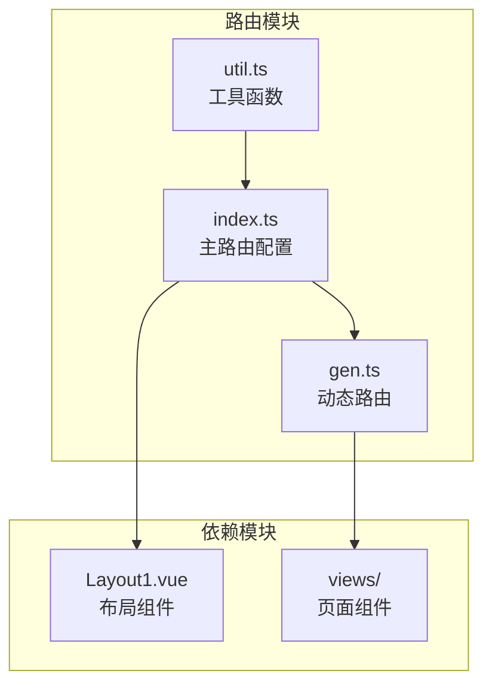
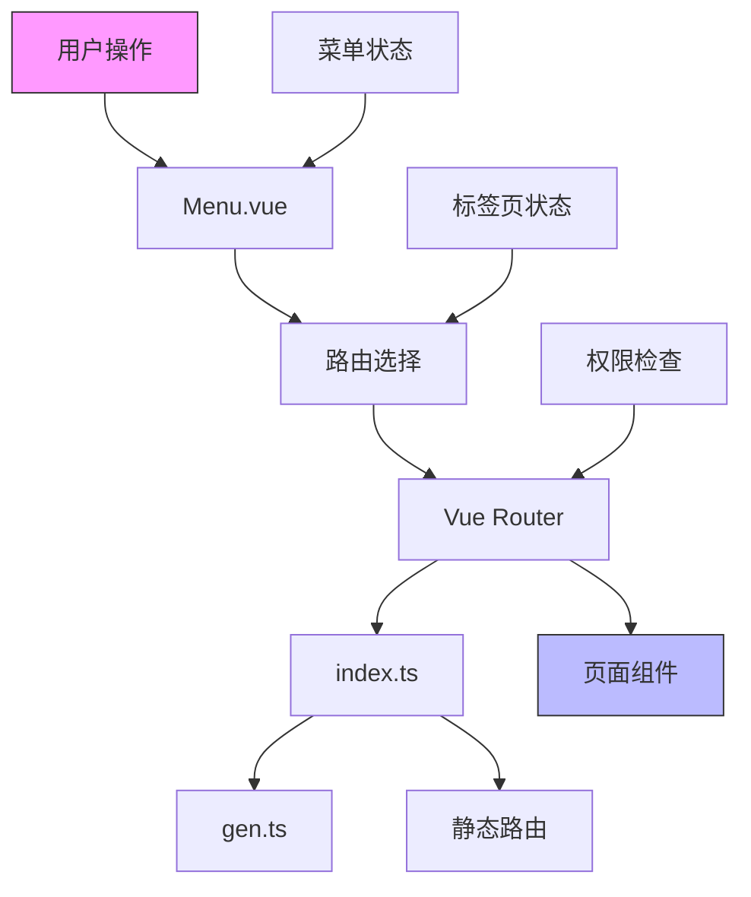
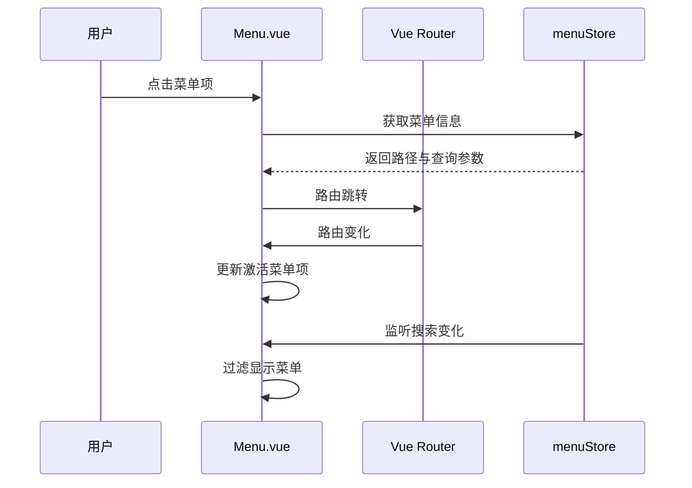
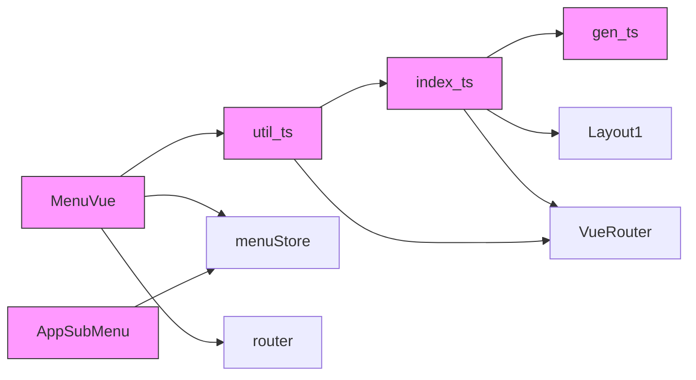

# 路由系统


**本文档引用文件**  
- [index.ts](https://github.com/sail-sail/nest/blob/main/pc/src/router/index.ts)
- [gen.ts](https://github.com/sail-sail/nest/blob/main/pc/src/router/gen.ts)
- [util.ts](https://github.com/sail-sail/nest/blob/main/pc/src/router/util.ts)
- [Menu.vue](https://github.com/sail-sail/nest/blob/main/pc/src/layout/layout1/Menu.vue)
- [AppSubMenu.vue](https://github.com/sail-sail/nest/blob/main/pc/src/components/AppSubMenu.vue)


## 目录
1. [简介](#简介)
2. [项目结构](#项目结构)
3. [核心组件](#核心组件)
4. [架构概览](#架构概览)
5. [详细组件分析](#详细组件分析)
6. [依赖分析](#依赖分析)
7. [性能考虑](#性能考虑)
8. [故障排除指南](#故障排除指南)
9. [结论](#结论)

## 简介
本文档详细解析了基于 Vue Router 的 PC 端路由系统。该系统采用静态路由与动态路由相结合的模式，实现了灵活的页面导航与权限控制机制。文档将深入分析路由配置、权限验证流程、菜单同步机制以及相关工具函数的实现原理。

## 项目结构
路由系统主要由三个核心文件构成，位于 `pc/src/router` 目录下：
- **index.ts**：主路由配置文件，整合静态与动态路由
- **gen.ts**：自动生成的业务路由配置
- **util.ts**：路由工具函数集合

该结构实现了路由配置的自动化生成与手动配置的有机结合，提高了开发效率与维护性。



**图示来源**
- [index.ts](https://github.com/sail-sail/nest/blob/main/pc/src/router/index.ts)
- [gen.ts](https://github.com/sail-sail/nest/blob/main/pc/src/router/gen.ts)
- [util.ts](https://github.com/sail-sail/nest/blob/main/pc/src/router/util.ts)

**本节来源**
- [index.ts](https://github.com/sail-sail/nest/blob/main/pc/src/router/index.ts)
- [gen.ts](https://github.com/sail-sail/nest/blob/main/pc/src/router/gen.ts)

## 核心组件
路由系统的核心在于 `index.ts` 与 `gen.ts` 的协同工作模式。`gen.ts` 文件由代码生成器自动生成，包含了所有业务模块的路由配置，而 `index.ts` 则负责将这些动态路由与静态路由（如首页）进行整合。

权限验证通过注释掉的路由守卫实现，通过检查菜单权限来控制页面访问。`util.ts` 提供了丰富的路由工具函数，支持路由查询、组件获取等操作。

**本节来源**
- [index.ts](https://github.com/sail-sail/nest/blob/main/pc/src/router/index.ts#L1-L60)
- [gen.ts](https://github.com/sail-sail/nest/blob/main/pc/src/router/gen.ts#L1-L335)
- [util.ts](https://github.com/sail-sail/nest/blob/main/pc/src/router/util.ts#L1-L143)

## 架构概览
整个路由系统采用分层架构设计，实现了配置、控制与展示的分离。



**图示来源**
- [index.ts](https://github.com/sail-sail/nest/blob/main/pc/src/router/index.ts)
- [gen.ts](https://github.com/sail-sail/nest/blob/main/pc/src/router/gen.ts)
- [Menu.vue](https://github.com/sail-sail/nest/blob/main/pc/src/layout/layout1/Menu.vue)

## 详细组件分析

### 静态与动态路由整合机制
`index.ts` 文件通过扩展操作符将 `gen.ts` 中的动态路由与静态路由进行合并，形成完整的路由表。

```typescript
const routes: Array<RouteRecordRaw> = [
  ...routesGen,
  {
    path: "",
    redirect: "/index",
  },
  {
    path: "/index",
    component: Layout1,
    children: [
      {
        path: "",
        name: "首页",
        component: () => import("@/views/Index.vue"),
        meta: {
          closeable: true,
          icon: "iconfont-home-fill",
        },
      },
    ],
  },
];
```

这种设计模式使得新业务模块的添加只需更新 `gen.ts` 文件，无需修改主路由配置，实现了路由配置的自动化管理。

**本节来源**
- [index.ts](https://github.com/sail-sail/nest/blob/main/pc/src/router/index.ts#L8-L60)

### 动态路由生成原理
`gen.ts` 文件为每个业务模块（如用户、角色、菜单等）生成了标准的路由配置。所有路由均采用嵌套路由模式，使用 `Layout1` 作为布局组件。

```typescript
export const routesGen: Array<RouteRecordRaw> = [
  {
    path: "/base/usr",
    component: Layout1,
    children: [
      {
        path: "",
        name: "用户",
        component: () => import("@/views/base/usr/List.vue"),
        props: (route) => route.query,
        meta: {
          name: "用户",
        },
      },
    ],
  },
  // 其他模块...
];
```

每个子路由都配置了 `props` 以支持查询参数传递，并通过 `meta` 字段存储额外的元信息，如菜单名称。

**本节来源**
- [gen.ts](https://github.com/sail-sail/nest/blob/main/pc/src/router/gen.ts#L1-L335)

### 路由守卫与权限验证
虽然当前代码中路由守卫被注释，但其设计思路清晰展示了权限验证流程：

1. 检查目标路由是否为首页等公共页面
2. 通过菜单存储获取目标路径对应的菜单项
3. 若菜单不存在或无权限，则阻止导航并提示
4. 为当前标签页标记权限状态

```typescript
// router.beforeEach((to, from) => {
//   const tabsStore = useTabsStore();
//   if (tabsStore.actTab?._hasPermit) {
//     return true;
//   }
//   if (to.path === "/index" || to.path === "/" || to.path === "") {
//     return true;
//   }
//   const menuStore = useMenuStore();
//   const menu = menuStore.getMenuByPath(to.path);
//   if (!menu) {
//     tabsStore.activeTab({ path: from.path });
//     alert("无权限打开此菜单!");
//     return false;
//   }
//   if (tabsStore.actTab) {
//     tabsStore.actTab._hasPermit = true;
//   }
//   return true;
// });
```

**本节来源**
- [index.ts](https://github.com/sail-sail/nest/blob/main/pc/src/router/index.ts#L50-L60)

### 路由与菜单同步机制
`Menu.vue` 组件与路由系统紧密集成，实现了菜单与路由的双向同步：



**图示来源**
- [Menu.vue](https://github.com/sail-sail/nest/blob/main/pc/src/layout/layout1/Menu.vue#L1-L294)
- [AppSubMenu.vue](https://github.com/sail-sail/nest/blob/main/pc/src/components/AppSubMenu.vue#L1-L81)

**本节来源**
- [Menu.vue](https://github.com/sail-sail/nest/blob/main/pc/src/layout/layout1/Menu.vue#L1-L294)

### 路由工具函数分析
`util.ts` 文件提供了多个实用的路由工具函数：

#### 路由查询函数
```typescript
export function getRouter(path0?: string) {
  // 根据路径查找路由配置
}

export function getRouters() {
  // 获取所有路由配置
}

export function getRouterPaths(
  filterFn?: (router: RouteRecordRaw) => boolean,
) {
  // 获取路由路径列表，支持过滤
}
```

#### 组件异步加载
```typescript
export async function getComponent(path0: string): Promise<Component> {
  // 根据路由路径异步获取组件
}
```

#### 页面打开功能
```typescript
export async function openForeignPage(
  routeName: string,
  tabName: string | undefined,
  query?: { [key: string]: string },
) {
  // 通过路由名称打开新页面
}
```

这些工具函数极大地简化了路由相关的操作，提高了代码的复用性。

**本节来源**
- [util.ts](https://github.com/sail-sail/nest/blob/main/pc/src/router/util.ts#L1-L143)

## 依赖分析
路由系统与其他模块存在明确的依赖关系：



**图示来源**
- [index.ts](https://github.com/sail-sail/nest/blob/main/pc/src/router/index.ts)
- [gen.ts](https://github.com/sail-sail/nest/blob/main/pc/src/router/gen.ts)
- [util.ts](https://github.com/sail-sail/nest/blob/main/pc/src/router/util.ts)
- [Menu.vue](https://github.com/sail-sail/nest/blob/main/pc/src/layout/layout1/Menu.vue)
- [AppSubMenu.vue](https://github.com/sail-sail/nest/blob/main/pc/src/components/AppSubMenu.vue)

**本节来源**
- 所有引用文件

## 性能考虑
路由系统在设计上考虑了以下性能优化：
1. **路由懒加载**：通过 `import()` 语法实现组件的按需加载
2. **菜单搜索优化**：使用防抖技术减少频繁的菜单过滤操作
3. **状态管理**：通过 Pinia 存储管理菜单和标签页状态，避免重复计算

## 故障排除指南
### 常见问题及解决方案
1. **新模块路由不生效**
   - 检查 `gen.ts` 是否已正确生成
   - 确认 `index.ts` 中是否正确导入 `routesGen`

2. **菜单无法点击**
   - 检查 `Menu.vue` 中的 `route_path` 是否正确配置
   - 确认路由守卫逻辑是否阻止了导航

3. **权限验证失效**
   - 检查 `menuStore.getMenuByPath()` 方法的实现
   - 确认菜单数据是否已正确加载

**本节来源**
- [index.ts](https://github.com/sail-sail/nest/blob/main/pc/src/router/index.ts)
- [Menu.vue](https://github.com/sail-sail/nest/blob/main/pc/src/layout/layout1/Menu.vue)

## 结论
本文档详细解析了基于 Vue Router 的路由管理系统。该系统通过静态与动态路由的结合，实现了灵活的页面导航机制。路由守卫提供了基础的权限控制能力，而 `util.ts` 中的工具函数则增强了路由操作的便利性。菜单组件与路由系统的深度集成，确保了用户界面与导航逻辑的一致性。整体设计体现了模块化、可维护性和可扩展性的良好平衡。