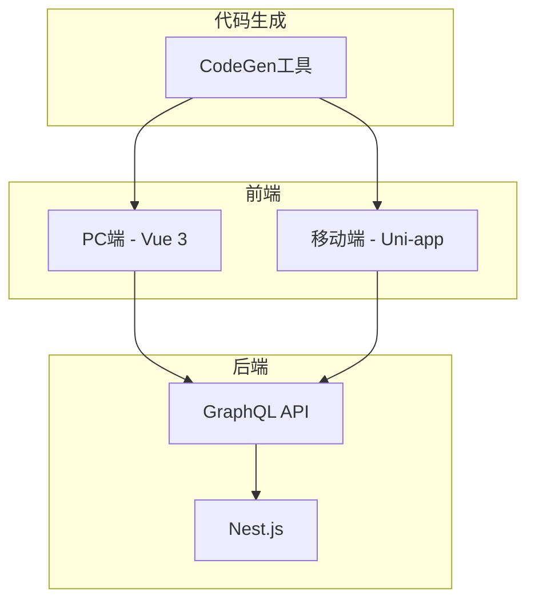
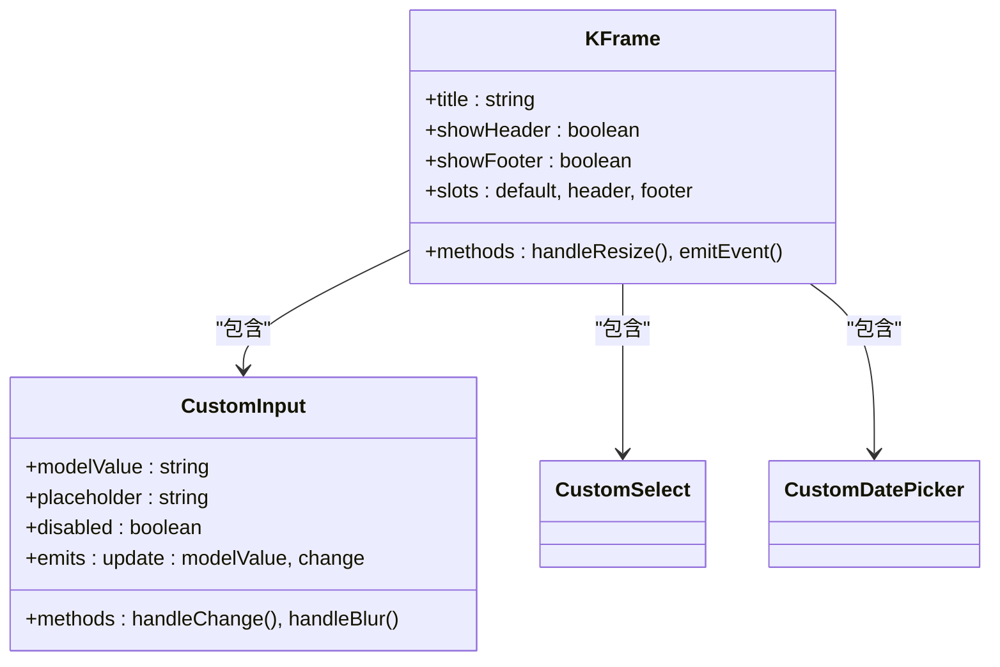
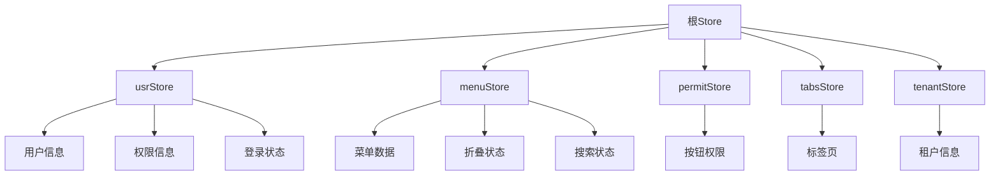
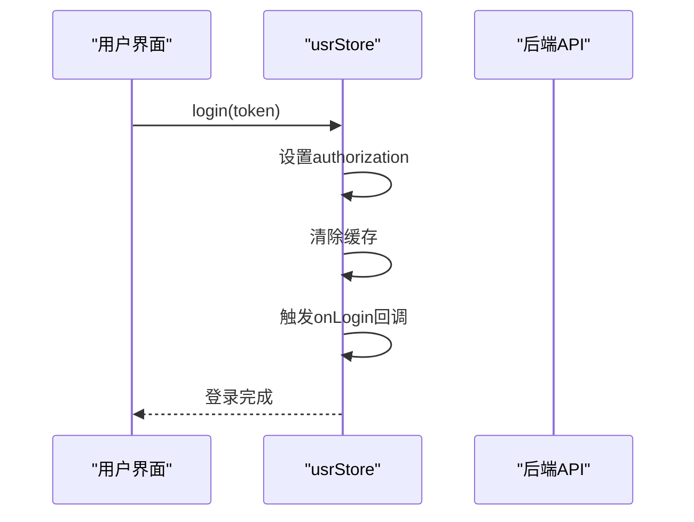
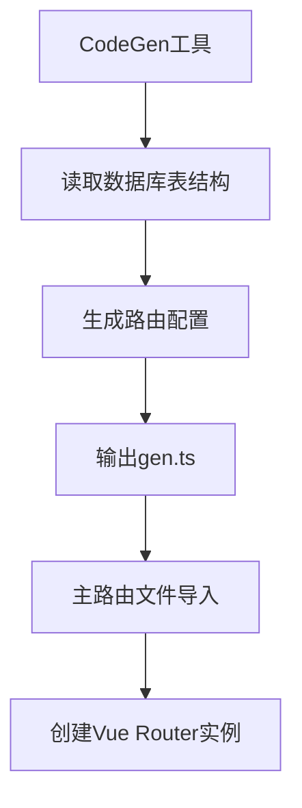
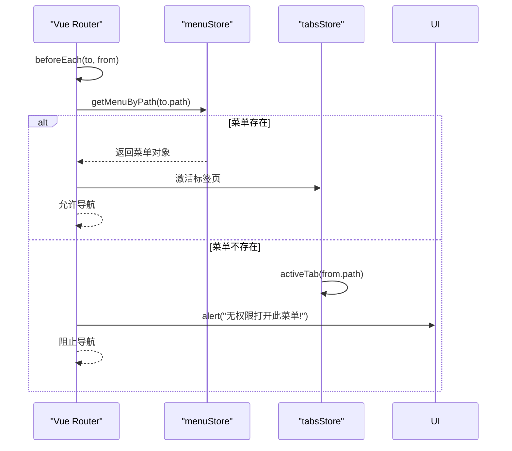
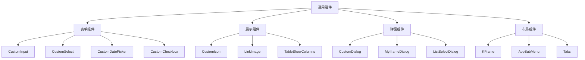
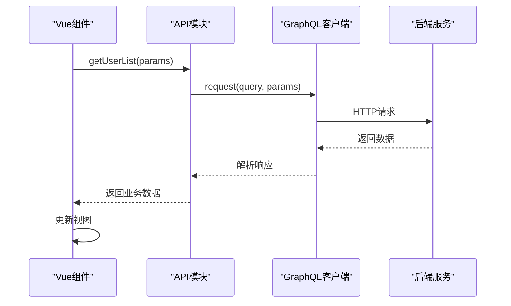
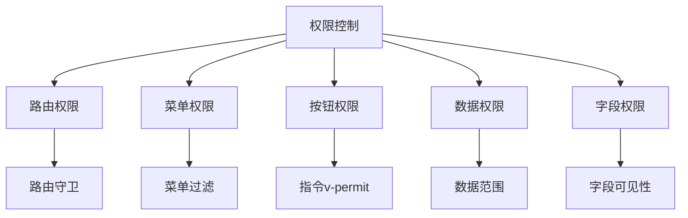

# 前端架构


**本文档引用的文件**  
- [index.ts](https://github.com/sail-sail/nest/blob/main/pc/src/router/index.ts)
- [gen.ts](https://github.com/sail-sail/nest/blob/main/pc/src/router/gen.ts)
- [index.ts](https://github.com/sail-sail/nest/blob/main/pc/src/store/index.ts)
- [usr.ts](https://github.com/sail-sail/nest/blob/main/pc/src/store/usr.ts)
- [menu.ts](https://github.com/sail-sail/nest/blob/main/pc/src/store/menu.ts)
- [main.ts](https://github.com/sail-sail/nest/blob/main/pc/src/main.ts)
- [KFrame.vue](https://github.com/sail-sail/nest/blob/main/pc/src/components/KFrame/KFrame.vue)
- [CustomInput.vue](https://github.com/sail-sail/nest/blob/main/pc/src/components/CustomInput.vue)
- [App.vue](https://github.com/sail-sail/nest/blob/main/pc/src/App.vue)
- [Login.vue](https://github.com/sail-sail/nest/blob/main/pc/src/layout/Login.vue)
- [package.json](https://github.com/sail-sail/nest/blob/main/pc/package.json) - *更新了VitePWA依赖*
- [.npmrc](https://github.com/sail-sail/nest/blob/main/pc/.npmrc) - *日志级别设置为error*
- [tm-modal.vue](https://github.com/sail-sail/nest/blob/main/uni/src/uni_modules/tm-ui/components/tm-modal/tm-modal.vue) - *底部操作栏定制修改*
- [TreeList.vue](https://github.com/sail-sail/nest/blob/main/pc/src/views/base/field_permit/TreeList.vue) - *租户过滤逻辑更新*
- [TreeList.vue](https://github.com/sail-sail/nest/blob/main/pc/src/views/base/menu/TreeList.vue) - *租户过滤逻辑更新*
- [config.ts](https://github.com/sail-sail/nest/blob/main/codegen/src/config.ts) - *新增关键词搜索配置*
- [List.vue](https://github.com/sail-sail/nest/blob/main/codegen/src/template/pc/src/views/[[mod_slash_table]]/List.vue) - *外键搜索方式及关键词搜索实现*


## 更新摘要
**变更内容**  
- 在树形列表组件中实现"仅当前租户"过滤功能，影响field_permit和menu模块
- 更新前端列表组件模板，支持外键字段的SelectInput搜索方式
- 在前端列表组件中实现关键词搜索功能
- 更新相关配置文件和模板文件的引用说明

## 目录
1. [项目结构概览](#项目结构概览)
2. [PC端架构设计](#pc端架构设计)
3. [移动端架构设计](#移动端架构设计)
4. [核心模块分析](#核心模块分析)
5. [状态管理机制](#状态管理机制)
6. [路由系统设计](#路由系统设计)
7. [组件体系与最佳实践](#组件体系与最佳实践)
8. [API集成与GraphQL交互](#api集成与graphql交互)
9. [权限控制实现](#权限控制实现)
10. [开发建议与总结](#开发建议与总结)

## 项目结构概览

本项目采用多前端架构，包含PC端（Vue 3）和移动端（Uni-app）两个独立前端应用，共享后端Nest.js服务。整体结构清晰，模块化程度高。



**图示来源**
- [project_structure](https://github.com/sail-sail/nest/blob/main/)

## PC端架构设计

PC端基于Vue 3 + TypeScript构建，采用组合式API和Pinia状态管理（通过自定义store实现），使用Element Plus作为UI框架。项目结构遵循功能模块化原则，核心目录包括components、views、store、router等。

### 技术栈
- **框架**: Vue 3 (Composition API)
- **状态管理**: 自定义Pinia风格store
- **路由**: Vue Router (Hash模式)
- **UI框架**: Element Plus
- **构建工具**: Vite
- **样式**: SCSS
- **PWA支持**: VitePWA插件

### 构建配置更新

根据最新代码变更，PC端项目已更新npm日志级别为error，并添加了VitePWA支持。

```json
// pc/.npmrc
loglevel=error
node-options=--max-old-space-size=4096
```

```json
// pc/package.json
"devDependencies": {
  "vite-plugin-pwa": "1.0.3",
  // ... 其他依赖
}
```

这些变更优化了构建输出的清晰度，并为应用添加了PWA功能支持。

**本节来源**
- [main.ts](https://github.com/sail-sail/nest/blob/main/pc/src/main.ts)
- [App.vue](https://github.com/sail-sail/nest/blob/main/pc/src/App.vue)
- [.npmrc](https://github.com/sail-sail/nest/blob/main/pc/.npmrc)
- [package.json](https://github.com/sail-sail/nest/blob/main/pc/package.json)

## 移动端架构设计

移动端基于Uni-app框架开发，兼容多端（H5、小程序、App），使用Vue 3语法。与PC端相比，UI组件库替换为tm-ui，布局和交互方式更适应移动设备。

### 移动端特点
- **UI库**: tm-ui组件库
- **状态管理**: Pinia风格store
- **路由**: Uni-app原生路由系统
- **适配**: 响应式设计，支持多种屏幕尺寸
- **组件**: 移动端专用组件（如CustomInputModal）

### tm-modal组件定制

根据最新代码变更，对tm-ui组件库中的tm-modal组件进行了定制化修改，主要针对底部操作栏的布局和样式。

```vue
<!-- uni/src/uni_modules/tm-ui/components/tm-modal/tm-modal.vue -->
<view v-if="showFooter" class="tmModalFooter" :style="{ backgroundColor: _bgColor }">
  <slot name="footer">
    <view un-flex="~ [1_0_0]" un-overflow="hidden" un-gap="x-2">
      <view un-flex="~ [1_0_0]" un-overflow="hidden">
        <tm-button :loading="isLoading" :color="_btnColor" @click="cancelEvt"
          v-if="_showCancel" skin="thin" style="margin-right: 16px; flex: 1" block>
          {{ _cancelText }}
        </tm-button>
      </view>
      <view un-flex="~ [1_0_0]" un-overflow="hidden">
        <tm-button :loading="isLoading" :color="_btnColor" @click="confirmEvt"
          style="flex: 1" block>
          {{ _confirmText }}
        </tm-button>
      </view>
    </view>
  </slot>
</view>
```

修改后的底部操作栏采用flex布局，确保按钮在不同屏幕尺寸下都能良好显示，并增加了间距控制。

**本节来源**
- [tm-modal.vue](https://github.com/sail-sail/nest/blob/main/uni/src/uni_modules/tm-ui/components/tm-modal/tm-modal.vue)
- [uni/src/main.ts](https://github.com/sail-sail/nest/blob/main/uni/src/main.ts)
- [uni/src/App.vue](https://github.com/sail-sail/nest/blob/main/uni/src/App.vue)

## 核心模块分析

### KFrame组件体系

KFrame是PC端的核心布局组件，提供标准化的页面框架结构。



**图示来源**
- [KFrame.vue](https://github.com/sail-sail/nest/blob/main/pc/src/components/KFrame/KFrame.vue)
- [CustomInput.vue](https://github.com/sail-sail/nest/blob/main/pc/src/components/CustomInput.vue)

### 组件使用示例

```typescript
// CustomInput.vue 核心代码
<template>
  <el-input
    v-model="inputValue"
    :placeholder="placeholder"
    :disabled="disabled"
    @input="handleInput"
    @change="handleChange"
  />
</template>

<script setup lang="ts">
import { ref, watch } from 'vue';

const props = defineProps<{
  modelValue?: string;
  placeholder?: string;
  disabled?: boolean;
}>();

const emit = defineEmits(['update:modelValue', 'change']);

const inputValue = ref(props.modelValue || '');

watch(() => props.modelValue, (newVal) => {
  inputValue.value = newVal || '';
});

const handleInput = (value: string) => {
  emit('update:modelValue', value);
};

const handleChange = (value: string) => {
  emit('change', value);
};
</script>
```

**本节来源**
- [KFrame.vue](https://github.com/sail-sail/nest/blob/main/pc/src/components/KFrame/KFrame.vue)
- [CustomInput.vue](https://github.com/sail-sail/nest/blob/main/pc/src/components/CustomInput.vue)

## 状态管理机制

项目采用模块化的状态管理模式，通过多个store文件管理不同领域的状态。

### Store架构



**图示来源**
- [store/index.ts](https://github.com/sail-sail/nest/blob/main/pc/src/store/index.ts)

### 用户状态管理

```typescript
// usr.ts 核心状态
const authorization = useStorage<string>("store.usr.authorization", "");
const username = useStorage<string>("store.usr.username", "");
const usr_id = useStorage<UsrId>("store.usr.usr_id", "" as unknown as UsrId);
const loginInfo = ref<GetLoginInfo | undefined>(undefined);
const lang = useStorage<string>("store.usr.lang", "");
```

提供以下核心方法：
- `login()`: 处理用户登录
- `logout()`: 处理用户登出
- `hasRole()`: 检查用户角色
- `isAdmin()`: 判断是否为管理员
- `onLogin()`: 登录回调注册



**图示来源**
- [usr.ts](https://github.com/sail-sail/nest/blob/main/pc/src/store/usr.ts)

**本节来源**
- [usr.ts](https://github.com/sail-sail/nest/blob/main/pc/src/store/usr.ts)
- [index.ts](https://github.com/sail-sail/nest/blob/main/pc/src/store/index.ts)

## 路由系统设计

路由系统采用动态生成机制，通过codegen工具自动生成路由配置。

### 路由生成机制



### 路由配置结构

```typescript
// gen.ts 路由示例
export const routesGen: Array<RouteRecordRaw> = [
  {
    path: "/base/user",
    component: Layout1,
    children: [
      {
        path: "",
        name: "用户",
        component: () => import("@/views/base/usr/List.vue"),
        props: (route) => route.query,
        meta: {
          name: "用户",
        },
      },
    ],
  },
  // ... 其他路由
];
```

### 路由集成

```typescript
// index.ts 路由集成
import { routesGen } from "./gen.ts";
const routes: Array<RouteRecordRaw> = [
  ...routesGen,
  {
    path: "/index",
    component: Layout1,
    children: [
      {
        path: "",
        name: "首页",
        component: () => import("@/views/Index.vue"),
      },
    ],
  },
];
```

### 权限控制流程



**图示来源**
- [gen.ts](https://github.com/sail-sail/nest/blob/main/pc/src/router/gen.ts)
- [index.ts](https://github.com/sail-sail/nest/blob/main/pc/src/router/index.ts)

**本节来源**
- [gen.ts](https://github.com/sail-sail/nest/blob/main/pc/src/router/gen.ts)
- [index.ts](https://github.com/sail-sail/nest/blob/main/pc/src/router/index.ts)

## 组件体系与最佳实践

### 通用组件体系

项目建立了完善的通用组件体系，主要分为以下几类：



### 组件设计原则

1. **可复用性**: 组件设计为高内聚、低耦合
2. **可配置性**: 通过props提供丰富配置选项
3. **可扩展性**: 支持slot插槽机制
4. **类型安全**: 使用TypeScript定义完整类型

### 最佳实践

```typescript
// 组件开发最佳实践示例
// 1. 使用defineProps和defineEmits
const props = defineProps<{
  modelValue: string;
  required?: boolean;
  placeholder?: string;
}>();

const emit = defineEmits(['update:modelValue', 'change']>;

// 2. 使用ref和watch进行响应式处理
const inputValue = ref(props.modelValue);
watch(() => props.modelValue, (newVal) => {
  inputValue.value = newVal;
});

// 3. 提供清晰的事件机制
const handleChange = (value: string) => {
  emit('update:modelValue', value);
  emit('change', value);
};
```

**本节来源**
- [components/](https://github.com/sail-sail/nest/blob/main/pc/src/components/)
- [CustomInput.vue](https://github.com/sail-sail/nest/blob/main/pc/src/components/CustomInput.vue)

## API集成与GraphQL交互

前后端通过GraphQL进行数据交互，前端封装了统一的API调用机制。

### GraphQL客户端集成

```typescript
// utils/graphql.ts
import { GraphQLClient } from 'graphql-request';

const client = new GraphQLClient('/graphql', {
  headers: {
    authorization: getAuthorization(),
  },
});

export const request = async (query, variables = {}) => {
  try {
    addLoading();
    const data = await client.request(query, variables);
    return data;
  } catch (error) {
    handleError(error);
    throw error;
  } finally {
    await minusLoading();
  }
};
```

### API调用示例

```typescript
// views/base/usr/Api.ts
import { request } from '@/utils/graphql';

export const getUserList = (variables) => {
  return request(
    `query GetUserList($page: Int, $size: Int) {
      usrPage(page: $page, size: $size) {
        content {
          id
          username
          email
        }
        total
      }
    }`,
    variables
  );
};

export const createUser = (input) => {
  return request(
    `mutation CreateUser($input: UsrInput!) {
      createUsr(input: $input) {
        id
        username
      }
    }`,
    { input }
  );
};
```

### 数据流图



**本节来源**
- [utils/graphql.ts](https://github.com/sail-sail/nest/blob/main/pc/src/utils/graphql.ts)
- [views/base/usr/Api.ts](https://github.com/sail-sail/nest/blob/main/pc/src/views/base/usr/Api.ts)

## 权限控制实现

系统实现了多层次的权限控制机制，包括路由级、菜单级和按钮级权限。

### 权限控制架构



### 路由权限实现

```typescript
// router/index.ts 权限控制
router.beforeEach((to, from) => {
  const menuStore = useMenuStore();
  const menu = menuStore.getMenuByPath(to.path);
  if (!menu) {
    alert("无权限打开此菜单!");
    return false;
  }
  return true;
});
```

### 按钮权限指令

```typescript
// directives/permit.ts
import { usePermitStore } from '@/store/permit';

export const permit = {
  mounted(el, binding) {
    const permitStore = usePermitStore();
    const { value } = binding;
    if (!permitStore.hasPermit(value)) {
      el.parentNode?.removeChild(el);
    }
  }
};

// 使用方式
// <el-button v-permit="'user:add'">添加用户</el-button>
```

### 用户权限检查

```typescript
// usr.ts 角色检查
function hasRole(role_code: string) {
  if (!loginInfo.value) {
    return false;
  }
  return loginInfo.value.role_codes.some((item) => item === role_code);
}

function isAdmin() {
  return username.value === "admin";
}
```

**本节来源**
- [router/index.ts](https://github.com/sail-sail/nest/blob/main/pc/src/router/index.ts)
- [store/usr.ts](https://github.com/sail-sail/nest/blob/main/pc/src/store/usr.ts)
- [store/permit.ts](https://github.com/sail-sail/nest/blob/main/pc/src/store/permit.ts)

## 开发建议与总结

### 开发最佳实践

1. **组件开发**
   - 遵循单一职责原则
   - 使用TypeScript提供完整类型定义
   - 通过props和emits明确接口契约
   - 支持slot机制提高灵活性

2. **状态管理**
   - 按业务领域划分store模块
   - 使用useStorage实现持久化
   - 提供清晰的getter和setter接口
   - 实现reset方法便于状态清理

3. **路由管理**
   - 利用codegen工具自动生成路由
   - 保持路由配置与菜单结构一致
   - 实现完善的权限控制机制
   - 支持动态路由参数

4. **API集成**
   - 封装统一的GraphQL客户端
   - 实现请求加载状态管理
   - 提供错误处理机制
   - 支持请求缓存和重试

### 性能优化建议

1. **组件层面**
   - 使用`v-memo`优化列表渲染
   - 实现组件懒加载
   - 避免不必要的响应式监听

2. **网络层面**
   - 启用GraphQL查询优化
   - 实现数据缓存机制
   - 使用分页加载大数据集

3. **构建层面**
   - 启用Gzip压缩
   - 实现代码分割
   - 优化第三方库引入

### 总结

本项目构建了一个现代化的前后端分离架构，具有以下特点：

- **技术先进**: 采用Vue 3、TypeScript、GraphQL等现代技术栈
- **架构清晰**: 模块化设计，职责分明
- **开发高效**: 通过codegen工具实现自动化代码生成
- **安全可靠**: 完善的权限控制和错误处理机制
- **易于维护**: 统一的编码规范和文档体系

该架构既满足了当前业务需求，又具备良好的扩展性和可维护性，为后续功能迭代提供了坚实的基础。

**本节来源**
- [所有引用文件]