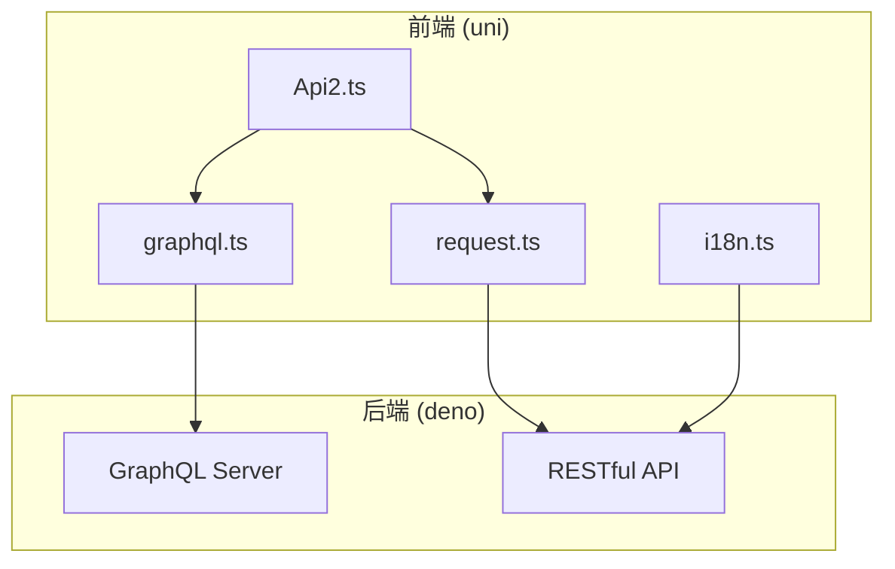
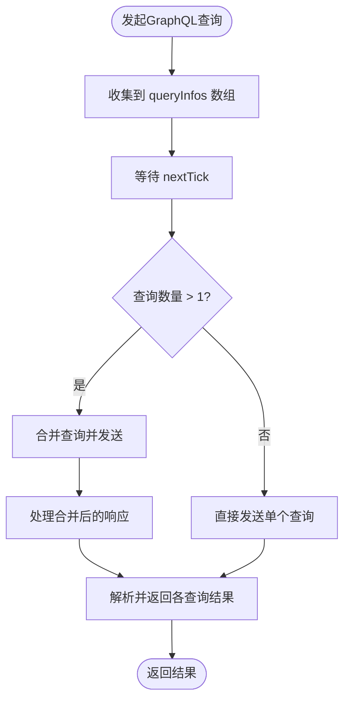
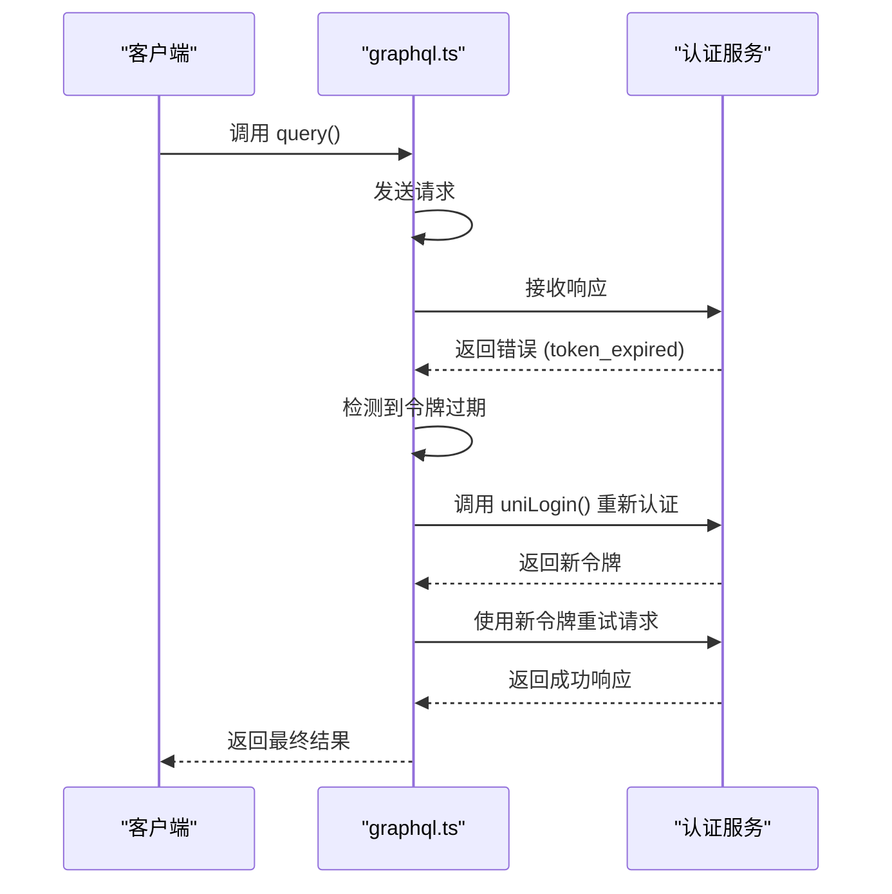
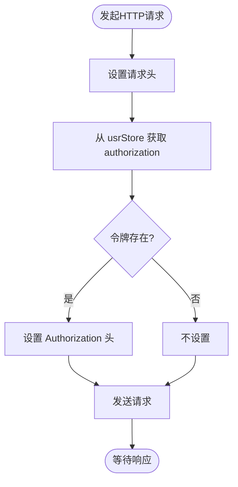
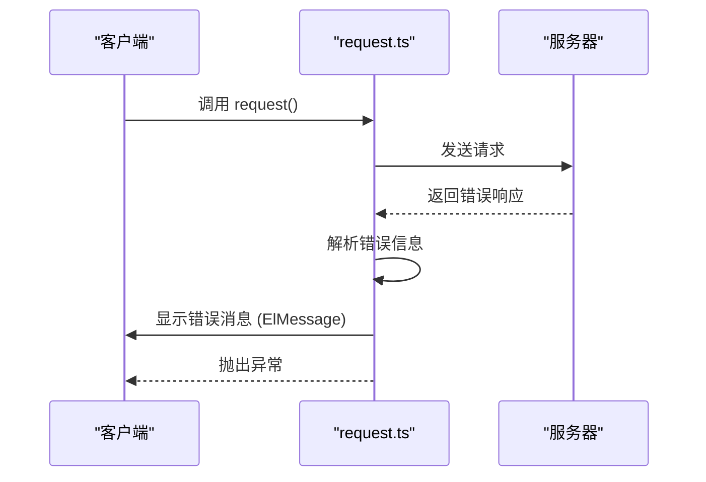
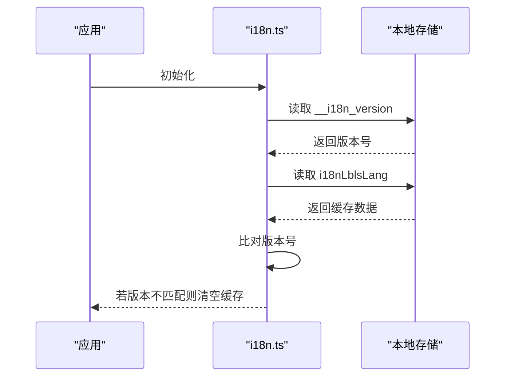
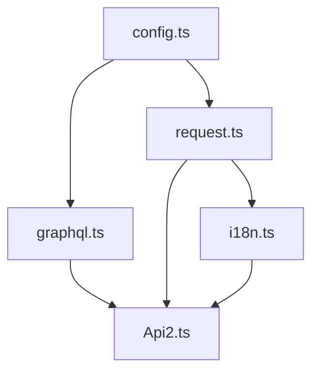

# API集成与数据交互


**本文档引用的文件**  
- [uni\src\utils\graphql.ts](https://github.com/sail-sail/nest/blob/main/uni/src/utils/graphql.ts)
- [pc\src\utils\request.ts](https://github.com/sail-sail/nest/blob/main/pc/src/utils/request.ts)
- [uni\src\pages\optbiz\Api2.ts](https://github.com/sail-sail/nest/blob/main/uni/src/pages/optbiz/Api2.ts)
- [uni\src\locales\i18n.ts](https://github.com/sail-sail/nest/blob/main/uni/src/locales/i18n.ts)


## 目录
1. [简介](#简介)
2. [项目结构](#项目结构)
3. [核心组件](#核心组件)
4. [架构概览](#架构概览)
5. [详细组件分析](#详细组件分析)
6. [依赖分析](#依赖分析)
7. [性能考量](#性能考量)
8. [故障排除指南](#故障排除指南)
9. [结论](#结论)

## 简介
本文档旨在全面阐述移动端API集成方案，重点分析GraphQL与RESTful接口的调用模式。文档将深入解析`graphql.ts`中GraphQL客户端的封装机制、`request.ts`中HTTP请求拦截器的实现细节、`Api2.ts`中业务接口的类型定义与响应处理流程，以及`i18n.ts`中的多语言资源加载与缓存策略。同时，提供网络优化的最佳实践，帮助开发者构建高效、稳定的移动应用。

## 项目结构
本项目采用模块化设计，主要分为`codegen`、`deno`、`pc`和`uni`四个核心模块。`codegen`负责代码生成，`deno`为后端服务，`pc`为PC端应用，`uni`为移动端应用。API集成相关代码主要位于`uni/src/utils`和`pc/src/utils`目录下，包括`graphql.ts`、`request.ts`和`config.ts`等文件，形成了统一的网络请求与数据交互层。

## 核心组件
本文档的核心组件包括：
- **GraphQL客户端封装**：位于`uni/src/utils/graphql.ts`，提供`query`和`mutation`方法，支持请求合并与错误处理。
- **HTTP请求拦截器**：位于`pc/src/utils/request.ts`，实现认证令牌注入、请求重试与超时控制。
- **业务接口定义**：以`uni/src/pages/optbiz/Api2.ts`为例，展示如何定义和调用具体的业务API。
- **多语言资源管理**：位于`uni/src/locales/i18n.ts`，实现多语言资源的异步加载与本地缓存。

## 架构概览
系统采用前后端分离架构，移动端通过GraphQL和RESTful API与后端服务进行数据交互。前端通过封装的`graphql.ts`和`request.ts`模块统一处理网络请求，后端通过Deno框架提供API服务。多语言资源通过`i18n.ts`模块进行管理，确保应用的国际化支持。



**图示来源**
- [uni\src\utils\graphql.ts](https://github.com/sail-sail/nest/blob/main/uni/src/utils/graphql.ts)
- [pc\src\utils\request.ts](https://github.com/sail-sail/nest/blob/main/pc/src/utils/request.ts)
- [uni\src\pages\optbiz\Api2.ts](https://github.com/sail-sail/nest/blob/main/uni/src/pages/optbiz/Api2.ts)
- [uni\src\locales\i18n.ts](https://github.com/sail-sail/nest/blob/main/uni/src/locales/i18n.ts)

## 详细组件分析

### GraphQL客户端封装分析
`graphql.ts`模块封装了GraphQL客户端，提供了`query`和`mutation`方法，支持请求合并、错误处理和认证令牌管理。

#### 请求合并机制
该模块通过`queryInfos`和`tasks`数组收集并发的查询请求，并在下一个事件循环中合并为一个请求，有效减少网络开销。



**图示来源**
- [uni\src\utils\graphql.ts](https://github.com/sail-sail/nest/blob/main/uni/src/utils/graphql.ts#L100-L200)

**本节来源**
- [uni\src\utils\graphql.ts](https://github.com/sail-sail/nest/blob/main/uni/src/utils/graphql.ts#L1-L380)

#### 错误处理与认证
模块实现了完善的错误处理机制，当检测到令牌过期时，自动触发重新登录流程。



**图示来源**
- [uni\src\utils\graphql.ts](https://github.com/sail-sail/nest/blob/main/uni/src/utils/graphql.ts#L300-L350)

**本节来源**
- [uni\src\utils\graphql.ts](https://github.com/sail-sail/nest/blob/main/uni/src/utils/graphql.ts#L1-L380)

### HTTP请求拦截器分析
`request.ts`模块实现了HTTP请求拦截器，负责认证令牌注入、请求重试与超时控制。

#### 认证令牌注入
在发送请求前，拦截器会从`usrStore`中获取当前用户的认证令牌，并将其添加到请求头中。



**图示来源**
- [pc\src\utils\request.ts](https://github.com/sail-sail/nest/blob/main/pc/src/utils/request.ts#L50-L80)

#### 响应处理与错误提示
拦截器统一处理响应，当服务器返回错误时，自动显示错误消息。



**图示来源**
- [pc\src\utils\request.ts](https://github.com/sail-sail/nest/blob/main/pc/src/utils/request.ts#L150-L200)

**本节来源**
- [pc\src\utils\request.ts](https://github.com/sail-sail/nest/blob/main/pc/src/utils/request.ts#L1-L496)

### 业务接口定义分析
以`Api2.ts`为例，展示如何定义和调用具体的业务API。

#### 类型安全的API调用
文件使用TypeScript的类型系统，确保API调用的类型安全。

```typescript
/// 移动端是否发版中 uni_releasing
export async function getUniReleasing(
  opt?: GqlOpt,
) {
  const res: {
    getUniReleasing: boolean;
  } = await mutation({
    query: /* GraphQL */ `
      query {
        getUniReleasing
      }
    `,
  }, opt);
  const data = res.getUniReleasing;
  return data;
}
```

**本节来源**
- [uni\src\pages\optbiz\Api2.ts](https://github.com/sail-sail/nest/blob/main/uni/src/pages/optbiz/Api2.ts#L1-L20)

### 多语言资源管理分析
`i18n.ts`模块实现了多语言资源的异步加载与本地缓存策略。

#### 异步加载与本地缓存
模块首先尝试从本地缓存中获取翻译，若不存在则从服务器获取并缓存。

```mermaid
flowchart TD
A([获取翻译 n(code)]) --> B["初始化 i18nLblsLang"]
B --> C["检查本地缓存"]
C --> D{"缓存中存在?"}
D --> |是| E["返回缓存的翻译"]
D --> |否| F["异步从服务器获取"]
F --> G["更新本地缓存"]
G --> H["返回获取的翻译"]
E --> I([返回结果])
H --> I
```

**图示来源**
- [uni\src\locales\i18n.ts](https://github.com/sail-sail/nest/blob/main/uni/src/locales/i18n.ts#L50-L100)

#### 版本控制与缓存失效
通过`__i18n_version`键值实现缓存的版本控制，确保语言包更新后缓存能及时失效。



**图示来源**
- [uni\src\locales\i18n.ts](https://github.com/sail-sail/nest/blob/main/uni/src/locales/i18n.ts#L100-L130)

**本节来源**
- [uni\src\locales\i18n.ts](https://github.com/sail-sail/nest/blob/main/uni/src/locales/i18n.ts#L1-L158)

## 依赖分析
各组件之间存在明确的依赖关系。`Api2.ts`依赖`graphql.ts`和`request.ts`进行网络请求，`graphql.ts`和`request.ts`依赖`config.ts`获取基础URL配置，`i18n.ts`依赖`request.ts`从服务器获取翻译资源。



**图示来源**
- [uni\src\utils\config.ts](https://github.com/sail-sail/nest/blob/main/uni/src/utils/config.ts)
- [uni\src\utils\graphql.ts](https://github.com/sail-sail/nest/blob/main/uni/src/utils/graphql.ts)
- [pc\src\utils\request.ts](https://github.com/sail-sail/nest/blob/main/pc/src/utils/request.ts)
- [uni\src\locales\i18n.ts](https://github.com/sail-sail/nest/blob/main/uni/src/locales/i18n.ts)
- [uni\src\pages\optbiz\Api2.ts](https://github.com/sail-sail/nest/blob/main/uni/src/pages/optbiz/Api2.ts)

**本节来源**
- 所有引用文件

## 性能考量
- **请求合并**：`graphql.ts`中的请求合并机制显著减少了网络请求数量，提升了性能。
- **本地缓存**：`i18n.ts`中的本地缓存避免了重复的网络请求，加快了翻译加载速度。
- **错误处理**：统一的错误处理机制减少了重复代码，提高了代码可维护性。

## 故障排除指南
- **网络连接失败**：检查网络连接，确认`baseURL`配置正确。
- **令牌过期**：确保`uniLogin`函数能正确处理重新认证流程。
- **翻译未加载**：检查`__i18n_version`是否与服务器同步，确认服务器端语言包存在。

**本节来源**
- [uni\src\utils\graphql.ts](https://github.com/sail-sail/nest/blob/main/uni/src/utils/graphql.ts)
- [pc\src\utils\request.ts](https://github.com/sail-sail/nest/blob/main/pc/src/utils/request.ts)
- [uni\src\locales\i18n.ts](https://github.com/sail-sail/nest/blob/main/uni/src/locales/i18n.ts)

## 结论
本文档详细分析了移动端API集成的关键组件，包括GraphQL客户端封装、HTTP请求拦截器、业务接口定义和多语言资源管理。通过请求合并、本地缓存和统一错误处理等机制，实现了高效、稳定的数据交互。开发者应遵循本文档的最佳实践，以构建高性能的移动应用。