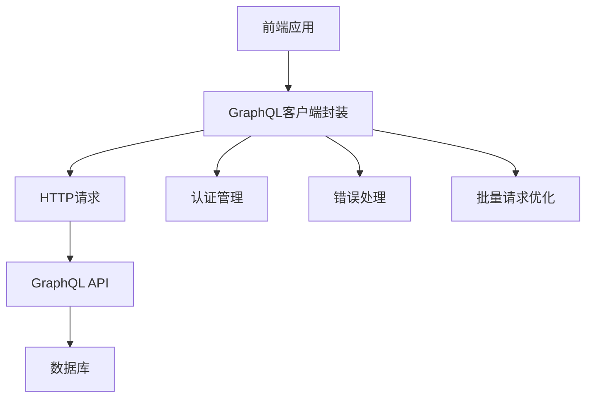
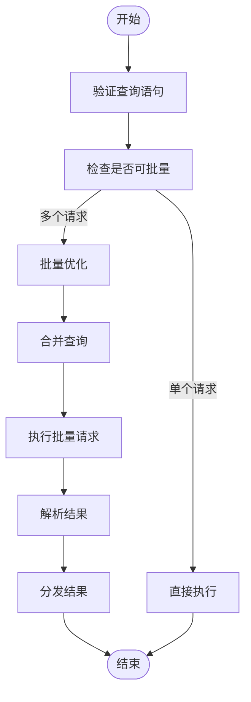
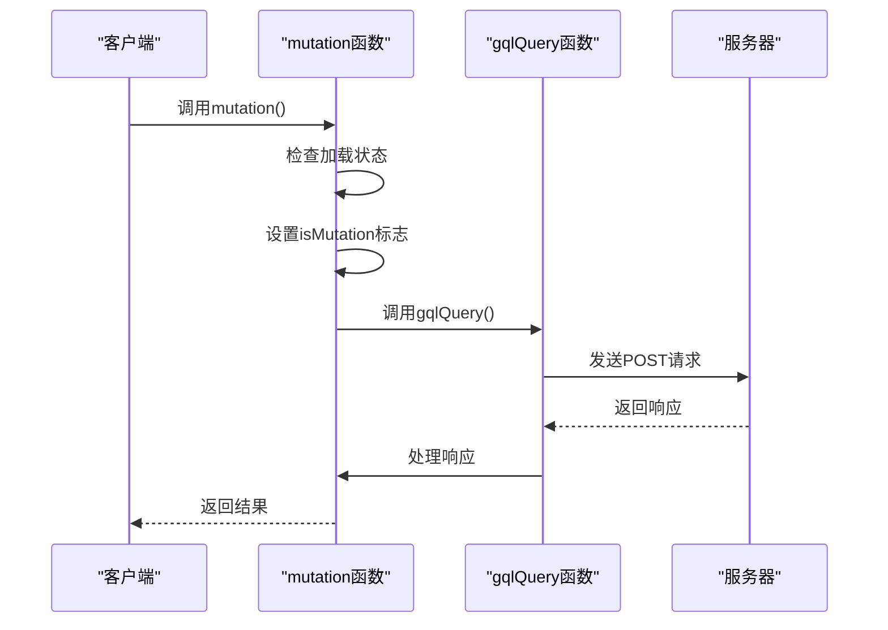
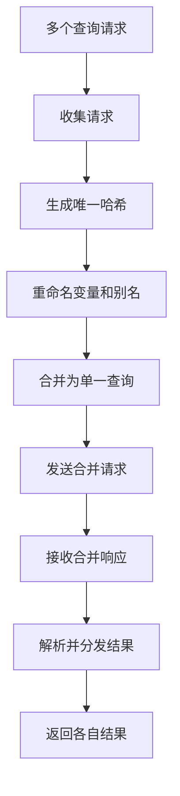
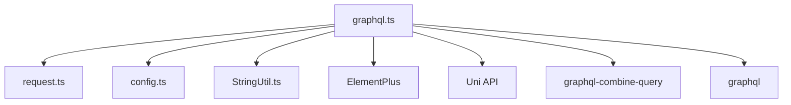
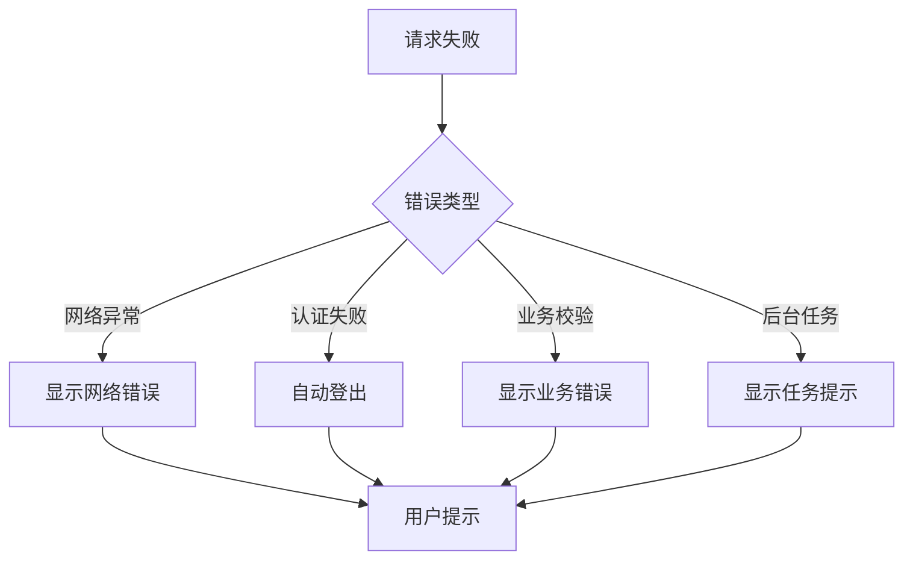
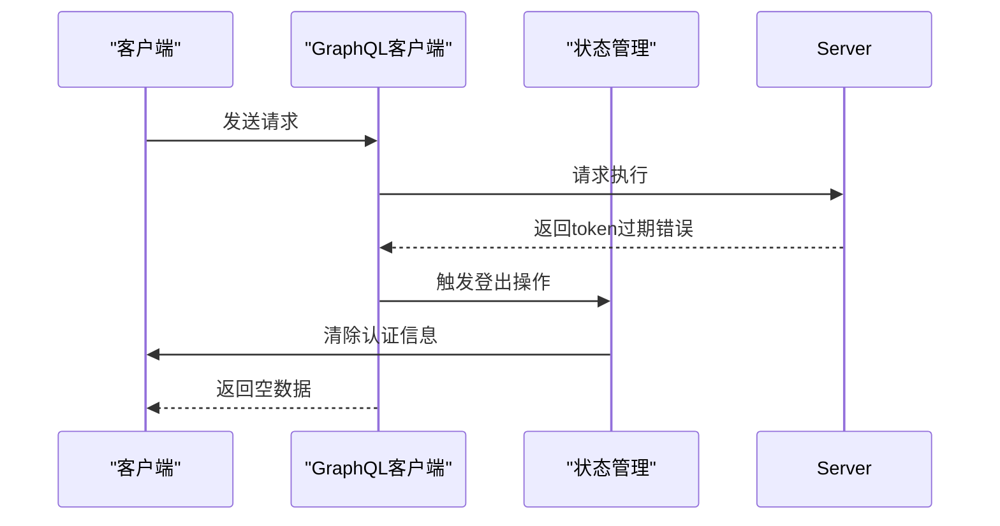

# GraphQL客户端封装


**本文档引用的文件**
- [pc\src\utils\graphql.ts](https://github.com/sail-sail/nest/blob/main/pc\src\utils\graphql.ts)
- [uni\src\utils\graphql.ts](https://github.com/sail-sail/nest/blob/main/uni\src\utils\graphql.ts)
- [deno\lib\graphql.ts](https://github.com/sail-sail/nest/blob/main/deno\lib\graphql.ts)
- [deno\src\graphql.ts](https://github.com/sail-sail/nest/blob/main/deno\src\graphql.ts)
- [deno\src\base\graphql.ts](https://github.com/sail-sail/nest/blob/main/deno\src\base\graphql.ts)
- [deno\gen\graphql.ts](https://github.com/sail-sail/nest/blob/main/deno\gen\graphql.ts)
- [deno\gen\base\graphql.ts](https://github.com/sail-sail/nest/blob/main/deno\gen\base\graphql.ts)


## 目录
1. [简介](#简介)
2. [项目结构](#项目结构)
3. [核心组件](#核心组件)
4. [架构概览](#架构概览)
5. [详细组件分析](#详细组件分析)
6. [依赖分析](#依赖分析)
7. [性能考量](#性能考量)
8. [故障排除指南](#故障排除指南)
9. [结论](#结论)

## 简介
本文档详细说明了在移动端和PC端项目中GraphQL客户端的封装实现。重点分析了`graphql.ts`文件中如何通过`query`和`mutation`函数构建具备认证能力的GraphQL客户端实例，包括HTTP头注入、错误统一处理、请求日志记录以及批量请求优化机制。文档阐述了查询和变更操作的通用封装模式，展示了如何使用泛型保证类型安全，并提供了常见查询模式的代码示例。

## 项目结构
项目包含多个子模块，其中`pc`和`uni`是主要的前端应用，分别对应PC端和移动端。`deno`目录包含后端服务代码。`graphql.ts`文件在不同模块中均有实现，用于封装GraphQL请求逻辑。

```mermaid
graph TB
subgraph "前端模块"
PC[pc]
UNI[uni]
end
subgraph "后端模块"
Deno[deno]
end
PC --> |使用| GraphQLClient[graphql.ts]
UNI --> |使用| GraphQLClient
Deno --> |提供| GraphQLAPI[/graphql]
GraphQLClient --> |请求| GraphQLAPI
```

**图示来源**
- [pc\src\utils\graphql.ts](https://github.com/sail-sail/nest/blob/main/pc\src\utils\graphql.ts)
- [uni\src\utils\graphql.ts](https://github.com/sail-sail/nest/blob/main/uni\src\utils\graphql.ts)

## 核心组件
核心组件包括`query`函数用于执行GraphQL查询，`mutation`函数用于执行变更操作，以及`gqlQuery`函数作为底层请求处理器。这些函数共同构成了GraphQL客户端的基础。

**组件来源**
- [pc\src\utils\graphql.ts](https://github.com/sail-sail/nest/blob/main/pc\src\utils\graphql.ts#L100-L400)
- [uni\src\utils\graphql.ts](https://github.com/sail-sail/nest/blob/main/uni\src\utils\graphql.ts#L100-L370)

## 架构概览
系统采用分层架构，前端通过封装的GraphQL客户端与后端API进行通信。客户端负责处理认证、错误、批量请求等横切关注点。



**图示来源**
- [pc\src\utils\graphql.ts](https://github.com/sail-sail/nest/blob/main/pc\src\utils\graphql.ts)
- [uni\src\utils\graphql.ts](https://github.com/sail-sail/nest/blob/main/uni\src\utils\graphql.ts)

## 详细组件分析

### 查询与变更操作封装

#### 查询函数分析
`query`函数是GraphQL查询的主要入口，支持批量请求优化。



**图示来源**
- [pc\src\utils\graphql.ts](https://github.com/sail-sail/nest/blob/main/pc\src\utils\graphql.ts#L100-L250)
- [uni\src\utils\graphql.ts](https://github.com/sail-sail/nest/blob/main/uni\src\utils\graphql.ts#L100-L250)

#### 变更函数分析
`mutation`函数用于执行GraphQL变更操作，包含防重复提交机制。



**图示来源**
- [pc\src\utils\graphql.ts](https://github.com/sail-sail/nest/blob/main/pc\src\utils\graphql.ts#L250-L300)
- [uni\src\utils\graphql.ts](https://github.com/sail-sail/nest/blob/main/uni\src\utils\graphql.ts#L250-L300)

### 批量请求实现机制
批量请求通过`combinedQuery`库实现，将多个独立查询合并为一个请求。



**图示来源**
- [pc\src\utils\graphql.ts](https://github.com/sail-sail/nest/blob/main/pc\src\utils\graphql.ts#L150-L200)

## 依赖分析
GraphQL客户端依赖于多个外部库和内部模块。



**图示来源**
- [pc\src\utils\graphql.ts](https://github.com/sail-sail/nest/blob/main/pc\src\utils\graphql.ts#L1-L20)
- [uni\src\utils\graphql.ts](https://github.com/sail-sail/nest/blob/main/uni\src\utils\graphql.ts#L1-L20)

## 性能考量
批量请求机制显著提升了性能，减少了网络往返次数。通过合并多个查询，可以有效降低延迟，特别是在移动网络环境下。

### 批量请求优势
- **减少网络开销**：将多个HTTP请求合并为一个
- **降低延迟**：避免多次TCP握手和SSL协商
- **提高吞吐量**：服务器可以更高效地处理合并请求
- **节省电量**：移动设备上减少网络活动可延长电池寿命

## 故障排除指南

### 常见错误处理
客户端实现了完善的错误处理策略，能够区分不同类型的错误。



**组件来源**
- [pc\src\utils\graphql.ts](https://github.com/sail-sail/nest/blob/main/pc\src\utils\graphql.ts#L300-L400)
- [uni\src\utils\graphql.ts](https://github.com/sail-sail/nest/blob/main/uni\src\utils\graphql.ts#L300-L370)

### 认证失败处理
当检测到token过期时，系统会自动处理认证失败。



**图示来源**
- [pc\src\utils\graphql.ts](https://github.com/sail-sail/nest/blob/main/pc\src\utils\graphql.ts#L350-L370)
- [uni\src\utils\graphql.ts](https://github.com/sail-sail/nest/blob/main/uni\src\utils\graphql.ts#L320-L340)

## 结论
本文档详细分析了GraphQL客户端的封装实现，展示了如何通过统一的接口处理查询、变更、认证和错误。批量请求机制是性能优化的关键，而完善的错误处理策略确保了用户体验。该封装模式具有良好的可维护性和扩展性，适用于复杂的前端应用。