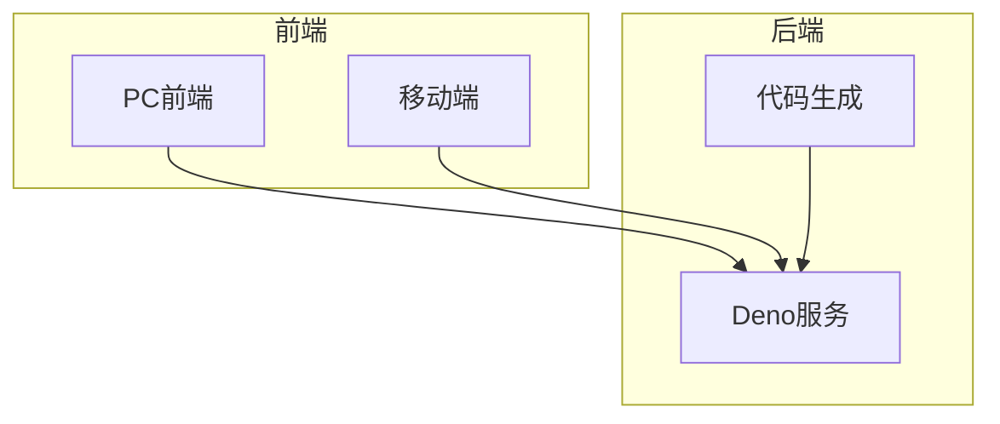
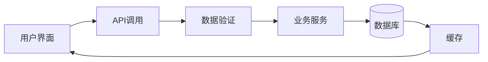
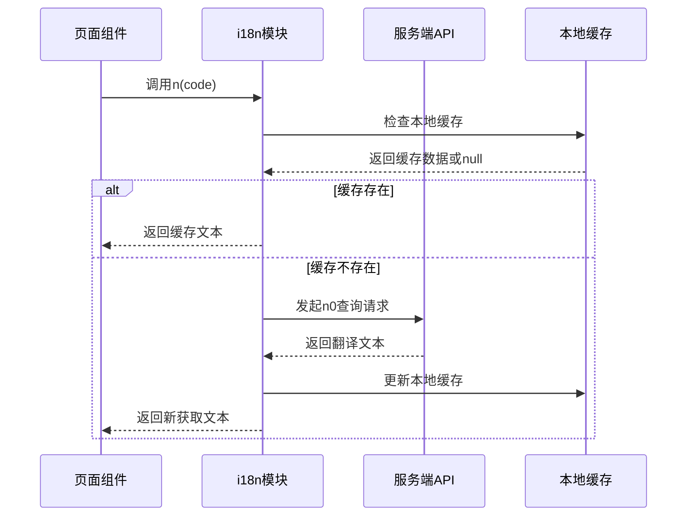
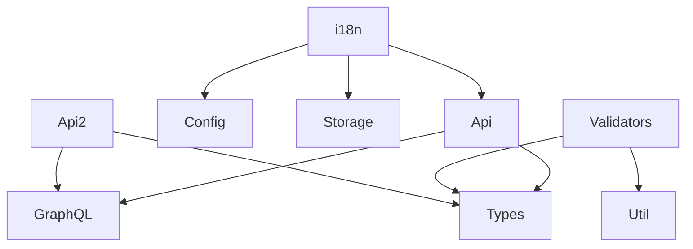

# 数据处理与类型安全


**本文档引用文件**  
- [Api2.ts](https://github.com/sail-sail/nest/blob/main/uni\src\pages\optbiz\Api2.ts)
- [Api2.ts](https://github.com/sail-sail/nest/blob/main/pc\src\views\base\role\Api2.ts)
- [Api2.ts](https://github.com/sail-sail/nest/blob/main/pc\src\views\base\tenant\Api2.ts)
- [i18n.ts](https://github.com/sail-sail/nest/blob/main/uni\src\locales\i18n.ts)
- [Api.ts](https://github.com/sail-sail/nest/blob/main/uni\src\locales\Api.ts)
- [config.ts](https://github.com/sail-sail/nest/blob/main/codegen\src\config.ts)
- [validators](https://github.com/sail-sail/nest/blob/main/deno\lib\validators)


## 目录
1. [引言](#引言)
2. [项目结构](#项目结构)
3. [核心组件](#核心组件)
4. [架构概览](#架构概览)
5. [详细组件分析](#详细组件分析)
6. [依赖分析](#依赖分析)
7. [性能考量](#性能考量)
8. [故障排查指南](#故障排查指南)
9. [结论](#结论)

## 引言
本文档旨在系统阐述移动端数据处理方案，重点介绍如何通过TypeScript接口定义实现API响应结构的类型安全，确保编译时类型检查。文档将深入分析数据转换器的使用模式、多语言资源的异步加载机制、运行时数据验证策略以及错误边界处理方案，为开发者提供一套完整的数据处理最佳实践。

## 项目结构
本项目采用模块化分层架构，主要包含codegen（代码生成）、deno（后端服务）、pc（PC端前端）、uni（移动端前端）四大模块。各模块职责清晰，通过GraphQL进行前后端数据交互。



**图示来源**
- [project_structure](https://github.com/sail-sail/nest/blob/main/)

## 核心组件
系统核心组件包括API接口定义、数据验证器、国际化处理模块和状态管理。这些组件共同构建了类型安全、可维护性强的数据处理体系。

**组件来源**
- [Api2.ts](https://github.com/sail-sail/nest/blob/main/uni\src\pages\optbiz\Api2.ts)
- [i18n.ts](https://github.com/sail-sail/nest/blob/main/uni\src\locales\i18n.ts)
- [config.ts](https://github.com/sail-sail/nest/blob/main/codegen\src\config.ts)

## 架构概览
系统采用前后端分离架构，前端通过GraphQL与后端通信，后端基于Deno运行时提供服务。数据流从用户界面发起，经过类型验证、业务逻辑处理，最终持久化到数据库。



**图示来源**
- [deno](https://github.com/sail-sail/nest/blob/main/deno)
- [pc](https://github.com/sail-sail/nest/blob/main/pc)
- [uni](https://github.com/sail-sail/nest/blob/main/uni)

## 详细组件分析

### API接口定义分析
以`Api2.ts`为例，展示了如何定义精确的TypeScript接口来描述API响应结构。

#### 移动端发版状态查询
```typescript
/// 移动端是否发版中 uni_releasing
export async function getUniReleasing(
  opt?: GqlOpt,
) {
  const res: {
    getUniReleasing: boolean;
  } = await mutation({
    query: /* GraphQL */ `
      query {
        getUniReleasing
      }
    `,
  }, opt);
  const data = res.getUniReleasing;
  return data;
}
```
该函数定义了清晰的返回类型`{ getUniReleasing: boolean }`，确保调用方可以获得类型安全的响应数据。

#### 租户管理员密码设置
```typescript
/** 设置租户管理员密码 */
export async function setTenantAdminPwd(
  input?: SetTenantAdminPwdInput,
  opt?: GqlOpt,
) {
  const data: {
    setTenantAdminPwd: Mutation["setTenantAdminPwd"];
  } = await mutation({
    query: /* GraphQL */ `
      mutation ($input: SetTenantAdminPwdInput!) {
        setTenantAdminPwd(input: $input)
      }
    `,
    variables: {
      input,
    },
  }, opt);
  const res = data.setTenantAdminPwd;
  return res;
}
```
此接口使用GraphQL mutation，通过`SetTenantAdminPwdInput`类型参数确保输入数据的结构完整性。

**组件来源**
- [Api2.ts](https://github.com/sail-sail/nest/blob/main/uni\src\pages\optbiz\Api2.ts)
- [Api2.ts](https://github.com/sail-sail/nest/blob/main/pc\src\views\base\tenant\Api2.ts)

### 国际化处理分析
系统实现了完整的多语言支持，包含资源加载、本地缓存和动态更新机制。

#### 多语言数据异步加载流程


**图示来源**
- [i18n.ts](https://github.com/sail-sail/nest/blob/main/uni\src\locales\i18n.ts)
- [Api.ts](https://github.com/sail-sail/nest/blob/main/uni\src\locales\Api.ts)

#### 国际化核心实现
```typescript
async function initI18ns(
  lang: string,
  codes: string[],
  routePath: string | null,
) {
  initI18nLblsLang();
  if (!i18nLblsLang) {
    return;
  }
  const i18nLbls = i18nLblsLang[lang];
  const keys2: string[] = [ ];
  const code2Prms: Promise<string>[] = [ ];
  for (let i = 0; i < codes.length; i++) {
    const code = codes[i];
    const key = JSON.stringify([ code, routePath ]);
    if (!i18nLbls[key]) {
      keys2.push(key);
      code2Prms.push(n0(lang, routePath, code, { notLoading: true }));
    }
  }
  if (code2Prms.length > 0) {
    const lbls2 = await Promise.all(code2Prms);
    for (let i = 0; i < keys2.length; i++) {
      const key = keys2[i];
      i18nLbls[key] = lbls2[i];
    }
    uni.setStorageSync(`i18nLblsLang`, JSON.stringify(i18nLblsLang));
  }
}
```
该实现采用懒加载策略，仅在需要时从服务器获取翻译文本，并自动更新本地缓存，优化了性能和用户体验。

**组件来源**
- [i18n.ts](https://github.com/sail-sail/nest/blob/main/uni\src\locales\i18n.ts)

### 数据验证分析
系统提供了全面的运行时数据验证机制，确保数据完整性。

#### 验证器配置定义
```typescript
export type Validator = {
  maximum?: number;
  minimum?: number;
  multiple_of?: number;
  max_items?: number;
  min_items?: number;
  chars_max_length?: number;
  chars_min_length?: number;
  email?: boolean;
  url?: boolean;
  ip?: boolean;
  regex?: string;
};
```
该类型定义了所有支持的验证规则，包括数值范围、字符串长度、格式校验等。

#### 验证器实现
系统在`deno/lib/validators`目录下提供了具体的验证器实现：
- `maximum.ts`: 数值上限验证
- `minimum.ts`: 数值下限验证
- `chars_max_length.ts`: Unicode字符数上限验证
- `email.ts`: 邮箱格式验证
- `url.ts`: URL格式验证
- `regex.ts`: 正则表达式匹配验证

```mermaid
classDiagram
class Validator {
+maximum : number
+minimum : number
+multiple_of : number
+max_items : number
+min_items : number
+chars_max_length : number
+chars_min_length : number
+email : boolean
+url : boolean
+ip : boolean
+regex : string
}
class ValidatorService {
+validateMaximum(value, max)
+validateMinimum(value, min)
+validateEmail(value)
+validateUrl(value)
+validateRegex(value, pattern)
}
Validator --> ValidatorService : "配置"
ValidatorService --> "maximum.ts" : "实现"
ValidatorService --> "minimum.ts" : "实现"
ValidatorService --> "email.ts" : "实现"
ValidatorService --> "url.ts" : "实现"
ValidatorService --> "regex.ts" : "实现"
```

**图示来源**
- [config.ts](https://github.com/sail-sail/nest/blob/main/codegen\src\config.ts)
- [validators](https://github.com/sail-sail/nest/blob/main/deno\lib\validators)

## 依赖分析
系统各组件间依赖关系清晰，采用松耦合设计。



**图示来源**
- [package.json](https://github.com/sail-sail/nest/blob/main/package.json)
- [tsconfig.json](https://github.com/sail-sail/nest/blob/main/tsconfig.json)

## 性能考量
系统在数据处理方面进行了多项性能优化：
1. **本地缓存**: 国际化文本采用本地缓存，减少重复网络请求
2. **批量加载**: 支持批量获取翻译文本，降低网络开销
3. **懒加载**: 仅在需要时加载翻译资源
4. **类型检查**: 编译时类型检查避免运行时错误

## 故障排查指南
### 常见问题及解决方案
1. **翻译文本未更新**
   - 检查`__i18n_version`缓存版本号
   - 确认服务器返回的翻译文本正确性
   - 清除本地缓存重新加载

2. **类型错误**
   - 检查API响应结构是否与TypeScript接口定义匹配
   - 确认GraphQL查询字段的完整性
   - 验证输入参数的类型正确性

3. **验证失败**
   - 检查验证器配置是否正确
   - 确认数据格式符合验证规则
   - 查看具体错误信息定位问题

**组件来源**
- [i18n.ts](https://github.com/sail-sail/nest/blob/main/uni\src\locales\i18n.ts)
- [validators](https://github.com/sail-sail/nest/blob/main/deno\lib\validators)

## 结论
本文档详细介绍了系统的数据处理与类型安全方案。通过精确的TypeScript接口定义、完善的运行时验证机制、高效的国际化处理流程和稳健的错误处理模式，系统实现了高可靠性、易维护性的数据处理能力。建议开发者在实际开发中遵循本文档的最佳实践，确保代码质量和用户体验。