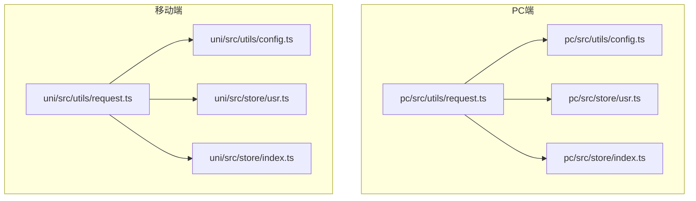
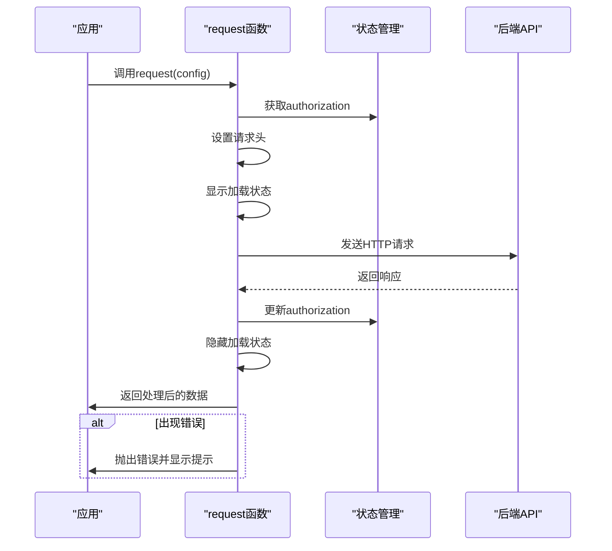
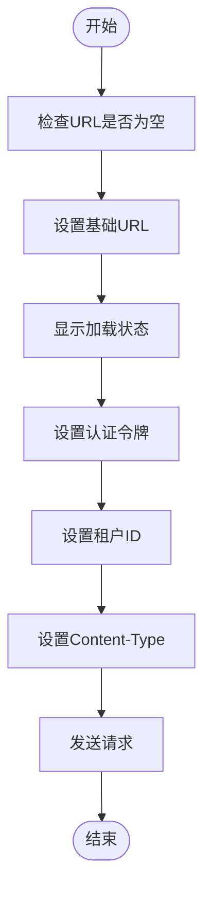
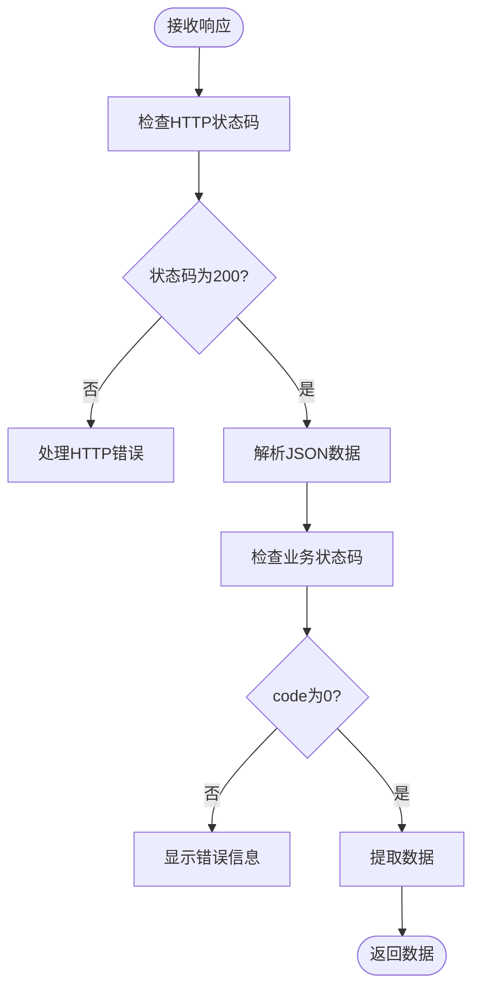
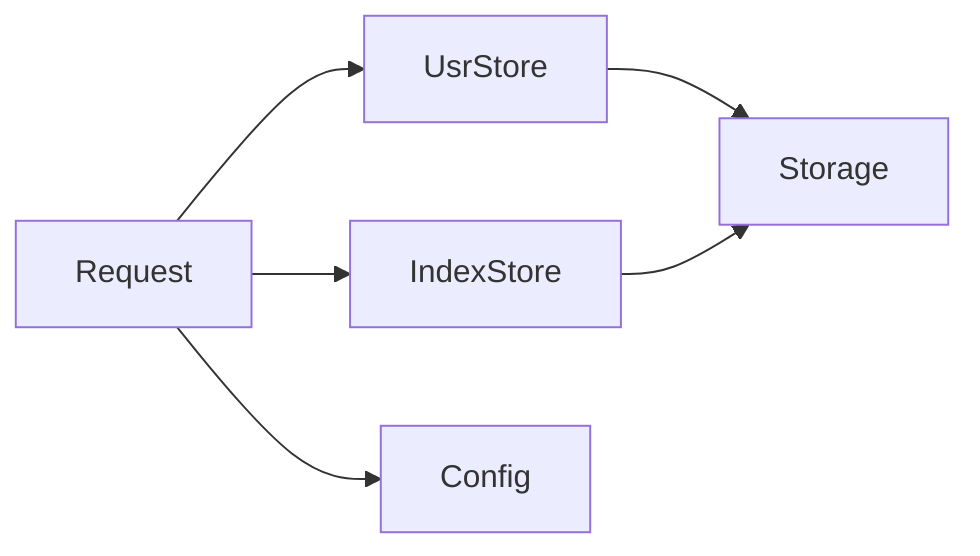

# 请求管理与拦截器


**本文档引用的文件**  
- [request.ts](https://github.com/sail-sail/nest/blob/main/pc/src/utils/request.ts)
- [request.ts](https://github.com/sail-sail/nest/blob/main/uni/src/utils/request.ts)
- [config.ts](https://github.com/sail-sail/nest/blob/main/pc/src/utils/config.ts)
- [config.ts](https://github.com/sail-sail/nest/blob/main/uni/src/utils/config.ts)
- [usr.ts](https://github.com/sail-sail/nest/blob/main/pc/src/store/usr.ts)
- [usr.ts](https://github.com/sail-sail/nest/blob/main/uni/src/store/usr.ts)
- [index.ts](https://github.com/sail-sail/nest/blob/main/pc/src/store/index.ts)
- [index.ts](https://github.com/sail-sail/nest/blob/main/uni/src/store/index.ts)


## 目录
1. [简介](#简介)
2. [项目结构](#项目结构)
3. [核心组件](#核心组件)
4. [架构概览](#架构概览)
5. [详细组件分析](#详细组件分析)
6. [依赖分析](#依赖分析)
7. [性能考虑](#性能考虑)
8. [故障排除指南](#故障排除指南)
9. [结论](#结论)

## 简介
本文档深入解析移动端请求管理机制，重点分析 `request.ts` 文件中 HTTP 请求拦截器的实现原理。文档涵盖请求前处理、响应拦截、超时控制、网络状态检测、自定义配置使用示例及请求取消机制等核心功能。通过分析 PC 端和移动端（uni-app）的实现差异，全面展示请求管理模块的设计与实现。

## 项目结构
项目包含多个模块，其中 `pc` 和 `uni` 模块分别对应 Web 端和移动端应用。两个模块均实现了独立的请求管理机制，位于各自的 `utils/request.ts` 文件中。请求模块依赖于配置文件 `config.ts` 和状态管理文件 `usr.ts`、`index.ts`，共同构成完整的请求生命周期管理。



**图示来源**  
- [pc/src/utils/request.ts](https://github.com/sail-sail/nest/blob/main/pc/src/utils/request.ts)
- [uni/src/utils/request.ts](https://github.com/sail-sail/nest/blob/main/uni/src/utils/request.ts)
- [pc/src/utils/config.ts](https://github.com/sail-sail/nest/blob/main/pc/src/utils/config.ts)
- [uni/src/utils/config.ts](https://github.com/sail-sail/nest/blob/main/uni/src/utils/config.ts)

**本节来源**  
- [pc/src/utils/request.ts](https://github.com/sail-sail/nest/blob/main/pc/src/utils/request.ts)
- [uni/src/utils/request.ts](https://github.com/sail-sail/nest/blob/main/uni/src/utils/request.ts)

## 核心组件
核心组件包括请求函数 `request`、文件上传函数 `uploadFile`、URL 生成函数 `getDownloadUrl` 和 `getImgUrl`。这些函数通过统一的配置对象处理 HTTP 请求，集成认证、加载状态、错误处理等横切关注点。

**本节来源**  
- [pc/src/utils/request.ts](https://github.com/sail-sail/nest/blob/main/pc/src/utils/request.ts#L50-L495)
- [uni/src/utils/request.ts](https://github.com/sail-sail/nest/blob/main/uni/src/utils/request.ts#L200-L703)

## 架构概览
系统采用分层架构，上层应用通过 `request` 函数发起请求，该函数封装了底层 `fetch` 或 `uni.request` API。请求过程中，自动注入认证令牌、租户信息，并处理响应数据。错误统一通过 UI 组件（如 `ElMessage` 或 `uni.showToast`）展示。



**图示来源**  
- [pc/src/utils/request.ts](https://github.com/sail-sail/nest/blob/main/pc/src/utils/request.ts#L50-L150)
- [uni/src/utils/request.ts](https://github.com/sail-sail/nest/blob/main/uni/src/utils/request.ts#L200-L300)

## 详细组件分析

### 请求拦截器分析
请求拦截器在请求发送前执行预处理逻辑，包括认证令牌注入、请求头设置、加载状态管理等。

#### 请求处理流程


**图示来源**  
- [pc/src/utils/request.ts](https://github.com/sail-sail/nest/blob/main/pc/src/utils/request.ts#L60-L100)
- [uni/src/utils/request.ts](https://github.com/sail-sail/nest/blob/main/uni/src/utils/request.ts#L210-L230)

#### 认证令牌注入
在 PC 端，通过 `useUsrStore()` 获取 `authorization`，并将其设置到请求头中：

```typescript
const authorization = usrStore.authorization;
if (authorization) {
  config.headers.set("authorization", authorization);
}
```

在移动端，通过 `usrStore.getAuthorization()` 获取令牌：

```typescript
const authorization = usrStore.getAuthorization();
if (authorization) {
  config.header.authorization = authorization;
}
```

**本节来源**  
- [pc/src/utils/request.ts](https://github.com/sail-sail/nest/blob/main/pc/src/utils/request.ts#L80-L85)
- [uni/src/utils/request.ts](https://github.com/sail-sail/nest/blob/main/uni/src/utils/request.ts#L220-L225)

### 响应拦截器分析
响应拦截器负责处理服务器响应，包括数据解包、错误处理、令牌刷新等。

#### 响应处理流程


**图示来源**  
- [pc/src/utils/request.ts](https://github.com/sail-sail/nest/blob/main/pc/src/utils/request.ts#L120-L180)
- [uni/src/utils/request.ts](https://github.com/sail-sail/nest/blob/main/uni/src/utils/request.ts#L250-L300)

#### 错误统一处理
当响应数据中的 `code` 不为 0 时，系统会自动显示错误消息：

```typescript
if (data && data.code !== 0) {
  if (data.msg && (!config || config.showErrMsg !== false)) {
    ElMessage({
      type: "error",
      message: data.msg,
    });
  }
  throw data;
}
```

移动端采用类似的逻辑，根据错误消息长度选择显示方式：

```typescript
if (data.msg.length <= 14) {
  uni.showToast({ title: data.msg, icon: "none" });
} else {
  uni.showModal({ title: "错误", content: data.msg });
}
```

**本节来源**  
- [pc/src/utils/request.ts](https://github.com/sail-sail/nest/blob/main/pc/src/utils/request.ts#L160-L180)
- [uni/src/utils/request.ts](https://github.com/sail-sail/nest/blob/main/uni/src/utils/request.ts#L280-L300)

### 超时控制与网络检测
系统通过 `fetch` API 的原生机制处理超时。当网络连接失败时，捕获 `TypeError: Failed to fetch` 错误并转换为用户友好的提示：

```typescript
catch(errTmp) {
  err = errTmp;
  const errStr = err && err.toString();
  if (errStr === "TypeError: Failed to fetch") {
    err = "网络连接失败，请稍后再试";
  }
}
```

**本节来源**  
- [pc/src/utils/request.ts](https://github.com/sail-sail/nest/blob/main/pc/src/utils/request.ts#L140-L145)

### 自定义请求配置
系统支持多种自定义配置，如文件上传、特殊头信息设置等。

#### 文件上传进度监听
在移动端，`uni.uploadFile` API 原生支持上传进度监听，可通过 `onProgressUpdate` 回调获取进度信息。

#### 缓存控制
通过 `notLoading` 配置项控制是否显示加载状态，通过 `showErrMsg` 控制是否显示错误消息。

**本节来源**  
- [pc/src/utils/request.ts](https://github.com/sail-sail/nest/blob/main/pc/src/utils/request.ts#L200-L300)
- [uni/src/utils/request.ts](https://github.com/sail-sail/nest/blob/main/uni/src/utils/request.ts#L1-L100)

### 请求取消机制
虽然当前实现未直接使用 Axios 的取消令牌，但通过页面导航时的状态重置实现类似效果。当用户登出时，`indexStore.logout()` 会重置相关状态。

**本节来源**  
- [pc/src/store/index.ts](https://github.com/sail-sail/nest/blob/main/pc/src/store/index.ts#L110-L120)

## 依赖分析
请求模块依赖于状态管理模块（`usr.ts`、`index.ts`）和配置模块（`config.ts`）。状态管理模块存储用户认证信息和全局状态，配置模块提供基础 URL 等环境配置。



**图示来源**  
- [pc/src/utils/request.ts](https://github.com/sail-sail/nest/blob/main/pc/src/utils/request.ts)
- [pc/src/store/usr.ts](https://github.com/sail-sail/nest/blob/main/pc/src/store/usr.ts)
- [pc/src/store/index.ts](https://github.com/sail-sail/nest/blob/main/pc/src/store/index.ts)

**本节来源**  
- [pc/src/utils/request.ts](https://github.com/sail-sail/nest/blob/main/pc/src/utils/request.ts)
- [uni/src/utils/request.ts](https://github.com/sail-sail/nest/blob/main/uni/src/utils/request.ts)

## 性能考虑
- **加载状态管理**：通过 `addLoading` 和 `minusLoading` 精确控制加载状态显示，避免不必要的 UI 更新。
- **错误处理**：统一的错误处理机制减少重复代码，提高维护性。
- **配置复用**：基础 URL 和请求头配置集中管理，便于维护和修改。

## 故障排除指南
- **网络连接失败**：检查网络连接，确认服务器地址是否正确。
- **认证失败**：检查 `authorization` 是否正确设置，确认令牌是否过期。
- **跨域问题**：确保后端正确配置 CORS 头信息。
- **文件上传失败**：检查文件大小限制，确认服务器存储服务正常运行。

**本节来源**  
- [pc/src/utils/request.ts](https://github.com/sail-sail/nest/blob/main/pc/src/utils/request.ts#L140-L145)
- [uni/src/utils/request.ts](https://github.com/sail-sail/nest/blob/main/uni/src/utils/request.ts#L260-L270)

## 结论
本文档详细分析了移动端请求管理模块的实现原理。系统通过封装 `request` 函数，实现了认证令牌自动注入、请求参数标准化、错误统一处理等核心功能。PC 端和移动端采用相似的设计模式，但根据平台特性使用不同的底层 API（`fetch` vs `uni.request`）。整体设计简洁高效，易于维护和扩展。