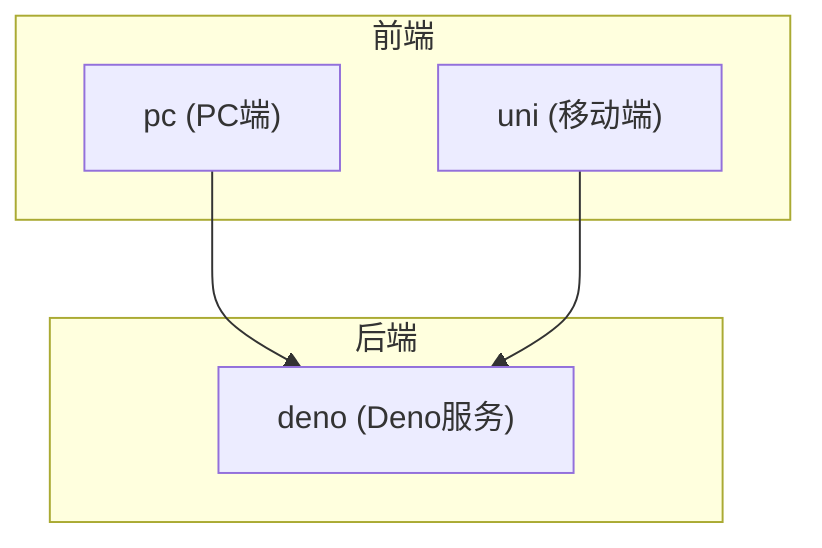
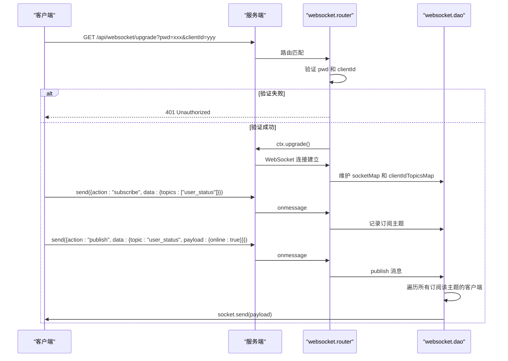
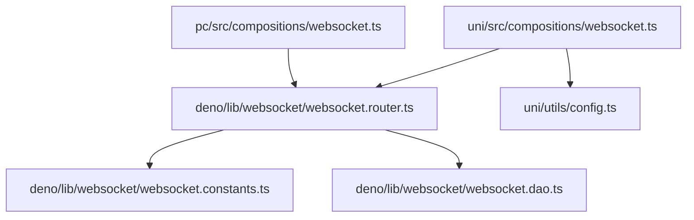

# 实时状态同步


**本文档引用文件**  
- [websocket.ts](https://github.com/sail-sail/nest/blob/main/pc/src/compositions/websocket.ts)
- [websocket.ts](https://github.com/sail-sail/nest/blob/main/uni/src/compositions/websocket.ts)
- [websocket.router.ts](https://github.com/sail-sail/nest/blob/main/deno/lib/websocket/websocket.router.ts)
- [websocket.dao.ts](https://github.com/sail-sail/nest/blob/main/deno/lib/websocket/websocket.dao.ts)
- [websocket.constants.ts](https://github.com/sail-sail/nest/blob/main/deno/lib/websocket/websocket.constants.ts)
- [config.ts](https://github.com/sail-sail/nest/blob/main/uni/src/utils/config.ts)


## 目录
1. [项目结构](#项目结构)
2. [核心组件](#核心组件)
3. [架构概览](#架构概览)
4. [详细组件分析](#详细组件分析)
5. [依赖分析](#依赖分析)
6. [性能考虑](#性能考虑)
7. [故障排除指南](#故障排除指南)

## 项目结构

本项目包含多个子模块，主要分为 `codegen`、`deno`、`pc` 和 `uni` 四个部分。其中：

- `codegen`：代码生成工具及相关配置。
- `deno`：后端服务，使用 Deno 构建，包含 WebSocket 服务逻辑。
- `pc`：PC 端前端应用，基于 Vue 框架实现。
- `uni`：移动端跨平台应用，使用 UniApp 框架开发。

WebSocket 实时通信功能在 `pc/src/compositions/websocket.ts` 和 `uni/src/compositions/websocket.ts` 中实现，服务端逻辑位于 `deno/lib/websocket/` 目录下。



**图示来源**
- [websocket.ts](https://github.com/sail-sail/nest/blob/main/pc/src/compositions/websocket.ts)
- [websocket.ts](https://github.com/sail-sail/nest/blob/main/uni/src/compositions/websocket.ts)
- [websocket.router.ts](https://github.com/sail-sail/nest/blob/main/deno/lib/websocket/websocket.router.ts)

## 核心组件

实时状态同步的核心是 WebSocket 通信机制，通过组合式函数封装连接管理、消息订阅与发布、自动重连等功能。客户端通过 `useSubscribe`、`subscribe`、`publish` 等 API 与服务端交互，服务端基于路由和数据访问对象（DAO）处理连接与消息转发。

**组件职责：**
- 客户端：建立连接、心跳维持、订阅/取消订阅主题、接收并分发消息。
- 服务端：验证连接、管理客户端会话、维护主题订阅关系、广播消息。

**本节来源**
- [websocket.ts](https://github.com/sail-sail/nest/blob/main/pc/src/compositions/websocket.ts#L0-L315)
- [websocket.ts](https://github.com/sail-sail/nest/blob/main/uni/src/compositions/websocket.ts#L0-L303)
- [websocket.router.ts](https://github.com/sail-sail/nest/blob/main/deno/lib/websocket/websocket.router.ts#L0-L199)

## 架构概览

系统采用典型的客户端-服务器架构，通过 WebSocket 协议实现实时双向通信。客户端在初始化时创建唯一 `clientId`，并通过认证参数连接服务端。服务端验证密码后升级为 WebSocket 连接，并维护客户端与订阅主题的映射关系。



**图示来源**
- [websocket.router.ts](https://github.com/sail-sail/nest/blob/main/deno/lib/websocket/websocket.router.ts#L38-L89)
- [websocket.dao.ts](https://github.com/sail-sail/nest/blob/main/deno/lib/websocket/websocket.dao.ts#L0-L63)
- [websocket.constants.ts](https://github.com/sail-sail/nest/blob/main/deno/lib/websocket/websocket.constants.ts#L0-L5)

## 详细组件分析

### 客户端连接管理

客户端通过 `connect()` 函数建立 WebSocket 连接。连接地址根据协议（HTTP/HTTPS）自动选择 `ws://` 或 `wss://`，并携带认证密码和客户端唯一标识。

```typescript
const isSSL = location.protocol === 'https:';
const url = (isSSL ? 'wss://' : 'ws://') + location.host + '/api/websocket/upgrade?pwd='+ PWD + '&clientId=' + encodeURIComponent(clientId);
```

在移动端（uni-app），使用 `uni.connectSocket` 创建连接：

```typescript
socket = uni.connectSocket({
  url,
  success() {},
  fail() {
    socket = undefined;
  },
});
```

**本节来源**
- [websocket.ts](https://github.com/sail-sail/nest/blob/main/pc/src/compositions/websocket.ts#L0-L23)
- [websocket.ts](https://github.com/sail-sail/nest/blob/main/uni/src/compositions/websocket.ts#L0-L48)
- [config.ts](https://github.com/sail-sail/nest/blob/main/uni/src/utils/config.ts#L78-L116)

### 消息处理与回调分发

客户端收到消息后，解析 JSON 数据，提取 `topic` 和 `payload`，并从 `topicCallbackMap` 中查找对应的回调函数执行。

```typescript
socket.onmessage = function(event) {
  const eventData = event.data;
  if (typeof eventData !== "string") return;
  if (eventData === "pong") return;
  const obj = JSON.parse(eventData as string);
  const topic = obj.topic;
  const payload = obj.payload;
  const callbacks = topicCallbackMap.get(topic);
  if (callbacks && callbacks.length > 0) {
    for (const callback of callbacks) {
      callback(payload);
    }
  }
};
```

**本节来源**
- [websocket.ts](https://github.com/sail-sail/nest/blob/main/pc/src/compositions/websocket.ts#L68-L115)
- [websocket.ts](https://github.com/sail-sail/nest/blob/main/uni/src/compositions/websocket.ts#L50-L113)

### 自动重连机制

当连接关闭或出错时，触发 `reConnect()` 函数。采用指数退避策略，前10次尝试以 `reConnectNum * 200ms` 间隔重连，超过10次则固定为5秒。

```typescript
async function reConnect() {
  if (socket && (socket.readyState === WebSocket.OPEN || socket.readyState === WebSocket.CONNECTING)) {
    return socket;
  }
  if (topicCallbackMap.size === 0) {
    return;
  }
  reConnectNum++;
  let time = 200;
  if (reConnectNum > 10) {
    time = 5000;
  } else {
    time = reConnectNum * 200;
  }
  await new Promise((resolve) => setTimeout(resolve, time));
  await connect();
}
```

**本节来源**
- [websocket.ts](https://github.com/sail-sail/nest/blob/main/pc/src/compositions/websocket.ts#L25-L72)
- [websocket.ts](https://github.com/sail-sail/nest/blob/main/uni/src/compositions/websocket.ts#L48-L50)

### 订阅与发布机制

客户端通过 `subscribe(topic, callback)` 注册主题监听，服务端将主题记录在 `clientIdTopicsMap` 中。发布消息时，服务端遍历所有订阅该主题的客户端并发送消息。

```mermaid
flowchart TD
A[客户端调用 subscribe] --> B{topicCallbackMap 是否存在}
B --> |否| C[创建新数组并存入]
B --> |是| D[追加回调函数]
C --> E[发送 subscribe 消息到服务端]
D --> E
E --> F[服务端记录 clientId 与 topic 关联]
G[客户端调用 publish] --> H[执行本地回调]
H --> I[发送 publish 消息到服务端]
I --> J[服务端查找所有订阅该 topic 的 clientId]
J --> K[遍历对应 socket 连接]
K --> L{连接是否 OPEN}
L --> |是| M[socket.send(data)]
L --> |否| N[清理无效连接]
```

**图示来源**
- [websocket.ts](https://github.com/sail-sail/nest/blob/main/pc/src/compositions/websocket.ts#L117-L203)
- [websocket.dao.ts](https://github.com/sail-sail/nest/blob/main/deno/lib/websocket/websocket.dao.ts#L0-L63)
- [websocket.router.ts](https://github.com/sail-sail/nest/blob/main/deno/lib/websocket/websocket.router.ts#L86-L134)

### 心跳机制

客户端每60秒发送一次 `ping` 消息，服务端收到后回复 `pong`，防止连接因超时被关闭。

```typescript
function socketPing() {
  if (socket && socket.readyState === WebSocket.OPEN) {
    socket.send("ping");
  }
  setTimeout(socketPing, 60000);
}
socketPing();
```

服务端处理：
```typescript
if (eventData === "ping") {
  socket.send("pong");
  return;
}
```

**本节来源**
- [websocket.ts](https://github.com/sail-sail/nest/blob/main/pc/src/compositions/websocket.ts#L15-L20)
- [websocket.router.ts](https://github.com/sail-sail/nest/blob/main/deno/lib/websocket/websocket.router.ts#L86-L134)

## 依赖分析

系统依赖关系清晰，前端通过 WebSocket 与后端通信，后端内部通过常量模块共享状态。



**图示来源**
- [websocket.ts](https://github.com/sail-sail/nest/blob/main/pc/src/compositions/websocket.ts)
- [websocket.ts](https://github.com/sail-sail/nest/blob/main/uni/src/compositions/websocket.ts)
- [websocket.router.ts](https://github.com/sail-sail/nest/blob/main/deno/lib/websocket/websocket.router.ts)
- [websocket.constants.ts](https://github.com/sail-sail/nest/blob/main/deno/lib/websocket/websocket.constants.ts)
- [websocket.dao.ts](https://github.com/sail-sail/nest/blob/main/deno/lib/websocket/websocket.dao.ts)
- [config.ts](https://github.com/sail-sail/nest/blob/main/uni/src/utils/config.ts)

## 性能考虑

- **连接复用**：同一 `clientId` 的新连接会关闭旧连接，避免资源浪费。
- **批量订阅**：支持一次订阅多个主题，减少网络请求。
- **内存管理**：无订阅时10分钟后自动关闭连接，防止内存泄漏。
- **消息节流**：心跳间隔60秒，平衡保活与性能。
- **错误容忍**：网络异常自动重连，提升用户体验。

## 故障排除指南

| 问题 | 可能原因 | 解决方案 |
|------|--------|---------|
| 连接失败 | 密码错误或缺少 `clientId` | 检查 `PWD` 和 `clientId` 参数 |
| 消息未收到 | 主题未正确订阅 | 确认 `subscribe` 已调用且主题名一致 |
| 频繁重连 | 网络不稳定或服务端异常 | 检查网络，查看服务端日志 |
| 内存泄漏 | 未正确取消订阅 | 使用 `unSubscribe` 清理回调，或使用 `useSubscribe` 自动管理生命周期 |

**本节来源**
- [websocket.router.ts](https://github.com/sail-sail/nest/blob/main/deno/lib/websocket/websocket.router.ts#L38-L89)
- [websocket.ts](https://github.com/sail-sail/nest/blob/main/pc/src/compositions/websocket.ts#L68-L115)
- [websocket.dao.ts](https://github.com/sail-sail/nest/blob/main/deno/lib/websocket/websocket.dao.ts#L0-L63)