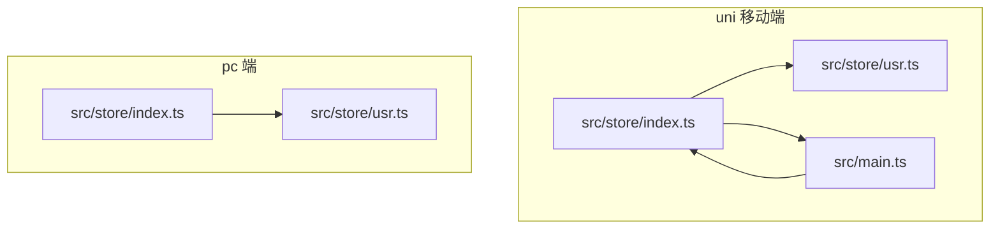
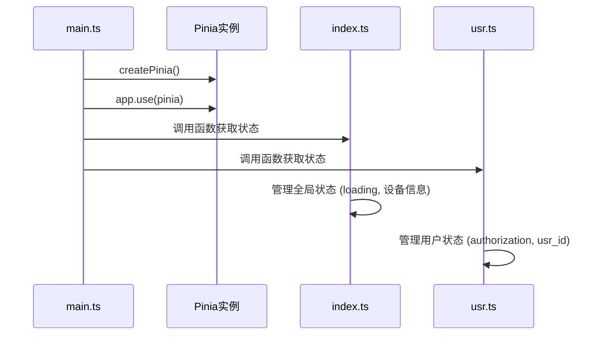
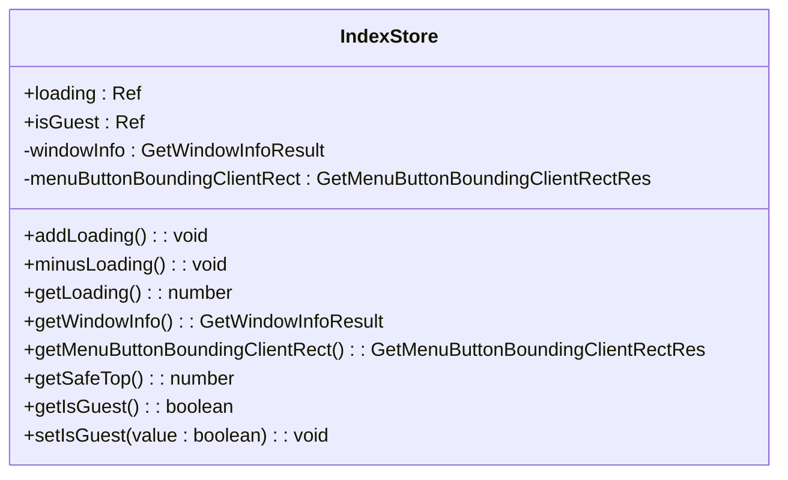
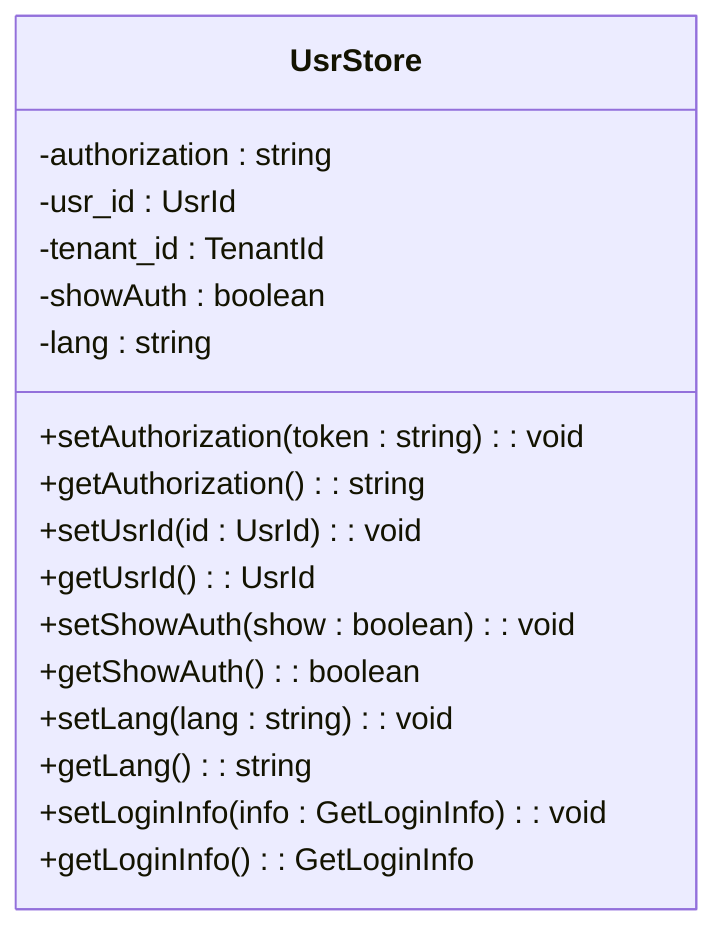
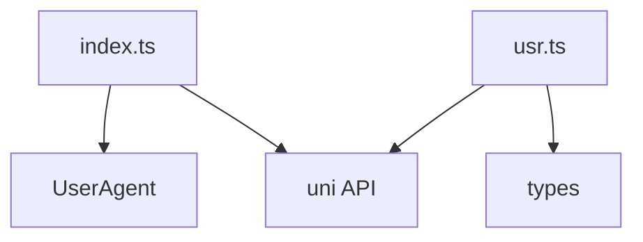

# 模块化Store设计

**本文档引用文件**  
- [index.ts](https://github.com/sail-sail/nest/blob/main/uni\src\store\index.ts)
- [usr.ts](https://github.com/sail-sail/nest/blob/main/uni\src\store\usr.ts)
- [main.ts](https://github.com/sail-sail/nest/blob/main/uni\src\main.ts)
- [index.ts](https://github.com/sail-sail/nest/blob/main/pc\src\store\index.ts)
- [usr.ts](https://github.com/sail-sail/nest/blob/main/pc\src\store\usr.ts)

## 目录
1. [引言](#引言)
2. [项目结构](#项目结构)
3. [核心组件](#核心组件)
4. [架构概览](#架构概览)
5. [详细组件分析](#详细组件分析)
6. [依赖分析](#依赖分析)
7. [性能考量](#性能考量)
8. [故障排除指南](#故障排除指南)
9. [结论](#结论)

## 引言
本文档旨在深入解析移动端模块化状态管理的设计与实现，重点分析基于Pinia的store模块化组织架构。文档将详细说明主store的初始化流程、依赖注入机制、模块注册与管理方式，并阐述模块间通信的最佳实践。同时，对比PC端与移动端store设计的异同，突出移动端的轻量化设计考量，为开发者提供全面的模块划分原则、命名规范和测试策略。

## 项目结构
项目采用多端分离的架构设计，包含`pc`（PC端）和`uni`（移动端）两个独立的前端模块。两者均使用Pinia进行状态管理，但实现方式和设计考量有所不同。移动端`uni`项目位于`uni`路径下，其状态管理模块位于`src/store`目录，包含`index.ts`（主store）和`usr.ts`（用户状态模块）等文件。

**图示来源**
- [index.ts](https://github.com/sail-sail/nest/blob/main/uni\src\store\index.ts)
- [main.ts](https://github.com/sail-sail/nest/blob/main/uni\src\main.ts)

## 核心组件
移动端状态管理的核心是`index.ts`中定义的主store和`usr.ts`中的用户状态模块。主store负责全局状态（如加载状态、设备信息）的管理，而`usr.ts`则专注于用户会话、认证信息等特定领域的状态。两者通过组合式函数（Composable）的模式导出，实现了高内聚、低耦合的模块化设计。

**组件来源**
- [index.ts](https://github.com/sail-sail/nest/blob/main/uni\src\store\index.ts#L0-L167)
- [usr.ts](https://github.com/sail-sail/nest/blob/main/uni\src\store\usr.ts#L0-L96)

## 架构概览
整个状态管理架构遵循模块化原则。在应用启动时，`main.ts`负责创建Pinia实例并将其挂载到Vue应用上。随后，各个store模块（如`index.ts`和`usr.ts`）通过导出的函数来访问和操作状态。这种设计避免了传统Vuex的集中式管理带来的复杂性，使得状态逻辑更易于维护和测试。

**图示来源**
- [main.ts](https://github.com/sail-sail/nest/blob/main/uni\src\main.ts#L0-L27)
- [index.ts](https://github.com/sail-sail/nest/blob/main/uni\src\store\index.ts)
- [usr.ts](https://github.com/sail-sail/nest/blob/main/uni\src\store\usr.ts)

## 详细组件分析

### 主Store (index.ts) 分析
`index.ts`作为主store，管理着应用的全局状态和工具函数。

#### 功能与数据结构
该模块定义了多个响应式变量和工具函数：
- `loading`: 计数器，用于跟踪异步操作的数量。
- `windowInfo`, `menuButtonBoundingClientRect`: 缓存设备窗口和菜单按钮的布局信息。
- `isGuest`: 响应式变量，标识当前是否为游客模式。

其核心是通过一个返回对象的函数暴露这些状态和方法，实现了状态的封装。

**图示来源**
- [index.ts](https://github.com/sail-sail/nest/blob/main/uni\src\store\index.ts#L0-L167)

**组件来源**
- [index.ts](https://github.com/sail-sail/nest/blob/main/uni\src\store\index.ts#L0-L167)

### 用户状态模块 (usr.ts) 分析
`usr.ts`模块专注于用户会话状态的管理。

#### 功能与数据结构
该模块主要管理以下用户相关状态：
- `authorization`: 存储用户的认证令牌。
- `usr_id`, `tenant_id`: 存储用户和租户的ID。
- `loginInfo`: 存储完整的登录信息对象。
- `showAuth`: 控制授权弹窗的显示状态。

与PC端不同，移动端直接使用`uni.getStorageSync`进行本地存储的读写，体现了其轻量化和对原生API的直接依赖。

**图示来源**
- [usr.ts](https://github.com/sail-sail/nest/blob/main/uni\src\store\usr.ts#L0-L96)

**组件来源**
- [usr.ts](https://github.com/sail-sail/nest/blob/main/uni\src\store\usr.ts#L0-L96)

## 依赖分析
移动端store的依赖关系相对简单直接。`index.ts`和`usr.ts`都依赖于`@/utils/UserAgent`和`@/typings/types`等工具和类型定义。它们不直接相互依赖，而是通过业务逻辑在组件层面进行协作。与PC端相比，移动端store没有使用`useStorage`这样的高级封装，而是直接操作`uni`的存储API，减少了对第三方库的依赖，更符合移动端对性能和包体积的严格要求。

**图示来源**
- [index.ts](https://github.com/sail-sail/nest/blob/main/uni\src\store\index.ts)
- [usr.ts](https://github.com/sail-sail/nest/blob/main/uni\src\store\usr.ts)

## 性能考量
移动端store的设计充分考虑了性能因素：
1.  **状态缓存**: 对`windowInfo`、`menuButtonBoundingClientRect`等计算成本较高的信息进行缓存，避免重复调用原生API。
2.  **轻量存储**: 直接使用`uni.getStorageSync`进行同步存储，虽然可能阻塞主线程，但在移动端场景下，存储的数据量通常很小，且同步操作更简单可靠。
3.  **按需加载**: 状态模块是独立的，只有在需要时才会被引入和执行，有助于代码分割和懒加载。

## 故障排除指南
在使用移动端store时，可能遇到以下问题：
- **状态未持久化**: 检查`uni.setStorageSync`的调用是否成功，确保键名（如`"authorization"`）拼写正确。
- **响应式失效**: 确保通过`get`和`set`方法来访问和修改状态，而不是直接修改内部变量。
- **初始化问题**: 确保`main.ts`中正确创建并使用了Pinia实例。

**排查来源**
- [index.ts](https://github.com/sail-sail/nest/blob/main/uni\src\store\index.ts#L0-L167)
- [usr.ts](https://github.com/sail-sail/nest/blob/main/uni\src\store\usr.ts#L0-L96)
- [main.ts](https://github.com/sail-sail/nest/blob/main/uni\src\main.ts#L0-L27)

## 结论
本文档详细解析了移动端基于Pinia的模块化状态管理实现。通过分析`index.ts`和`usr.ts`，我们看到其设计简洁、直接，充分利用了组合式API的优势，并针对移动端特性（如原生API、性能要求）进行了优化。与PC端相比，移动端store更轻量、更直接，体现了“合适的技术用在合适的场景”的设计哲学。开发者在进行模块划分时，应遵循单一职责原则，将状态按业务领域清晰地分离，并通过统一的命名规范和本地存储策略来保证代码的可维护性。