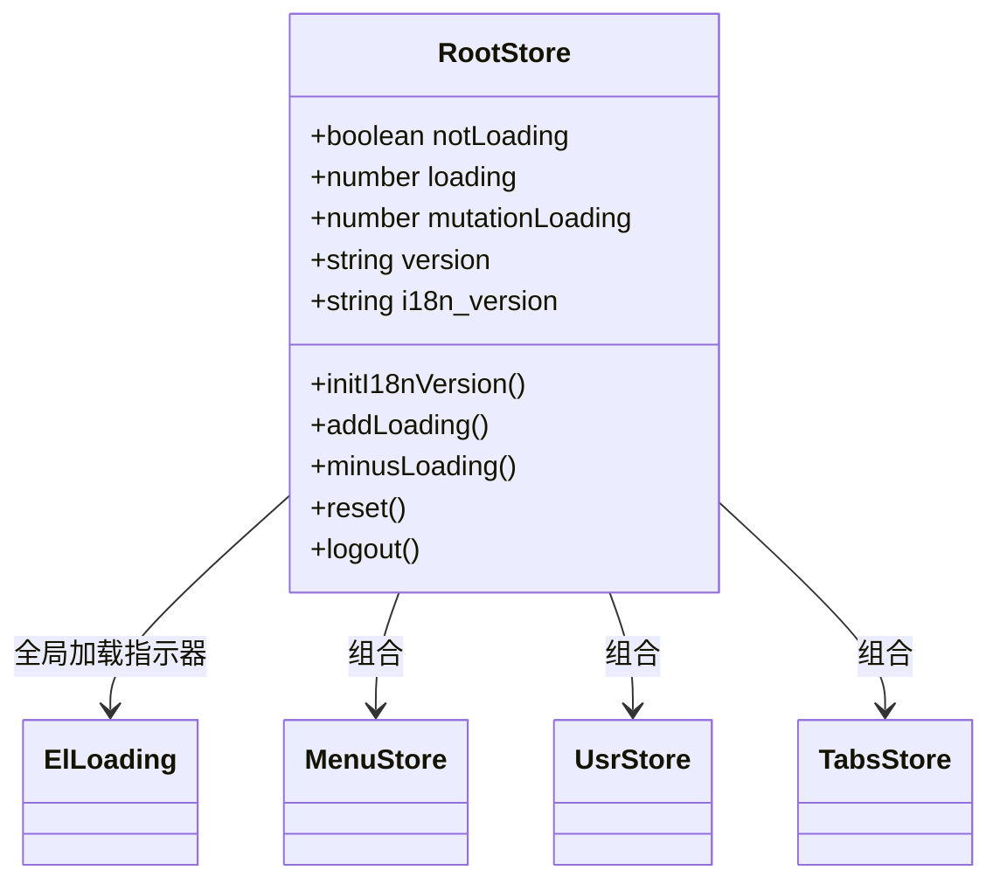
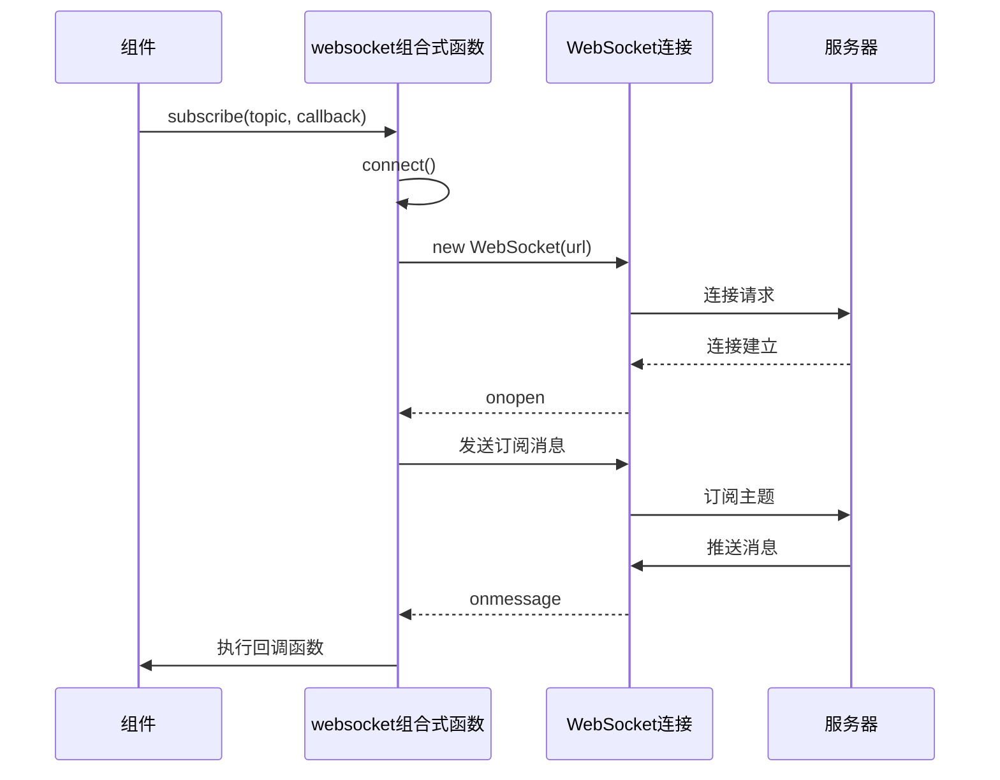
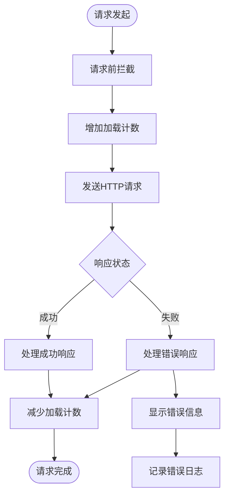
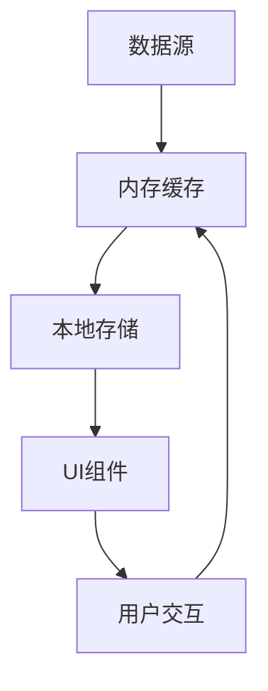

# 状态管理策略


**本文档引用的文件**  
- [usr.ts](https://github.com/sail-sail/nest/blob/main/pc/src/store/usr.ts)
- [usr.ts](https://github.com/sail-sail/nest/blob/main/uni/src/store/usr.ts)
- [index.ts](https://github.com/sail-sail/nest/blob/main/pc/src/store/index.ts)
- [index.ts](https://github.com/sail-sail/nest/blob/main/uni/src/store/index.ts)
- [websocket.ts](https://github.com/sail-sail/nest/blob/main/pc/src/compositions/websocket.ts)
- [websocket.ts](https://github.com/sail-sail/nest/blob/main/uni/src/compositions/websocket.ts)
- [request.ts](https://github.com/sail-sail/nest/blob/main/pc/src/utils/request.ts)
- [request.ts](https://github.com/sail-sail/nest/blob/main/uni/src/utils/request.ts)


## 目录
1. [项目结构概览](#项目结构概览)
2. [用户状态管理机制](#用户状态管理机制)
3. [模块化Store组织方式](#模块化store组织方式)
4. [实时状态同步实现](#实时状态同步实现)
5. [全局状态拦截与处理](#全局状态拦截与处理)
6. [状态共享最佳实践](#状态共享最佳实践)

## 项目结构概览

本项目采用多端统一架构设计，包含PC端（`pc`目录）与移动端（`uni`目录）两个主要前端模块，共享核心状态管理逻辑。状态管理主要集中在`store`目录下，通过Pinia实现轻量级状态管理模式。

核心状态管理文件分布如下：
- `pc/src/store/`：PC端状态管理模块
- `uni/src/store/`：移动端状态管理模块
- `pc/src/compositions/` 和 `uni/src/compositions/`：组合式函数用于实时通信
- `pc/src/utils/request.ts` 和 `uni/src/utils/request.ts`：请求拦截器实现全局状态控制

该架构实现了跨平台状态管理的一致性，同时针对不同终端特性进行适配优化。

**Section sources**
- [usr.ts](https://github.com/sail-sail/nest/blob/main/pc/src/store/usr.ts)
- [usr.ts](https://github.com/sail-sail/nest/blob/main/uni/src/store/usr.ts)
- [index.ts](https://github.com/sail-sail/nest/blob/main/pc/src/store/index.ts)
- [index.ts](https://github.com/sail-sail/nest/blob/main/uni/src/store/index.ts)

## 用户状态管理机制

### PC端用户状态实现

PC端用户状态管理位于`pc/src/store/usr.ts`文件中，采用Vue Use的`useStorage`实现数据持久化存储。

```mermaid
classDiagram
class UsrStore {
+string authorization
+boolean isLogining
+TenantId tenant_id
+string username
+UsrId usr_id
+GetLoginInfo loginInfo
+string lang
+refreshToken(authorization0)
+login(authorization0)
+logout()
+onLogin(callback)
+hasRole(role_code)
+isAdmin()
+setLang(lang0)
+clear()
+reset()
}
UsrStore --> "localStorage" : 持久化存储
UsrStore --> TabsStore : 依赖
UsrStore --> PermitStore : 依赖
```

**Diagram sources**
- [usr.ts](https://github.com/sail-sail/nest/blob/main/pc/src/store/usr.ts#L1-L147)

**Section sources**
- [usr.ts](https://github.com/sail-sail/nest/blob/main/pc/src/store/usr.ts#L1-L147)

#### 持久化处理机制

PC端使用浏览器`localStorage`实现用户状态持久化：

- `authorization`：存储认证令牌，键名为`store.usr.authorization`
- `loginInfo`：存储登录信息，键名为`store.usr.loginInfo`
- `tenant_id`、`username`、`usr_id`、`lang`：分别存储租户ID、用户名、用户ID和语言设置

系统在初始化时会检查`localStorage`中是否存在`store.usr.loginInfo`，若存在则自动解析并恢复登录状态，实现页面刷新后的状态保持。

#### 登录状态存储与自动刷新

登录流程通过`login`方法实现：
1. 设置`authorization`值
2. 清除标签页缓存（调用`tabsStore.clearKeepAliveNames()`）
3. 执行所有注册的登录回调函数

```typescript
async function login(authorization0: string) {
  authorization.value = authorization0;
  tabsStore.clearKeepAliveNames();
  await Promise.all([
    onLoginCallbacks.filter((callback) => callback()).map((callback) => callback()),
  ]);
}
```

系统提供`onLogin`方法用于注册登录后执行的回调函数，利用Vue的`onActivated`和`onDeactivated`生命周期钩子管理回调函数的激活状态，确保仅在组件激活时执行相关逻辑。

### 移动端用户状态实现

移动端用户状态管理位于`uni/src/store/usr.ts`文件中，针对uni-app平台特性进行适配。

```mermaid
classDiagram
class UsrStore {
+string authorization
+UsrId usr_id
+TenantId tenant_id
+string username
+GetLoginInfo loginInfo
+boolean showAuth
+string lang
+setAuthorization(authorization0)
+getAuthorization()
+setUsrId(usr_id0)
+getUsrId()
+setShowAuth(showAuth0)
+getShowAuth()
+setLang(lang0)
+getLang()
+setLoginInfo(loginInfo0)
+getLoginInfo()
+setUsername(username0)
+getUsername()
+setTenantId(tenant_id0)
+getTenantId()
}
UsrStore --> "uniStorage" : 持久化存储
```

**Diagram sources**
- [usr.ts](https://github.com/sail-sail/nest/blob/main/uni/src/store/usr.ts#L1-L96)

**Section sources**
- [usr.ts](https://github.com/sail-sail/nest/blob/main/uni/src/store/usr.ts#L1-L96)

#### 平台适配差异

移动端采用uni-app提供的`uni.setStorageSync`和`uni.getStorageSync`进行数据持久化，与PC端的`localStorage`API不同但功能相似：

- 所有状态变量直接声明为普通变量而非`ref`
- 通过getter/setter方法控制状态读写
- 每次设置值时同步更新到本地存储

```typescript
function setAuthorization(authorization0: string) {
  if (authorization !== authorization0) {
    authorization = authorization0;
    uni.setStorageSync("authorization", authorization0);
  }
}
```

#### 特有功能扩展

移动端增加了`showAuth`状态变量，用于控制授权弹窗的显示与隐藏，这是针对移动端用户授权场景的特殊需求。

## 模块化Store组织方式

### PC端模块化实现

PC端的根状态管理位于`pc/src/store/index.ts`文件中，采用模块化组织方式整合多个功能模块。



**Diagram sources**
- [index.ts](https://github.com/sail-sail/nest/blob/main/pc/src/store/index.ts#L1-L127)

**Section sources**
- [index.ts](https://github.com/sail-sail/nest/blob/main/pc/src/store/index.ts#L1-L127)

#### 依赖注入方法

系统通过`useXXXStore()`函数实现Store的依赖注入：

```typescript
const tabsStore = useTabsStore();
const usrStore = useUsrStore();
const permitsStore = usePermitStore();
```

这种模式实现了Store之间的解耦，各模块可以独立开发维护，通过统一的API进行交互。

#### 全局状态管理

根Store管理以下全局状态：
- `loading`：加载计数器，控制全局加载指示器显示
- `mutationLoading`：变更加载状态
- `version`：应用版本号，持久化存储
- `i18n_version`：国际化版本号

`addLoading`和`minusLoading`方法实现加载计数器的增减操作，当计数器为0时自动关闭Element Plus的全屏加载指示器。

### 移动端模块化实现

移动端的根状态管理位于`uni/src/store/index.ts`文件中，针对移动设备特性进行了优化。

```mermaid
classDiagram
class RootStore {
+number loading
+Object windowInfo
+Object menuButtonBoundingClientRect
+UserAgent userAgent
+AppBaseInfo appBaseInfo
+App.LaunchShowOption launchOptions
+string uid
+number _safeTop
+number _safeWidth
+AccountInfo accountInfo
+boolean isGuest
+addLoading()
+minusLoading()
+getLoading()
+getWindowInfo()
+getMenuButtonBoundingClientRect()
+getUserAgent()
+getAppBaseInfo()
+setLaunchOptions(options)
+getLaunchOptions()
+getUid()
+getSafeTop()
+getSafeWidth()
+getAccountInfo()
+setIsGuest(isGuestValue)
+getIsGuest()
}
RootStore --> "uni API" : 设备信息获取
```

**Diagram sources**
- [index.ts](https://github.com/sail-sail/nest/blob/main/uni/src/store/index.ts#L1-L167)

**Section sources**
- [index.ts](https://github.com/sail-sail/nest/blob/main/uni/src/store/index.ts#L1-L167)

#### 移动端特有状态

移动端Store管理了丰富的设备相关信息：
- `windowInfo`：窗口信息
- `menuButtonBoundingClientRect`：菜单按钮布局信息
- `userAgent`：用户代理信息
- `appBaseInfo`：应用基础信息
- `_safeTop`和`_safeWidth`：安全区域距离

这些状态为移动端UI适配提供了重要依据，如处理iPhone刘海屏的安全距离。

#### 唯一标识生成

系统通过`getUid`方法生成并持久化存储用户唯一标识：
```typescript
function getUid() {
  uid = uni.getStorageSync("_uid");
  if (uid) {
    return uid;
  }
  uid = uniqueID();
  uni.setStorageSync("_uid", uid);
  return uid;
}
```

## 实时状态同步实现

### WebSocket组合式函数

实时状态同步功能通过`compositions/websocket.ts`文件中的组合式函数实现，PC端和移动端分别有对应的实现。



**Diagram sources**
- [websocket.ts](https://github.com/sail-sail/nest/blob/main/pc/src/compositions/websocket.ts#L1-L315)
- [websocket.ts](https://github.com/sail-sail/nest/blob/main/uni/src/compositions/websocket.ts#L1-L303)

**Section sources**
- [websocket.ts](https://github.com/sail-sail/nest/blob/main/pc/src/compositions/websocket.ts#L1-L315)
- [websocket.ts](https://github.com/sail-sail/nest/blob/main/uni/src/compositions/websocket.ts#L1-L303)

### PC端WebSocket实现

PC端WebSocket实现位于`pc/src/compositions/websocket.ts`，主要特点：

- 自动构建WSS/WS连接URL，根据当前页面协议自动选择安全连接
- 使用UUID生成客户端ID，增强安全性
- 内置心跳机制（每60秒发送ping消息）
- 支持自动重连，重试间隔随失败次数递增

```typescript
const isSSL = location.protocol === 'https:';
const clientId = uuid();
const PWD = "0YSCBr1QQSOpOfi6GgH34A";
const url = (isSSL ? 'wss://' : 'ws://') + location.host + '/api/websocket/upgrade?pwd='+ PWD + '&clientId=' + encodeURIComponent(clientId);
```

### 移动端WebSocket实现

移动端WebSocket实现位于`uni/src/compositions/websocket.ts`，主要差异：

- 使用uni-app的`uni.connectSocket` API建立连接
- 连接URL从配置文件`cfg.wss`获取
- 采用uni-app特有的SocketTask类型

```typescript
const url = cfg.wss + '/api/websocket/upgrade?pwd='+ PWD + '&clientId=' + encodeURIComponent(clientId);
socket = uni.connectSocket({
  url,
  success() {},
  fail() {
    socket = undefined;
  },
});
```

### 核心功能对比

| 功能 | PC端实现 | 移动端实现 |
|------|----------|------------|
| **连接建立** | 原生WebSocket API | uni.connectSocket API |
| **URL构建** | 基于location.host动态构建 | 从配置文件读取cfg.wss |
| **消息发送** | socket.send(JSON.stringify(data)) | socket.send({data: JSON.stringify(data)}) |
| **错误处理** | ErrorEvent类型 | 通用err参数 |
| **连接关闭** | socket.close() | socket.close({}) |

### 共享的编程模型

尽管底层API不同，但两端实现了统一的编程模型：

- `subscribe`：订阅主题
- `unSubscribe`：取消订阅单个主题
- `unSubscribes`：批量取消订阅
- `publish`：发布消息
- `useSubscribe`：响应式订阅（仅PC端）

```typescript
export async function useSubscribe<T>(
  topic: string,
  callback: ((data: T | undefined) => void),
) {
  onMounted(async () => {
    await subscribe(topic, callback);
  });
  
  onBeforeUnmount(async () => {
    await unSubscribe(topic, callback);
  });
}
```

## 全局状态拦截与处理

### 请求拦截器实现

全局状态管理通过`request.ts`文件中的请求拦截器实现，PC端和移动端分别有对应的实现。



**Diagram sources**
- [request.ts](https://github.com/sail-sail/nest/blob/main/pc/src/utils/request.ts)
- [request.ts](https://github.com/sail-sail/nest/blob/main/uni/src/utils/request.ts)

**Section sources**
- [request.ts](https://github.com/sail-sail/nest/blob/main/pc/src/utils/request.ts)
- [request.ts](https://github.com/sail-sail/nest/blob/main/uni/src/utils/request.ts)

### 加载指示器管理

系统通过维护加载计数器实现全局加载指示器的智能控制：

- 每次发起请求时调用`addLoading()`增加计数
- 请求完成（无论成功或失败）时调用`minusLoading()`减少计数
- 当计数器从1减到0时，自动关闭全屏加载层

PC端使用Element Plus的`ElLoading.service`实现全屏加载指示器，移动端则通过简单的计数器实现。

### 错误处理机制

全局错误处理包含以下层次：

1. **网络层错误**：处理连接超时、网络中断等
2. **HTTP状态码错误**：处理4xx、5xx等错误响应
3. **业务逻辑错误**：处理服务器返回的业务错误码

系统会根据错误类型显示相应的错误提示，并记录错误日志用于问题排查。

## 状态共享最佳实践

### 模块划分策略

系统采用功能模块化划分策略，每个Store模块职责单一：

- `usr`模块：用户认证与个人信息
- `menu`模块：菜单状态管理
- `tabs`模块：标签页状态管理
- `permit`模块：权限状态管理
- `index`模块：全局状态管理

这种划分方式遵循单一职责原则，降低了模块间的耦合度。

### 数据缓存策略

系统实现了多层级的数据缓存机制：

1. **内存缓存**：使用`ref`和`reactive`实现响应式状态
2. **本地存储**：使用`localStorage`或`uniStorage`实现持久化
3. **会话存储**：临时状态在页面会话期间保持



### 内存优化策略

为避免内存泄漏，系统采用了以下优化措施：

- **自动清理机制**：当订阅者数量为0时，10分钟后自动关闭WebSocket连接
- **生命周期管理**：使用`onMounted`和`onBeforeUnmount`钩子管理订阅生命周期
- **弱引用管理**：通过Map结构管理回调函数引用，便于垃圾回收

```typescript
let closeSocketTimeout: NodeJS.Timeout | undefined = undefined;

// 每次操作后重置超时计时器
closeSocketTimeout = setTimeout(() => {
  if (topicCallbackMap.size === 0) {
    try {
      socket?.close();
    } catch (err) {
      console.log(err);
    } finally {
      socket = undefined;
    }
  }
}, 600000); // 10分钟
```

### 跨平台一致性

尽管PC端和移动端在技术实现上存在差异，但通过以下方式保持了API的一致性：

- 相同的功能模块命名
- 相似的API设计模式
- 统一的状态管理理念
- 共享的核心业务逻辑

这种设计使得开发者可以在不同平台间快速切换，降低了学习成本和维护难度。