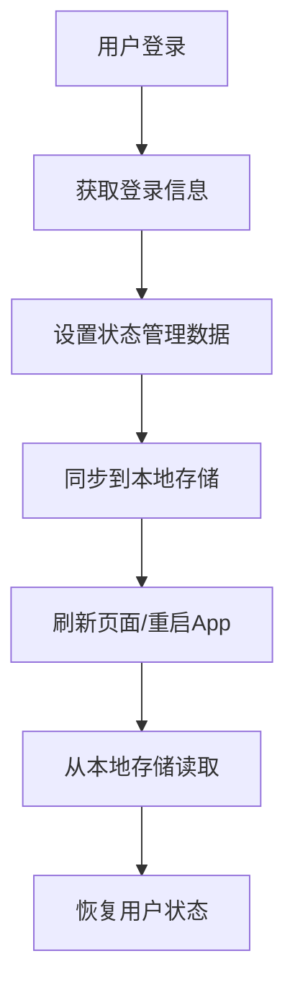
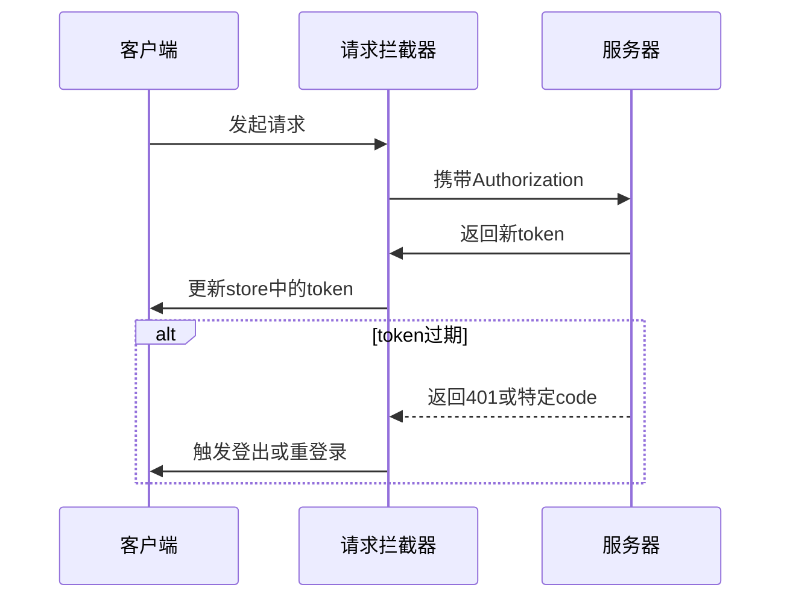
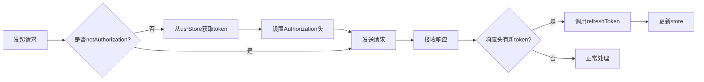

# 用户状态管理


**本文档引用文件**  
- [usr.ts](https://github.com/sail-sail/nest/blob/main/pc/src/store/usr.ts)
- [usr.ts](https://github.com/sail-sail/nest/blob/main/uni/src/store/usr.ts)
- [request.ts](https://github.com/sail-sail/nest/blob/main/pc/src/utils/request.ts)
- [request.ts](https://github.com/sail-sail/nest/blob/main/uni/src/utils/request.ts)
- [index.ts](https://github.com/sail-sail/nest/blob/main/pc/src/store/index.ts)
- [Login.vue](https://github.com/sail-sail/nest/blob/main/pc/src/layout/Login.vue)
- [Login.vue](https://github.com/sail-sail/nest/blob/main/uni/src/pages/index/Login.vue)


## 目录
1. [项目结构分析](#项目结构分析)  
2. [用户状态定义与存储结构](#用户状态定义与存储结构)  
3. [状态持久化机制](#状态持久化机制)  
4. [登录状态管理与自动刷新](#登录状态管理与自动刷新)  
5. [权限与角色判断逻辑](#权限与角色判断逻辑)  
6. [请求拦截器与认证信息统一管理](#请求拦截器与认证信息统一管理)  
7. [用户状态变更与数据同步](#用户状态变更与数据同步)  
8. [移动端与PC端状态管理差异](#移动端与pc端状态管理差异)  
9. [最佳实践与注意事项](#最佳实践与注意事项)

## 项目结构分析

本项目包含多个模块，主要分为 `pc`（Web端）和 `uni`（移动端）两个前端应用，均采用 Vue 3 + TypeScript 架构。用户状态管理分别位于两个模块的 `store/` 目录下，通过 Pinia 或类似状态管理模式实现。

核心用户状态管理文件位于：
- `pc/src/store/usr.ts`：Web端用户状态管理
- `uni/src/store/usr.ts`：移动端用户状态管理

状态管理依赖于本地存储（localStorage/uniStorage）实现持久化，并通过请求拦截器在全局统一注入认证信息。

**Section sources**  
- [usr.ts](https://github.com/sail-sail/nest/blob/main/pc/src/store/usr.ts#L1-L147)  
- [usr.ts](https://github.com/sail-sail/nest/blob/main/uni/src/store/usr.ts#L1-L96)

## 用户状态定义与存储结构

用户状态主要包含以下核心字段：

| 字段名 | 类型 | 说明 |
|--------|------|------|
| `authorization` | string | JWT 认证令牌，用于接口鉴权 |
| `usr_id` | UsrId | 用户唯一标识 |
| `tenant_id` | TenantId | 租户ID，支持多租户架构 |
| `username` | string | 用户名 |
| `lang` | string | 当前语言设置 |
| `loginInfo` | GetLoginInfo | 完整登录信息对象，包含角色、权限等 |

在 Web 端使用 `useStorage` 实现响应式持久化存储，关键代码如下：

```ts
const authorization = useStorage<string>("store.usr.authorization", "");
const tenant_id = useStorage<TenantId>("store.usr.tenant_id", "" as unknown as TenantId);
const username = useStorage<string>("store.usr.username", "");
const usr_id = useStorage<UsrId>("store.usr.usr_id", "" as unknown as UsrId);
const lang = useStorage<string>("store.usr.lang", "");
```

移动端则直接使用 `uni.getStorageSync` 和 `uni.setStorageSync` 进行同步存储。

**Section sources**  
- [usr.ts](https://github.com/sail-sail/nest/blob/main/pc/src/store/usr.ts#L3-L15)  
- [usr.ts](https://github.com/sail-sail/nest/blob/main/uni/src/store/usr.ts#L3-L12)

## 状态持久化机制

### Web端持久化实现

Web端通过封装的 `useStorage` 工具实现自动持久化，该工具基于 `localStorage` 并结合响应式系统，在数据变更时自动同步到本地存储。

`loginInfo` 字段在设置时手动处理持久化逻辑：

```ts
set loginInfo(loginInfo0: GetLoginInfo | undefined) {
  loginInfo.value = loginInfo0;
  if (!loginInfo0) {
    localStorage.removeItem("store.usr.loginInfo");
  } else {
    localStorage.setItem("store.usr.loginInfo", JSON.stringify(loginInfo0));
  }
}
```

### 移动端持久化实现

移动端使用 `uni.setStorageSync` 显式保存每个字段：

```ts
function setAuthorization(authorization0: string) {
  authorization = authorization0;
  uni.setStorageSync("authorization", authorization0);
}
```

所有用户相关字段均独立存储，确保状态可恢复。



**Diagram sources**  
- [usr.ts](https://github.com/sail-sail/nest/blob/main/pc/src/store/usr.ts#L16-L20)  
- [usr.ts](https://github.com/sail-sail/nest/blob/main/uni/src/store/usr.ts#L3-L12)

## 登录状态管理与自动刷新

### 登录流程

登录成功后调用 `login` 方法设置认证信息：

```ts
async function login(authorization0: string) {
  authorization.value = authorization0;
  tabsStore.clearKeepAliveNames();
  await Promise.all([
    onLoginCallbacks.filter((callback) => callback()).map((callback) => callback()),
  ]);
}
```

同时触发 `onLoginCallbacks` 回调队列，通知各模块登录状态变更。

### 令牌自动刷新

在 `request.ts` 中，每次请求响应头若包含新的 `authorization`，则自动更新：

```ts
let authorization = header?.get("authorization");
if (authorization) {
  if (authorization.startsWith("Bearer ")) {
    authorization = authorization.substring(7);
  }
  usrStore.refreshToken(authorization);
}
```

此机制实现无感续签，避免频繁重新登录。

### 过期处理

当接口返回 `token_empty` 或 `refresh_token_expired` 时，触发登出逻辑：

```ts
if (data && (data.key === "token_empty" || data.key === "refresh_token_expired")) {
  indexStore.logout();
  return data;
}
```

移动端还支持自动重登录：

```ts
if (await uniLogin()) {
  config.notLogin = true;
  return await request(config);
}
```



**Diagram sources**  
- [request.ts](https://github.com/sail-sail/nest/blob/main/pc/src/utils/request.ts#L100-L120)  
- [request.ts](https://github.com/sail-sail/nest/blob/main/uni/src/utils/request.ts#L300-L320)

## 权限与角色判断逻辑

用户状态管理模块提供便捷的权限判断方法：

```ts
function hasRole(role_code: string) {
  if (!loginInfo.value) {
    return false;
  }
  return loginInfo.value.role_codes.some((item) => item === role_code);
}

function isAdmin() {
  return username.value === "admin";
}
```

- `hasRole`：检查用户是否拥有指定角色
- `isAdmin`：通过用户名判断是否为超级管理员

这些方法可在组件中直接调用，用于控制UI显示或路由访问。

**Section sources**  
- [usr.ts](https://github.com/sail-sail/nest/blob/main/pc/src/store/usr.ts#L120-L135)

## 请求拦截器与认证信息统一管理

### 全局加载状态管理

`request.ts` 中通过 `indexStore` 统一管理加载状态：

```ts
if (!config.notLoading) {
  indexStore.addLoading();
}
// ...请求逻辑...
finally {
  if (!config.notLoading) {
    indexStore.minusLoading();
  }
}
```

实现请求期间显示全局加载动画。

### 认证信息注入

在请求头中自动注入 `authorization` 和 `TenantId`：

```ts
if (config.notAuthorization !== true) {
  const authorization = usrStore.authorization;
  if (authorization) {
    config.headers.set("authorization", authorization);
  }
}
```

确保所有请求自动携带认证信息，无需在每个请求中手动设置。



**Diagram sources**  
- [request.ts](https://github.com/sail-sail/nest/blob/main/pc/src/utils/request.ts#L50-L80)  
- [request.ts](https://github.com/sail-sail/nest/blob/main/uni/src/utils/request.ts#L250-L280)

## 用户状态变更与数据同步

### 状态变更监听

通过 `onLogin` 方法注册登录后回调：

```ts
function onLogin(callback: () => void | PromiseLike<void>) {
  onDeactivated(function() {
    const idx = onLoginCallbacks.indexOf(callback);
    if (idx !== -1) {
      onLoginCallbacks.splice(idx, 1);
    }
  });
  onActivated(function() {
    if (!onLoginCallbacks.includes(callback)) {
      onLoginCallbacks.push(callback);
    }
  });
  if (!onLoginCallbacks.includes(callback)) {
    onLoginCallbacks.push(callback);
  }
}
```

利用 Vue 的 `onActivated`/`onDeactivated` 实现组件激活时自动注册，避免内存泄漏。

### 登出与状态重置

登出时清除认证信息并重置相关模块：

```ts
function logout() {
  authorization.value = "";
  permitsStore.permits = [];
}
```

在 `indexStore` 中统一处理登出：

```ts
function logout() {
  reset();
}
```

其中 `reset` 会重置所有子模块状态。

**Section sources**  
- [usr.ts](https://github.com/sail-sail/nest/blob/main/pc/src/store/usr.ts#L45-L55)  
- [index.ts](https://github.com/sail-sail/nest/blob/main/pc/src/store/index.ts#L72-L126)

## 移动端与PC端状态管理差异

| 特性 | PC端 | 移动端 |
|------|------|--------|
| 存储方式 | useStorage + localStorage | uniStorage |
| 状态恢复 | 自动从localStorage恢复 | 自动从uniStorage恢复 |
| 登录流程 | 手动输入账号密码 | 支持微信授权登录 |
| 重登录机制 | 直接跳转登录页 | 支持code2Session自动登录 |
| 语言切换 | 页面刷新生效 | 页面刷新生效 |

移动端通过 `uniLogin` 方法封装了完整的微信登录流程，包括获取 code、调用 `code2Session` 接口、更新用户状态等。

**Section sources**  
- [usr.ts](https://github.com/sail-sail/nest/blob/main/pc/src/store/usr.ts)  
- [usr.ts](https://github.com/sail-sail/nest/blob/main/uni/src/store/usr.ts)  
- [request.ts](https://github.com/sail-sail/nest/blob/main/uni/src/utils/request.ts#L500-L700)

## 最佳实践与注意事项

### 最佳实践

1. **统一使用 store 访问用户状态**，避免直接操作 localStorage
2. **敏感信息不存储**，如密码等绝不本地保存
3. **及时清理状态**，登出时重置所有相关模块
4. **合理使用 onLogin 回调**，在组件激活时注册，停用时自动注销
5. **避免内存泄漏**，通过 onActivated/onDeactivated 管理回调生命周期

### 注意事项

- `loginInfo` 包含敏感权限信息，需确保传输安全
- 多标签页场景下，localStorage 变更可通过 `storage` 事件同步
- 移动端网络环境复杂，需妥善处理请求失败和 token 过期
- 定期清理过期的本地存储数据，避免占用过多空间

### 代码示例：在组件中使用用户状态

```ts
import useUsrStore from "@/store/usr.ts";

export default {
  setup() {
    const usrStore = useUsrStore();
    
    // 判断是否有管理员角色
    const isSuperAdmin = computed(() => usrStore.hasRole("super_admin"));
    
    // 监听登录状态变化
    usrStore.onLogin(() => {
      console.log("用户已登录，执行初始化");
    });
    
    return {
      isSuperAdmin
    };
  }
};
```

**Section sources**  
- [usr.ts](https://github.com/sail-sail/nest/blob/main/pc/src/store/usr.ts)  
- [Login.vue](https://github.com/sail-sail/nest/blob/main/pc/src/layout/Login.vue#L264-L325)  
- [Login.vue](https://github.com/sail-sail/nest/blob/main/uni/src/pages/index/Login.vue#L191-L226)