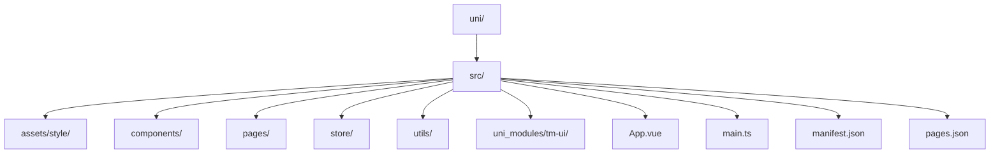
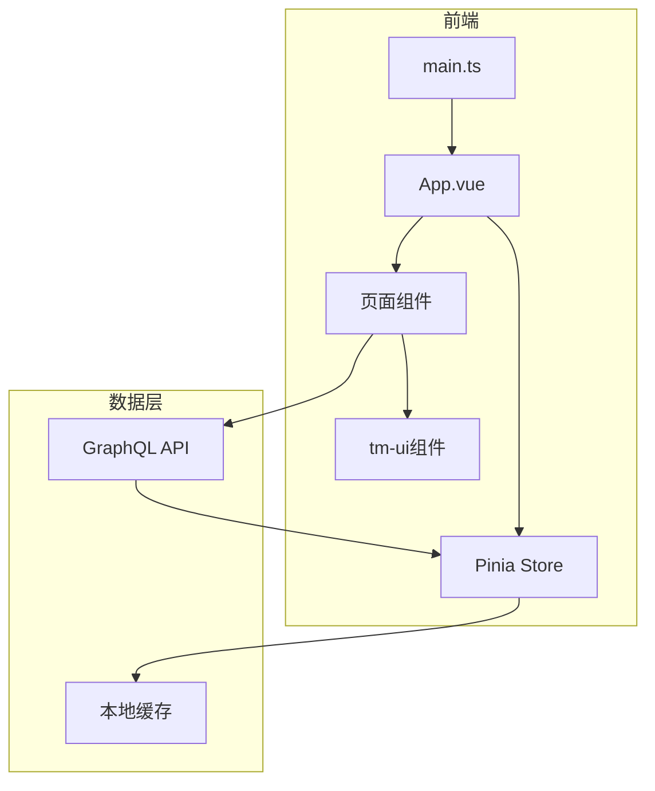
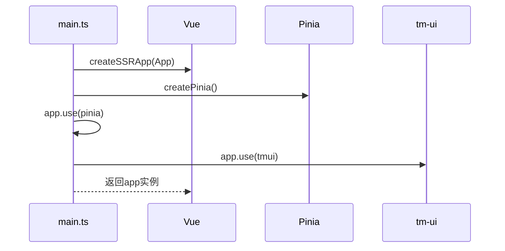
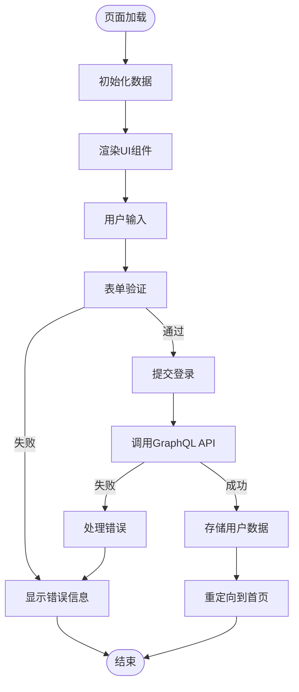
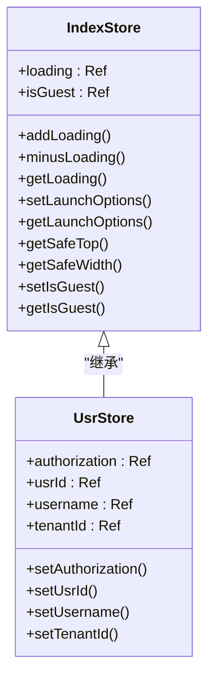
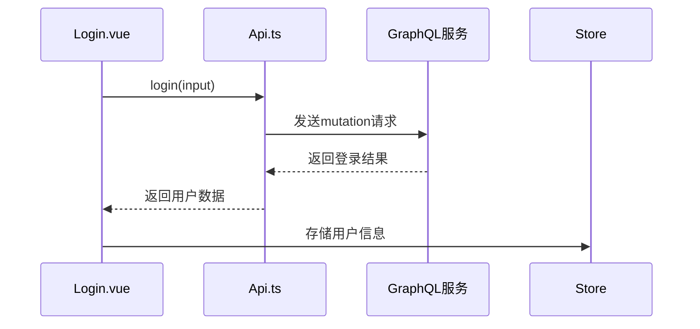
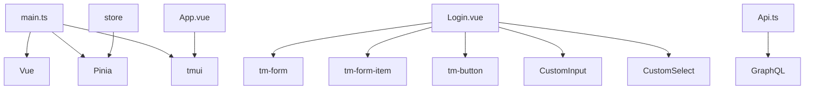

# 移动端前端架构


**本文档引用文件**   
- [main.ts](https://github.com/sail-sail/nest/blob/main/uni/src/main.ts)
- [App.vue](https://github.com/sail-sail/nest/blob/main/uni/src/App.vue)
- [index.vue](https://github.com/sail-sail/nest/blob/main/uni/src/pages/index/index.vue)
- [Login.vue](https://github.com/sail-sail/nest/blob/main/uni/src/pages/index/Login.vue)
- [Api.ts](https://github.com/sail-sail/nest/blob/main/uni/src/pages/index/Api.ts)
- [index.ts](https://github.com/sail-sail/nest/blob/main/uni/src/store/index.ts)
- [usr.ts](https://github.com/sail-sail/nest/blob/main/uni/src/store/usr.ts)


## 目录
1. [简介](#简介)
2. [项目结构](#项目结构)
3. [核心组件](#核心组件)
4. [架构概览](#架构概览)
5. [详细组件分析](#详细组件分析)
6. [依赖分析](#依赖分析)
7. [性能考虑](#性能考虑)
8. [故障排除指南](#故障排除指南)
9. [结论](#结论)

## 简介
本文档全面分析基于Uni-app框架的移动端前端架构设计。文档详细阐述了应用入口初始化过程、页面结构设计、组件库集成、状态管理策略、API集成模式以及移动端开发最佳实践。通过深入分析代码结构和功能实现，为开发者提供清晰的技术指导和架构理解。

## 项目结构
项目采用模块化设计，主要分为codegen、deno、pc和uni四个核心模块。其中uni目录为移动端前端核心，基于Uni-app框架实现跨平台应用。项目结构清晰，遵循功能划分原则，将组件、页面、状态管理、工具函数等分别组织在独立目录中。



**图示来源**
- [main.ts](https://github.com/sail-sail/nest/blob/main/uni/src/main.ts)
- [App.vue](https://github.com/sail-sail/nest/blob/main/uni/src/App.vue)

**本节来源**
- [main.ts](https://github.com/sail-sail/nest/blob/main/uni/src/main.ts)
- [App.vue](https://github.com/sail-sail/nest/blob/main/uni/src/App.vue)

## 核心组件
移动端前端核心组件包括应用入口main.ts、根组件App.vue、页面组件、状态管理模块和工具函数库。这些组件共同构成了应用的基础架构，实现了跨平台运行、状态管理、UI渲染和业务逻辑处理等核心功能。

**本节来源**
- [main.ts](https://github.com/sail-sail/nest/blob/main/uni/src/main.ts)
- [App.vue](https://github.com/sail-sail/nest/blob/main/uni/src/App.vue)
- [index.ts](https://github.com/sail-sail/nest/blob/main/uni/src/store/index.ts)

## 架构概览
移动端前端采用基于Vue 3的组合式API架构，结合Pinia进行状态管理，使用tm-ui组件库构建用户界面。应用通过GraphQL进行数据交互，实现了前后端分离的现代化架构设计。



**图示来源**
- [main.ts](https://github.com/sail-sail/nest/blob/main/uni/src/main.ts)
- [store/index.ts](https://github.com/sail-sail/nest/blob/main/uni/src/store/index.ts)
- [Api.ts](https://github.com/sail-sail/nest/blob/main/uni/src/pages/index/Api.ts)

## 详细组件分析

### 应用入口分析
应用入口main.ts负责初始化Vue应用实例，集成Pinia状态管理和tm-ui组件库。通过createApp工厂函数创建SSR兼容的应用实例，确保应用在不同环境下的正常运行。



**图示来源**
- [main.ts](https://github.com/sail-sail/nest/blob/main/uni/src/main.ts)

**本节来源**
- [main.ts](https://github.com/sail-sail/nest/blob/main/uni/src/main.ts)

### 根组件分析
根组件App.vue负责应用的全局配置和生命周期管理。通过onLaunch钩子函数处理应用启动逻辑，引入必要的样式文件，为整个应用提供统一的视觉风格和功能支持。

```mermaid
classDiagram
class App {
+onLaunch(options : App.LaunchShowOption)
}
App --> "1" "使用" "./uni_modules/tm-ui/css/remixicon.min.css"
App --> "1" "使用" "./assets/style/common.scss"
```

**图示来源**
- [App.vue](https://github.com/sail-sail/nest/blob/main/uni/src/App.vue)

**本节来源**
- [App.vue](https://github.com/sail-sail/nest/blob/main/uni/src/App.vue)

### 页面组件分析
页面组件采用标准的Vue单文件组件结构，包含template、script和style三个部分。以Login.vue为例，展示了登录页面的布局设计、表单验证和用户交互逻辑。



**图示来源**
- [Login.vue](https://github.com/sail-sail/nest/blob/main/uni/src/pages/index/Login.vue)
- [Api.ts](https://github.com/sail-sail/nest/blob/main/uni/src/pages/index/Api.ts)

**本节来源**
- [Login.vue](https://github.com/sail-sail/nest/blob/main/uni/src/pages/index/Login.vue)
- [index.vue](https://github.com/sail-sail/nest/blob/main/uni/src/pages/index/index.vue)

### 状态管理分析
状态管理采用Pinia框架，通过模块化设计管理应用状态。index.ts文件提供了全局状态管理功能，包括加载状态、设备信息、用户代理等，为应用提供统一的状态访问接口。



**图示来源**
- [index.ts](https://github.com/sail-sail/nest/blob/main/uni/src/store/index.ts)
- [usr.ts](https://github.com/sail-sail/nest/blob/main/uni/src/store/usr.ts)

**本节来源**
- [index.ts](https://github.com/sail-sail/nest/blob/main/uni/src/store/index.ts)
- [usr.ts](https://github.com/sail-sail/nest/blob/main/uni/src/store/usr.ts)

### API集成分析
API集成采用GraphQL协议，通过封装的query和mutation函数实现数据交互。Api.ts文件提供了登录、租户查询、角色查询等核心业务接口，实现了类型安全的API调用。



**图示来源**
- [Api.ts](https://github.com/sail-sail/nest/blob/main/uni/src/pages/index/Api.ts)
- [Login.vue](https://github.com/sail-sail/nest/blob/main/uni/src/pages/index/Login.vue)

**本节来源**
- [Api.ts](https://github.com/sail-sail/nest/blob/main/uni/src/pages/index/Api.ts)

## 依赖分析
项目依赖关系清晰，主要依赖包括Vue 3、Pinia、tm-ui组件库和GraphQL客户端。这些依赖共同支撑了应用的UI渲染、状态管理和数据交互功能。



**图示来源**
- [main.ts](https://github.com/sail-sail/nest/blob/main/uni/src/main.ts)
- [package.json](https://github.com/sail-sail/nest/blob/main/uni/package.json)

**本节来源**
- [main.ts](https://github.com/sail-sail/nest/blob/main/uni/src/main.ts)
- [package.json](https://github.com/sail-sail/nest/blob/main/uni/package.json)

## 性能考虑
移动端前端在性能方面进行了多项优化，包括组件懒加载、数据缓存、请求合并等策略。通过减少不必要的渲染和网络请求，提升应用响应速度和用户体验。

## 故障排除指南
常见问题包括组件样式不生效、API调用失败、状态更新不及时等。解决方案包括检查样式引入路径、验证GraphQL查询语法、确保Pinia状态正确更新等。

**本节来源**
- [main.ts](https://github.com/sail-sail/nest/blob/main/uni/src/main.ts)
- [App.vue](https://github.com/sail-sail/nest/blob/main/uni/src/App.vue)
- [Login.vue](https://github.com/sail-sail/nest/blob/main/uni/src/pages/index/Login.vue)

## 结论
本文档全面分析了基于Uni-app框架的移动端前端架构，涵盖了应用初始化、组件设计、状态管理、API集成等核心方面。通过详细的代码分析和架构图示，为开发者提供了清晰的技术指导和最佳实践建议。