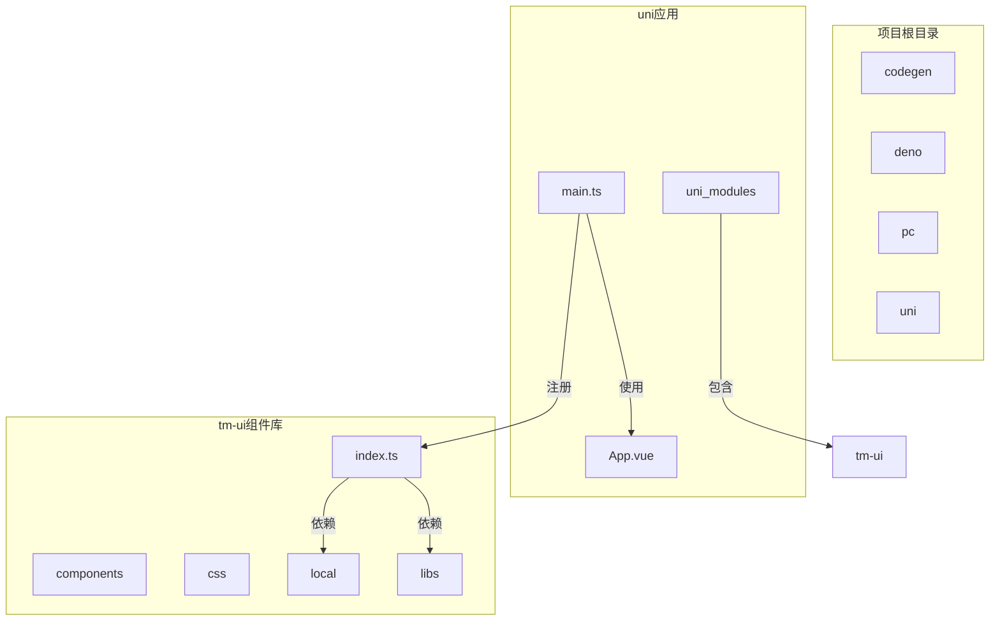
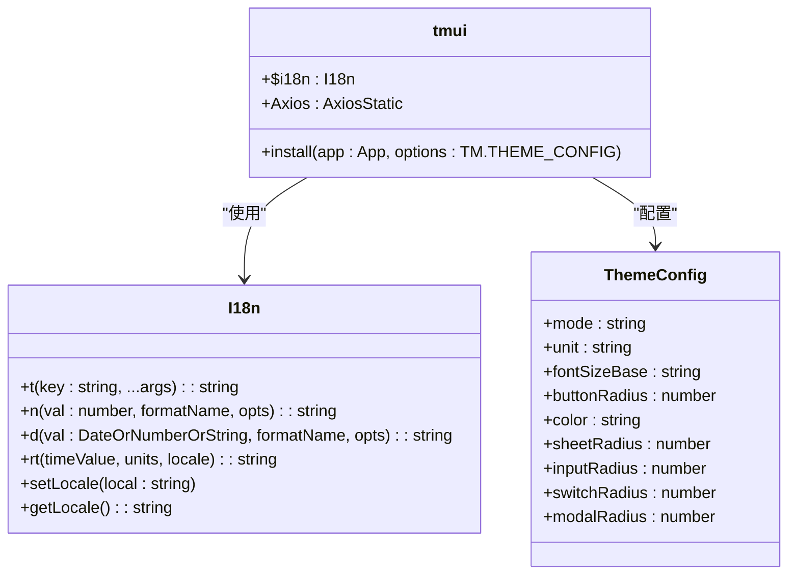
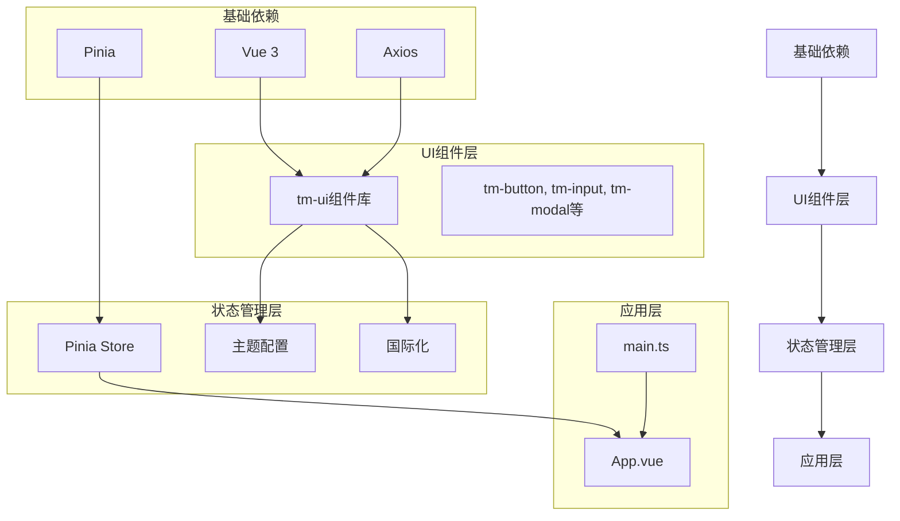
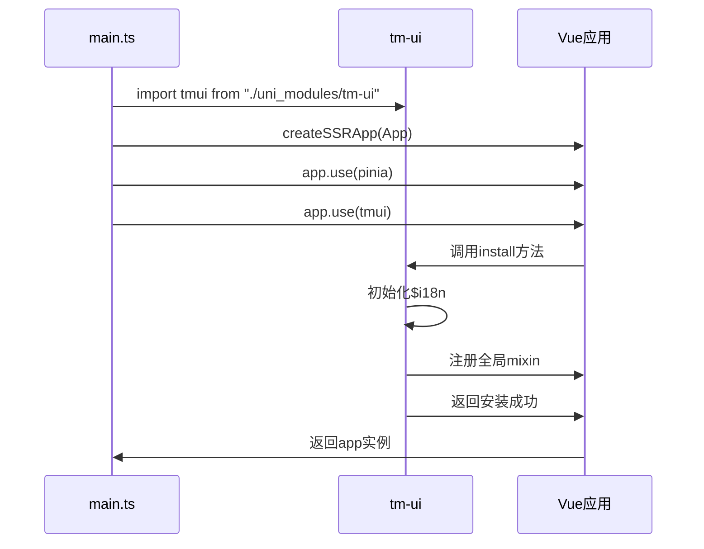
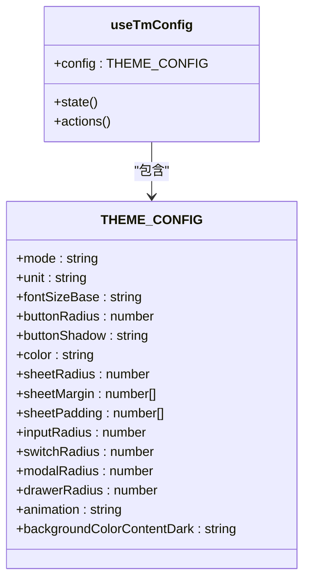
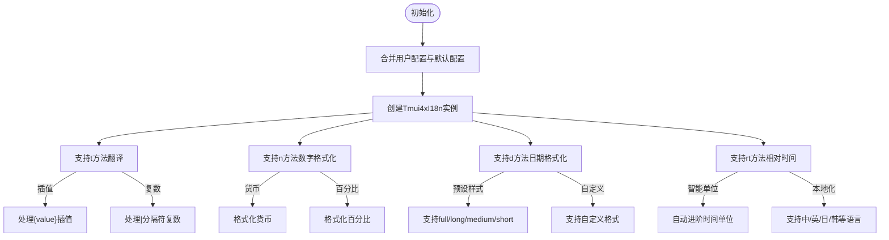
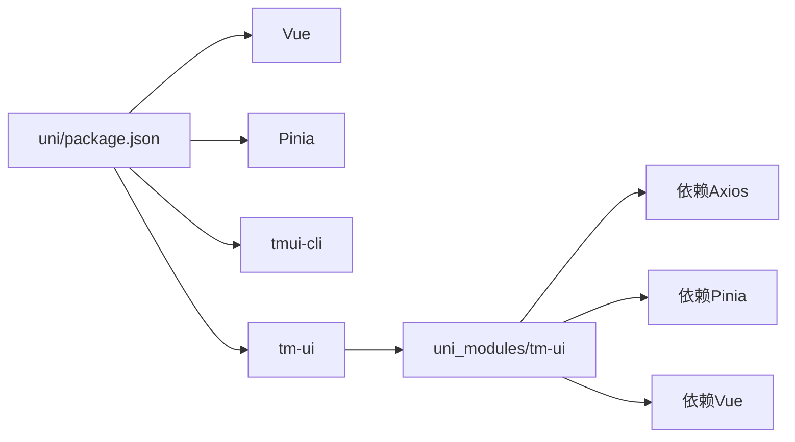

# UI库集成与全局配置

**本文档引用文件**   
- [main.ts](https://github.com/sail-sail/nest/blob/main/uni\src\main.ts)
- [index.ts](https://github.com/sail-sail/nest/blob/main/uni\src\uni_modules\tm-ui\index.ts)
- [package.json](https://github.com/sail-sail/nest/blob/main/uni\package.json)
- [config.ts](https://github.com/sail-sail/nest/blob/main/uni\src\uni_modules\tm-ui\libs\config.ts)
- [i18n.ts](https://github.com/sail-sail/nest/blob/main/uni\src\uni_modules\tm-ui\local\i18n.ts)

## 目录
1. [项目结构](#项目结构)
2. [核心组件分析](#核心组件分析)
3. [架构概览](#架构概览)
4. [详细组件分析](#详细组件分析)
5. [依赖分析](#依赖分析)
6. [性能考量](#性能考量)
7. [故障排除指南](#故障排除指南)

## 项目结构
本项目为基于UniApp的移动端应用，采用模块化设计，主要包含codegen、deno、pc、uni四个核心模块。其中uni目录为移动端UI主应用，集成了tm-ui组件库。项目通过pnpm进行包管理，支持多平台构建（微信小程序、H5、App等）。

**图示来源**
- [main.ts](https://github.com/sail-sail/nest/blob/main/uni\src\main.ts)
- [index.ts](https://github.com/sail-sail/nest/blob/main/uni\src\uni_modules\tm-ui\index.ts)

**本节来源**
- [main.ts](https://github.com/sail-sail/nest/blob/main/uni\src\main.ts)
- [package.json](https://github.com/sail-sail/nest/blob/main/uni\package.json)

## 核心组件分析
tm-ui组件库通过index.ts文件提供统一的安装接口，支持Vue应用的全局注册。组件库内置Pinia状态管理、Axios网络请求、国际化支持等核心功能。

**图示来源**
- [index.ts](https://github.com/sail-sail/nest/blob/main/uni\src\uni_modules\tm-ui\index.ts)
- [config.ts](https://github.com/sail-sail/nest/blob/main/uni\src\uni_modules\tm-ui\libs\config.ts)
- [i18n.ts](https://github.com/sail-sail/nest/blob/main/uni\src\uni_modules\tm-ui\local\i18n.ts)

**本节来源**
- [index.ts](https://github.com/sail-sail/nest/blob/main/uni\src\uni_modules\tm-ui\index.ts)
- [config.ts](https://github.com/sail-sail/nest/blob/main/uni\src\uni_modules\tm-ui\libs\config.ts)

## 架构概览
系统采用分层架构设计，从下至上分别为：基础依赖层、UI组件层、状态管理层、应用层。tm-ui组件库作为UI组件层，提供丰富的移动端UI组件和全局配置能力。

**图示来源**
- [main.ts](https://github.com/sail-sail/nest/blob/main/uni\src\main.ts)
- [index.ts](https://github.com/sail-sail/nest/blob/main/uni\src\uni_modules\tm-ui\index.ts)

## 详细组件分析

### 组件库注册流程
tm-ui组件库通过Vue插件机制进行全局注册，开发者只需在main.ts中调用app.use(tmui)即可完成所有组件的注册。

**图示来源**
- [main.ts](https://github.com/sail-sail/nest/blob/main/uni\src\main.ts)
- [index.ts](https://github.com/sail-sail/nest/blob/main/uni\src\uni_modules\tm-ui\index.ts)

**本节来源**
- [main.ts](https://github.com/sail-sail/nest/blob/main/uni\src\main.ts)
- [index.ts](https://github.com/sail-sail/nest/blob/main/uni\src\uni_modules\tm-ui\index.ts)

### 主题配置分析
tm-ui组件库通过Pinia store实现主题配置的集中管理，支持暗黑模式、尺寸单位、圆角大小等全局样式配置。

**图示来源**
- [config.ts](https://github.com/sail-sail/nest/blob/main/uni\src\uni_modules\tm-ui\libs\config.ts)

**本节来源**
- [config.ts](https://github.com/sail-sail/nest/blob/main/uni\src\uni_modules\tm-ui\libs\config.ts)

### 国际化实现
tm-ui组件库提供完整的国际化支持，包含翻译、数字格式化、日期时间格式化、相对时间计算等功能。

**图示来源**
- [i18n.ts](https://github.com/sail-sail/nest/blob/main/uni\src\uni_modules\tm-ui\local\i18n.ts)

**本节来源**
- [i18n.ts](https://github.com/sail-sail/nest/blob/main/uni\src\uni_modules\tm-ui\local\i18n.ts)

## 依赖分析
项目依赖管理清晰，通过package.json明确声明了所有依赖项。tm-ui组件库作为uni_modules模块被主应用引用，实现了组件的独立管理和版本控制。

**图示来源**
- [package.json](https://github.com/sail-sail/nest/blob/main/uni\package.json)

**本节来源**
- [package.json](https://github.com/sail-sail/nest/blob/main/uni\package.json)

## 性能考量
tm-ui组件库在设计时充分考虑了性能优化：
1. 采用按需加载机制，避免不必要的组件加载
2. 国际化配置使用单例模式，减少内存占用
3. 主题配置通过Pinia store集中管理，避免重复计算
4. 组件库支持tree-shaking，可有效减少打包体积

## 故障排除指南
### 组件无法显示
**问题**：引入tm-ui组件后页面无显示  
**解决方案**：
1. 检查main.ts中是否正确注册了tmui插件
2. 确认uni_modules目录下存在tm-ui文件夹
3. 检查组件名称是否正确（如tm-button、tm-input）

### 国际化失效
**问题**：t方法无法正确翻译文本  
**解决方案**：
1. 检查是否在main.ts中正确引入并注册了tmui
2. 确认messages对象中包含对应语言的翻译键值
3. 检查locale设置是否正确

### 主题配置不生效
**问题**：修改主题配置后样式无变化  
**解决方案**：
1. 确保在app.use(tmui)时传入正确的配置对象
2. 检查Pinia store中useTmConfig是否正确更新
3. 确认组件是否正确读取了主题配置

**本节来源**
- [main.ts](https://github.com/sail-sail/nest/blob/main/uni\src\main.ts)
- [index.ts](https://github.com/sail-sail/nest/blob/main/uni\src\uni_modules\tm-ui\index.ts)
- [config.ts](https://github.com/sail-sail/nest/blob/main/uni\src\uni_modules\tm-ui\libs\config.ts)