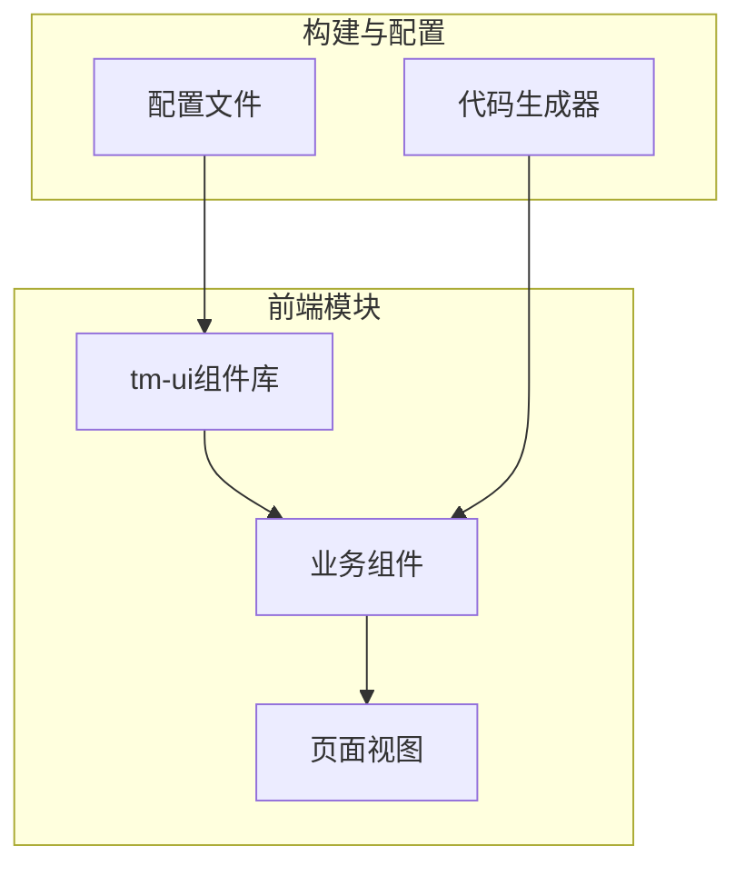
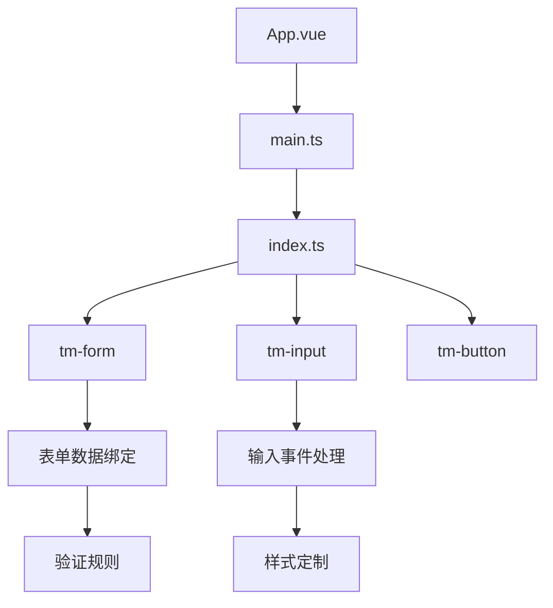
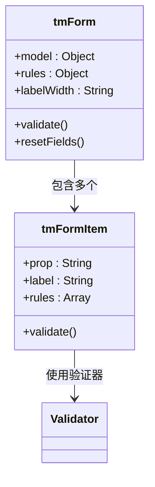
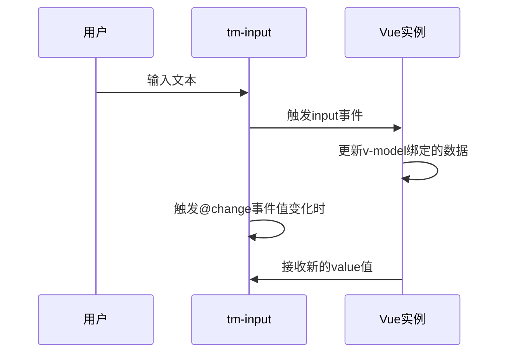
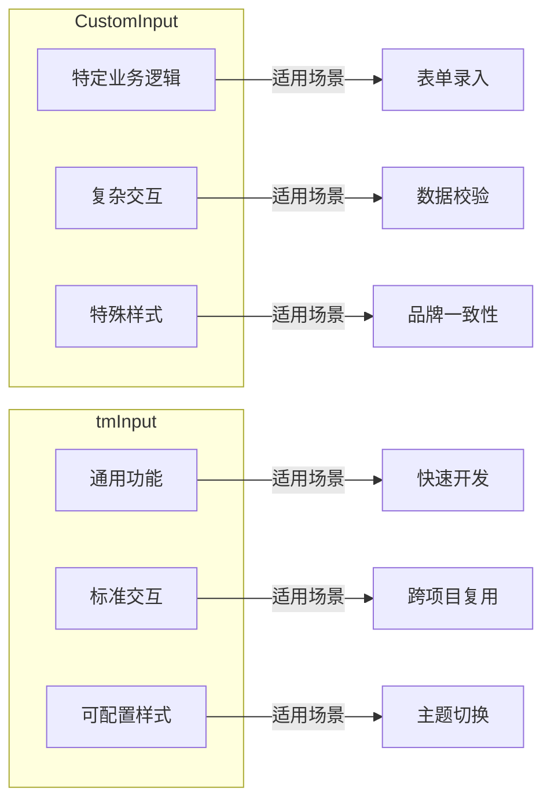
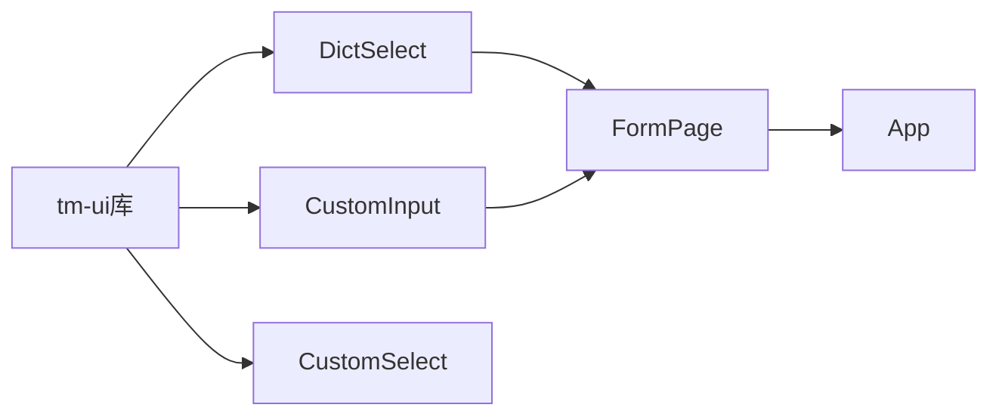

# 组件体系与UI库集成


**本文档引用文件**  
- [index.ts](https://github.com/sail-sail/nest/blob/main/uni/src/uni_modules/tm-ui/index.ts#L1-L20)
- [tm-form.vue](https://github.com/sail-sail/nest/blob/main/uni/src/uni_modules/tm-ui/components/tm-form/tm-form.vue#L1-L200)
- [tm-input.vue](https://github.com/sail-sail/nest/blob/main/uni/src/uni_modules/tm-ui/components/tm-input/tm-input.vue#L1-L150)
- [DictSelect.vue](https://github.com/sail-sail/nest/blob/main/pc/src/components/DictSelect.vue#L1-L100)
- [CustomInput.vue](https://github.com/sail-sail/nest/blob/main/pc/src/components/CustomInput.vue#L1-L120)
- [main.ts](https://github.com/sail-sail/nest/blob/main/uni/src/main.ts#L1-L30)
- [App.vue](https://github.com/sail-sail/nest/blob/main/uni/src/App.vue#L1-L50)


## 目录
1. [简介](#简介)
2. [项目结构](#项目结构)
3. [核心组件](#核心组件)
4. [架构概览](#架构概览)
5. [详细组件分析](#详细组件分析)
6. [依赖关系分析](#依赖关系分析)
7. [性能考量](#性能考量)
8. [故障排除指南](#故障排除指南)
9. [结论](#结论)

## 简介
本文档全面介绍基于 `tm-ui` 的移动端组件体系集成与使用方法。重点阐述如何通过全局注册机制实现组件的按需引入与自动导入，深入解析表单组件的数据绑定与验证机制，并结合实际案例展示下拉选择器、输入框等常用组件的配置与定制方式。同时对比分析自定义组件与原生组件的设计差异，提供组件组合使用的最佳实践。

## 项目结构
项目采用模块化分层架构，主要分为四个顶层目录：`codegen`（代码生成工具）、`deno`（后端服务）、`pc`（PC端前端）和 `uni`（移动端前端）。其中 `uni` 目录下的 `uni_modules/tm-ui` 是本次文档的核心，包含完整的移动端UI组件库。



**图示来源**
- [project_structure](https://github.com/sail-sail/nest/blob/main/#L1-L200)

**本节来源**
- [project_structure](https://github.com/sail-sail/nest/blob/main/#L1-L200)

## 核心组件
`tm-ui` 提供了一套完整的移动端UI组件，包括按钮、输入框、表单、选择器、弹窗等。这些组件基于 Vue 3 和 TypeScript 构建，支持按需引入和全局注册两种使用方式。核心入口文件为 `index.ts`，负责导出所有组件并提供安装方法。

**本节来源**
- [index.ts](https://github.com/sail-sail/nest/blob/main/uni/src/uni_modules/tm-ui/index.ts#L1-L20)

## 架构概览
整个组件体系采用分层设计，上层为业务组件（如 `DictSelect`、`CustomInput`），底层为 `tm-ui` 原生组件（如 `tm-form`、`tm-input`）。通过 `main.ts` 中的 `app.use()` 实现全局注册，支持在任意页面中直接使用组件标签。



**图示来源**
- [main.ts](https://github.com/sail-sail/nest/blob/main/uni/src/main.ts#L1-L30)
- [index.ts](https://github.com/sail-sail/nest/blob/main/uni/src/uni_modules/tm-ui/index.ts#L1-L20)

## 详细组件分析

### tm-form 表单组件分析
`tm-form` 是一个功能强大的表单容器组件，支持双向数据绑定和灵活的验证规则配置。它通过 `v-model` 与表单数据对象进行绑定，并利用 `tm-form-item` 定义每个字段的验证逻辑。



**图示来源**
- [tm-form.vue](https://github.com/sail-sail/nest/blob/main/uni/src/uni_modules/tm-ui/components/tm-form/tm-form.vue#L1-L200)

**本节来源**
- [tm-form.vue](https://github.com/sail-sail/nest/blob/main/uni/src/uni_modules/tm-ui/components/tm-form/tm-form.vue#L1-L200)

### tm-input 输入框组件分析
`tm-input` 组件提供丰富的属性配置选项，支持文本、密码、数字等多种类型输入。可通过 `v-model` 实现数据绑定，监听 `@change`、`@input` 等事件进行交互处理，并支持通过 `class` 和 `style` 进行样式定制。



**图示来源**
- [tm-input.vue](https://github.com/sail-sail/nest/blob/main/uni/src/uni_modules/tm-ui/components/tm-input/tm-input.vue#L1-L150)

**本节来源**
- [tm-input.vue](https://github.com/sail-sail/nest/blob/main/uni/src/uni_modules/tm-ui/components/tm-input/tm-input.vue#L1-L150)

### DictSelect 下拉选择器应用案例
`DictSelect` 是基于 `tm-ui` 封装的业务组件，用于从字典数据中选择值。它通过 API 获取字典项，并将结果绑定到表单字段中，常用于性别、状态等固定选项的选择。

```mermaid
flowchart TD
A[DictSelect组件] --> B[调用Api.getDictList]
B --> C{请求成功?}
C --> |是| D[设置options数据]
C --> |否| E[显示错误提示]
D --> F[渲染下拉菜单]
F --> G[用户选择]
G --> H[触发@change事件]
H --> I[更新绑定值]
```

**图示来源**
- [DictSelect.vue](https://github.com/sail-sail/nest/blob/main/pc/src/components/DictSelect.vue#L1-L100)

**本节来源**
- [DictSelect.vue](https://github.com/sail-sail/nest/blob/main/pc/src/components/DictSelect.vue#L1-L100)

### 自定义组件 vs 原生组件
对比 `CustomInput` 与 `tm-input` 的设计差异：



**图示来源**
- [CustomInput.vue](https://github.com/sail-sail/nest/blob/main/pc/src/components/CustomInput.vue#L1-L120)
- [tm-input.vue](https://github.com/sail-sail/nest/blob/main/uni/src/uni_modules/tm-ui/components/tm-input/tm-input.vue#L1-L150)

**本节来源**
- [CustomInput.vue](https://github.com/sail-sail/nest/blob/main/pc/src/components/CustomInput.vue#L1-L120)
- [tm-input.vue](https://github.com/sail-sail/nest/blob/main/uni/src/uni_modules/tm-ui/components/tm-input/tm-input.vue#L1-L150)

## 依赖关系分析
组件间的依赖关系清晰，遵循单一职责原则。`tm-ui` 作为基础UI库被上层业务组件依赖，而业务组件之间通过事件和属性进行通信，避免了直接的模块耦合。



**图示来源**
- [package.json](https://github.com/sail-sail/nest/blob/main/uni/package.json#L1-L20)
- [index.ts](https://github.com/sail-sail/nest/blob/main/uni/src/uni_modules/tm-ui/index.ts#L1-L20)

**本节来源**
- [package.json](https://github.com/sail-sail/nest/blob/main/uni/package.json#L1-L20)

## 性能考量
- **按需引入**：通过 `index.ts` 的导出机制，支持只引入需要的组件，减少打包体积
- **虚拟滚动**：对于大型列表，建议结合 `tm-list` 使用虚拟滚动优化渲染性能
- **事件防抖**：在输入类组件中合理使用防抖，避免频繁触发搜索等操作
- **懒加载**：对于非首屏组件，可采用动态导入实现懒加载

## 故障排除指南
常见问题及解决方案：

1. **组件未注册**：确保在 `main.ts` 中正确调用 `app.use(tmUI)`
2. **样式丢失**：检查是否引入了 `tmui.scss` 样式文件
3. **数据不更新**：确认 `v-model` 绑定的对象属性是响应式的
4. **验证不触发**：检查 `rules` 配置格式是否正确，`prop` 是否与 `model` 字段匹配

**本节来源**
- [main.ts](https://github.com/sail-sail/nest/blob/main/uni/src/main.ts#L1-L30)
- [App.vue](https://github.com/sail-sail/nest/blob/main/uni/src/App.vue#L1-L50)

## 结论
`tm-ui` 组件库为移动端开发提供了高效、一致的UI解决方案。通过合理的全局注册机制和按需引入策略，既能保证开发效率，又能控制应用体积。结合业务需求封装的自定义组件与原生组件相辅相成，形成了完整的组件体系。建议在项目中统一使用该组件库，确保用户体验的一致性。