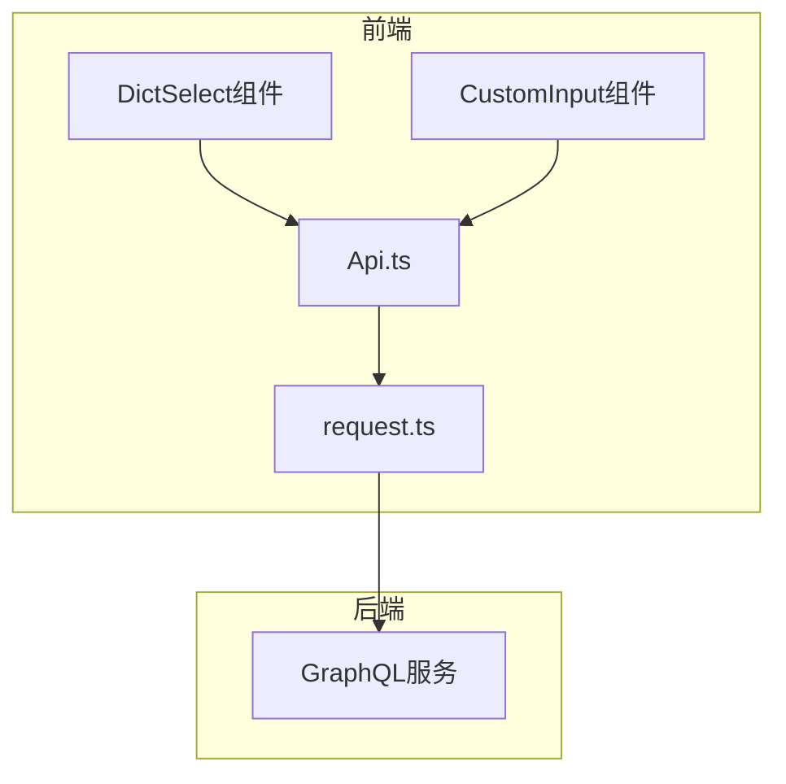
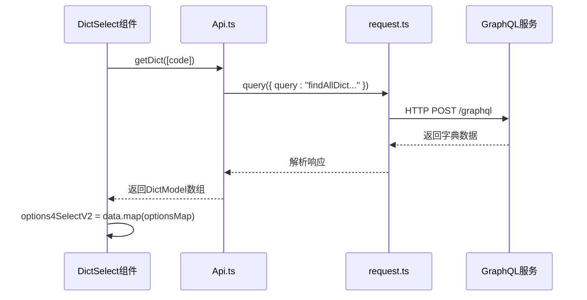
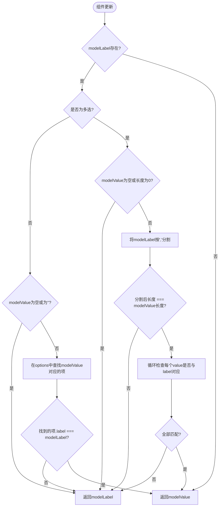
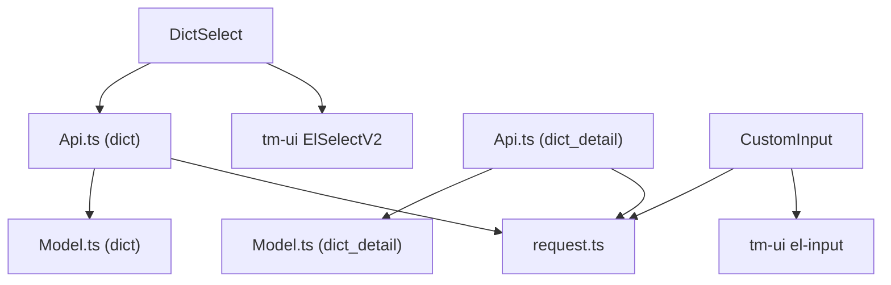

# 自定义组件设计与扩展

**本文档引用文件**  
- [DictSelect.vue](https://github.com/sail-sail/nest/blob/main/pc/src/components/DictSelect.vue)
- [CustomInput.vue](https://github.com/sail-sail/nest/blob/main/pc/src/components/CustomInput.vue)
- [Api.ts](https://github.com/sail-sail/nest/blob/main/pc/src/views/base/dict/Api.ts)
- [Api.ts](https://github.com/sail-sail/nest/blob/main/pc/src/views/base/dict_detail/Api.ts)
- [Model.ts](https://github.com/sail-sail/nest/blob/main/pc/src/views/base/dict/Model.ts)
- [Model.ts](https://github.com/sail-sail/nest/blob/main/pc/src/views/base/dict_detail/Model.ts)
- [request.ts](https://github.com/sail-sail/nest/blob/main/pc/src/utils/request.ts)

## 目录
1. [引言](#引言)
2. [项目结构](#项目结构)
3. [核心组件](#核心组件)
4. [架构概览](#架构概览)
5. [详细组件分析](#详细组件分析)
6. [依赖分析](#依赖分析)
7. [性能考量](#性能考量)
8. [故障排除指南](#故障排除指南)
9. [结论](#结论)

## 引言
本文档旨在阐述移动端自定义组件的设计原则与实现方法，重点分析 `DictSelect` 和 `CustomInput` 两个组件。这两个组件基于 `tm-ui` 基础组件库进行功能扩展，封装了复杂的业务逻辑和交互细节，为开发者提供了更高级、更易用的抽象。文档将深入探讨其 `props` 设计、事件通信、插槽使用和样式隔离等最佳实践。

## 项目结构
项目采用典型的前后端分离架构，前端部分包含 PC 端（`pc`）和移动端（`uni`）两个应用。自定义组件主要位于 `pc/src/components` 和 `uni/src/components` 目录下。`DictSelect` 和 `CustomInput` 组件在两个平台均有实现，共享核心逻辑。业务数据模型和 API 定义位于 `pc/src/views/base` 目录下的对应模块中。

## 核心组件
`DictSelect` 是一个基于字典数据的下拉选择器，它封装了从后端获取字典数据、渲染选项、处理多选和全选逻辑、以及值与标签映射的复杂过程。`CustomInput` 则是对原生输入框的增强，提供了对只读状态、对齐方式、后缀插槽等特性的统一控制。

**组件来源**
- [DictSelect.vue](https://github.com/sail-sail/nest/blob/main/pc/src/components/DictSelect.vue)
- [CustomInput.vue](https://github.com/sail-sail/nest/blob/main/pc/src/components/CustomInput.vue)

## 架构概览
系统采用 GraphQL 作为数据查询语言，前端通过 `request.ts` 中的 `request` 函数与后端进行通信。`DictSelect` 组件通过调用 `Api.ts` 中的 `getDict` 函数来获取字典数据，该函数内部使用 GraphQL 查询。组件本身遵循 Vue 3 的 Composition API 风格，利用 `ref`、`computed` 和 `watch` 等响应式 API 来管理状态。

**图示来源**
- [DictSelect.vue](https://github.com/sail-sail/nest/blob/main/pc/src/components/DictSelect.vue)
- [CustomInput.vue](https://github.com/sail-sail/nest/blob/main/pc/src/components/CustomInput.vue)
- [Api.ts](https://github.com/sail-sail/nest/blob/main/pc/src/views/base/dict/Api.ts)
- [request.ts](https://github.com/sail-sail/nest/blob/main/pc/src/utils/request.ts)

## 详细组件分析

### DictSelect 组件分析
`DictSelect` 组件的核心功能是将一个简单的 `code` 属性映射为一个完整的下拉选项列表。

#### Props 设计
组件通过 `props` 接收外部配置，设计合理且具有良好的默认值。
- `code`: (必需) 字典编码，用于标识要加载的字典类型。
- `modelValue`: (v-model) 绑定的选中值。
- `modelLabel`: (可选) 用于在 `readonly` 模式下显示的标签。
- `multiple`: (可选) 是否为多选模式。
- `readonly`: (可选) 是否为只读模式。
- `optionsMap`: (可选) 自定义选项映射函数，将数据模型转换为 `ElSelectV2` 所需的 `OptionType`。

**组件来源**
- [DictSelect.vue](https://github.com/sail-sail/nest/blob/main/pc/src/components/DictSelect.vue)

#### 数据请求与渲染
组件在 `onRefresh` 函数中通过 `getDict([props.code])` 发起数据请求。请求成功后，将返回的 `DictModel` 数组通过 `props.optionsMap` 映射为 `options4SelectV2`，并赋值给 `ElSelectV2` 组件的 `options` 属性。

**图示来源**
- [DictSelect.vue](https://github.com/sail-sail/nest/blob/main/pc/src/components/DictSelect.vue)
- [Api.ts](https://github.com/sail-sail/nest/blob/main/pc/src/views/base/dict/Api.ts)
- [request.ts](https://github.com/sail-sail/nest/blob/main/pc/src/utils/request.ts)

#### 值与标签映射
组件通过 `modelValueComputed` 和 `modelLabels` 两个计算属性来处理值与标签的映射关系。
- `modelLabels`: 根据当前的 `modelValue` 和 `options4SelectV2`，查找并返回对应的标签数组。
- `modelValueComputed`: 这是一个关键的计算属性，它处理了 `modelValue` 和 `modelLabel` 不一致的情况。当 `modelLabel` 存在且与 `modelValue` 对应的标签不匹配时，它会返回 `modelLabel`，从而在界面上显示正确的标签，即使 `modelValue` 尚未更新。这确保了在异步数据加载完成前，组件能正确显示预设的标签。

**图示来源**
- [DictSelect.vue](https://github.com/sail-sail/nest/blob/main/pc/src/components/DictSelect.vue)

#### 事件通信
组件通过 `emit` 向父组件传递事件。
- `update:modelValue`: 当选中值发生变化时触发。
- `update:modelLabel`: 当选中值变化时，同步更新标签。
- `change`: 当选中值变化时触发，传递的是完整的数据模型（`DictModel` 或 `DictModel[]`），方便父组件获取更多元数据。
- `clear`: 当用户清空选择时触发。
- `data`: 在数据加载完成后触发，传递完整的字典数据数组。

#### 插槽与样式
组件使用 `<slot>` 元素支持内容分发，允许用户自定义下拉列表的头部（`#header`）和尾部（`#footer`），例如实现“全选”复选框和“新增选项”按钮。样式通过 `scoped` 属性进行隔离，并使用 `:deep()` 选择器来穿透作用域，修改 `ElSelectV2` 内部元素的样式。

### CustomInput 组件分析
`CustomInput` 组件提供了一个统一的输入框接口，简化了对原生 `el-input` 的配置。

#### Props 设计
- `modelValue`: (v-model) 绑定的输入值。
- `type`: 输入框类型（如 text, password, textarea）。
- `align`: 文本对齐方式（left, center, right）。
- `readonly`: 是否为只读模式。
- `isReadonlyBorder`: 只读模式下是否显示边框。

#### 只读模式实现
当 `readonly` 为 `true` 时，组件会切换到一个自定义的只读视图，使用 `div` 和 `span` 元素来显示文本，而不是可编辑的输入框。这提供了更灵活的样式控制，避免了原生 `readonly` 输入框的样式限制。

#### 事件与方法
组件同样通过 `emit` 传递 `update:modelValue`、`change` 和 `clear` 事件。此外，通过 `defineExpose` 暴露了 `focus` 和 `blur` 方法，允许父组件直接调用原生输入框的聚焦和失焦方法。

**组件来源**
- [CustomInput.vue](https://github.com/sail-sail/nest/blob/main/pc/src/components/CustomInput.vue)

## 依赖分析
`DictSelect` 组件依赖于 `tm-ui` 的 `ElSelectV2` 组件作为基础UI，并依赖 `pc/src/views/base/dict/Api.ts` 和 `pc/src/views/base/dict_detail/Api.ts` 来获取字典数据。`CustomInput` 组件则依赖 `tm-ui` 的 `el-input` 组件。两个组件都间接依赖于 `request.ts` 进行网络请求。

**图示来源**
- [DictSelect.vue](https://github.com/sail-sail/nest/blob/main/pc/src/components/DictSelect.vue)
- [CustomInput.vue](https://github.com/sail-sail/nest/blob/main/pc/src/components/CustomInput.vue)
- [Api.ts](https://github.com/sail-sail/nest/blob/main/pc/src/views/base/dict/Api.ts)
- [Api.ts](https://github.com/sail-sail/nest/blob/main/pc/src/views/base/dict_detail/Api.ts)
- [request.ts](https://github.com/sail-sail/nest/blob/main/pc/src/utils/request.ts)

## 性能考量
`DictSelect` 组件在数据加载完成后，会动态计算下拉菜单的宽度以适应最长的选项文本，这通过 `refreshDropdownWidth` 函数实现。该函数在下拉框可见时执行，避免了不必要的计算。对于 `CustomInput`，当类型为 `textarea` 时，使用 `useResizeObserver` 来监听输入框高度的变化，确保只读模式下的内容区域高度与可编辑模式保持一致。

## 故障排除指南
- **问题：`DictSelect` 下拉框为空**
  - 检查 `code` 属性是否正确传递。
  - 检查 `getDict` 函数的网络请求是否成功，确认后端服务正常。
  - 确认字典数据在数据库中存在且已启用。
- **问题：`CustomInput` 在只读模式下样式异常**
  - 检查 `isReadonlyBorder` 属性的设置。
  - 确认 `align` 属性的值是否正确。

**组件来源**
- [DictSelect.vue](https://github.com/sail-sail/nest/blob/main/pc/src/components/DictSelect.vue)
- [CustomInput.vue](https://github.com/sail-sail/nest/blob/main/pc/src/components/CustomInput.vue)

## 结论
`DictSelect` 和 `CustomInput` 组件是基于基础 UI 库进行功能扩展的优秀范例。它们通过封装复杂的业务逻辑（如数据请求、值映射）和提供统一的接口（`props`、`events`），极大地提升了开发效率和代码的可维护性。其设计遵循了高内聚、低耦合的原则，是创建可复用自定义组件的良好实践。