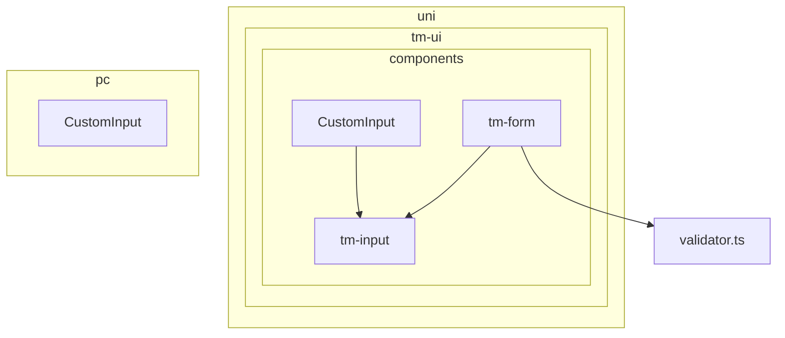
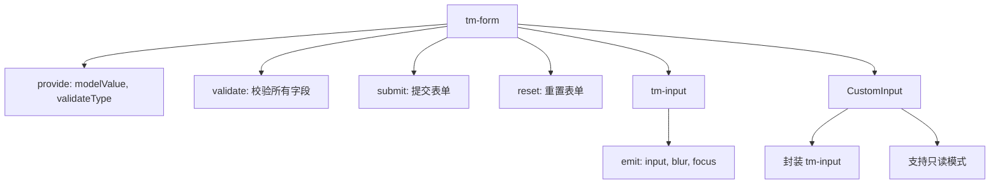
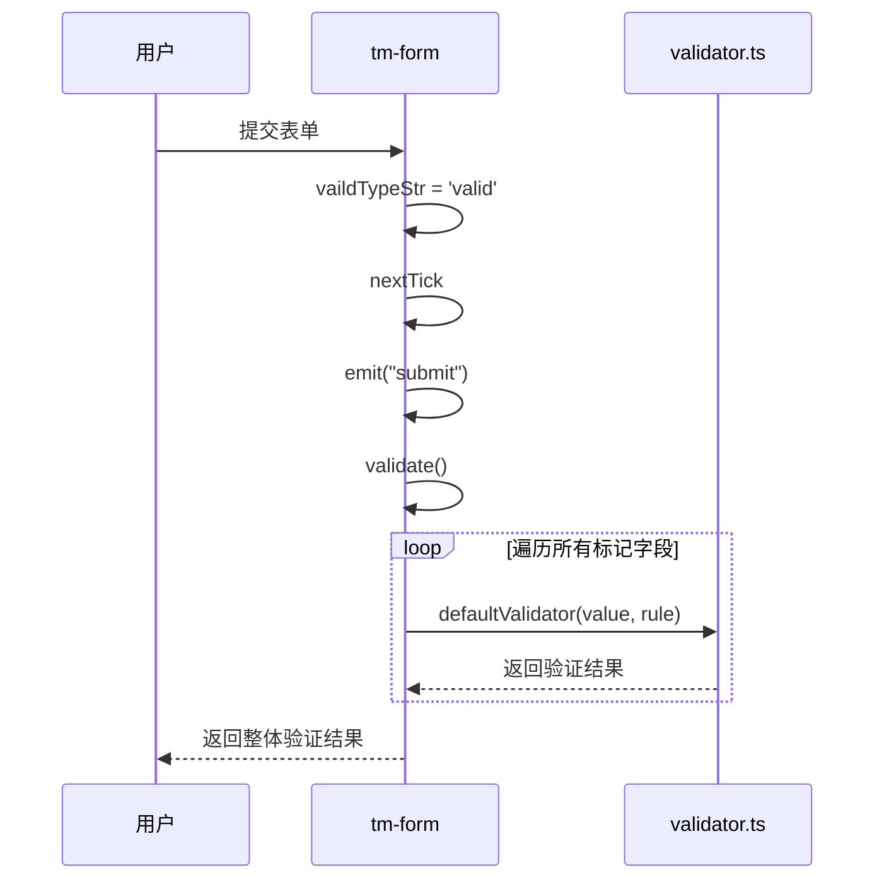
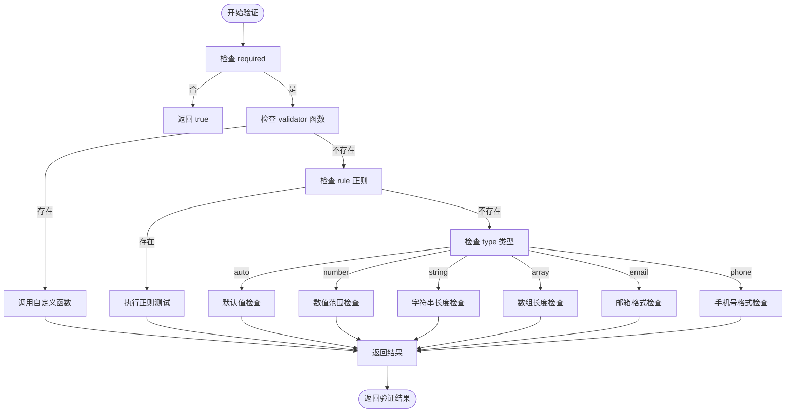
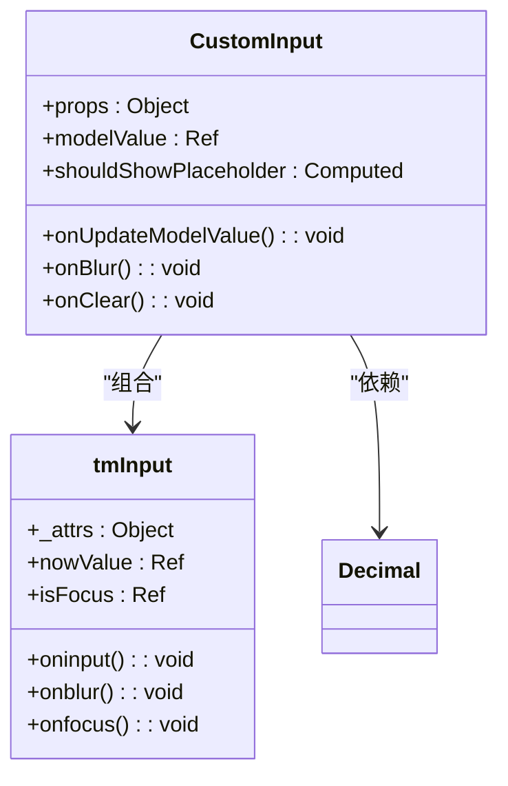
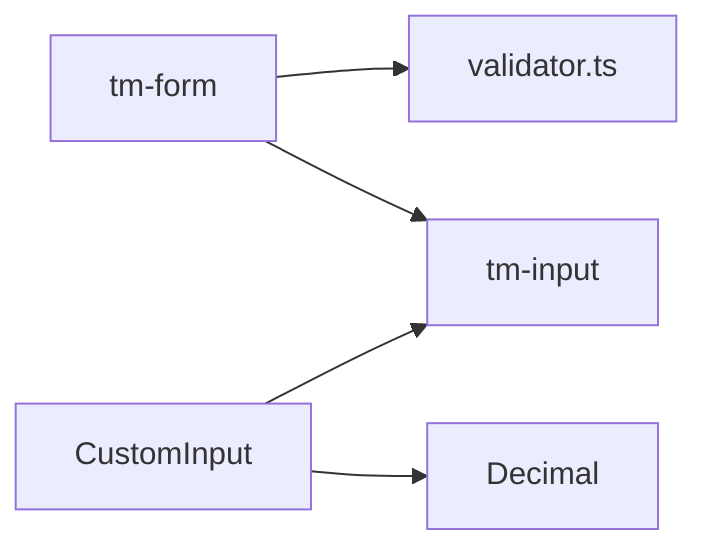

# 表单组件体系与数据交互

**本文档引用文件**  
- [tm-form.vue](https://github.com/sail-sail/nest/blob/main/uni/src/uni_modules/tm-ui/components/tm-form/tm-form.vue)
- [tm-input.vue](https://github.com/sail-sail/nest/blob/main/uni/src/uni_modules/tm-ui/components/tm-input/tm-input.vue)
- [validator.ts](https://github.com/sail-sail/nest/blob/main/uni/src/uni_modules/tm-ui/components/tm-form/validator.ts)
- [CustomInput.vue](https://github.com/sail-sail/nest/blob/main/pc/src/components/CustomInput.vue)
- [CustomInput.vue](https://github.com/sail-sail/nest/blob/main/uni/src/components/CustomInput/CustomInput.vue)

## 目录
1. [简介](#简介)
2. [项目结构](#项目结构)
3. [核心组件](#核心组件)
4. [架构概览](#架构概览)
5. [详细组件分析](#详细组件分析)
6. [依赖分析](#依赖分析)
7. [性能考量](#性能考量)
8. [故障排除指南](#故障排除指南)
9. [结论](#结论)

## 简介
本文档深入解析移动端表单组件体系，重点分析 `tm-form` 与 `tm-input` 的实现机制。涵盖表单验证规则配置、错误提示机制、提交流程控制，以及 `validator.ts` 中验证逻辑的实现方式。同时对比 `tm-input` 原生组件与 `CustomInput` 自定义组件在属性传递、事件处理和样式控制方面的差异，并提供表单数据双向绑定、动态字段渲染和复杂表单布局的最佳实践。

## 项目结构
项目采用模块化结构，主要分为 `codegen`、`deno`、`pc` 和 `uni` 四个模块。其中 `uni` 模块包含移动端核心组件，位于 `uni/src/uni_modules/tm-ui/components` 目录下，主要包括 `tm-form`、`tm-input` 等表单相关组件。

**图示来源**
- [tm-form.vue](https://github.com/sail-sail/nest/blob/main/uni/src/uni_modules/tm-ui/components/tm-form/tm-form.vue)
- [tm-input.vue](https://github.com/sail-sail/nest/blob/main/uni/src/uni_modules/tm-ui/components/tm-input/tm-input.vue)
- [CustomInput.vue](https://github.com/sail-sail/nest/blob/main/uni/src/components/CustomInput/CustomInput.vue)

**本节来源**
- [tm-form.vue](https://github.com/sail-sail/nest/blob/main/uni/src/uni_modules/tm-ui/components/tm-form/tm-form.vue)
- [tm-input.vue](https://github.com/sail-sail/nest/blob/main/uni/src/uni_modules/tm-ui/components/tm-input/tm-input.vue)

## 核心组件
核心组件包括 `tm-form`、`tm-input` 和 `CustomInput`。`tm-form` 负责表单整体管理与验证，`tm-input` 提供基础输入功能，`CustomInput` 则是基于 `tm-input` 的封装，增加只读模式等特性。

**本节来源**
- [tm-form.vue](https://github.com/sail-sail/nest/blob/main/uni/src/uni_modules/tm-ui/components/tm-form/tm-form.vue)
- [tm-input.vue](https://github.com/sail-sail/nest/blob/main/uni/src/uni_modules/tm-ui/components/tm-input/tm-input.vue)
- [CustomInput.vue](https://github.com/sail-sail/nest/blob/main/uni/src/components/CustomInput/CustomInput.vue)

## 架构概览
系统采用分层架构，`tm-form` 作为容器组件，通过 `provide/inject` 向下传递表单状态和验证方法。`tm-input` 作为原子组件，处理用户输入并触发事件。`CustomInput` 在其基础上扩展功能，适配不同平台需求。

**图示来源**
- [tm-form.vue](https://github.com/sail-sail/nest/blob/main/uni/src/uni_modules/tm-ui/components/tm-form/tm-form.vue)
- [tm-input.vue](https://github.com/sail-sail/nest/blob/main/uni/src/uni_modules/tm-ui/components/tm-input/tm-input.vue)
- [CustomInput.vue](https://github.com/sail-sail/nest/blob/main/uni/src/components/CustomInput/CustomInput.vue)

## 详细组件分析

### tm-form 组件分析
`tm-form` 组件负责管理整个表单的验证流程。其核心功能包括：

- **表单验证规则配置**：通过 `rules` 属性统一配置所有字段的验证规则，支持嵌套对象（使用点号连接）。
- **错误提示机制**：通过 `provide` 向子组件传递验证状态，子组件根据状态显示错误信息。
- **提交流程控制**：调用 `submit()` 方法触发验证，并通过 `emit("submit")` 返回验证结果。

**图示来源**
- [tm-form.vue](https://github.com/sail-sail/nest/blob/main/uni/src/uni_modules/tm-ui/components/tm-form/tm-form.vue#L150-L180)
- [validator.ts](https://github.com/sail-sail/nest/blob/main/uni/src/uni_modules/tm-ui/components/tm-form/validator.ts#L1-L87)

#### 验证逻辑实现
`validator.ts` 文件中的 `defaultValidator` 函数是验证的核心。它根据规则类型（`type`）执行不同的验证逻辑：

- `required`: 检查值是否为空。
- `type`: 支持 `number`、`string`、`array`、`date`、`phone`、`email` 等类型校验。
- `min/max`: 检查数值、字符串长度或数组长度。
- `validator`: 支持自定义验证函数。
- `rule`: 支持正则表达式校验。

**图示来源**
- [validator.ts](https://github.com/sail-sail/nest/blob/main/uni/src/uni_modules/tm-ui/components/tm-form/validator.ts#L1-L87)

**本节来源**
- [tm-form.vue](https://github.com/sail-sail/nest/blob/main/uni/src/uni_modules/tm-ui/components/tm-form/tm-form.vue)
- [validator.ts](https://github.com/sail-sail/nest/blob/main/uni/src/uni_modules/tm-ui/components/tm-form/validator.ts)

### tm-input 与 CustomInput 组件对比分析
`tm-input` 是基础输入组件，`CustomInput` 是其在不同平台的封装。

#### 属性传递
- `tm-input`：通过 `_attrs` 计算属性接收所有属性，支持丰富的输入类型（`text`, `number`, `textarea` 等）。
- `CustomInput`：通过 `props` 明确定义所需属性，并将未定义的属性通过 `v-bind="$attrs"` 传递给内部的 `tm-input` 或 `el-input`。

#### 事件处理
- `tm-input`：直接监听原生 `input`、`blur`、`focus` 等事件，并通过 `emits` 触发自定义事件。
- `CustomInput`：在 `tm-input` 事件基础上，增加 `onChange`、`onClear` 等处理逻辑，并支持 `Decimal` 类型的精度控制。

#### 样式控制
- `tm-input`：使用内联样式和计算属性动态控制颜色、字体、圆角等。
- `CustomInput`：通过 `un-*` 工具类和 `:deep()` 选择器控制样式，并支持只读模式下的不同外观。

**图示来源**
- [tm-input.vue](https://github.com/sail-sail/nest/blob/main/uni/src/uni_modules/tm-ui/components/tm-input/tm-input.vue)
- [CustomInput.vue](https://github.com/sail-sail/nest/blob/main/uni/src/components/CustomInput/CustomInput.vue)

**本节来源**
- [tm-input.vue](https://github.com/sail-sail/nest/blob/main/uni/src/uni_modules/tm-ui/components/tm-input/tm-input.vue)
- [CustomInput.vue](https://github.com/sail-sail/nest/blob/main/pc/src/components/CustomInput.vue)
- [CustomInput.vue](https://github.com/sail-sail/nest/blob/main/uni/src/components/CustomInput/CustomInput.vue)

## 依赖分析
组件间依赖关系清晰，`tm-form` 依赖 `validator.ts` 进行验证，`CustomInput` 依赖 `tm-input` 实现基础功能。`provide/inject` 机制降低了组件间的耦合度。

**图示来源**
- [tm-form.vue](https://github.com/sail-sail/nest/blob/main/uni/src/uni_modules/tm-ui/components/tm-form/tm-form.vue)
- [CustomInput.vue](https://github.com/sail-sail/nest/blob/main/uni/src/components/CustomInput/CustomInput.vue)

**本节来源**
- [tm-form.vue](https://github.com/sail-sail/nest/blob/main/uni/src/uni_modules/tm-ui/components/tm-form/tm-form.vue)
- [CustomInput.vue](https://github.com/sail-sail/nest/blob/main/uni/src/components/CustomInput/CustomInput.vue)

## 性能考量
- **避免重复计算**：`tm-form` 中使用 `computed` 缓存验证规则，减少重复计算。
- **合理使用 watch**：`CustomInput` 中使用 `watch` 同步 `props` 和 `modelValue`，避免不必要的更新。
- **虚拟滚动**：对于长列表表单，建议使用虚拟滚动技术提升性能。

## 故障排除指南
- **表单不触发验证**：检查字段是否被正确标记（`_setMarker`），确保 `name` 属性与 `rules` 中的键名匹配。
- **输入框样式异常**：检查 `uni` 平台的 `styleIsolation` 配置，确保样式隔离正确。
- **只读模式显示异常**：确认 `readonly` 属性正确传递，且 `readonlyPlaceholder` 有值。

**本节来源**
- [tm-form.vue](https://github.com/sail-sail/nest/blob/main/uni/src/uni_modules/tm-ui/components/tm-form/tm-form.vue#L200-L210)
- [CustomInput.vue](https://github.com/sail-sail/nest/blob/main/uni/src/components/CustomInput/CustomInput.vue#L50-L60)

## 结论
`tm-form` 与 `tm-input` 组件体系设计合理，验证机制灵活高效。`CustomInput` 的封装提升了组件的复用性和可维护性。建议在复杂表单场景中充分利用 `provide/inject` 和计算属性优化性能。