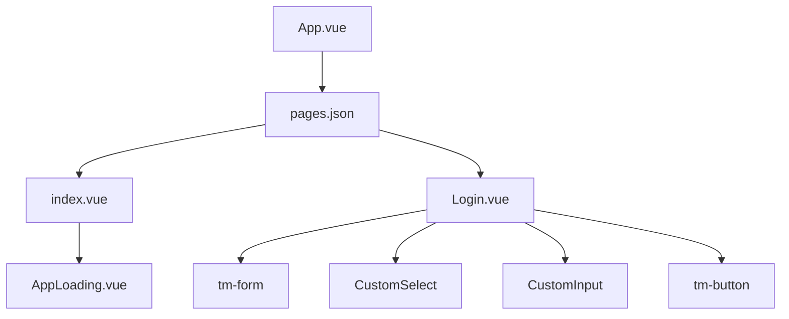

# 页面结构设计


**本文档引用文件**   
- [pages.json](https://github.com/sail-sail/nest/blob/main/uni/src/pages.json)
- [App.vue](https://github.com/sail-sail/nest/blob/main/uni/src/App.vue)
- [index.vue](https://github.com/sail-sail/nest/blob/main/uni/src/pages/index/index.vue)
- [Login.vue](https://github.com/sail-sail/nest/blob/main/uni/src/pages/index/Login.vue)
- [Api.ts](https://github.com/sail-sail/nest/blob/main/uni/src/pages/index/Api.ts)


## 目录
1. [项目结构](#项目结构)
2. [页面路由与窗口配置](#页面路由与窗口配置)
3. [根组件App.vue分析](#根组件appvue分析)
4. [首页index.vue结构解析](#首页indexvue结构解析)
5. [登录页Login.vue详解](#登录页loginvue详解)
6. [表单验证与登录逻辑](#表单验证与登录逻辑)
7. [页面跳转与参数传递](#页面跳转与参数传递)
8. [组件自动注册机制](#组件自动注册机制)

## 项目结构

本项目基于Uni-app框架构建移动端应用，采用模块化组织方式。核心页面位于`uni/src/pages`目录下，包含首页和登录页。项目通过`pages.json`进行全局配置，`App.vue`作为根组件管理应用生命周期。



**图示来源**
- [App.vue](https://github.com/sail-sail/nest/blob/main/uni/src/App.vue)
- [pages.json](https://github.com/sail-sail/nest/blob/main/uni/src/pages.json)
- [index.vue](https://github.com/sail-sail/nest/blob/main/uni/src/pages/index/index.vue)
- [Login.vue](https://github.com/sail-sail/nest/blob/main/uni/src/pages/index/Login.vue)

## 页面路由与窗口配置

`pages.json`文件定义了应用的页面路由和全局样式。通过`pages`数组配置可访问页面路径，`globalStyle`设置全局窗口表现。

```json
{
  "pages": [
    {
      "path": "pages/index/index",
      "style": {
        "navigationBarTitleText": "uni-app"
      }
    },
    {
      "path": "pages/index/Login",
      "style": {
        "navigationBarTitleText": "登录"
      }
    }
  ],
  "globalStyle": {
    "navigationBarTextStyle": "black",
    "navigationBarTitleText": "uni-app",
    "navigationBarBackgroundColor": "#F8F8F8",
    "backgroundColor": "#F8F8F8"
  }
}
```

该配置表明：
- 应用包含两个页面：首页和登录页
- 全局导航栏文字颜色为黑色，背景色为浅灰
- 每个页面可独立设置标题文字

**页面来源**
- [pages.json](https://github.com/sail-sail/nest/blob/main/uni/src/pages.json#L1-L32)

## 根组件App.vue分析

`App.vue`是应用的根组件，负责初始化应用状态和注入全局样式。

```vue
<script setup lang="ts">
import "uno.css";

onLaunch((async(options?: App.LaunchShowOption) => {
  const indexStore = useIndexStore();
  indexStore.setLaunchOptions(options);
}));
</script>

<style lang="scss">
@use "./uni_modules/tm-ui/css/remixicon.min.css";
@use "./assets/style/common.scss";
</style>
```

关键特性：
- 使用`<script setup>`语法糖简化组件逻辑
- `onLaunch`生命周期钩子在应用启动时执行，保存启动参数
- 引入UnoCSS进行原子化样式管理
- 加载图标字体和公共样式文件

**组件来源**
- [App.vue](https://github.com/sail-sail/nest/blob/main/uni/src/App.vue#L1-L21)

## 首页index.vue结构解析

首页采用简洁布局，展示基本内容区域和加载组件。

```vue
<template>
<view class="content">
  <view class="text-area">
    <text class="title n-text-[#0FF]">
      {{ title }}
    </text>
  </view>
  <AppLoading></AppLoading>
</view>
</template>

<script setup lang="ts">
import AppLoading from "@/components/AppLoading/AppLoading.vue";
const title = ref("hello");
</script>
```

结构特点：
- 使用`view`和`text`构建基础UI元素
- 通过`ref`创建响应式数据`title`
- 引入`AppLoading`组件显示加载状态
- 使用Tailwind CSS语法（n-text-[#0FF]）设置文本颜色

**页面来源**
- [index.vue](https://github.com/sail-sail/nest/blob/main/uni/src/pages/index/index.vue#L1-L22)

## 登录页Login.vue详解

登录页实现完整的用户认证界面，包含租户选择、用户名和密码输入。

```vue
<template>
<view un-flex="~ [1_0_0] col" un-overflow-hidden>
  <scroll-view un-flex="~ [1_0_0] col" scroll-y enable-back-to-top enable-flex un-p="x-4">
    <tm-form ref="formRef" v-model="login_input" :rules="form_rules" @submit="onLogin">
      <tm-form-item label="租户" name="tenant_id">
        <CustomSelect v-model="login_input.tenant_id" :page-inited="inited" :method="getLoginTenantsEfc" placeholder="请选择 租户">
          <template #left>
            <i un-i="iconfont-tenant" un-m="x-2"></i>
          </template>
        </CustomSelect>
      </tm-form-item>
      <tm-form-item label="用户名" name="username">
        <CustomInput v-model="login_input.username" placeholder="请输入 用户名">
          <template #left>
            <i un-i="iconfont-user" un-m="x-2"></i>
          </template>
        </CustomInput>
      </tm-form-item>
      <tm-form-item label="密码" name="password">
        <CustomInput v-model="login_input.password" password placeholder="请输入 密码">
          <template #left>
            <i un-i="iconfont-password" un-m="x-2"></i>
          </template>
        </CustomInput>
      </tm-form-item>
    </tm-form>
  </scroll-view>
  <view un-p="2" un-box-border>
    <tm-button block @click="formRef?.submit()">登录</tm-button>
  </view>
  <AppLoading></AppLoading>
</view>
</template>
```

UI特性：
- 使用Flex布局实现全屏自适应
- `scroll-view`确保内容可滚动
- 表单组件`tm-form`集成验证功能
- 自定义输入组件带图标前缀
- 响应式按钮触发表单提交

**页面来源**
- [Login.vue](https://github.com/sail-sail/nest/blob/main/uni/src/pages/index/Login.vue#L1-L228)

## 表单验证与登录逻辑

登录逻辑包含完整的验证流程和状态管理。

```ts
const form_rules: Record<string, TM.FORM_RULE[]> = {
  tenant_id: [{ required: true, message: "请选择 租户" }],
  username: [{ required: true, message: "请输入 用户名" }],
  password: [{ required: true, message: "请输入 密码" }]
};

async function onLogin(formSubmitResult?: TM.FORM_SUBMIT_RESULT) {
  if (formSubmitResult?.isPass === false) return;
  
  const loginModel = await login(login_input.value);
  if (!loginModel.authorization) return;
  
  usrStore.setAuthorization(loginModel.authorization);
  usrStore.setUsrId(loginModel.usr_id);
  // ... 设置用户信息到状态管理
}
```

验证流程：
1. 定义`form_rules`规则对象
2. 提交时检查验证结果
3. 调用`login` API进行认证
4. 成功后更新用户状态
5. 重定向到目标页面

**逻辑来源**
- [Login.vue](https://github.com/sail-sail/nest/blob/main/uni/src/pages/index/Login.vue#L100-L150)
- [Api.ts](https://github.com/sail-sail/nest/blob/main/uni/src/pages/index/Api.ts#L1-L20)

## 页面跳转与参数传递

页面跳转通过URL参数实现灵活导航。

```ts
onLoad(async function(query) {
  if (query?.redirect_uri) {
    redirect_uri = decodeURIComponent(query.redirect_uri);
  }
  if (query?.redirect_action) {
    redirect_action = decodeURIComponent(query.redirect_action);
  }
  await initFrame();
});
```

支持参数：
- `redirect_uri`：登录后跳转的目标页面
- `redirect_action`：跳转方式（reLaunch或navigateBack）
- 参数通过`decodeURIComponent`解码处理

跳转方式：
- `uni.reLaunch`：关闭所有页面，打开到应用内某个页面
- `uni.navigateBack`：返回上一页面

**跳转来源**
- [Login.vue](https://github.com/sail-sail/nest/blob/main/uni/src/pages/index/Login.vue#L200-L220)

## 组件自动注册机制

通过`easycom`配置实现组件的自动引入。

```json
"easycom": {
  "autoscan": true,
  "custom": {
    "^App(.*)": "@/components/App$1/App$1.vue",
    "^Custom(.*)": "@/components/Custom$1/Custom$1.vue",
    "^Dict(.*)": "@/components/Dict$1/Dict$1.vue",
    "^tm-(.*)": "@/uni_modules/tm-ui/components/tm-$1/tm-$1.vue"
  }
}
```

匹配规则：
- `AppXXX` → `/components/AppXXX/AppXXX.vue`
- `CustomXXX` → `/components/CustomXXX/CustomXXX.vue`
- `DictXXX` → `/components/DictXXX/DictXXX.vue`
- `tm-xxx` → `/uni_modules/tm-ui/components/tm-xxx/tm-xxx.vue`

此机制避免了手动import，提升开发效率。

**配置来源**
- [pages.json](https://github.com/sail-sail/nest/blob/main/uni/src/pages.json#L2-L14)