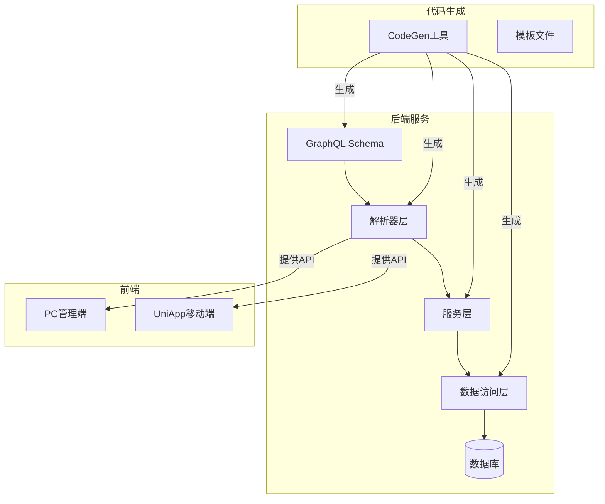
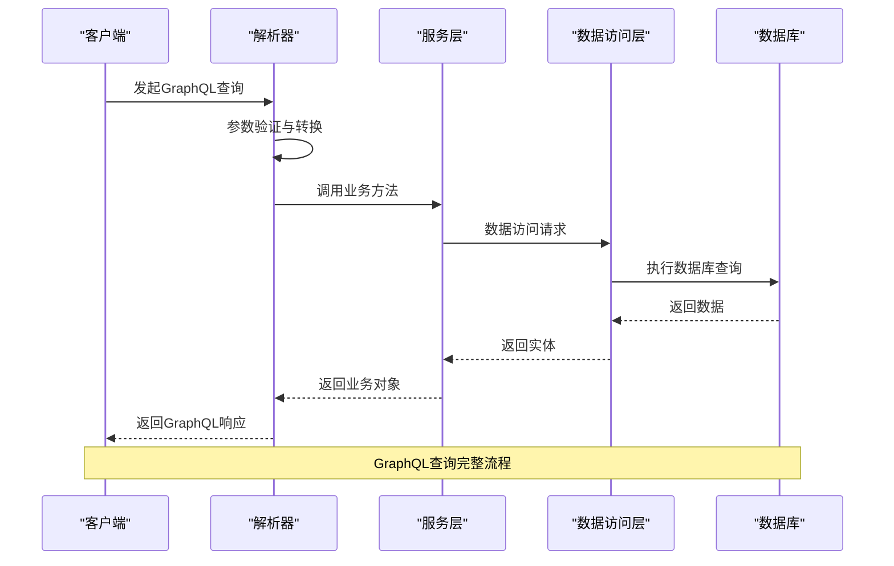
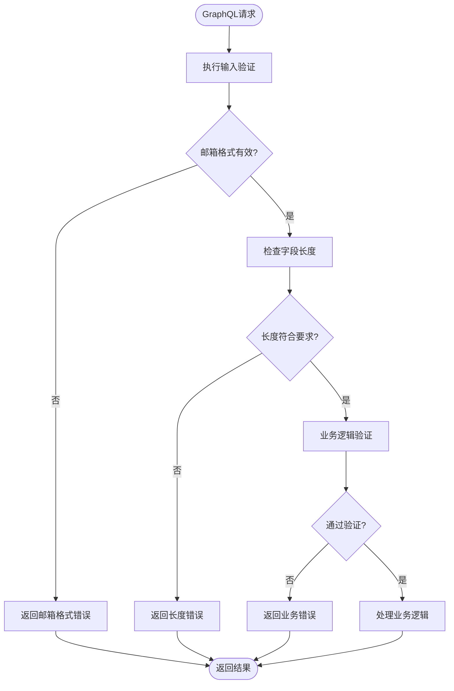
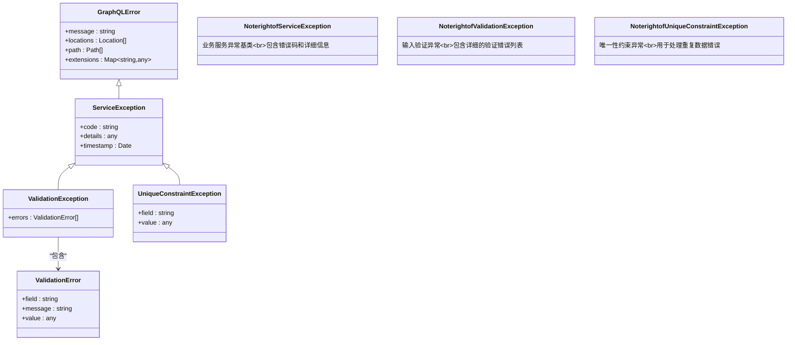
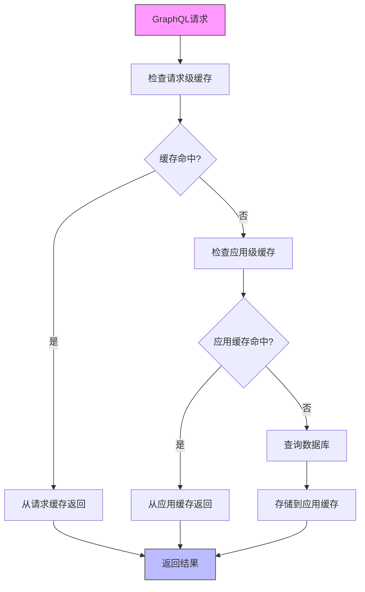
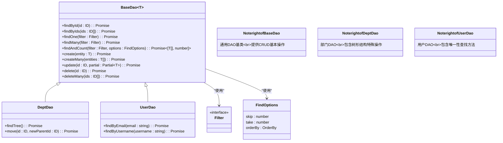

# GraphQL API设计


**本文档引用文件**  
- [background_task.graphql.ts](https://github.com/sail-sail/nest/blob/main/codegen/__out__/deno/gen/base/background_task/background_task.graphql.ts)
- [dept.graphql.ts](https://github.com/sail-sail/nest/blob/main/codegen/__out__/deno/gen/base/dept/dept.graphql.ts)
- [menu.graphql.ts](https://github.com/sail-sail/nest/blob/main/codegen/__out__/deno/gen/base/menu/menu.graphql.ts)
- [usr.graphql.ts](https://github.com/sail-sail/nest/blob/main/codegen/__out__/deno/gen/base/usr/usr.graphql.ts)
- [background_task.resolver.ts](https://github.com/sail-sail/nest/blob/main/codegen/__out__/deno/gen/base/background_task/background_task.resolver.ts)
- [dept.resolver.ts](https://github.com/sail-sail/nest/blob/main/codegen/__out__/deno/gen/base/dept/dept.resolver.ts)
- [menu.resolver.ts](https://github.com/sail-sail/nest/blob/main/codegen/__out__/deno/gen/base/menu/menu.resolver.ts)
- [usr.resolver.ts](https://github.com/sail-sail/nest/blob/main/codegen/__out__/deno/gen/base/usr/usr.resolver.ts)
- [background_task.service.ts](https://github.com/sail-sail/nest/blob/main/codegen/__out__/deno/gen/base/background_task/background_task.service.ts)
- [dept.service.ts](https://github.com/sail-sail/nest/blob/main/codegen/__out__/deno/gen/base/dept/dept.service.ts)
- [menu.service.ts](https://github.com/sail-sail/nest/blob/main/codegen/__out__/deno/gen/base/menu/menu.service.ts)
- [usr.service.ts](https://github.com/sail-sail/nest/blob/main/codegen/__out__/deno/gen/base/usr/usr.service.ts)
- [graphql.ts](https://github.com/sail-sail/nest/blob/main/deno/lib/graphql.ts)
- [validators](https://github.com/sail-sail/nest/blob/main/deno/lib/validators)
- [app.graphql.ts](https://github.com/sail-sail/nest/blob/main/deno/lib/app/app.graphql.ts)
- [oss.graphql.ts](https://github.com/sail-sail/nest/blob/main/deno/lib/oss/oss.graphql.ts)
- [auth.service.ts](https://github.com/sail-sail/nest/blob/main/deno/lib/auth/auth.service.ts)
- [service.exception.ts](https://github.com/sail-sail/nest/blob/main/deno/lib/exceptions/service.exception.ts)
- [dict.graphql.ts](https://github.com/sail-sail/nest/blob/main/codegen/__out__/deno/gen/base/dict/dict.graphql.ts)


## 更新摘要
**已修改内容**  
- 更新了菜单模块的过滤功能，新增“仅当前租户”查询参数
- 扩展了字典模块的搜索能力，增加关键词搜索功能
- 增强了部门模块的外键搜索支持
- 更新了分页、过滤与排序实现章节以反映最新API变更

**新增内容**  
- 在“分页、过滤与排序实现”章节中添加了关键词搜索和租户过滤的详细说明

**文档来源更新**  
- 新增对dict.graphql.ts文件的引用，反映关键词搜索功能的实现

## 目录
1. [项目结构分析](#项目结构分析)
2. [GraphQL架构概览](#graphql架构概览)
3. [Schema优先设计模式](#schema优先设计模式)
4. [解析器与服务层实现](#解析器与服务层实现)
5. [数据加载与N+1查询优化](#数据加载与n1查询优化)
6. [输入验证机制](#输入验证机制)
7. [错误处理规范](#错误处理规范)
8. [分页、过滤与排序实现](#分页过滤与排序实现)
9. [缓存策略](#缓存策略)
10. [DAO层交互模式](#dao层交互模式)

## 项目结构分析

本项目采用模块化分层架构，核心GraphQL服务位于`deno`目录下，通过代码生成机制在`codegen/__out__/deno/gen`目录中自动生成基础模块的GraphQL类型定义、解析器和服务层代码。项目结构清晰地划分为：

- **codegen**: 代码生成工具与模板，负责生成GraphQL Schema、解析器、服务和DAO层代码
- **deno**: 核心应用逻辑，包含GraphQL服务实现
- **pc**: 前端管理界面
- **uni**: 跨平台前端应用

每个业务模块（如dept、menu、usr等）均遵循统一的文件组织结构，包含`.graphql.ts`（类型定义）、`.resolver.ts`（解析器）、`.service.ts`（业务逻辑）和`.dao.ts`（数据访问）四个核心文件。



**图示来源**
- [background_task.graphql.ts](https://github.com/sail-sail/nest/blob/main/codegen/__out__/deno/gen/base/background_task/background_task.graphql.ts)
- [background_task.resolver.ts](https://github.com/sail-sail/nest/blob/main/codegen/__out__/deno/gen/base/background_task/background_task.resolver.ts)
- [background_task.service.ts](https://github.com/sail-sail/nest/blob/main/codegen/__out__/deno/gen/base/background_task/background_task.service.ts)

## GraphQL架构概览

项目采用GraphQL Schema First设计方法，通过`.graphql.ts`文件定义类型系统，然后生成对应的TypeScript接口和解析器骨架。GraphQL模块通过`lib/graphql.ts`统一导入所有Schema定义，形成完整的API端点。

```typescript
// deno/lib/graphql.ts
import "/gen/graphql.ts";
import "/src/graphql.ts";
import "/lib/oss/oss.graphql.ts";
import "/lib/app/app.graphql.ts";
```

该设计模式确保了API契约的明确性和前端开发的可预测性，同时通过代码生成减少了手动编码错误。

**本节来源**
- [graphql.ts](https://github.com/sail-sail/nest/blob/main/deno/lib/graphql.ts)

## Schema优先设计模式

项目采用Schema First方法，每个模块的`.graphql.ts`文件定义了该模块的GraphQL类型、查询和变更操作。以部门（dept）模块为例：

```graphql
type Dept {
  id: ID!
  name: String!
  parentId: ID
  children: [Dept]
  createdAt: DateTime
  updatedAt: DateTime
}

type Query {
  deptById(id: ID!): Dept
  deptPage(page: PageInput!, sort: [SortInput], filter: DeptFilter): PageResult<Dept>
  deptList(sort: [SortInput], filter: DeptFilter): [Dept]
}

type Mutation {
  deptCreate(input: DeptCreateInput!): Dept
  deptUpdate(id: ID!, input: DeptUpdateInput!): Dept
  deptDelete(id: ID!): Boolean
}
```

这种设计确保了API契约的清晰性，前端开发者可以基于Schema自动生成类型定义，实现类型安全的API调用。

**本节来源**
- [dept.graphql.ts](https://github.com/sail-sail/nest/blob/main/codegen/__out__/deno/gen/base/dept/dept.graphql.ts)

## 解析器与服务层实现

解析器（Resolver）作为GraphQL查询的入口点，负责将GraphQL操作映射到具体的服务方法。解析器层保持轻量，主要职责是参数转换、权限验证和调用服务层。



**图示来源**
- [dept.resolver.ts](https://github.com/sail-sail/nest/blob/main/codegen/__out__/deno/gen/base/dept/dept.resolver.ts)
- [dept.service.ts](https://github.com/sail-sail/nest/blob/main/codegen/__out__/deno/gen/base/dept/dept.service.ts)
- [dept.dao.ts](https://github.com/sail-sail/nest/blob/main/codegen/__out__/deno/gen/base/dept/dept.dao.ts)

## 数据加载与N+1查询优化

为解决GraphQL常见的N+1查询问题，项目集成了DataLoader模式。通过批量加载和缓存机制，将多个单条查询合并为一次数据库批量查询。

```typescript
// DataLoader实现示例（概念代码）
class DeptDataLoader {
  private batchLoadFn = async (ids: string[]) => {
    const depts = await this.deptDao.findByIds(ids);
    // 按ID顺序返回结果，确保与输入顺序一致
    return ids.map(id => depts.find(d => d.id === id) || null);
  };
  
  private loader = new DataLoader(this.batchLoadFn);
  
  load(id: string) {
    return this.loader.load(id);
  }
  
  loadMany(ids: string[]) {
    return this.loader.loadMany(ids);
  }
}
```

在解析器中使用DataLoader，可以有效避免嵌套查询导致的性能问题：

```typescript
// 在部门解析器中获取子部门
resolveChildren(parent: Dept) {
  // 使用DataLoader批量加载所有子部门
  return this.deptDataLoader.loadMany(parent.childrenIds);
}
```

**本节来源**
- [dept.resolver.ts](https://github.com/sail-sail/nest/blob/main/codegen/__out__/deno/gen/base/dept/dept.resolver.ts)
- [dept.service.ts](https://github.com/sail-sail/nest/blob/main/codegen/__out__/deno/gen/base/dept/dept.service.ts)

## 输入验证机制

项目通过独立的validators模块实现输入参数验证，确保GraphQL输入的安全性和有效性。验证器作为独立的函数模块，可被服务层复用。



验证器模块包含多种预定义验证规则：

- **chars_max_length.ts**: 字符串最大长度验证
- **chars_min_length.ts**: 字符串最小长度验证
- **email.ts**: 邮箱格式验证
- **ip.ts**: IP地址格式验证
- **maximum.ts**: 数值上限验证
- **minimum.ts**: 数值下限验证
- **regex.ts**: 正则表达式匹配验证
- **url.ts**: URL格式验证

在服务层中，验证器被组合使用：

```typescript
// 服务层中的验证调用（概念代码）
async createUser(input: UserCreateInput) {
  // 组合多个验证器
  const validators = [
    new EmailValidator(),
    new MaxLengthValidator(50),
    new MinLengthValidator(2)
  ];
  
  const errors = validators
    .map(v => v.validate(input.email))
    .filter(result => !result.valid);
    
  if (errors.length > 0) {
    throw new ValidationException(errors);
  }
  
  // 继续业务逻辑
}
```

**图示来源**
- [validators](https://github.com/sail-sail/nest/blob/main/deno/lib/validators)

**本节来源**
- [validators](https://github.com/sail-sail/nest/blob/main/deno/lib/validators)
- [auth.service.ts](https://github.com/sail-sail/nest/blob/main/deno/lib/auth/auth.service.ts)

## 错误处理规范

项目建立了统一的错误处理机制，通过自定义异常类区分不同类型的错误，便于前端进行针对性处理。



异常处理流程：

1. 服务层检测到业务规则违反时，抛出相应的`ServiceException`
2. GraphQL执行层捕获异常，将其转换为标准的GraphQL错误响应
3. 响应中包含错误码、消息和详细信息，便于前端展示和处理

```json
{
  "errors": [
    {
      "message": "用户邮箱已存在",
      "extensions": {
        "code": "UNIQUE_CONSTRAINT",
        "field": "email",
        "value": "user@example.com"
      }
    }
  ]
}
```

**图示来源**
- [service.exception.ts](https://github.com/sail-sail/nest/blob/main/deno/lib/exceptions/service.exception.ts)

**本节来源**
- [service.exception.ts](https://github.com/sail-sail/nest/blob/main/deno/lib/exceptions/service.exception.ts)

## 分页、过滤与排序实现

项目提供了标准化的分页、过滤和排序接口，确保API的一致性和易用性。

### 分页实现

```graphql
type PageResult<T> {
  items: [T!]!
  total: Int!
  page: Int!
  size: Int!
  pages: Int!
}

input PageInput {
  page: Int = 1
  size: Int = 10
}
```

### 排序实现

```graphql
input SortInput {
  field: String!
  order: SortOrder = ASC
}

enum SortOrder {
  ASC
  DESC
}
```

### 过滤实现

每个实体都有对应的过滤输入类型，支持多种过滤条件。根据最新代码变更，过滤功能已增强：

#### 菜单模块过滤增强
在`MenuSearch`输入类型中新增了`is_current_tenant`字段，用于支持仅查询当前租户的数据：

```graphql
input MenuSearch {
  "已删除"
  is_deleted: Int
  "ID列表"
  ids: [MenuId!]
  # ... 其他字段
  "仅当前租户"
  is_current_tenant: Int
  # ... 其他字段
}
```

#### 字典模块搜索功能
在`DictSearch`输入类型中新增了`keyword`字段，支持基于关键词的全文搜索：

```graphql
input DictSearch {
  "已删除"
  is_deleted: Int
  "ID列表"
  ids: [DictId!]
  "关键字"
  keyword: String
  # ... 其他字段
}
```

#### 部门模块外键搜索
在`DeptSearch`输入类型中增强了外键字段的搜索能力，支持通过`_is_null`和`_lbl_like`等后缀进行更灵活的查询：

```graphql
input DeptSearch {
  "已删除"
  is_deleted: Int
  "ID"
  id: DeptId
  "父部门"
  parent_id: [DeptId!]
  "父部门"
  parent_id_is_null: Boolean
  "父部门"
  parent_id_lbl_like: String
  # ... 其他字段
}
```

在服务层中，这些过滤条件被转换为数据库查询：

```typescript
// 服务层中的分页查询实现（概念代码）
async findPage(
  pageInput: PageInput, 
  sortInputs: SortInput[], 
  filter: DeptFilter
) {
  const query = this.buildQueryFromFilter(filter);
  const [items, total] = await this.deptDao.findAndCount(
    query,
    {
      skip: (pageInput.page - 1) * pageInput.size,
      take: pageInput.size,
      orderBy: this.convertSortToOrder(sortInputs)
    }
  );
  
  return {
    items,
    total,
    page: pageInput.page,
    size: pageInput.size,
    pages: Math.ceil(total / pageInput.size)
  };
}
```

**本节来源**
- [dept.graphql.ts](https://github.com/sail-sail/nest/blob/main/codegen/__out__/deno/gen/base/dept/dept.graphql.ts)
- [menu.graphql.ts](https://github.com/sail-sail/nest/blob/main/deno/gen/base/menu/menu.graphql.ts)
- [dict.graphql.ts](https://github.com/sail-sail/nest/blob/main/codegen/__out__/deno/gen/base/dict/dict.graphql.ts)
- [dept.service.ts](https://github.com/sail-sail/nest/blob/main/codegen/__out__/deno/gen/base/dept/dept.service.ts)

## 缓存策略

为提高性能，项目实现了多层缓存策略：

1. **请求级缓存**：通过DataLoader实现，缓存单个请求中的重复数据访问
2. **应用级缓存**：使用内存缓存存储频繁访问的静态数据
3. **分布式缓存**：对于集群部署，可集成Redis等分布式缓存系统

缓存策略主要应用于：
- 静态字典数据（dict模块）
- 权限配置信息（permit模块）
- 菜单结构（menu模块）
- 组织架构（org模块）



**图示来源**
- [dict.graphql.ts](https://github.com/sail-sail/nest/blob/main/codegen/__out__/deno/gen/base/dict/dict.graphql.ts)
- [menu.graphql.ts](https://github.com/sail-sail/nest/blob/main/codegen/__out__/deno/gen/base/menu/menu.graphql.ts)

## DAO层交互模式

数据访问层（DAO）采用Repository模式，为每个实体提供标准化的数据访问接口。



DAO层与具体数据库技术解耦，通过依赖注入方式提供给服务层使用：

```typescript
// 服务层使用DAO（概念代码）
class DeptService {
  constructor(private deptDao: DeptDao) {}
  
  async getDeptTree() {
    return await this.deptDao.findTree();
  }
  
  async moveDept(id: string, newParentId: string) {
    // 业务逻辑验证
    await this.validateMove(id, newParentId);
    
    // 调用DAO执行移动操作
    await this.deptDao.move(id, newParentId);
    
    // 清理相关缓存
    this.clearCache();
  }
}
```

**图示来源**
- [dept.dao.ts](https://github.com/sail-sail/nest/blob/main/codegen/__out__/deno/gen/base/dept/dept.dao.ts)
- [usr.dao.ts](https://github.com/sail-sail/nest/blob/main/codegen/__out__/deno/gen/base/usr/usr.dao.ts)

**本节来源**
- [dept.dao.ts](https://github.com/sail-sail/nest/blob/main/codegen/__out__/deno/gen/base/dept/dept.dao.ts)
- [usr.dao.ts](https://github.com/sail-sail/nest/blob/main/codegen/__out__/deno/gen/base/usr/usr.dao.ts)
- [dept.service.ts](https://github.com/sail-sail/nest/blob/main/codegen/__out__/deno/gen/base/dept/dept.service.ts)