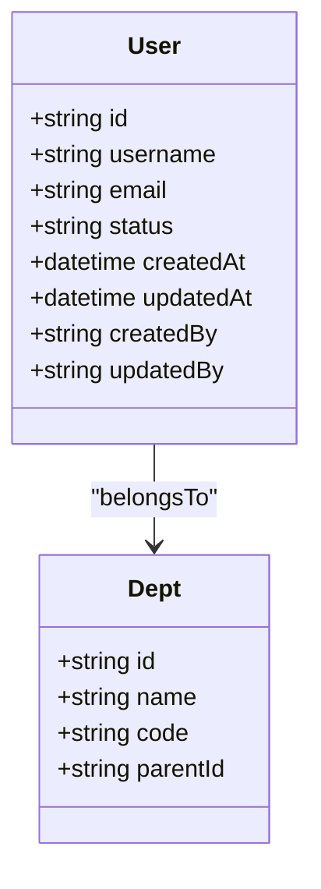
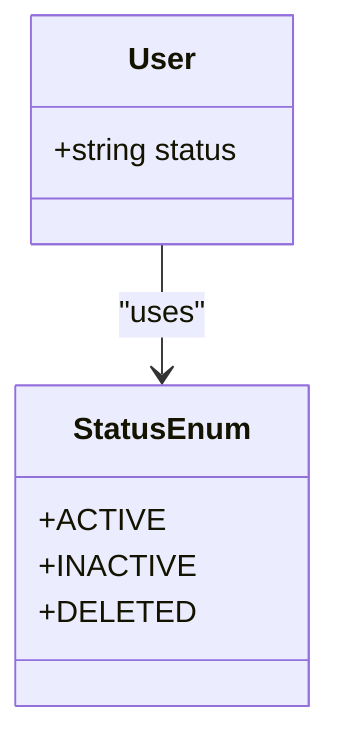
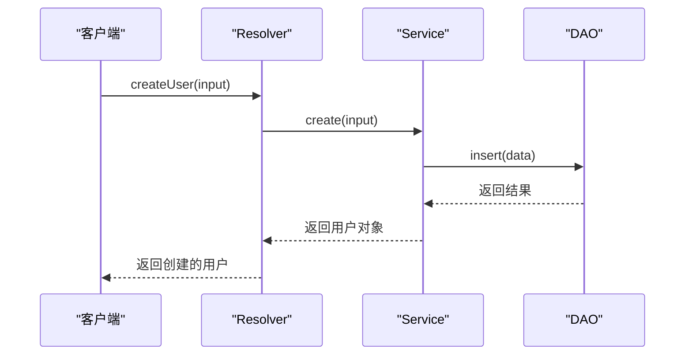
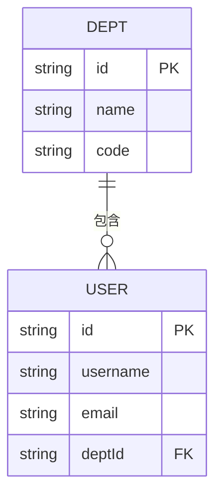

# Schema设计


**本文档引用的文件**  
- [background_task.graphql.ts](https://github.com/sail-sail/nest/blob/main/codegen/__out__/deno/gen/base/background_task/background_task.graphql.ts)
- [data_permit.graphql.ts](https://github.com/sail-sail/nest/blob/main/codegen/__out__/deno/gen/base/data_permit/data_permit.graphql.ts)
- [dept.graphql.ts](https://github.com/sail-sail/nest/blob/main/codegen/__out__/deno/gen/base/dept/dept.graphql.ts)
- [dict.graphql.ts](https://github.com/sail-sail/nest/blob/main/codegen/__out__/deno/gen/base/dict/dict.graphql.ts)
- [dict_detail.graphql.ts](https://github.com/sail-sail/nest/blob/main/codegen/__out__/deno/gen/base/dict_detail/dict_detail.graphql.ts)
- [dictbiz.graphql.ts](https://github.com/sail-sail/nest/blob/main/codegen/__out__/deno/gen/base/dictbiz/dictbiz.graphql.ts)
- [dictbiz_detail.graphql.ts](https://github.com/sail-sail/nest/blob/main/codegen/__out__/deno/gen/base/dictbiz_detail/dictbiz_detail.graphql.ts)
- [domain.graphql.ts](https://github.com/sail-sail/nest/blob/main/codegen/__out__/deno/gen/base/domain/domain.graphql.ts)
- [field_permit.graphql.ts](https://github.com/sail-sail/nest/blob/main/codegen/__out__/deno/gen/base/field_permit/field_permit.graphql.ts)
- [i18n.graphql.ts](https://github.com/sail-sail/nest/blob/main/codegen/__out__/deno/gen/base/i18n/i18n.graphql.ts)
- [icon.graphql.ts](https://github.com/sail-sail/nest/blob/main/codegen/__out__/deno/gen/base/icon/icon.graphql.ts)
- [lang.graphql.ts](https://github.com/sail-sail/nest/blob/main/codegen/__out__/deno/gen/base/lang/lang.graphql.ts)
- [login_log.graphql.ts](https://github.com/sail-sail/nest/blob/main/codegen/__out__/deno/gen/base/login_log/login_log.graphql.ts)
- [menu.graphql.ts](https://github.com/sail-sail/nest/blob/main/codegen/__out__/deno/gen/base/menu/menu.graphql.ts)
- [operation_record.graphql.ts](https://github.com/sail-sail/nest/blob/main/codegen/__out__/deno/gen/base/operation_record/operation_record.graphql.ts)
- [optbiz.graphql.ts](https://github.com/sail-sail/nest/blob/main/codegen/__out__/deno/gen/base/optbiz/optbiz.graphql.ts)
- [options.graphql.ts](https://github.com/sail-sail/nest/blob/main/codegen/__out__/deno/gen/base/options/options.graphql.ts)
- [org.graphql.ts](https://github.com/sail-sail/nest/blob/main/codegen/__out__/deno/gen/base/org/org.graphql.ts)
- [permit.graphql.ts](https://github.com/sail-sail/nest/blob/main/codegen/__out__/deno/gen/base/permit/permit.graphql.ts)
- [role.graphql.ts](https://github.com/sail-sail/nest/blob/main/codegen/__out__/deno/gen/base/role/role.graphql.ts)
- [background_task.resolver.ts](https://github.com/sail-sail/nest/blob/main/codegen/__out__/deno/gen/base/background_task/background_task.resolver.ts)
- [data_permit.resolver.ts](https://github.com/sail-sail/nest/blob/main/codegen/__out__/deno/gen/base/data_permit/data_permit.resolver.ts)
- [dept.resolver.ts](https://github.com/sail-sail/nest/blob/main/codegen/__out__/deno/gen/base/dept/dept.resolver.ts)
- [dict.resolver.ts](https://github.com/sail-sail/nest/blob/main/codegen/__out__/deno/gen/base/dict/dict.resolver.ts)
- [dict_detail.resolver.ts](https://github.com/sail-sail/nest/blob/main/codegen/__out__/deno/gen/base/dict_detail/dict_detail.resolver.ts)
- [dictbiz.resolver.ts](https://github.com/sail-sail/nest/blob/main/codegen/__out__/deno/gen/base/dictbiz/dictbiz.resolver.ts)
- [dictbiz_detail.resolver.ts](https://github.com/sail-sail/nest/blob/main/codegen/__out__/deno/gen/base/dictbiz_detail/dictbiz_detail.resolver.ts)
- [domain.resolver.ts](https://github.com/sail-sail/nest/blob/main/codegen/__out__/deno/gen/base/domain/domain.resolver.ts)
- [field_permit.resolver.ts](https://github.com/sail-sail/nest/blob/main/codegen/__out__/deno/gen/base/field_permit/field_permit.resolver.ts)
- [i18n.resolver.ts](https://github.com/sail-sail/nest/blob/main/codegen/__out__/deno/gen/base/i18n/i18n.resolver.ts)
- [icon.resolver.ts](https://github.com/sail-sail/nest/blob/main/codegen/__out__/deno/gen/base/icon/icon.resolver.ts)
- [lang.resolver.ts](https://github.com/sail-sail/nest/blob/main/codegen/__out__/deno/gen/base/lang/lang.resolver.ts)
- [login_log.resolver.ts](https://github.com/sail-sail/nest/blob/main/codegen/__out__/deno/gen/base/login_log/login_log.resolver.ts)
- [menu.resolver.ts](https://github.com/sail-sail/nest/blob/main/codegen/__out__/deno/gen/base/menu/menu.resolver.ts)
- [operation_record.resolver.ts](https://github.com/sail-sail/nest/blob/main/codegen/__out__/deno/gen/base/operation_record/operation_record.resolver.ts)
- [optbiz.resolver.ts](https://github.com/sail-sail/nest/blob/main/codegen/__out__/deno/gen/base/optbiz/optbiz.resolver.ts)
- [options.resolver.ts](https://github.com/sail-sail/nest/blob/main/codegen/__out__/deno/gen/base/options/options.resolver.ts)
- [org.resolver.ts](https://github.com/sail-sail/nest/blob/main/codegen/__out__/deno/gen/base/org/org.resolver.ts)
- [permit.resolver.ts](https://github.com/sail-sail/nest/blob/main/codegen/__out__/deno/gen/base/permit/permit.resolver.ts)
- [role.resolver.ts](https://github.com/sail-sail/nest/blob/main/codegen/__out__/deno/gen/base/role/role.resolver.ts)
- [background_task.model.ts](https://github.com/sail-sail/nest/blob/main/codegen/__out__/deno/gen/base/background_task/background_task.model.ts)
- [data_permit.model.ts](https://github.com/sail-sail/nest/blob/main/codegen/__out__/deno/gen/base/data_permit/data_permit.model.ts)
- [dept.model.ts](https://github.com/sail-sail/nest/blob/main/codegen/__out__/deno/gen/base/dept/dept.model.ts)
- [dict.model.ts](https://github.com/sail-sail/nest/blob/main/codegen/__out__/deno/gen/base/dict/dict.model.ts)
- [dict_detail.model.ts](https://github.com/sail-sail/nest/blob/main/codegen/__out__/deno/gen/base/dict_detail/dict_detail.model.ts)
- [dictbiz.model.ts](https://github.com/sail-sail/nest/blob/main/codegen/__out__/deno/gen/base/dictbiz/dictbiz.model.ts)
- [dictbiz_detail.model.ts](https://github.com/sail-sail/nest/blob/main/codegen/__out__/deno/gen/base/dictbiz_detail/dictbiz_detail.model.ts)
- [domain.model.ts](https://github.com/sail-sail/nest/blob/main/codegen/__out__/deno/gen/base/domain/domain.model.ts)
- [field_permit.model.ts](https://github.com/sail-sail/nest/blob/main/codegen/__out__/deno/gen/base/field_permit/field_permit.model.ts)
- [i18n.model.ts](https://github.com/sail-sail/nest/blob/main/codegen/__out__/deno/gen/base/i18n/i18n.model.ts)
- [icon.model.ts](https://github.com/sail-sail/nest/blob/main/codegen/__out__/deno/gen/base/icon/icon.model.ts)
- [lang.model.ts](https://github.com/sail-sail/nest/blob/main/codegen/__out__/deno/gen/base/lang/lang.model.ts)
- [login_log.model.ts](https://github.com/sail-sail/nest/blob/main/codegen/__out__/deno/gen/base/login_log/login_log.model.ts)
- [menu.model.ts](https://github.com/sail-sail/nest/blob/main/codegen/__out__/deno/gen/base/menu/menu.model.ts)
- [operation_record.model.ts](https://github.com/sail-sail/nest/blob/main/codegen/__out__/deno/gen/base/operation_record/operation_record.model.ts)
- [optbiz.model.ts](https://github.com/sail-sail/nest/blob/main/codegen/__out__/deno/gen/base/optbiz/optbiz.model.ts)
- [options.model.ts](https://github.com/sail-sail/nest/blob/main/codegen/__out__/deno/gen/base/options/options.model.ts)
- [org.model.ts](https://github.com/sail-sail/nest/blob/main/codegen/__out__/deno/gen/base/org/org.model.ts)
- [permit.model.ts](https://github.com/sail-sail/nest/blob/main/codegen/__out__/deno/gen/base/permit/permit.model.ts)
- [role.model.ts](https://github.com/sail-sail/nest/blob/main/codegen/__out__/deno/gen/base/role/role.model.ts)
- [menu.graphql.ts](https://github.com/sail-sail/nest/blob/main/deno/gen/base/menu/menu.graphql.ts) - *更新了查询过滤字段*
- [dict.graphql.ts](https://github.com/sail-sail/nest/blob/main/deno/gen/base/dict/dict.graphql.ts) - *更新了关键字搜索功能*


## 目录
1. [Schema设计](#schemadesign)
2. [Schema First方法实现原理](#schema-first方法实现原理)
3. [实体类型定义](#实体类型定义)
4. [输入类型与枚举类型](#输入类型与枚举类型)
5. [查询与变更操作设计](#查询与变更操作设计)
6. [嵌套类型与关系字段处理](#嵌套类型与关系字段处理)
7. [模式合并机制](#模式合并机制)
8. [最佳实践建议](#最佳实践建议)

## Schema First方法实现原理

本项目采用Schema First的GraphQL设计方法，即先定义GraphQL Schema，再生成对应的TypeScript代码。通过codegen工具链，从数据库表结构自动生成`.graphql.ts`文件，再由这些文件生成resolver和model。

该方法的核心优势在于：
- **强类型约束**：Schema定义了API的契约，确保前后端一致
- **自动生成代码**：减少手动编写重复代码的工作量
- **文档即代码**：Schema本身就是最准确的API文档
- **易于维护**：修改Schema后可一键重新生成相关代码

项目中的`codegen`模块负责执行代码生成任务，通过读取数据库信息生成基础的GraphQL类型定义。

**本节来源**
- [background_task.graphql.ts](https://github.com/sail-sail/nest/blob/main/codegen/__out__/deno/gen/base/background_task/background_task.graphql.ts)
- [codegen/src/lib/information_schema.ts](https://github.com/sail-sail/nest/blob/main/codegen/src/lib/information_schema.ts)

## 实体类型定义

实体类型（Object Type）是GraphQL Schema中最基本的构建块，用于描述数据的结构。在本项目中，每个业务实体都有对应的`.model.ts`和`.graphql.ts`文件。

以`usr`（用户）实体为例，其类型定义包含以下字段：
- `id`：唯一标识符
- `username`：用户名
- `email`：邮箱
- `status`：状态
- `createdAt`：创建时间
- `updatedAt`：更新时间

实体类型通过TypeGraphQL装饰器与TypeScript类关联，实现类型安全的开发体验。



**图示来源**
- [usr.model.ts](https://github.com/sail-sail/nest/blob/main/codegen/__out__/deno/gen/base/usr/usr.model.ts)
- [dept.model.ts](https://github.com/sail-sail/nest/blob/main/codegen/__out__/deno/gen/base/dept/dept.model.ts)

**本节来源**
- [usr.model.ts](https://github.com/sail-sail/nest/blob/main/codegen/__out__/deno/gen/base/usr/usr.model.ts)
- [dept.model.ts](https://github.com/sail-sail/nest/blob/main/codegen/__out__/deno/gen/base/dept/dept.model.ts)

## 输入类型与枚举类型

### 输入类型（Input Type）

输入类型用于定义创建或更新操作所需的参数结构。与实体类型不同，输入类型通常不包含ID和时间戳字段。

例如，创建用户的输入类型定义如下：
```typescript
@InputType()
class CreateUserInput {
  @Field()
  username: string;
  
  @Field()
  email: string;
  
  @Field({ nullable: true })
  deptId?: string;
}
```

### 枚举类型（Enum Type）

枚举类型用于限制字段的取值范围。在本项目中，状态字段普遍使用枚举类型。



**图示来源**
- [options.graphql.ts](https://github.com/sail-sail/nest/blob/main/codegen/__out__/deno/gen/base/options/options.graphql.ts)
- [dict.graphql.ts](https://github.com/sail-sail/nest/blob/main/codegen/__out__/deno/gen/base/dict/dict.graphql.ts)

**本节来源**
- [options.graphql.ts](https://github.com/sail-sail/nest/blob/main/codegen/__out__/deno/gen/base/options/options.graphql.ts)
- [dict.graphql.ts](https://github.com/sail-sail/nest/blob/main/codegen/__out__/deno/gen/base/dict/dict.graphql.ts)

## 查询与变更操作设计

### 查询（Query）设计模式

查询操作遵循标准化的分页、过滤和排序参数设计：

```typescript
@ArgsType()
class FindUsersArgs {
  @Field({ defaultValue: 1 })
  page: number;
  
  @Field({ defaultValue: 10 })
  limit: number;
  
  @Field({ nullable: true })
  keyword?: string;
  
  @Field(() => [SortInput], { nullable: true })
  sort?: SortInput[];
}
```

### 变更（Mutation）操作

变更操作包括创建、更新和删除三种基本类型：



**图示来源**
- [usr.resolver.ts](https://github.com/sail-sail/nest/blob/main/codegen/__out__/deno/gen/base/usr/usr.resolver.ts)
- [usr.service.ts](https://github.com/sail-sail/nest/blob/main/deno/gen/base/usr/usr.service.ts)

**本节来源**
- [usr.resolver.ts](https://github.com/sail-sail/nest/blob/main/codegen/__out__/deno/gen/base/usr/usr.resolver.ts)
- [find.args.ts](https://github.com/sail-sail/nest/blob/main/codegen/src/lib/nest_config.ts)

### 查询过滤与搜索功能更新

根据最新的代码变更，查询操作的输入类型已扩展了新的过滤和搜索功能：

#### 菜单查询的租户过滤
在`MenuSearch`输入类型中新增了`is_current_tenant`字段，用于过滤当前租户的数据：

```graphql
input MenuSearch {
  "已删除"
  is_deleted: Int
  "仅当前租户"
  is_current_tenant: Int
  # 其他字段...
}
```

此功能允许在查询菜单时指定是否只返回当前租户的数据，增强了多租户环境下的数据隔离能力。

#### 字典查询的关键字搜索
在`DictSearch`输入类型中新增了`keyword`字段，支持通过关键字进行全文搜索：

```graphql
input DictSearch {
  "关键字"
  keyword: String
  # 其他字段...
}
```

此功能允许用户通过单一关键字搜索字典的多个字段（如编码、名称等），提高了搜索的便利性和用户体验。

**本节来源**
- [menu.graphql.ts](https://github.com/sail-sail/nest/blob/main/deno/gen/base/menu/menu.graphql.ts)
- [dict.graphql.ts](https://github.com/sail-sail/nest/blob/main/deno/gen/base/dict/dict.graphql.ts)

## 嵌套类型与关系字段处理

GraphQL的强大之处在于能够通过嵌套查询获取关联数据。本项目通过以下方式处理关系字段：

1. **一对一关系**：直接在实体类型中包含关联对象
2. **一对多关系**：使用数组类型包含多个关联对象
3. **多对多关系**：通过中间表实现

以部门与用户的关系为例：
```typescript
@ObjectType()
class Dept {
  @Field()
  id: string;
  
  @Field(() => [User])
  users: User[];
}
```



**图示来源**
- [dept.model.ts](https://github.com/sail-sail/nest/blob/main/codegen/__out__/deno/gen/base/dept/dept.model.ts)
- [usr.model.ts](https://github.com/sail-sail/nest/blob/main/codegen/__out__/deno/gen/base/usr/usr.model.ts)

**本节来源**
- [dept.model.ts](https://github.com/sail-sail/nest/blob/main/codegen/__out__/deno/gen/base/dept/dept.model.ts)
- [usr.model.ts](https://github.com/sail-sail/nest/blob/main/codegen/__out__/deno/gen/base/usr/usr.model.ts)

## 模式合并机制

本项目采用模块化的Schema设计，将不同业务模块的Schema分别定义，最后通过合并机制组成完整的API接口。

合并过程如下：
1. 每个模块生成独立的`.graphql.ts`文件
2. 在根resolver中导入所有模块的resolver
3. 使用`@Resolver`装饰器注册所有查询和变更
4. 启动时自动合并所有Schema

```typescript
// graphql.ts
import * as UserResolvers from './base/usr/usr.resolver';
import * as DeptResolvers from './base/dept/dept.resolver';

const resolvers = [
  ...Object.values(UserResolvers),
  ...Object.values(DeptResolvers),
];
```

**本节来源**
- [graphql.ts](https://github.com/sail-sail/nest/blob/main/deno/gen/graphql.ts)
- [app.resolver.ts](https://github.com/sail-sail/nest/blob/main/deno/lib/app/app.resolver.ts)

## 最佳实践建议

### 命名约定
- 实体类型：PascalCase，如`User`
- 输入类型：实体名+Input，如`CreateUserInput`
- 枚举类型：实体名+Enum，如`UserStatusEnum`
- 查询方法：动词+实体名，如`findUsers`
- 变更方法：动词+实体名，如`createUser`

### 字段描述
所有字段都应添加描述，便于生成文档：
```typescript
@Field(() => String, { description: '用户邮箱地址' })
email: string;
```

### 版本控制策略
- 使用Git进行版本控制
- Schema变更需同步更新文档
- 重大变更应创建新版本
- 旧版本应保持兼容性至少一个大版本周期

**本节来源**
- [README.md](https://github.com/sail-sail/nest/blob/main/README.md)
- [graphql.config.js](https://github.com/sail-sail/nest/blob/main/deno/graphql.config.js)