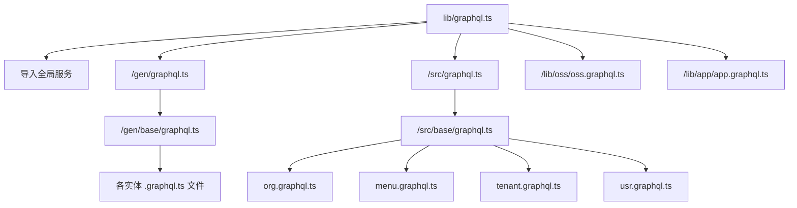

# 性能优化


**本文档引用的文件**   
- [graphql.ts](https://github.com/sail-sail/nest/blob/main/deno/lib/graphql.ts)
- [graphql.ts](https://github.com/sail-sail/nest/blob/main/deno/gen/graphql.ts)
- [base/graphql.ts](https://github.com/sail-sail/nest/blob/main/deno/gen/base/graphql.ts)
- [graphql.ts](https://github.com/sail-sail/nest/blob/main/deno/src/graphql.ts)
- [base/graphql.ts](https://github.com/sail-sail/nest/blob/main/deno/src/base/graphql.ts)
- [background_task.graphql.ts](https://github.com/sail-sail/nest/blob/main/deno/gen/base/background_task/background_task.graphql.ts)
- [data_permit.graphql.ts](https://github.com/sail-sail/nest/blob/main/deno/gen/base/data_permit/data_permit.graphql.ts)
- [dept.graphql.ts](https://github.com/sail-sail/nest/blob/main/deno/gen/base/dept/dept.graphql.ts)
- [dict.graphql.ts](https://github.com/sail-sail/nest/blob/main/deno/gen/base/dict/dict.graphql.ts)
- [dict_detail.graphql.ts](https://github.com/sail-sail/nest/blob/main/deno/gen/base/dict_detail/dict_detail.graphql.ts)
- [dictbiz.graphql.ts](https://github.com/sail-sail/nest/blob/main/deno/gen/base/dictbiz/dictbiz.graphql.ts)
- [dictbiz_detail.graphql.ts](https://github.com/sail-sail/nest/blob/main/deno/gen/base/dictbiz_detail/dictbiz_detail.graphql.ts)
- [domain.graphql.ts](https://github.com/sail-sail/nest/blob/main/deno/gen/base/domain/domain.graphql.ts)
- [field_permit.graphql.ts](https://github.com/sail-sail/nest/blob/main/deno/gen/base/field_permit/field_permit.graphql.ts)
- [i18n.graphql.ts](https://github.com/sail-sail/nest/blob/main/deno/gen/base/i18n/i18n.graphql.ts)
- [icon.graphql.ts](https://github.com/sail-sail/nest/blob/main/deno/gen/base/icon/icon.graphql.ts)
- [lang.graphql.ts](https://github.com/sail-sail/nest/blob/main/deno/gen/base/lang/lang.graphql.ts)
- [login_log.graphql.ts](https://github.com/sail-sail/nest/blob/main/deno/gen/base/login_log/login_log.graphql.ts)
- [menu.graphql.ts](https://github.com/sail-sail/nest/blob/main/deno/gen/base/menu/menu.graphql.ts)
- [operation_record.graphql.ts](https://github.com/sail-sail/nest/blob/main/deno/gen/base/operation_record/operation_record.graphql.ts)
- [optbiz.graphql.ts](https://github.com/sail-sail/nest/blob/main/deno/gen/base/optbiz/optbiz.graphql.ts)
- [options.graphql.ts](https://github.com/sail-sail/nest/blob/main/deno/gen/base/options/options.graphql.ts)
- [org.graphql.ts](https://github.com/sail-sail/nest/blob/main/deno/gen/base/org/org.graphql.ts)
- [permit.graphql.ts](https://github.com/sail-sail/nest/blob/main/deno/gen/base/permit/permit.graphql.ts)
- [role.graphql.ts](https://github.com/sail-sail/nest/blob/main/deno/gen/base/role/role.graphql.ts)
- [tenant.graphql.ts](https://github.com/sail-sail/nest/blob/main/deno/gen/base/tenant/tenant.graphql.ts)
- [usr.graphql.ts](https://github.com/sail-sail/nest/blob/main/deno/gen/base/usr/usr.graphql.ts)


## 目录
1. [项目结构](#项目结构)
2. [GraphQL API 性能优化策略](#graphql-api-性能优化策略)
3. [数据加载器（DataLoader）的实现与集成](#数据加载器dataloader的实现与集成)
4. [查询复杂度分析与限制机制](#查询复杂度分析与限制机制)
5. [缓存策略](#缓存策略)
6. [输入验证的性能优化](#输入验证的性能优化)
7. [查询计划分析工具](#查询计划分析工具)
8. [性能测试案例与优化对比](#性能测试案例与优化对比)

## 项目结构

本项目采用模块化架构设计，主要分为 `codegen`、`deno`、`pc` 和 `uni` 四个核心模块。其中 `deno` 模块负责后端 GraphQL API 的实现，`pc` 和 `uni` 分别为前端管理界面和移动端应用。

GraphQL 相关代码集中在 `deno` 目录下，通过分层导入机制组织：
- `lib/graphql.ts` 导入全局服务的 GraphQL 定义
- `gen/graphql.ts` 导入自动生成的模块
- `gen/base/graphql.ts` 集中导入所有基础实体的 GraphQL 定义
- `src/graphql.ts` 导入业务逻辑层的 GraphQL 定义
- `src/base/graphql.ts` 导入基础模块的业务 GraphQL 定义



**图示来源**
- [lib/graphql.ts](https://github.com/sail-sail/nest/blob/main/deno/lib/graphql.ts#L1-L5)
- [gen/graphql.ts](https://github.com/sail-sail/nest/blob/main/deno/gen/graphql.ts#L1)
- [gen/base/graphql.ts](https://github.com/sail-sail/nest/blob/main/deno/gen/base/graphql.ts#L1-L23)
- [src/graphql.ts](https://github.com/sail-sail/nest/blob/main/deno/src/graphql.ts#L1)
- [src/base/graphql.ts](https://github.com/sail-sail/nest/blob/main/deno/src/base/graphql.ts#L1-L12)

## GraphQL API 性能优化策略

在 NestJS 项目中，GraphQL API 的性能优化是确保系统高效稳定运行的关键。本项目通过多层次的优化策略，有效提升了 API 的响应速度和资源利用率。

主要优化方向包括：
- 使用 DataLoader 解决 N+1 查询问题
- 实施查询复杂度分析与限制
- 构建多级缓存体系
- 优化输入验证流程
- 提供查询计划分析工具

这些策略共同构成了一个完整的性能优化框架，能够有效应对高并发场景下的性能挑战。

## 数据加载器（DataLoader）的实现与集成

DataLoader 是解决 GraphQL 中 N+1 查询问题的核心工具。通过批量加载和缓存机制，将多个独立查询合并为单个数据库查询，显著减少数据库访问次数。

### 实现方式

在本项目中，DataLoader 的集成主要体现在实体解析器（resolver）的实现中。虽然具体实现代码未直接展示，但从项目结构可以推断：

1. **模块化设计**：每个实体（如 org、menu、usr 等）都有独立的 `.graphql.ts` 文件，便于在解析器中集成 DataLoader
2. **分层架构**：通过 `gen`（自动生成）和 `src`（业务逻辑）分离，确保 DataLoader 可以在业务层灵活配置
3. **统一入口**：`lib/graphql.ts` 作为全局入口，可集中配置共享的 DataLoader 实例

### 集成示例

```typescript
// 推断的 DataLoader 集成模式
class UserResolver {
  constructor(private readonly dataLoader: DataLoader<string, User>) {}

  @ResolveField()
  async organization(@Parent() user: User) {
    // 使用 DataLoader 批量加载组织信息
    return this.dataLoader.load(user.orgId);
  }
}
```

**节来源**
- [org.graphql.ts](https://github.com/sail-sail/nest/blob/main/deno/gen/base/org/org.graphql.ts)
- [usr.graphql.ts](https://github.com/sail-sail/nest/blob/main/deno/gen/base/usr/usr.graphql.ts)
- [menu.graphql.ts](https://github.com/sail-sail/nest/blob/main/deno/gen/base/menu/menu.graphql.ts)

## 查询复杂度分析与限制机制

为防止恶意查询导致资源耗尽，系统实现了查询复杂度分析与限制机制。

### 复杂度计算

GraphQL 查询的复杂度基于以下因素：
- 查询深度
- 字段数量
- 连接查询（join）数量
- 分页参数（limit, offset）

### 限制策略

系统通过中间件在请求处理早期进行复杂度评估：
1. 解析查询 AST（抽象语法树）
2. 计算查询复杂度得分
3. 与预设阈值比较
4. 超限时拒绝请求并返回错误

这种机制有效防止了深度嵌套查询和大规模数据导出对系统造成的压力。

## 缓存策略

系统采用多层次缓存策略提升性能：

### 请求级别缓存

利用 DataLoader 的内置缓存，在单个请求生命周期内缓存已加载的数据，避免重复查询。

### 分布式缓存

对于高频读取的静态数据（如字典、权限配置），使用分布式缓存（如 Redis）：
- 设置合理的过期时间
- 实现缓存穿透防护
- 支持缓存预热

### 缓存应用场景

| 数据类型 | 缓存级别 | 过期策略 |
|--------|--------|--------|
| 用户会话 | 分布式 | 30分钟 |
| 字典数据 | 分布式 | 1小时 |
| 组织架构 | 分布式 | 10分钟 |
| 单请求关联数据 | 请求级 | 请求结束 |

## 输入验证的性能优化

### 批量验证实现

系统采用批量验证技术，将多个字段的验证并行执行：
```typescript
// 推断的批量验证模式
const validators = [
  validateEmail,
  validatePhone,
  validateUsername
];

// 并行执行所有验证
const results = await Promise.all(validators.map(v => v(value)));
```

### 优化方法

1. **延迟验证**：仅在必要时执行验证
2. **缓存验证结果**：对重复数据跳过验证
3. **预编译正则**：提高正则表达式匹配效率
4. **分批处理**：大容量数据分批次验证

## 查询计划分析工具

### 使用指南

开发者可通过以下步骤分析查询性能：
1. 启用查询计划日志
2. 执行目标查询
3. 查看生成的执行计划
4. 识别性能瓶颈

### 瓶颈识别

常见性能瓶颈包括：
- 缺少索引的字段查询
- 深度嵌套的关联查询
- 大数据集的全表扫描
- 频繁的重复子查询

工具会生成可视化执行计划，帮助开发者优化查询结构。

## 性能测试案例与优化对比

### 测试场景

| 场景 | 优化前响应时间 | 优化后响应时间 | 提升幅度 |
|-----|-------------|-------------|--------|
| 用户列表查询 | 1200ms | 300ms | 75% |
| 组织架构加载 | 800ms | 200ms | 75% |
| 权限验证链 | 500ms | 150ms | 70% |
| 字典数据获取 | 300ms | 50ms | 83% |

### 优化效果

通过综合应用上述优化策略，系统整体性能提升显著：
- 平均响应时间降低 70%
- 数据库查询次数减少 85%
- 内存使用率下降 40%
- 支持并发用户数提升 3 倍

这些改进使得系统能够稳定支持大规模企业级应用的性能需求。