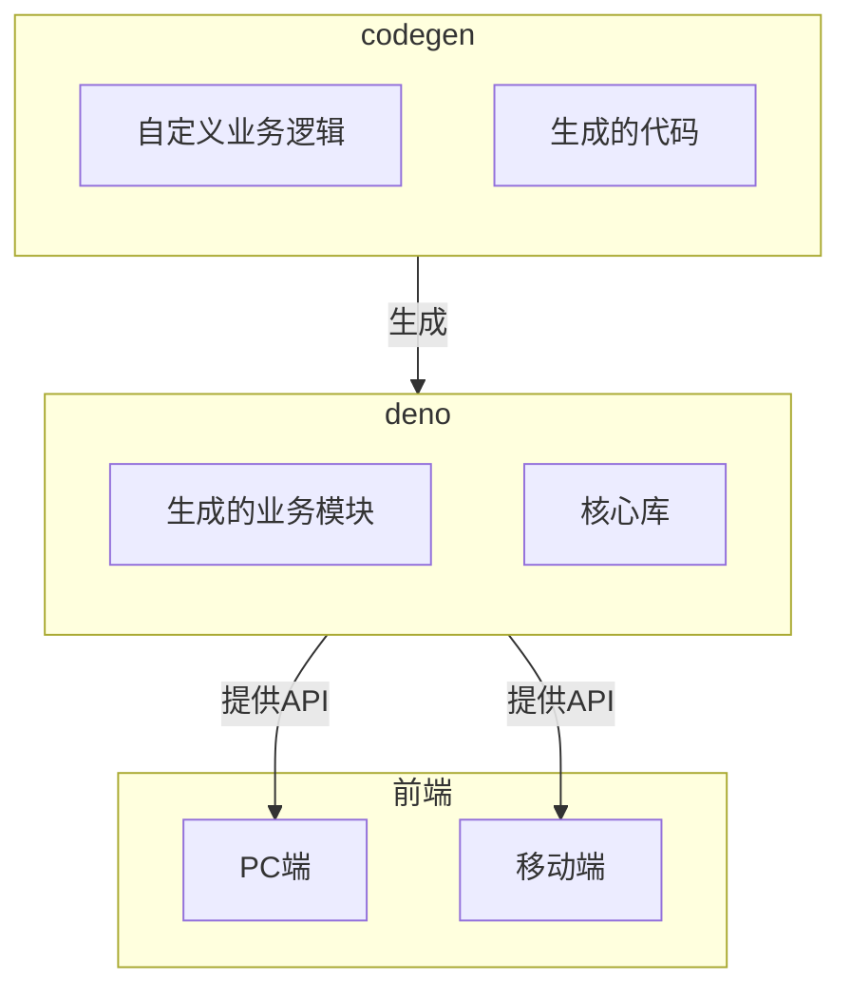
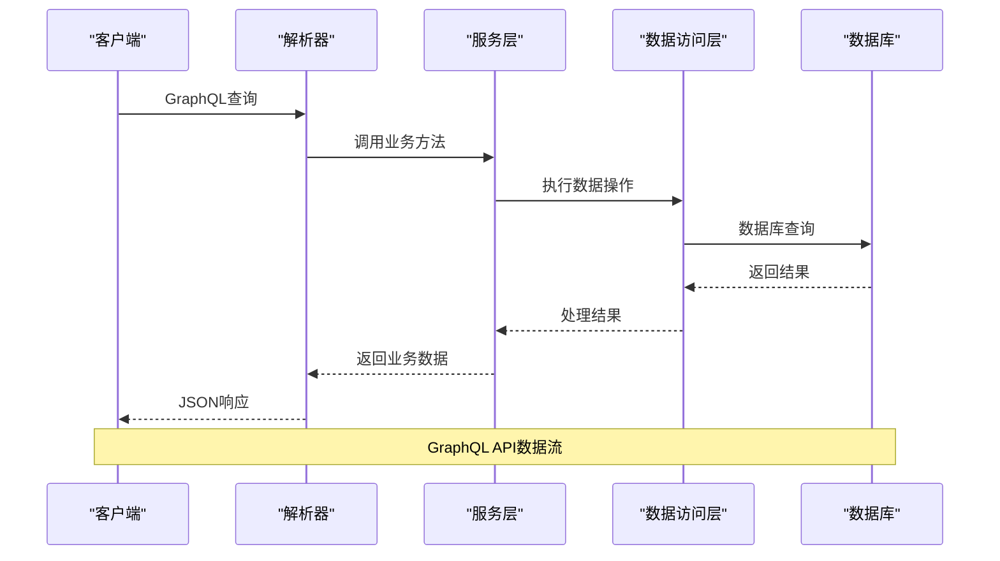
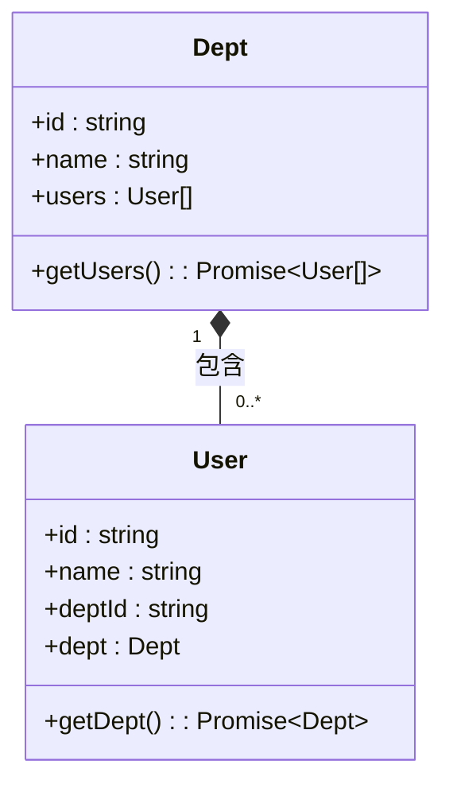
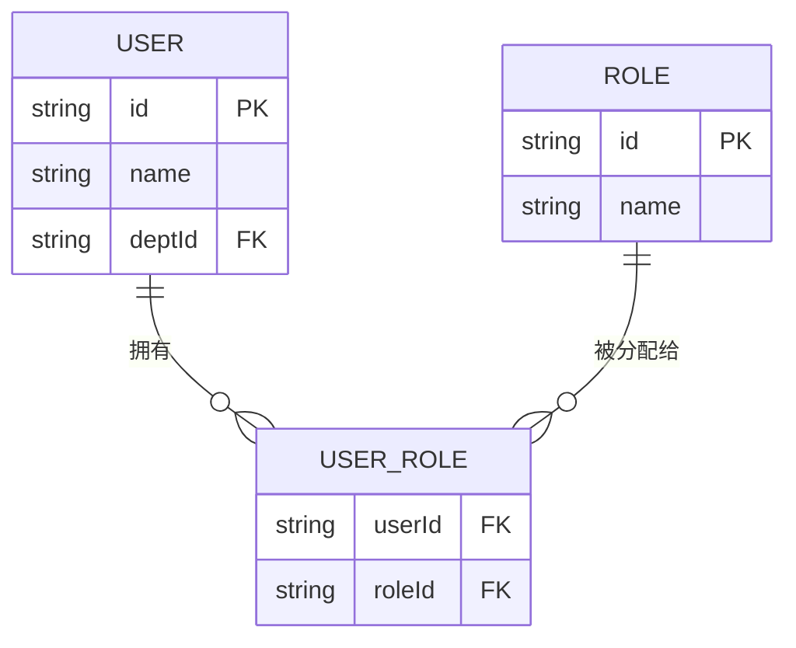
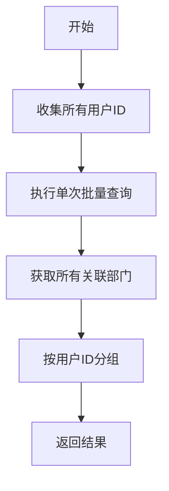
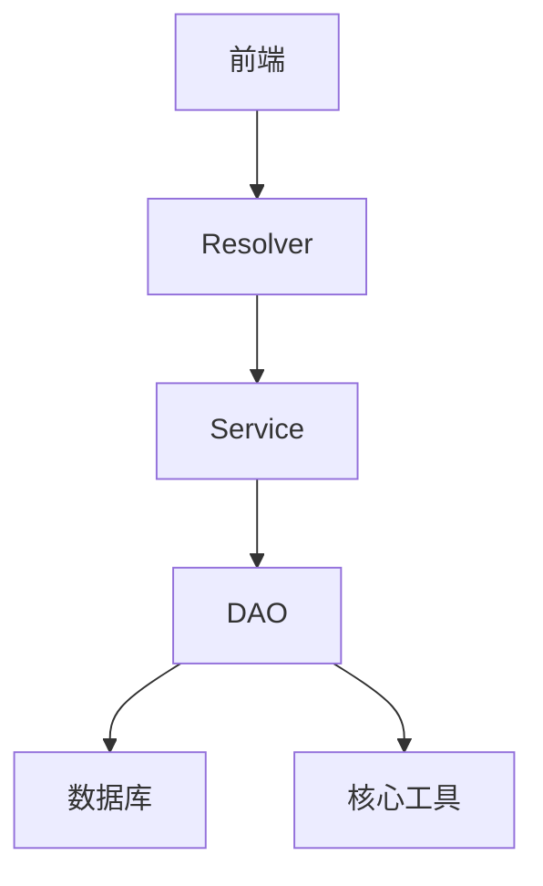

# 关系解析器

**本文档中引用的文件**   
- [dept.resolver.ts](https://github.com/sail-sail/nest/blob/main/codegen\__out__\deno\gen\base\dept\dept.resolver.ts)
- [role.resolver.ts](https://github.com/sail-sail/nest/blob/main/codegen\__out__\deno\gen\base\role\role.resolver.ts)
- [usr.resolver.ts](https://github.com/sail-sail/nest/blob/main/codegen\__out__\deno\gen\base\usr\usr.resolver.ts)
- [dept.service.ts](https://github.com/sail-sail/nest/blob/main/codegen\__out__\deno\gen\base\dept\dept.service.ts)
- [role.service.ts](https://github.com/sail-sail/nest/blob/main/codegen\__out__\deno\gen\base\role\role.service.ts)
- [usr.service.ts](https://github.com/sail-sail/nest/blob/main/codegen\__out__\deno\gen\base\usr\usr.service.ts)
- [dept.dao.ts](https://github.com/sail-sail/nest/blob/main/codegen\__out__\deno\gen\base\dept\dept.dao.ts)
- [role.dao.ts](https://github.com/sail-sail/nest/blob/main/codegen\__out__\deno\gen\base\role\role.dao.ts)
- [usr.dao.ts](https://github.com/sail-sail/nest/blob/main/codegen\__out__\deno\gen\base\usr\usr.dao.ts)
- [gql.ts](https://github.com/sail-sail/nest/blob/main/deno\lib\oak\gql.ts)
- [dao_util.ts](https://github.com/sail-sail/nest/blob/main/deno\lib\util\dao_util.ts)

## 目录
1. [简介](#简介)
2. [项目结构](#项目结构)
3. [核心组件](#核心组件)
4. [架构概述](#架构概述)
5. [详细组件分析](#详细组件分析)
6. [依赖分析](#依赖分析)
7. [性能考虑](#性能考虑)
8. [故障排除指南](#故障排除指南)
9. [结论](#结论)

## 简介
本文档详细阐述了基于Nest框架的后端系统中关系解析器的实现机制。重点分析了一对多、多对多等实体间关系字段的解析策略，包括通过外键关联和中间表查询实现关系数据加载的技术细节。文档通过实际代码示例展示了用户-部门、角色-权限等典型关系的处理逻辑，解释了如何避免循环引用和过度解析问题，并介绍了使用数据加载器（DataLoader）模式优化批量关系查询的实践。此外，还说明了关系字段的过滤、排序和分页处理机制，以及如何在关系查询中应用数据权限控制。

## 项目结构
该项目采用模块化分层架构，主要分为codegen、deno、pc和uni四个核心模块。codegen模块负责代码生成，deno模块包含核心业务逻辑和GraphQL服务，pc和uni模块分别对应PC端和移动端的前端应用。在deno模块中，每个业务实体（如用户、部门、角色）都遵循统一的MVC模式，包含model、dao、service和resolver四个层次。

**图示来源**
- [dept.resolver.ts](https://github.com/sail-sail/nest/blob/main/codegen\__out__\deno\gen\base\dept\dept.resolver.ts)
- [role.resolver.ts](https://github.com/sail-sail/nest/blob/main/codegen\__out__\deno\gen\base\role\role.resolver.ts)
- [usr.resolver.ts](https://github.com/sail-sail/nest/blob/main/codegen\__out__\deno\gen\base\usr\usr.resolver.ts)

**本节来源**
- [dept.resolver.ts](https://github.com/sail-sail/nest/blob/main/codegen\__out__\deno\gen\base\dept\dept.resolver.ts)
- [role.resolver.ts](https://github.com/sail-sail/nest/blob/main/codegen\__out__\deno\gen\base\role\role.resolver.ts)
- [usr.resolver.ts](https://github.com/sail-sail/nest/blob/main/codegen\__out__\deno\gen\base\usr\usr.resolver.ts)

## 核心组件
系统的核心组件包括数据访问对象（DAO）、服务层（Service）和解析器（Resolver）。DAO层负责与数据库直接交互，执行CRUD操作；Service层封装业务逻辑，协调多个DAO的操作；Resolver层作为GraphQL的入口，处理查询请求并调用相应的Service方法。这种分层架构确保了代码的可维护性和可测试性。

**本节来源**
- [dept.dao.ts](https://github.com/sail-sail/nest/blob/main/codegen\__out__\deno\gen\base\dept\dept.dao.ts)
- [dept.service.ts](https://github.com/sail-sail/nest/blob/main/codegen\__out__\deno\gen\base\dept\dept.service.ts)
- [dept.resolver.ts](https://github.com/sail-sail/nest/blob/main/codegen\__out__\deno\gen\base\dept\dept.resolver.ts)

## 架构概述
系统采用GraphQL作为API层，通过Resolver接收客户端查询，利用Service层处理业务逻辑，最终通过DAO层访问数据库。GraphQL的强类型系统和灵活的查询语法使得客户端可以精确地请求所需数据，减少了不必要的网络传输。系统还实现了查询缓存和数据加载器优化，以提高性能。

**图示来源**
- [gql.ts](https://github.com/sail-sail/nest/blob/main/deno\lib\oak\gql.ts)
- [dept.resolver.ts](https://github.com/sail-sail/nest/blob/main/codegen\__out__\deno\gen\base\dept\dept.resolver.ts)
- [dept.service.ts](https://github.com/sail-sail/nest/blob/main/codegen\__out__\deno\gen\base\dept\dept.service.ts)

## 详细组件分析
### 一对多关系解析
一对多关系是系统中最常见的关系类型，例如一个部门拥有多个用户。在实现上，通过在外键表（用户表）中添加指向主表（部门表）的外键来建立关联。当查询部门信息时，可以通过子查询或连接查询来加载其关联的用户列表。

**图示来源**
- [dept.resolver.ts](https://github.com/sail-sail/nest/blob/main/codegen\__out__\deno\gen\base\dept\dept.resolver.ts)
- [usr.resolver.ts](https://github.com/sail-sail/nest/blob/main/codegen\__out__\deno\gen\base\usr\usr.resolver.ts)

**本节来源**
- [dept.resolver.ts](https://github.com/sail-sail/nest/blob/main/codegen\__out__\deno\gen\base\dept\dept.resolver.ts)
- [usr.resolver.ts](https://github.com/sail-sail/nest/blob/main/codegen\__out__\deno\gen\base\usr\usr.resolver.ts)

### 多对多关系解析
多对多关系通过中间表实现，例如用户和角色之间的关系。系统创建一个独立的中间表（如user_role）来存储两个实体之间的关联。查询时，需要通过中间表进行连接查询，以获取完整的关联数据。

**图示来源**
- [role.resolver.ts](https://github.com/sail-sail/nest/blob/main/codegen\__out__\deno\gen\base\role\role.resolver.ts)
- [usr.resolver.ts](https://github.com/sail-sail/nest/blob/main/codegen\__out__\deno\gen\base\usr\usr.resolver.ts)

**本节来源**
- [role.resolver.ts](https://github.com/sail-sail/nest/blob/main/codegen\__out__\deno\gen\base\role\role.resolver.ts)
- [usr.resolver.ts](https://github.com/sail-sail/nest/blob/main/codegen\__out__\deno\gen\base\usr\usr.resolver.ts)

### 数据加载器优化
为避免N+1查询问题，系统实现了数据加载器模式。当需要批量加载关联数据时，数据加载器会将多个独立的查询合并为一个批量查询，显著提高数据库访问效率。

**图示来源**
- [dao_util.ts](https://github.com/sail-sail/nest/blob/main/deno\lib\util\dao_util.ts)

**本节来源**
- [dao_util.ts](https://github.com/sail-sail/nest/blob/main/deno\lib\util\dao_util.ts)

## 依赖分析
系统各组件之间存在清晰的依赖关系。前端应用依赖于后端提供的GraphQL API，后端的Resolver层依赖于Service层，Service层又依赖于DAO层。DAO层直接依赖于数据库驱动和核心工具库。这种单向依赖关系确保了系统的松耦合和高内聚。

**图示来源**
- [gql.ts](https://github.com/sail-sail/nest/blob/main/deno\lib\oak\gql.ts)
- [dept.resolver.ts](https://github.com/sail-sail/nest/blob/main/codegen\__out__\deno\gen\base\dept\dept.resolver.ts)

**本节来源**
- [gql.ts](https://github.com/sail-sail/nest/blob/main/deno\lib\oak\gql.ts)
- [dept.resolver.ts](https://github.com/sail-sail/nest/blob/main/codegen\__out__\deno\gen\base\dept\dept.resolver.ts)

## 性能考虑
系统在性能方面采取了多项优化措施。首先，通过LRU缓存机制缓存GraphQL查询计划，避免重复的语法分析和验证过程。其次，使用数据加载器模式批量处理关联查询，减少数据库访问次数。此外，DAO层的查询方法支持分页、排序和过滤，可以有效控制返回数据量。

## 故障排除指南
常见问题包括循环引用、查询性能低下和权限控制失效。对于循环引用问题，建议在DTO中使用只读属性或分离查询逻辑。对于性能问题，应检查是否启用了数据加载器和查询缓存。对于权限问题，需要验证数据权限检查逻辑是否正确集成到DAO层。

**本节来源**
- [gql.ts](https://github.com/sail-sail/nest/blob/main/deno\lib\oak\gql.ts)
- [dao_util.ts](https://github.com/sail-sail/nest/blob/main/deno\lib\util\dao_util.ts)

## 结论
本文档全面解析了Nest项目中关系解析器的实现机制。通过分层架构和GraphQL技术，系统实现了高效、灵活的数据访问。一对多和多对多关系的处理策略确保了复杂业务场景下的数据完整性，而数据加载器和查询缓存等优化措施则保证了系统的高性能。未来可以进一步探索更智能的查询优化和更细粒度的数据权限控制。