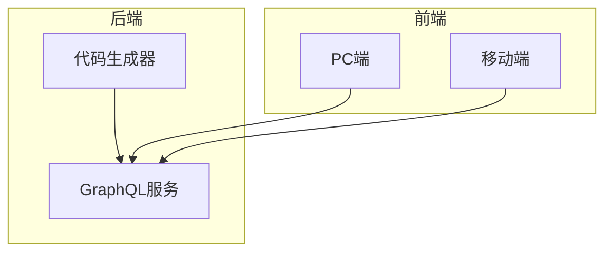
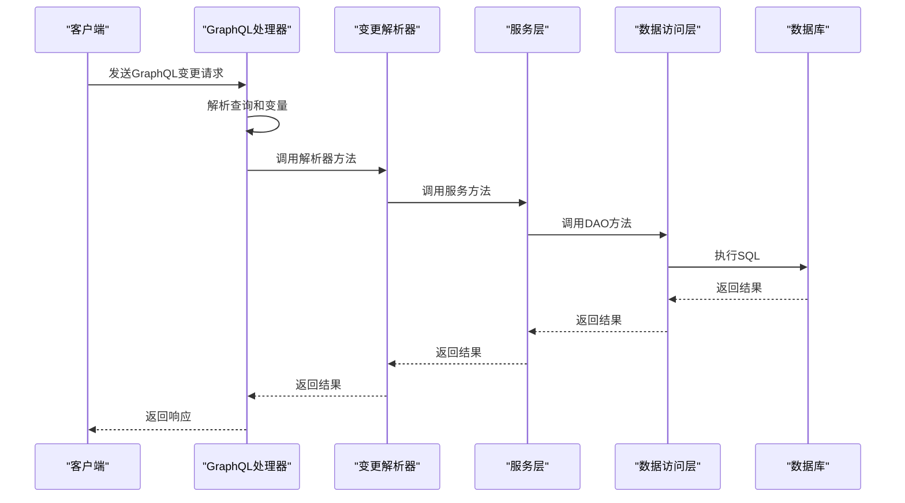
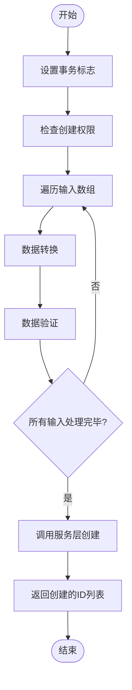
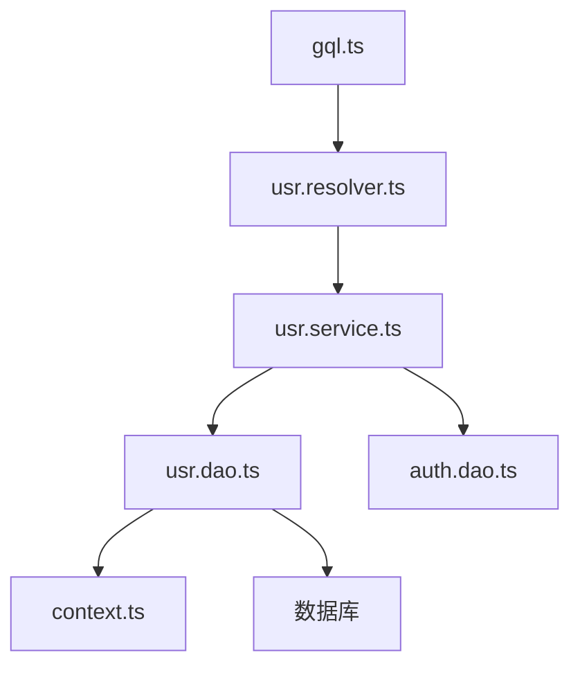

# 变更解析器

**本文档中引用的文件**   
- [usr.resolver.ts](https://github.com/sail-sail/nest/blob/main/codegen\__out__\deno\gen\base\usr\usr.resolver.ts)
- [usr.service.ts](https://github.com/sail-sail/nest/blob/main/codegen\__out__\deno\gen\base\usr\usr.service.ts)
- [usr.dao.ts](https://github.com/sail-sail/nest/blob/main/codegen\__out__\deno\gen\base\usr\usr.dao.ts)
- [gql.ts](https://github.com/sail-sail/nest/blob/main/deno\lib\oak\gql.ts)

## 目录
1. [简介](#简介)
2. [项目结构](#项目结构)
3. [核心组件](#核心组件)
4. [架构概述](#架构概述)
5. [详细组件分析](#详细组件分析)
6. [依赖分析](#依赖分析)
7. [性能考虑](#性能考虑)
8. [故障排除指南](#故障排除指南)
9. [结论](#结论)

## 简介
本文档详细解析了基于Nest框架的GraphQL变更（Mutation）解析器的实现机制。重点分析了创建（Create）、更新（Update）、删除（Delete）等操作的实现模式，涵盖了参数验证、事务处理、错误回滚、权限控制以及数据一致性保障等关键方面。通过分析`usr`（用户）模块的具体代码，展示了变更解析器在实际项目中的应用。

## 项目结构
该项目采用模块化设计，主要分为`codegen`、`deno`、`pc`和`uni`四个部分。`codegen`目录包含代码生成器及其配置；`deno`目录是后端服务的核心，实现了基于Deno的GraphQL API；`pc`和`uni`目录则分别是PC端和移动端的前端应用。变更解析器的逻辑主要位于`deno`目录下的`gen`和`lib`子目录中。

**图源**
- [usr.resolver.ts](https://github.com/sail-sail/nest/blob/main/codegen\__out__\deno\gen\base\usr\usr.resolver.ts)
- [gql.ts](https://github.com/sail-sail/nest/blob/main/deno\lib\oak\gql.ts)

**节源**
- [usr.resolver.ts](https://github.com/sail-sail/nest/blob/main/codegen\__out__\deno\gen\base\usr\usr.resolver.ts)
- [gql.ts](https://github.com/sail-sail/nest/blob/main/deno\lib\oak\gql.ts)

## 核心组件
变更解析器的核心组件包括解析器（Resolver）、服务（Service）和数据访问对象（DAO）。解析器负责接收GraphQL请求并调用相应的服务方法；服务层包含业务逻辑，如权限校验和数据处理；DAO层则直接与数据库交互，执行具体的SQL操作。

**节源**
- [usr.resolver.ts](https://github.com/sail-sail/nest/blob/main/codegen\__out__\deno\gen\base\usr\usr.resolver.ts)
- [usr.service.ts](https://github.com/sail-sail/nest/blob/main/codegen\__out__\deno\gen\base\usr\usr.service.ts)
- [usr.dao.ts](https://github.com/sail-sail/nest/blob/main/codegen\__out__\deno\gen\base\usr\usr.dao.ts)

## 架构概述
系统采用典型的分层架构，从上至下分为GraphQL接口层、业务逻辑层和数据访问层。GraphQL解析器作为入口，通过`gql.ts`中的`defineGraphql`函数注册到路由中。当请求到达时，`handleGraphql`函数负责解析查询、执行解析器，并通过代理机制将调用转发给具体的解析器函数。

**图源**
- [gql.ts](https://github.com/sail-sail/nest/blob/main/deno\lib\oak\gql.ts)
- [usr.resolver.ts](https://github.com/sail-sail/nest/blob/main/codegen\__out__\deno\gen\base\usr\usr.resolver.ts)

## 详细组件分析
### 变更操作实现模式
变更解析器遵循统一的实现模式：接收输入参数，进行权限和业务校验，执行数据库操作，并返回结果。

#### 创建操作分析
创建操作通过`createsUsr`解析器实现。该方法首先设置事务标志，然后调用`usePermit`进行权限校验，接着对每个输入项进行数据转换和验证，最后调用服务层的`createsUsr`方法批量创建用户。

**图源**
- [usr.resolver.ts](https://github.com/sail-sail/nest/blob/main/codegen\__out__\deno\gen\base\usr\usr.resolver.ts)
- [usr.service.ts](https://github.com/sail-sail/nest/blob/main/codegen\__out__\deno\gen\base\usr\usr.service.ts)

**节源**
- [usr.resolver.ts](https://github.com/sail-sail/nest/blob/main/codegen\__out__\deno\gen\base\usr\usr.resolver.ts)

#### 更新与删除操作分析
更新和删除操作均通过ID进行。以`updateByIdUsr`为例，解析器接收ID和输入对象，进行权限校验后调用服务层方法。服务层会先检查用户是否被锁定，若锁定则抛出异常，否则执行更新。删除操作`deleteByIdsUsr`同样会检查锁定状态，并在事务中执行软删除。

**节源**
- [usr.resolver.ts](https://github.com/sail-sail/nest/blob/main/codegen\__out__\deno\gen\base\usr\usr.resolver.ts)
- [usr.service.ts](https://github.com/sail-sail/nest/blob/main/codegen\__out__\deno\gen\base\usr\usr.service.ts)

## 依赖分析
各组件之间存在明确的依赖关系。解析器依赖于服务层，服务层依赖于DAO层，DAO层依赖于数据库和上下文工具。`gql.ts`作为核心，依赖于GraphQL库和上下文管理。

**图源**
- [gql.ts](https://github.com/sail-sail/nest/blob/main/deno\lib\oak\gql.ts)
- [usr.resolver.ts](https://github.com/sail-sail/nest/blob/main/codegen\__out__\deno\gen\base\usr\usr.resolver.ts)
- [usr.service.ts](https://github.com/sail-sail/nest/blob/main/codegen\__out__\deno\gen\base\usr\usr.service.ts)
- [usr.dao.ts](https://github.com/sail-sail/nest/blob/main/codegen\__out__\deno\gen\base\usr\usr.dao.ts)

**节源**
- [gql.ts](https://github.com/sail-sail/nest/blob/main/deno\lib\oak\gql.ts)
- [usr.resolver.ts](https://github.com/sail-sail/nest/blob/main/codegen\__out__\deno\gen\base\usr\usr.resolver.ts)

## 性能考虑
系统通过多种方式优化性能。DAO层使用LRU缓存存储解析后的查询文档，避免重复解析。数据库查询中对ID数组的长度进行了限制，防止因过长的列表导致性能问题。此外，分页和排序功能也有效控制了单次查询的数据量。

## 故障排除指南
常见问题包括权限不足、数据验证失败和数据库约束冲突。日志系统会记录详细的请求和错误信息，便于排查。例如，当尝试修改已锁定的用户时，服务层会抛出明确的错误信息“不能修改已经锁定的 用户”。

**节源**
- [usr.service.ts](https://github.com/sail-sail/nest/blob/main/codegen\__out__\deno\gen\base\usr\usr.service.ts)
- [gql.ts](https://github.com/sail-sail/nest/blob/main/deno\lib\oak\gql.ts)

## 结论
本文档详细解析了Nest项目中GraphQL变更解析器的实现。该设计模式清晰地分离了关注点，通过事务和权限控制保障了数据安全与一致性。结合代码生成器，能够高效地为不同实体生成标准化的CRUD操作，极大地提升了开发效率和代码质量。