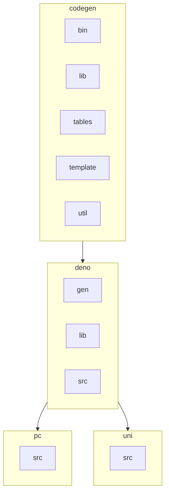
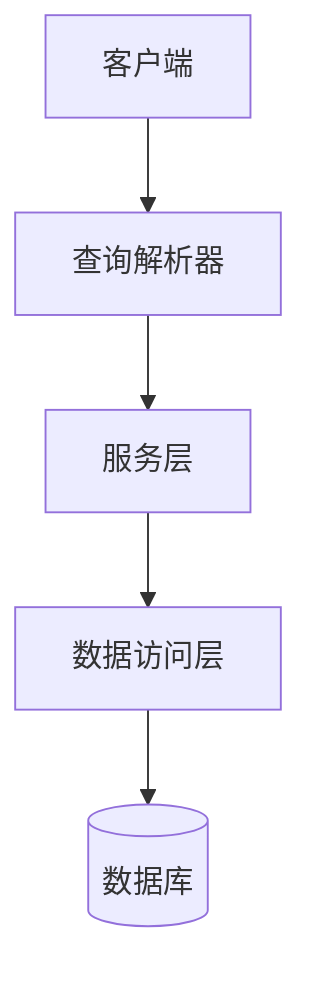
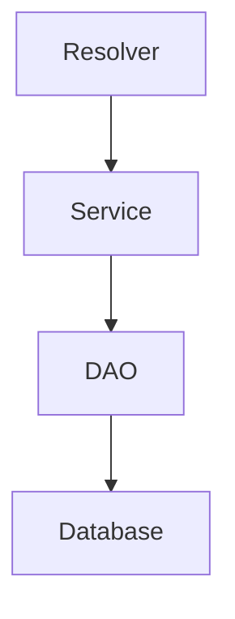

# 查询解析器


**本文档引用的文件**   
- [usr.resolver.ts](https://github.com/sail-sail/nest/blob/main/codegen\__out__\deno\gen\base\usr\usr.resolver.ts)
- [usr.dao.ts](https://github.com/sail-sail/nest/blob/main/codegen\__out__\deno\gen\base\usr\usr.dao.ts)
- [usr.service.ts](https://github.com/sail-sail/nest/blob/main/codegen\__out__\deno\gen\base\usr\usr.service.ts)


## 目录
1. [简介](#简介)
2. [项目结构](#项目结构)
3. [核心组件](#核心组件)
4. [架构概述](#架构概述)
5. [详细组件分析](#详细组件分析)
6. [依赖分析](#依赖分析)
7. [性能考虑](#性能考虑)
8. [故障排除指南](#故障排除指南)
9. [结论](#结论)
10. [附录](#附录)（如有必要）

## 简介
本文档详细介绍了在Nest项目中GraphQL查询解析器的实现，重点分析了查询类型解析器的设计模式。文档涵盖了分页查询、条件过滤和排序的实现机制，通过实际代码示例展示了如何定义查询方法签名、处理输入参数和返回分页结果。此外，还解释了查询解析器如何调用DAO层进行数据库查询，并处理空结果和异常情况。文档还介绍了常用查询模式的实现差异，并提供了性能优化建议。

## 项目结构
项目采用模块化设计，主要分为codegen、deno、pc和uni四个部分。codegen目录包含代码生成相关的脚本和模板，deno目录包含核心业务逻辑的TypeScript文件，pc目录包含前端管理界面的Vue组件，uni目录包含移动端应用的代码。每个模块都有清晰的职责划分，便于维护和扩展。



**图表来源**
- [usr.resolver.ts](https://github.com/sail-sail/nest/blob/main/codegen\__out__\deno\gen\base\usr\usr.resolver.ts)
- [usr.dao.ts](https://github.com/sail-sail/nest/blob/main/codegen\__out__\deno\gen\base\usr\usr.dao.ts)

**章节来源**
- [usr.resolver.ts](https://github.com/sail-sail/nest/blob/main/codegen\__out__\deno\gen\base\usr\usr.resolver.ts)
- [usr.dao.ts](https://github.com/sail-sail/nest/blob/main/codegen\__out__\deno\gen\base\usr\usr.dao.ts)

## 核心组件
核心组件包括查询解析器、数据访问对象（DAO）和服务层。查询解析器负责处理GraphQL查询请求，服务层包含业务逻辑，DAO层负责与数据库交互。这种分层架构确保了代码的可维护性和可测试性。

**章节来源**
- [usr.resolver.ts](https://github.com/sail-sail/nest/blob/main/codegen\__out__\deno\gen\base\usr\usr.resolver.ts)
- [usr.service.ts](https://github.com/sail-sail/nest/blob/main/codegen\__out__\deno\gen\base\usr\usr.service.ts)
- [usr.dao.ts](https://github.com/sail-sail/nest/blob/main/codegen\__out__\deno\gen\base\usr\usr.dao.ts)

## 架构概述
系统采用典型的三层架构：表示层（GraphQL解析器）、业务逻辑层（服务）和数据访问层（DAO）。GraphQL解析器接收客户端请求，调用服务层处理业务逻辑，服务层再调用DAO层执行数据库操作。这种分层设计使得各层职责清晰，便于独立开发和测试。



**图表来源**
- [usr.resolver.ts](https://github.com/sail-sail/nest/blob/main/codegen\__out__\deno\gen\base\usr\usr.resolver.ts)
- [usr.service.ts](https://github.com/sail-sail/nest/blob/main/codegen\__out__\deno\gen\base\usr\usr.service.ts)
- [usr.dao.ts](https://github.com/sail-sail/nest/blob/main/codegen\__out__\deno\gen\base\usr\usr.dao.ts)

## 详细组件分析
### 查询解析器分析
查询解析器是GraphQL API的入口点，负责处理各种查询请求。它定义了查询方法的签名，处理输入参数，并调用服务层获取数据。

#### 查询方法签名
查询方法通常接受搜索条件、分页参数和排序参数。例如，`findAllUsr`方法接受`search`、`page`和`sort`参数：

```typescript
export async function findAllUsr(
  search?: UsrSearch,
  page?: PageInput,
  sort?: SortInput[],
): Promise<UsrModel[]> {
  // 方法实现
}
```

#### 输入参数处理
查询解析器对输入参数进行预处理，如设置默认值和验证参数。例如，在`findAllUsr`方法中，如果`search`参数为空，则设置默认值：

```typescript
search = search || { };
search.is_hidden = [ 0 ];
```

#### 分页结果返回
查询解析器支持分页查询，通过`page`参数控制返回结果的数量和偏移量。分页参数包括`pgOffset`和`pgSize`：

```typescript
if (page?.pgSize) {
  sql += ` limit ${ Number(page?.pgOffset) || 0 },${ Number(page.pgSize) }`;
}
```

**图表来源**
- [usr.resolver.ts](https://github.com/sail-sail/nest/blob/main/codegen\__out__\deno\gen\base\usr\usr.resolver.ts)

**章节来源**
- [usr.resolver.ts](https://github.com/sail-sail/nest/blob/main/codegen\__out__\deno\gen\base\usr\usr.resolver.ts)

### 数据访问对象分析
DAO层负责与数据库交互，执行具体的SQL查询和更新操作。它封装了数据库访问细节，为上层提供统一的接口。

#### 条件过滤实现
DAO层通过构建动态SQL查询来实现条件过滤。`getWhereQuery`函数根据搜索条件生成WHERE子句：

```typescript
async function getWhereQuery(
  args: QueryArgs,
  search?: Readonly<UsrSearch>,
): Promise<string> {
  let whereQuery = "";
  if (search?.lbl_like) {
    whereQuery += ` and t.lbl like ${ args.push("%" + sqlLike(search?.lbl_like) + "%") }`;
  }
  // 其他条件...
  return whereQuery;
}
```

#### 排序实现
排序功能通过`ORDER BY`子句实现。DAO层根据`sort`参数构建排序语句：

```typescript
for (let i = 0; i < sort.length; i++) {
  const item = sort[i];
  sql += ` ${ sqlstring.escapeId(item.prop) } ${ escapeDec(item.order) }`;
}
```

#### 分页实现
分页通过`LIMIT`子句实现，结合`pgOffset`和`pgSize`参数控制返回结果的范围：

```typescript
if (page?.pgSize) {
  sql += ` limit ${ Number(page?.pgOffset) || 0 },${ Number(page.pgSize) }`;
}
```

**图表来源**
- [usr.dao.ts](https://github.com/sail-sail/nest/blob/main/codegen\__out__\deno\gen\base\usr\usr.dao.ts)

**章节来源**
- [usr.dao.ts](https://github.com/sail-sail/nest/blob/main/codegen\__out__\deno\gen\base\usr\usr.dao.ts)

### 服务层分析
服务层包含业务逻辑，协调DAO层的操作，并处理事务和权限验证。

#### 事务管理
服务层通过`set_is_tran`函数管理事务，确保数据库操作的原子性：

```typescript
set_is_tran(true);
const ids = await createsUsr(inputs, { uniqueType });
```

#### 权限验证
服务层在执行敏感操作前进行权限验证，确保用户具有相应的操作权限：

```typescript
await usePermit(
  route_path,
  "add",
);
```

**图表来源**
- [usr.service.ts](https://github.com/sail-sail/nest/blob/main/codegen\__out__\deno\gen\base\usr\usr.service.ts)

**章节来源**
- [usr.service.ts](https://github.com/sail-sail/nest/blob/main/codegen\__out__\deno\gen\base\usr\usr.service.ts)

## 依赖分析
系统各组件之间存在明确的依赖关系。查询解析器依赖服务层，服务层依赖DAO层，DAO层依赖数据库。这种单向依赖关系确保了系统的松耦合和高内聚。



**图表来源**
- [usr.resolver.ts](https://github.com/sail-sail/nest/blob/main/codegen\__out__\deno\gen\base\usr\usr.resolver.ts)
- [usr.service.ts](https://github.com/sail-sail/nest/blob/main/codegen\__out__\deno\gen\base\usr\usr.service.ts)
- [usr.dao.ts](https://github.com/sail-sail/nest/blob/main/codegen\__out__\deno\gen\base\usr\usr.dao.ts)

**章节来源**
- [usr.resolver.ts](https://github.com/sail-sail/nest/blob/main/codegen\__out__\deno\gen\base\usr\usr.resolver.ts)
- [usr.service.ts](https://github.com/sail-sail/nest/blob/main/codegen\__out__\deno\gen\base\usr\usr.service.ts)
- [usr.dao.ts](https://github.com/sail-sail/nest/blob/main/codegen\__out__\deno\gen\base\usr\usr.dao.ts)

## 性能考虑
### 数据库索引
合理使用数据库索引可以显著提高查询性能。对于常用的查询字段，如`lbl`、`username`等，应创建适当的索引。

### 避免N+1查询
通过使用JOIN查询和批量操作，可以避免N+1查询问题。例如，在查询用户时，同时获取其角色、部门和组织信息：

```sql
left join base_usr_role on base_usr_role.usr_id=t.id
left join base_role on base_role.id=base_usr_role.role_id
```

### 缓存机制
系统实现了查询结果缓存，减少数据库访问次数。通过`cacheKey1`和`cacheKey2`生成缓存键，提高查询效率：

```typescript
const cacheKey1 = `dao.sql.${ table }`;
const cacheKey2 = await hash(JSON.stringify({ sql, args }));
```

## 故障排除指南
### 空结果处理
当查询结果为空时，DAO层返回空数组或undefined，上层组件应正确处理这些情况：

```typescript
if (!usr_model) {
  throw "此 用户 已被删除";
}
```

### 异常处理
系统通过try-catch机制处理异常，并提供有意义的错误信息。例如，在删除锁定的用户时抛出异常：

```typescript
if (is_locked) {
  throw "不能修改已经锁定的 用户";
}
```

**章节来源**
- [usr.dao.ts](https://github.com/sail-sail/nest/blob/main/codegen\__out__\deno\gen\base\usr\usr.dao.ts)
- [usr.service.ts](https://github.com/sail-sail/nest/blob/main/codegen\__out__\deno\gen\base\usr\usr.service.ts)

## 结论
本文档详细介绍了Nest项目中GraphQL查询解析器的实现。通过分层架构和清晰的职责划分，系统实现了高效、可维护的查询功能。合理使用数据库索引、避免N+1查询和实现缓存机制，可以显著提高系统性能。未来可以进一步优化查询性能，增加更多的查询模式和支持。

## 附录
### 常用查询模式
- **根据ID查询**：使用`findByIdUsr`方法，直接通过ID获取用户信息。
- **列表查询**：使用`findAllUsr`方法，支持分页、过滤和排序。
- **聚合查询**：使用`findCountUsr`方法，获取满足条件的记录总数。

### 性能优化建议
1. 为常用查询字段创建数据库索引。
2. 使用JOIN查询避免N+1问题。
3. 实现查询结果缓存。
4. 优化SQL查询语句，避免全表扫描。
5. 定期分析和优化数据库性能。