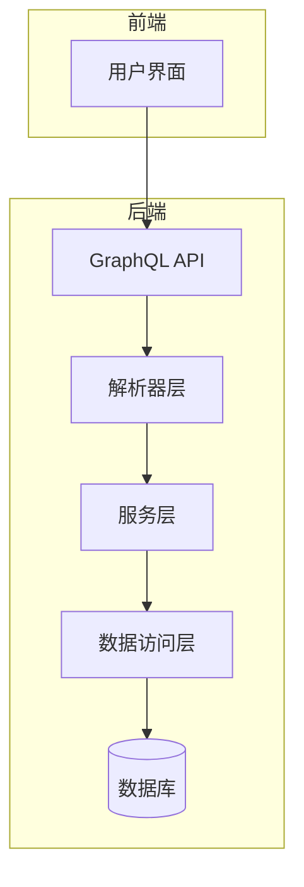
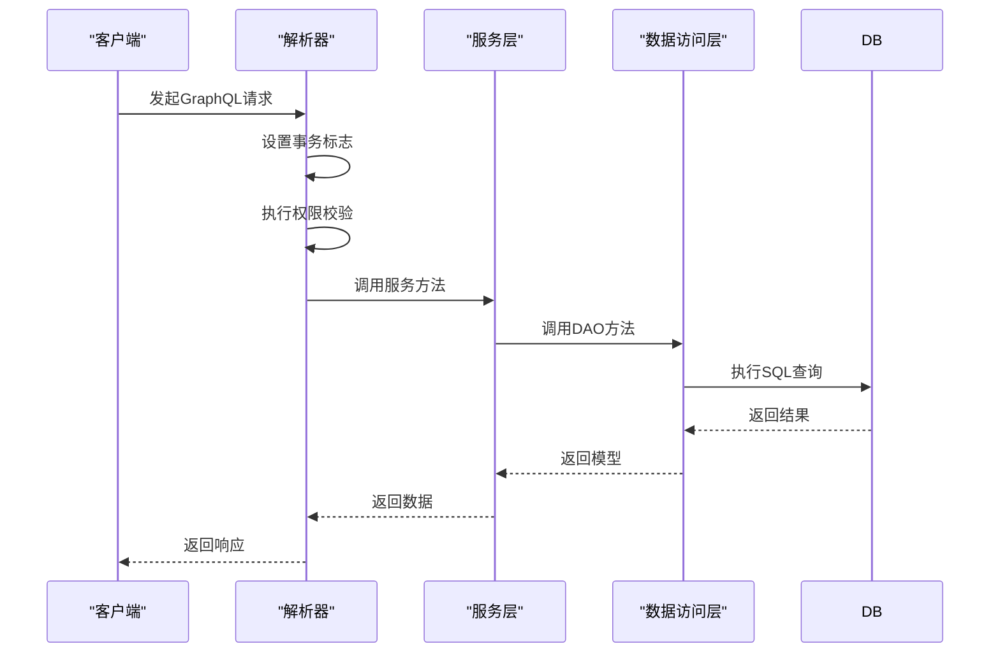
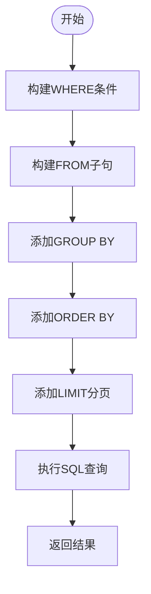

# 解析器实现


**本文档引用的文件**  
- [usr.resolver.ts](https://github.com/sail-sail/nest/blob/main/deno/gen/base/usr/usr.resolver.ts)
- [usr.service.ts](https://github.com/sail-sail/nest/blob/main/deno/gen/base/usr/usr.service.ts)
- [usr.dao.ts](https://github.com/sail-sail/nest/blob/main/deno/gen/base/usr/usr.dao.ts)
- [usr.model.ts](https://github.com/sail-sail/nest/blob/main/deno/gen/base/usr/usr.model.ts)
- [gql.ts](https://github.com/sail-sail/nest/blob/main/deno/lib/oak/gql.ts)


## 目录
1. [项目结构分析](#项目结构分析)
2. [解析器类结构设计](#解析器类结构设计)
3. [查询、变更与字段解析器实现差异](#查询变更与字段解析器实现差异)
4. [解析器与DAO层交互机制](#解析器与dao层交互机制)
5. [复杂关系字段解析策略](#复杂关系字段解析策略)
6. [分页、过滤与数据聚合实现](#分页过滤与数据聚合实现)
7. [上下文对象使用](#上下文对象使用)
8. [性能优化建议](#性能优化建议)

## 项目结构分析

项目采用模块化分层架构，核心功能按业务实体划分目录，每个模块包含数据访问对象（DAO）、服务层（Service）、解析器（Resolver）和模型定义（Model）。GraphQL解析器位于`deno/gen/base`目录下，每个实体拥有独立的`.resolver.ts`文件。



**图示来源**  
- [usr.resolver.ts](https://github.com/sail-sail/nest/blob/main/deno/gen/base/usr/usr.resolver.ts)
- [usr.service.ts](https://github.com/sail-sail/nest/blob/main/deno/gen/base/usr/usr.service.ts)
- [usr.dao.ts](https://github.com/sail-sail/nest/blob/main/deno/gen/base/usr/usr.dao.ts)

## 解析器类结构设计

解析器以独立函数形式组织，每个函数对应一个GraphQL字段解析逻辑。通过ES模块导出机制暴露接口，无需类封装。函数命名遵循`动词+实体名`模式（如`findAllUsr`），清晰表达操作意图。

解析器函数通常包含以下特征：
- 异步执行（`async`）
- 明确的输入参数类型（如`search?: UsrSearch`）
- 返回值类型声明（如`Promise<UsrModel[]>`）
- 内部动态导入服务层模块，实现依赖解耦

```typescript
/**
 * 根据搜索条件和分页查找用户列表
 */
export async function findAllUsr(
  search?: UsrSearch,
  page?: PageInput,
  sort?: SortInput[],
): Promise<UsrModel[]> {
  
  const {
    findAllUsr,
  } = await import("./usr.service.ts");
  
  search = search || { };
  search.is_hidden = [ 0 ];
  
  checkSortUsr(sort);
  
  const models = await findAllUsr(search, page, sort);
  
  for (const model of models) {
    // 密码
    model.password = "";
  }
  
  return models;
}
```

**本节来源**  
- [usr.resolver.ts](https://github.com/sail-sail/nest/blob/main/deno/gen/base/usr/usr.resolver.ts#L45-L80)

## 查询变更与字段解析器实现差异

### 查询解析器
用于数据读取操作，如`findAllUsr`、`findOneUsr`等。主要特点：
- 不修改数据状态
- 支持分页、排序、条件过滤
- 对敏感字段进行脱敏处理（如密码置空）

### 变更解析器
用于数据写入操作，如`createsUsr`、`updateByIdUsr`等。主要特点：
- 启用事务控制（`set_is_tran(true)`）
- 执行权限校验（`usePermit`）
- 调用服务层完成持久化

```typescript
/**
 * 批量创建用户
 */
export async function createsUsr(
  inputs: UsrInput[],
  unique_type?: UniqueType,
): Promise<UsrId[]> {
  
  const {
    validateUsr,
    setIdByLblUsr,
    createsUsr,
  } = await import("./usr.service.ts");
  
  set_is_tran(true);
  set_is_creating(true);
  
  await usePermit(
    route_path,
    "add",
  );
  
  for (const input of inputs) {
    
    intoInputUsr(input);
    
    await setIdByLblUsr(input);
    
    await validateUsr(input);
    
  }
  const uniqueType = unique_type;
  const ids = await createsUsr(inputs, { uniqueType });
  return ids;
}
```

### 字段解析器
处理嵌套对象的延迟加载或计算字段，当前项目中未显式定义，由DAO层SQL关联查询统一处理。

**本节来源**  
- [usr.resolver.ts](https://github.com/sail-sail/nest/blob/main/deno/gen/base/usr/usr.resolver.ts#L250-L290)

## 解析器与dao层交互机制

解析器通过服务层间接调用DAO，形成清晰的调用链：**Resolver → Service → DAO**。这种分层设计实现了关注点分离。

### 依赖注入实现
通过动态`import()`实现运行时依赖注入，避免循环引用问题，并支持热重载。

```typescript
const {
  findAllUsr,
} = await import("./usr.service.ts");
```

### 事务控制
变更操作在解析器层面启动事务，确保数据一致性。

```typescript
set_is_tran(true);
```

### 权限校验
在执行变更前调用`usePermit`进行权限检查。

```typescript
await usePermit(route_path, "edit");
```



**图示来源**  
- [usr.resolver.ts](https://github.com/sail-sail/nest/blob/main/deno/gen/base/usr/usr.resolver.ts)
- [usr.service.ts](https://github.com/sail-sail/nest/blob/main/deno/gen/base/usr/usr.service.ts)
- [usr.dao.ts](https://github.com/sail-sail/nest/blob/main/deno/gen/base/usr/usr.dao.ts)

## 复杂关系字段解析策略

系统通过SQL的`LEFT JOIN`和`JSON_OBJECTAGG`函数处理一对多、多对多关系，在单次查询中完成关联数据聚合。

### 一对多关系处理
以用户与角色为例，通过中间表`base_usr_role`建立多对多关系，在查询时使用子查询聚合JSON对象。

```sql
left join(select
  json_objectagg(base_usr_role.order_by,base_role.id) role_ids,
  json_objectagg(base_usr_role.order_by,base_role.lbl) role_ids_lbl,
  base_usr.id usr_id
from base_usr_role
inner join base_role on base_role.id=base_usr_role.role_id
inner join base_usr on base_usr.id=base_usr_role.usr_id
where base_usr_role.is_deleted=0
group by usr_id) _role on _role.usr_id=t.id
```

### 多对多关系处理
同上，通过中间表关联，并在DAO层将JSON字符串解析为数组结构。

```typescript
// DAO层处理JSON聚合结果
if (item.role_ids) {
  const obj = item.role_ids;
  const keys = Object.keys(obj)
    .map((key) => Number(key))
    .sort((a, b) => a - b ? 1 : -1);
  item.role_ids = keys.map((key) => obj[key]);
} else {
  item.role_ids = [];
}
```

**本节来源**  
- [usr.dao.ts](https://github.com/sail-sail/nest/blob/main/deno/gen/base/usr/usr.dao.ts#L150-L200)

## 分页过滤与数据聚合实现

### 分页实现
通过`PageInput`参数接收分页信息，在SQL末尾添加`LIMIT offset, size`子句。

```typescript
if (page?.pgSize) {
  sql += ` limit ${ Number(page?.pgOffset) || 0 },${ Number(page.pgSize) }`;
}
```

### 条件过滤
通过`getWhereQuery`函数生成WHERE子句，支持字段精确匹配、模糊查询、范围查询等。

```typescript
if (isNotEmpty(search?.username_like)) {
  whereQuery += ` and t.username like ${ args.push("%" + sqlLike(search?.username_like) + "%") }`;
}
```

### 数据聚合
- 使用`COUNT(1)`统计总数
- 使用`JSON_OBJECTAGG`聚合关联数据
- 支持按字段排序（`ORDER BY`）



**图示来源**  
- [usr.dao.ts](https://github.com/sail-sail/nest/blob/main/deno/gen/base/usr/usr.dao.ts#L300-L800)

## 上下文对象使用

GraphQL上下文通过`newContext(oakCtx)`创建，封装了请求相关信息，包括：
- 数据库连接
- 日志记录器
- 缓存管理
- 异步上下文跟踪

### 认证信息传递
通过`get_usr_id()`从上下文中获取当前用户ID，用于数据权限控制。

```typescript
const usr_id = await get_usr_id();
```

### 请求范围数据
使用`runInAsyncHooks`确保事务、日志等操作在请求生命周期内保持一致。

```typescript
return runInAsyncHooks(context, async function() {
  log(`resolver: ${ prop }: ${ JSON.stringify(cbArgs) }`);
  // 业务逻辑
});
```

**本节来源**  
- [gql.ts](https://github.com/sail-sail/nest/blob/main/deno/lib/oak/gql.ts#L234-L265)
- [context.ts](https://github.com/sail-sail/nest/blob/main/lib/context.ts)

## 性能优化建议

### 避免过度解析
- 解析器返回前对敏感字段脱敏（如密码置空）
- 仅查询必要字段，避免`SELECT *`

### 合理使用数据加载器
当前项目未使用数据加载器（DataLoader），建议引入以解决N+1查询问题，特别是在处理列表嵌套关联数据时。

### 查询缓存
利用LRU缓存机制对解析后的GraphQL文档进行缓存，减少重复解析开销。

```typescript
const queryCacheMap = new LRUCache<string, { document: DocumentNode, validationErrors: readonly GraphQLError[] }>({ max: 10000 });
```

### 数据库层面优化
- 为常用查询条件建立索引
- 限制批量操作的数据量（如`FIND_ALL_IDS_LIMIT`）
- 使用连接池管理数据库连接

**本节来源**  
- [gql.ts](https://github.com/sail-sail/nest/blob/main/deno/lib/oak/gql.ts#L60-L70)
- [usr.dao.ts](https://github.com/sail-sail/nest/blob/main/deno/gen/base/usr/usr.dao.ts#L100-L120)