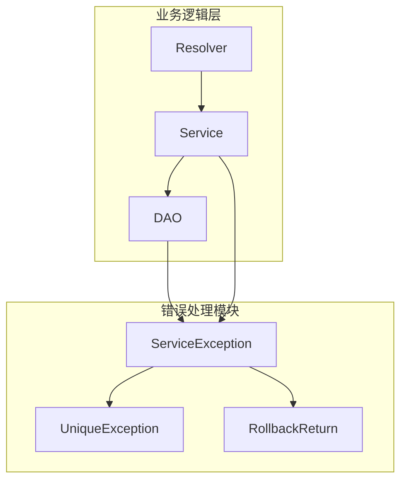
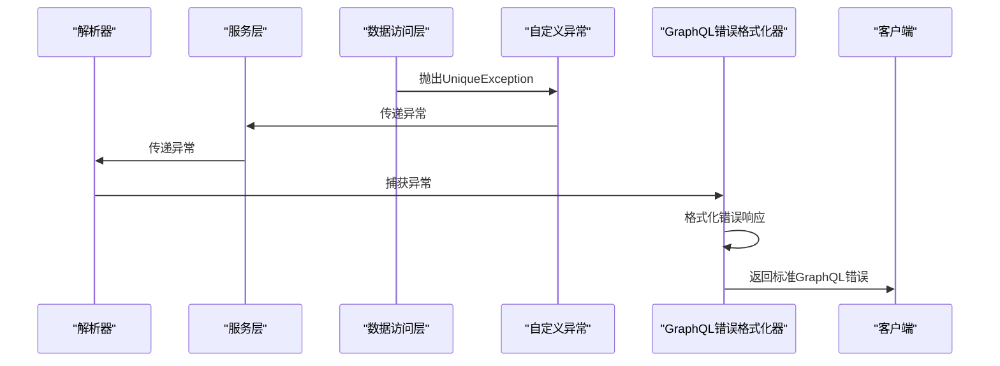
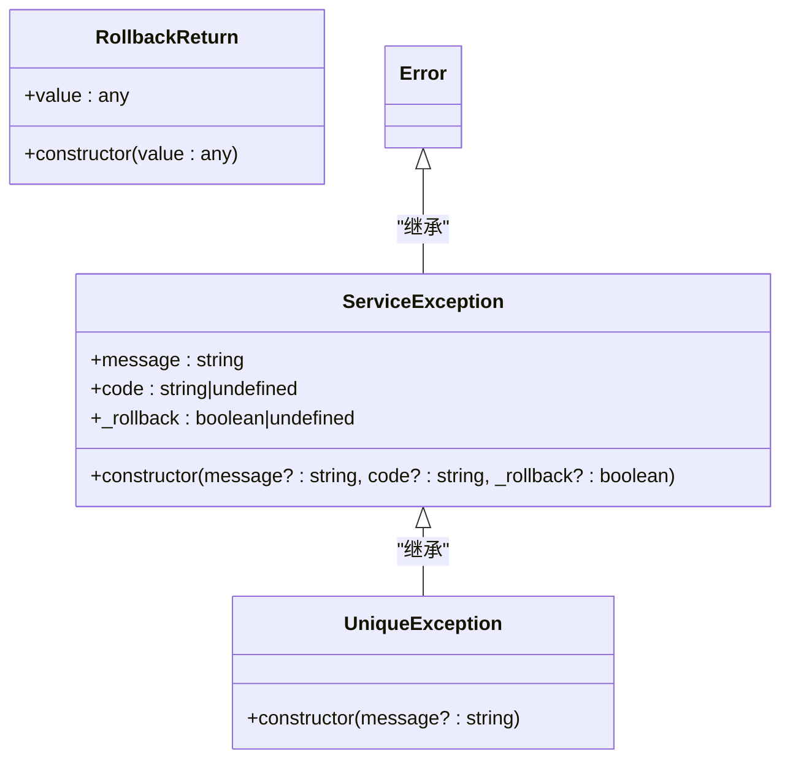
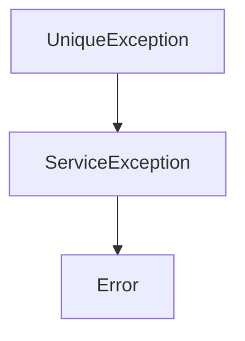

# 错误处理


**本文档引用的文件**   
- [service.exception.ts](https://github.com/sail-sail/nest/blob/main/deno\lib\exceptions\service.exception.ts)
- [unique.execption.ts](https://github.com/sail-sail/nest/blob/main/deno\lib\exceptions\unique.execption.ts)


## 目录
1. [简介](#简介)
2. [项目结构](#项目结构)
3. [核心组件](#核心组件)
4. [架构概述](#架构概述)
5. [详细组件分析](#详细组件分析)
6. [依赖分析](#依赖分析)
7. [性能考虑](#性能考虑)
8. [故障排除指南](#故障排除指南)
9. [结论](#结论)

## 简介
本文档全面介绍基于 Nest 框架的 GraphQL API 项目中的错误处理机制。重点分析自定义异常类的设计与使用，如 `ServiceException` 和 `UniqueException`，并详细说明如何通过异常处理器将内部错误转换为标准的 GraphQL 响应格式。文档还涵盖错误码体系设计、解析器中的异常抛出与捕获实践、日志记录机制以及常见错误场景的解决方案，旨在为开发者提供一套完整、可维护的错误处理方案。

## 项目结构
该项目采用模块化分层架构，主要分为 `codegen`、`deno`、`pc` 和 `uni` 四个核心目录。其中，错误处理相关的核心逻辑位于 `deno/lib/exceptions` 目录下，该路径存放了自定义异常类的实现。整个项目通过 Deno 运行时构建，结合 GraphQL 提供 API 服务，异常处理机制贯穿于服务层（Service）、数据访问层（DAO）和解析器（Resolver）之间，确保错误信息能够统一捕获和格式化。



**图示来源**
- [service.exception.ts](https://github.com/sail-sail/nest/blob/main/deno\lib\exceptions\service.exception.ts#L1-L28)
- [unique.execption.ts](https://github.com/sail-sail/nest/blob/main/deno\lib\exceptions\unique.execption.ts#L1-L11)

## 核心组件
错误处理系统的核心是自定义异常类 `ServiceException` 和 `UniqueException`。`ServiceException` 作为基础服务异常，提供了错误消息、错误码和事务回滚控制等关键属性。`UniqueException` 继承自 `ServiceException`，专门用于处理数据库唯一约束冲突的场景。此外，`RollbackReturn` 类用于在需要返回数据的同时触发事务回滚，增强了异常处理的灵活性。

**本节来源**
- [service.exception.ts](https://github.com/sail-sail/nest/blob/main/deno\lib\exceptions\service.exception.ts#L1-L28)
- [unique.execption.ts](https://github.com/sail-sail/nest/blob/main/deno\lib\exceptions\unique.execption.ts#L1-L11)

## 架构概述
系统的错误处理架构遵循分层异常捕获原则。当底层 DAO 或 Service 层发生业务逻辑错误时，会抛出特定的自定义异常（如 `UniqueException`）。这些异常在上层被 GraphQL 的错误格式化器捕获，并转换为符合 GraphQL 规范的错误响应，包含 `message`、`code` 等字段。整个流程确保了内部实现细节不会暴露给客户端，同时提供了清晰的错误标识和用户友好的提示信息。



**图示来源**
- [service.exception.ts](https://github.com/sail-sail/nest/blob/main/deno\lib\exceptions\service.exception.ts#L1-L28)
- [unique.execption.ts](https://github.com/sail-sail/nest/blob/main/deno\lib\exceptions\unique.execption.ts#L1-L11)

## 详细组件分析

### ServiceException 分析
`ServiceException` 是项目中所有业务异常的基类，它扩展了 JavaScript 的 `Error` 类，增加了业务所需的额外属性。



**图示来源**
- [service.exception.ts](https://github.com/sail-sail/nest/blob/main/deno\lib\exceptions\service.exception.ts#L1-L28)

#### 属性说明
- **message**: 重写了父类的 `message` 属性，用于存储用户可读的错误描述。
- **code**: 字符串类型的错误码，用于客户端进行错误类型判断和国际化处理。
- **_rollback**: 布尔值，指示在发生此异常时是否应回滚数据库事务，默认为回滚。

#### 构造函数
构造函数接受三个可选参数：`message`（错误消息）、`code`（错误码）和 `_rollback`（事务回滚标志）。通过 `super()` 调用父类构造函数，并初始化自定义属性。

**本节来源**
- [service.exception.ts](https://github.com/sail-sail/nest/blob/main/deno\lib\exceptions\service.exception.ts#L1-L28)

### UniqueException 分析
`UniqueException` 是 `ServiceException` 的一个具体实现，专门用于处理数据库唯一性约束冲突。

#### 实现细节
该异常在构造函数中固定了 `code` 为 `"UniqueException"`，并提供了一个默认的错误消息 `"唯一约束冲突"`。如果调用时传入了自定义消息，则使用传入的消息覆盖默认值。这种设计简化了在代码中抛出此类异常的流程，开发者无需记忆错误码。

```typescript
constructor(message?: string) {
  super();
  this.code = "UniqueException";
  this.message = message || "唯一约束冲突";
}
```

**本节来源**
- [unique.execption.ts](https://github.com/sail-sail/nest/blob/main/deno\lib\exceptions\unique.execption.ts#L1-L11)

## 依赖分析
`UniqueException` 依赖于 `ServiceException`，形成了明确的继承关系。这种设计遵循了面向对象的开闭原则，允许在不修改现有代码的情况下扩展新的异常类型。整个异常处理模块独立于具体的业务逻辑，仅通过抛出和捕获异常与业务层交互，降低了模块间的耦合度。



**图示来源**
- [unique.execption.ts](https://github.com/sail-sail/nest/blob/main/deno\lib\exceptions\unique.execption.ts#L1-L11)
- [service.exception.ts](https://github.com/sail-sail/nest/blob/main/deno\lib\exceptions\service.exception.ts#L1-L28)

## 性能考虑
异常处理机制本身对性能的影响较小，因为异常仅在错误发生时才被创建和抛出。然而，频繁的异常抛出（例如用于流程控制）会显著降低性能。建议仅在真正的错误场景下使用异常，并通过预校验等方式减少异常的发生频率。此外，错误码的设计避免了在运行时进行复杂的字符串比较，提高了错误处理的效率。

## 故障排除指南
### 常见错误场景及解决方案
- **数据验证失败**: 在服务层使用 `validators` 模块进行输入校验，校验失败时抛出带有特定 `code` 的 `ServiceException`。
- **权限不足**: 在 `auth` 模块中进行权限检查，无权限时抛出 `ServiceException`，`code` 可设为 `"PermissionDenied"`。
- **资源不存在**: 在 DAO 层查询数据时，若未找到记录，应抛出 `ServiceException`，`code` 可设为 `"ResourceNotFound"`。

### 日志记录
建议在全局异常过滤器中集成日志记录功能，记录异常的 `code`、`message` 和堆栈信息（生产环境应谨慎记录堆栈）。对于敏感信息（如密码、密钥），应在记录前进行过滤或脱敏处理。

**本节来源**
- [service.exception.ts](https://github.com/sail-sail/nest/blob/main/deno\lib\exceptions\service.exception.ts#L1-L28)
- [unique.execption.ts](https://github.com/sail-sail/nest/blob/main/deno\lib\exceptions\unique.execption.ts#L1-L11)

## 结论
本项目的错误处理机制设计合理，通过继承 `Error` 类创建自定义异常，实现了错误信息的结构化和标准化。`ServiceException` 提供了灵活的扩展基础，而 `UniqueException` 则针对特定业务场景进行了封装。结合 GraphQL 的错误处理能力，系统能够向客户端返回清晰、一致的错误响应，极大地提升了 API 的可用性和可维护性。建议在项目中统一使用此类异常处理模式，并建立完善的错误码字典以支持多语言和前端错误处理。