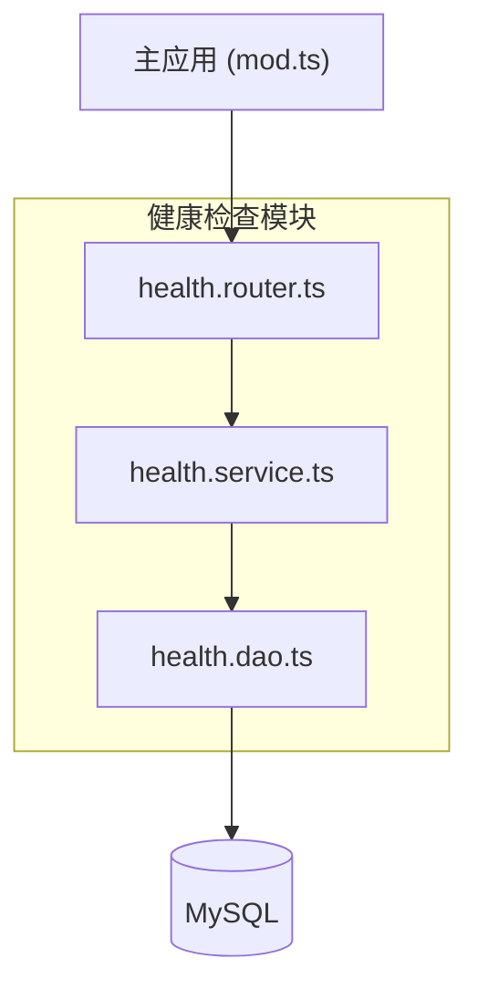
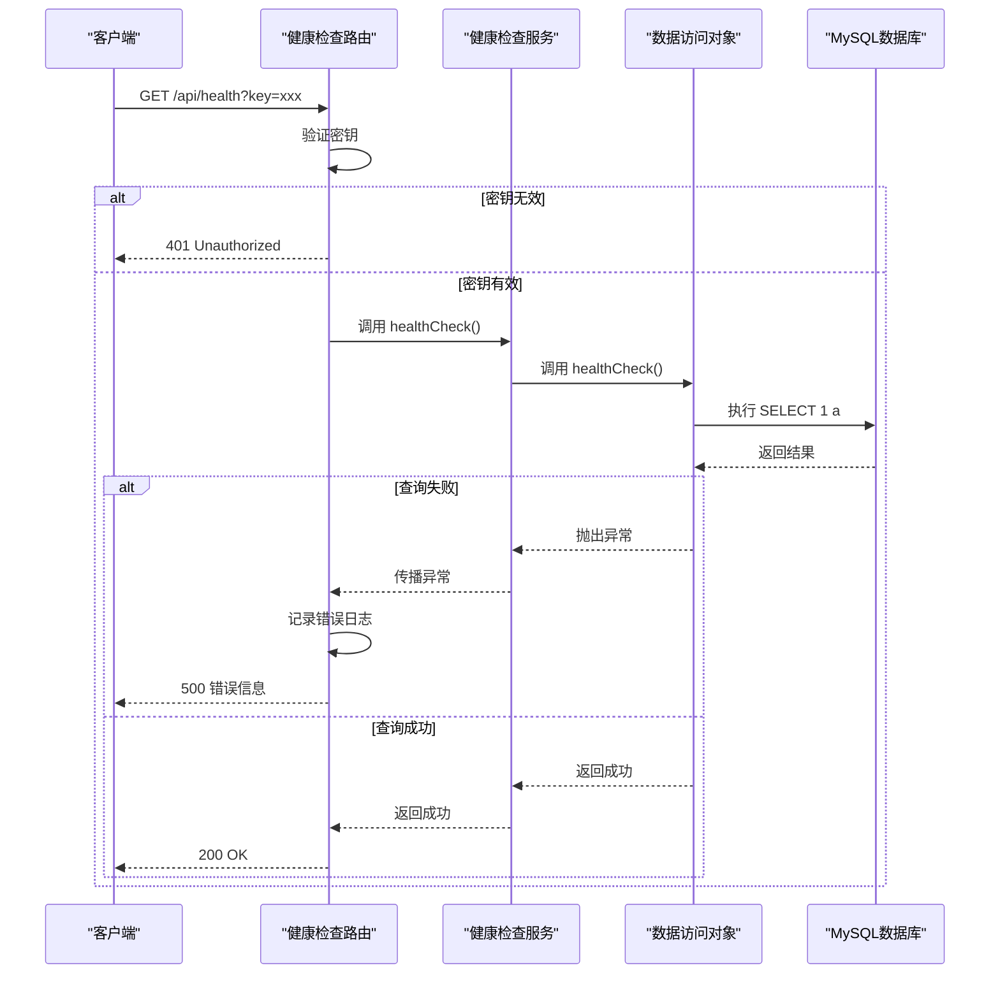
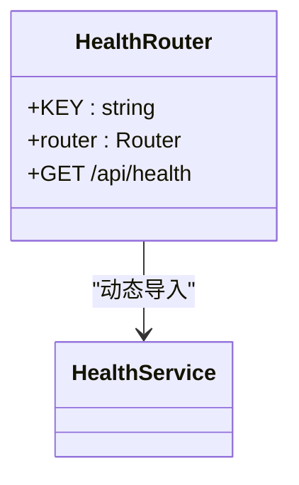

# 健康检查


**本文档引用的文件**  
- [health.router.ts](https://github.com/sail-sail/nest/blob/main/deno/lib/health/health.router.ts)
- [health.service.ts](https://github.com/sail-sail/nest/blob/main/deno/lib/health/health.service.ts)
- [health.dao.ts](https://github.com/sail-sail/nest/blob/main/deno/lib/health/health.dao.ts)
- [context.ts](https://github.com/sail-sail/nest/blob/main/deno/lib/context.ts)
- [mod.ts](https://github.com/sail-sail/nest/blob/main/deno/lib/oak/mod.ts)


## 目录
1. [简介](#简介)
2. [项目结构](#项目结构)
3. [核心组件](#核心组件)
4. [架构概览](#架构概览)
5. [详细组件分析](#详细组件分析)
6. [依赖分析](#依赖分析)
7. [性能考虑](#性能考虑)
8. [故障排查指南](#故障排查指南)
9. [结论](#结论)

## 简介
本文档系统性地介绍了基于 Nest 框架的健康检查服务实现。该服务用于监控系统运行状态，确保数据库连接正常，并为运维系统提供可靠的健康状态接口。文档详细说明了健康检查端点的设计、系统状态检测机制、结果报告方式以及与容器化部署的集成实践。

## 项目结构
健康检查功能位于 `deno/lib/health/` 目录下，包含三个核心文件：
- `health.router.ts`：定义 HTTP 路由
- `health.service.ts`：业务逻辑层
- `health.dao.ts`：数据访问层

该模块通过 Oak 框架集成到主应用中，作为独立的中间件运行。



**图示来源**  
- [health.router.ts](https://github.com/sail-sail/nest/blob/main/deno/lib/health/health.router.ts)
- [health.service.ts](https://github.com/sail-sail/nest/blob/main/deno/lib/health/health.service.ts)
- [health.dao.ts](https://github.com/sail-sail/nest/blob/main/deno/lib/health/health.dao.ts)
- [mod.ts](https://github.com/sail-sail/nest/blob/main/deno/lib/oak/mod.ts)

**本节来源**  
- [health.router.ts](https://github.com/sail-sail/nest/blob/main/deno/lib/health/health.router.ts)
- [mod.ts](https://github.com/sail-sail/nest/blob/main/deno/lib/oak/mod.ts)

## 核心组件
健康检查服务由三层架构组成：路由层、服务层和数据访问层。其主要功能是通过执行一个简单的数据库查询来验证数据库连接是否正常。

**本节来源**  
- [health.router.ts](https://github.com/sail-sail/nest/blob/main/deno/lib/health/health.router.ts)
- [health.service.ts](https://github.com/sail-sail/nest/blob/main/deno/lib/health/health.service.ts)
- [health.dao.ts](https://github.com/sail-sail/nest/blob/main/deno/lib/health/health.dao.ts)

## 架构概览
整个健康检查流程遵循典型的三层架构模式，从 HTTP 请求进入，经过路由分发，调用服务逻辑，最终通过 DAO 层与数据库交互。



**图示来源**  
- [health.router.ts](https://github.com/sail-sail/nest/blob/main/deno/lib/health/health.router.ts#L14-L44)
- [health.service.ts](https://github.com/sail-sail/nest/blob/main/deno/lib/health/health.service.ts#L4-L6)
- [health.dao.ts](https://github.com/sail-sail/nest/blob/main/deno/lib/health/health.dao.ts#L4-L10)

## 详细组件分析

### 路由层分析
路由层负责接收 HTTP 请求，验证访问密钥，并调用服务层进行健康检查。



**图示来源**  
- [health.router.ts](https://github.com/sail-sail/nest/blob/main/deno/lib/health/health.router.ts#L1-L44)

**本节来源**  
- [health.router.ts](https://github.com/sail-sail/nest/blob/main/deno/lib/health/health.router.ts#L1-L44)

### 服务层分析
服务层作为中间协调者，导入并调用 DAO 层的健康检查方法。

```typescript
import {
  healthCheck as healthCheckHealth,
} from "./health.dao.ts";

export async function healthCheck() {
  await healthCheckHealth();
}
```

该层实现了逻辑解耦，便于未来扩展更多健康检查项。

**图示来源**  
- [health.service.ts](https://github.com/sail-sail/nest/blob/main/deno/lib/health/health.service.ts#L1-L7)

**本节来源**  
- [health.service.ts](https://github.com/sail-sail/nest/blob/main/deno/lib/health/health.service.ts#L1-L7)

### 数据访问层分析
DAO 层直接与数据库交互，执行最基础的 SQL 查询来验证连接可用性。

```typescript
export async function healthCheck() {
  const res = await queryOne("select 1 a");
  if (res?.a !== "1") {
    throw new Error("health check failed");
  }
}
```

此实现简单高效，仅依赖最基本的数据库查询能力。

**图示来源**  
- [health.dao.ts](https://github.com/sail-sail/nest/blob/main/deno/lib/health/health.dao.ts#L4-L10)

**本节来源**  
- [health.dao.ts](https://github.com/sail-sail/nest/blob/main/deno/lib/health/health.dao.ts#L4-L10)

## 依赖分析
健康检查模块依赖于以下核心组件：
- Oak 框架：提供路由功能
- MySQL 连接池：通过 context.ts 管理
- 日志系统：用于错误追踪

```mermaid
graph TD
HealthRouter --> Oak[Oak框架]
HealthDAO --> Context[context.ts]
Context --> MySQL[(MySQL)]
Context --> Redis[(Redis)]
HealthRouter --> Context : "错误日志"
```

**图示来源**  
- [context.ts](https://github.com/sail-sail/nest/blob/main/deno/lib/context.ts)
- [health.router.ts](https://github.com/sail-sail/nest/blob/main/deno/lib/health/health.router.ts)
- [mod.ts](https://github.com/sail-sail/nest/blob/main/deno/lib/oak/mod.ts)

**本节来源**  
- [context.ts](https://github.com/sail-sail/nest/blob/main/deno/lib/context.ts)
- [mod.ts](https://github.com/sail-sail/nest/blob/main/deno/lib/oak/mod.ts)

## 性能考虑
当前健康检查实现具有以下性能特点：
- 轻量级：仅执行一次简单查询
- 低延迟：避免复杂计算或网络调用
- 安全性：通过密钥验证防止滥用
- 错误隔离：异常被捕获并记录，不影响主流程

建议在生产环境中设置合理的探针间隔（如每10秒一次），避免对数据库造成不必要的压力。

## 故障排查指南
常见问题及解决方案：

| 问题现象 | 可能原因 | 解决方案 |
|---------|--------|--------|
| 返回 401 | 密钥错误 | 检查请求参数中的 key 值 |
| 返回 500 | 数据库连接失败 | 检查数据库服务状态和连接配置 |
| 响应缓慢 | 数据库负载过高 | 优化数据库性能或调整探针频率 |
| 持续失败 | 网络问题 | 检查服务器间网络连通性 |

**本节来源**  
- [health.router.ts](https://github.com/sail-sail/nest/blob/main/deno/lib/health/health.router.ts#L35-L42)
- [context.ts](https://github.com/sail-sail/nest/blob/main/deno/lib/context.ts#L790-L799)

## 结论
本健康检查服务实现了简单而有效的系统监控机制，通过分层架构保证了代码的可维护性和扩展性。当前功能已能满足基本的存活探针需求，未来可扩展支持：
- 多项健康指标（如磁盘空间、内存使用率）
- 自定义业务健康检查
- 分级健康状态报告
- 与 Prometheus 等监控系统的集成

该设计为容器化部署提供了坚实的基础，确保系统能够被 Kubernetes 等编排平台正确管理。