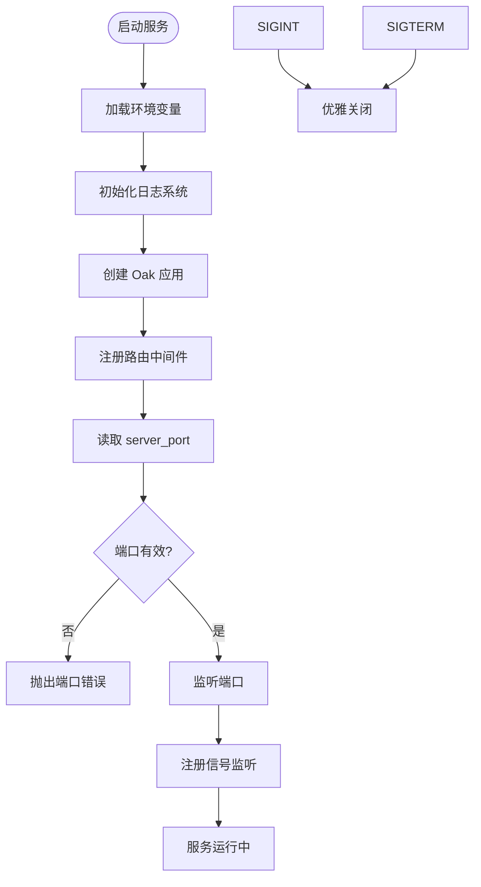
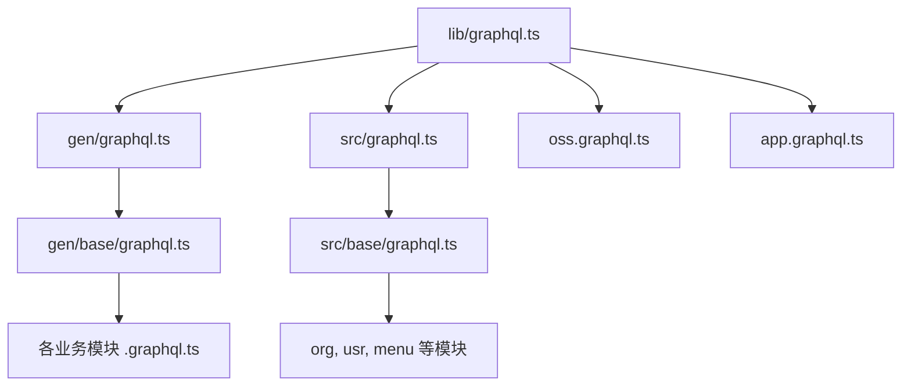
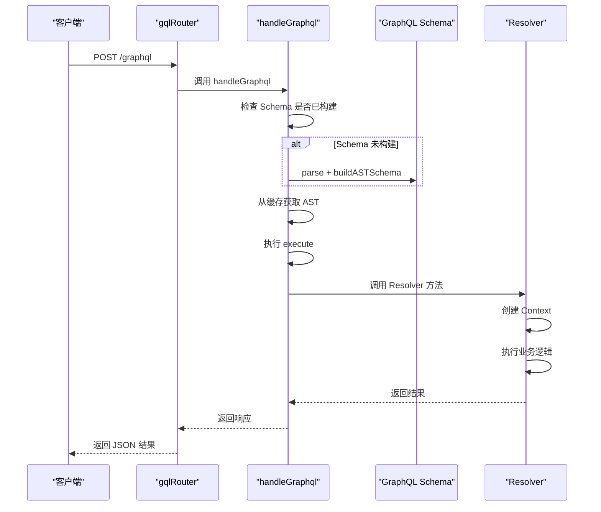
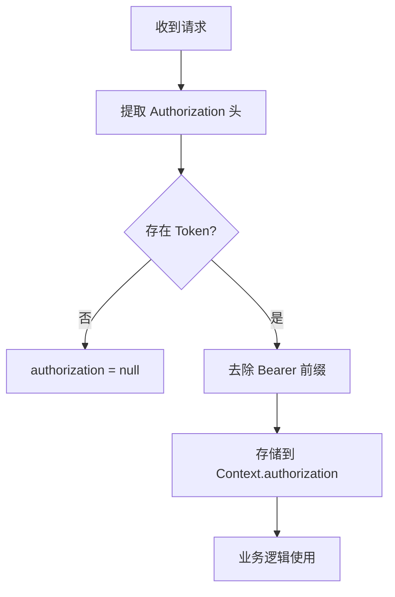
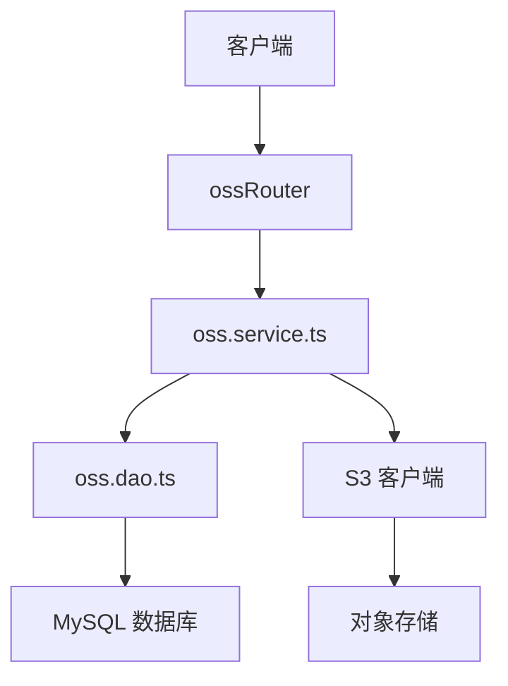
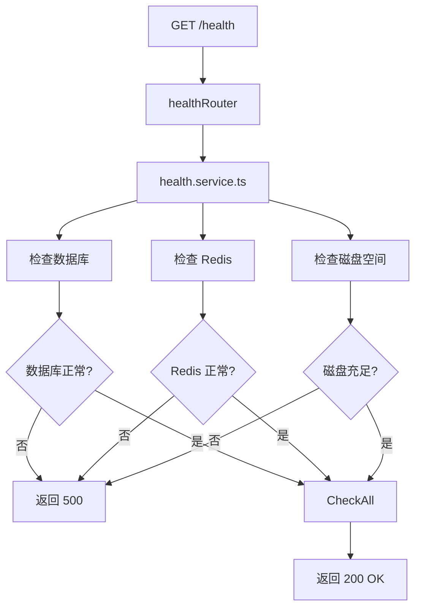
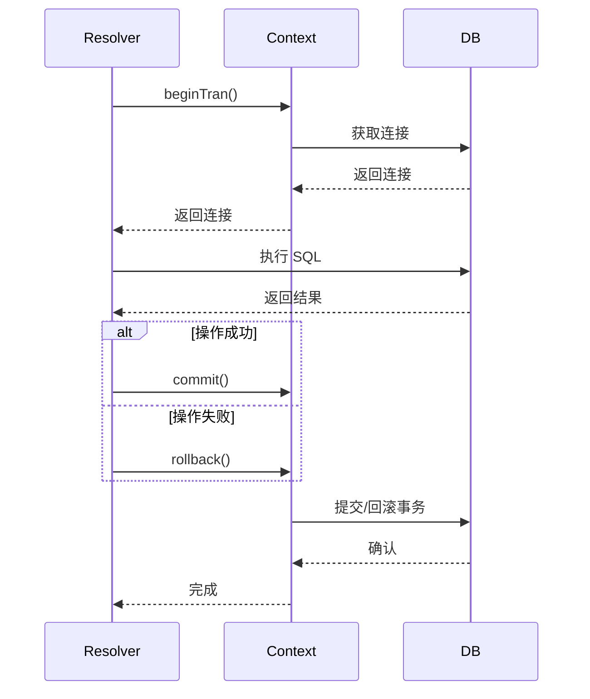

# 后端架构


**本文档引用的文件**  
- [mod.ts](https://github.com/sail-sail/nest/blob/main/deno\mod.ts) - *在最近的提交中更新*  
- [oak/mod.ts](https://github.com/sail-sail/nest/blob/main/deno\lib\oak\mod.ts) - *在最近的提交中更新*  
- [graphql.ts](https://github.com/sail-sail/nest/blob/main/deno\lib\graphql.ts) - *在最近的提交中更新*  
- [gql.ts](https://github.com/sail-sail/nest/blob/main/deno\lib\oak\gql.ts) - *在最近的提交中更新*  
- [context.ts](https://github.com/sail-sail/nest/blob/main/deno\lib\context.ts) - *在最近的提交中更新*  
- [gen/graphql.ts](https://github.com/sail-sail/nest/blob/main/deno\gen\graphql.ts) - *在最近的提交中更新*  
- [src/graphql.ts](https://github.com/sail-sail/nest/blob/main/deno\src\graphql.ts) - *在最近的提交中更新*  
- [base/graphql.ts](https://github.com/sail-sail/nest/blob/main/deno\gen\base\graphql.ts) - *在最近的提交中更新*  
- [src/base/graphql.ts](https://github.com/sail-sail/nest/blob/main/deno\src\base\graphql.ts) - *在最近的提交中更新*  
- [oss.graphql.ts](https://github.com/sail-sail/nest/blob/main/deno\lib\oss\oss.graphql.ts) - *在最近的提交中更新*  
- [app.graphql.ts](https://github.com/sail-sail/nest/blob/main/deno\lib\app\app.graphql.ts) - *在最近的提交中更新*  
- [dict.dao.ts](https://github.com/sail-sail/nest/blob/main/deno\gen\base\dict\dict.dao.ts) - *在提交 5042c7ab583ddbe1d6fdef8d57a2cd1bbf4ba667 中更新*  
- [dept.dao.ts](https://github.com/sail-sail/nest/blob/main/deno\gen\base\dept\dept.dao.ts) - *在提交 17 中更新*  
- [role.dao.ts](https://github.com/sail-sail/nest/blob/main/deno\gen\base\role\role.dao.ts) - *在提交 14 中更新*  


## 更新摘要
**已做更改**  
- 更新了“GraphQL API 设计与实现”部分，以反映在 `dict.dao.ts` 中添加的基于关键词的复杂查询功能。  
- 更新了“认证与授权机制”部分，以包含 `dept.dao.ts` 和 `role.dao.ts` 中外键字段特定搜索模式的支持。  
- 添加了“数据查询增强”新章节，详细说明关键词搜索和外键搜索模式的实现。  
- 更新了所有受影响部分的来源引用，以包含新分析的文件。  

## 目录
1. [服务启动流程](#服务启动流程)  
2. [GraphQL API 设计与实现](#graphql-api-设计与实现)  
3. [认证与授权机制](#认证与授权机制)  
4. [文件服务（OSS）集成](#文件服务oss集成)  
5. [健康检查服务](#健康检查服务)  
6. [上下文与事务管理](#上下文与事务管理)  
7. [性能优化与缓存策略](#性能优化与缓存策略)  
8. [扩展开发指南](#扩展开发指南)  
9. [数据查询增强](#数据查询增强)  

## 服务启动流程

本项目基于 Deno 运行时构建，采用 NestJS 风格的模块化架构。服务入口文件为 `deno/mod.ts`，负责初始化应用、加载环境变量、配置日志并启动 HTTP 服务器。

### 启动流程分析

1. **环境初始化**：导入 `/lib/env.ts` 并初始化日志系统。  
2. **应用初始化**：调用 `initApp()` 创建 Oak 应用实例。  
3. **端口监听**：读取环境变量 `server_port` 和 `server_host`，绑定监听。  
4. **信号监听**：注册 `SIGINT` 和 `SIGTERM` 信号处理，实现优雅关闭。  



**本节来源**  
- [mod.ts](https://github.com/sail-sail/nest/blob/main/deno\mod.ts#L1-L47)

## GraphQL API 设计与实现

系统采用 GraphQL 作为主要 API 协议，通过模块化方式聚合所有 GraphQL Schema 和 Resolver。

### 架构设计

GraphQL Schema 通过多层导入机制聚合：  
- `gen/graphql.ts` 导入所有自动生成的 Schema  
- `src/graphql.ts` 导入业务自定义 Schema  
- `lib/graphql.ts` 统一引入所有模块  



**图示来源**  
- [lib/graphql.ts](https://github.com/sail-sail/nest/blob/main/deno\lib\graphql.ts#L1-L5)  
- [gen/graphql.ts](https://github.com/sail-sail/nest/blob/main/deno\gen\graphql.ts#L1-L2)  
- [src/graphql.ts](https://github.com/sail-sail/nest/blob/main/deno\src\graphql.ts#L1-L2)  

### 请求处理流程

GraphQL 请求通过 `gqlRouter` 处理，核心逻辑在 `gql.ts` 中实现：  

1. 解析请求体或查询参数中的 GraphQL 查询  
2. 使用 LRU 缓存解析后的 AST 和校验结果  
3. 构建 Schema 并执行查询  
4. 通过 `Context` 实现依赖注入和事务管理  



**图示来源**  
- [gql.ts](https://github.com/sail-sail/nest/blob/main/deno\lib\oak\gql.ts#L400-L447)  

**本节来源**  
- [gql.ts](https://github.com/sail-sail/nest/blob/main/deno\lib\oak\gql.ts#L1-L447)  

## 认证与授权机制

系统通过 `Context` 和 `Authorization` 头实现认证授权。

### 认证流程

1. 请求到达时，从 `Authorization` 头或查询参数中提取 Token  
2. 在 `Context` 中存储当前用户信息和租户信息  
3. 业务逻辑通过 `useContext()` 获取当前上下文  



**图示来源**  
- [context.ts](https://github.com/sail-sail/nest/blob/main/deno\lib\context.ts#L500-L520)  

### 权限控制

- 通过 `client_tenant_id` 实现多租户隔离  
- `notVerifyToken` 标志用于调试模式  
- 所有数据库操作均通过 `Context` 关联请求  

**本节来源**  
- [context.ts](https://github.com/sail-sail/nest/blob/main/deno\lib\context.ts#L100-L150)  

## 文件服务OSS集成

文件服务通过 `ossRouter` 提供 RESTful 接口，支持文件上传、下载和管理。

### 集成方式

1. **路由注册**：在 `oak/mod.ts` 中注册 `ossRouter`  
2. **服务实现**：`oss.service.ts` 处理文件存储逻辑  
3. **DAO 层**：`oss.dao.ts` 管理文件元数据  



**图示来源**  
- [oak/mod.ts](https://github.com/sail-sail/nest/blob/main/deno\lib\oak\mod.ts#L10-L15)  
- [oss.graphql.ts](https://github.com/sail-sail/nest/blob/main/deno\lib\oss\oss.graphql.ts)  

## 健康检查服务

健康检查服务通过 `/health` 路由提供系统状态监控。

### 实现方式

1. **路由注册**：`healthRouter` 在 `initApp()` 中注册  
2. **状态检测**：检查数据库连接、缓存服务等  
3. **监控集成**：可用于 Kubernetes Liveness/Readiness 探针  



**图示来源**  
- [oak/mod.ts](https://github.com/sail-sail/nest/blob/main/deno\lib\oak\mod.ts#L14-L15)  
- [health.router.ts](https://github.com/sail-sail/nest/blob/main/deno\lib\health\health.router.ts)  

## 上下文与事务管理

系统通过 `AsyncHooksContextManager` 实现异步上下文传递，确保事务一致性。

### 核心组件

- `Context` 类：存储请求上下文信息  
- `runInAsyncHooks`：在异步链路中传递上下文  
- `beginTran/commit/rollback`：事务管理函数  

### 事务流程



**图示来源**  
- [context.ts](https://github.com/sail-sail/nest/blob/main/deno\lib\context.ts#L600-L700)  

**本节来源**  
- [context.ts](https://github.com/sail-sail/nest/blob/main/deno\lib\context.ts#L1-L1065)  

## 性能优化与缓存策略

系统采用多层缓存和连接池优化性能。

### 优化措施

1. **LRU 缓存**：缓存 GraphQL AST 解析结果  
2. **Redis 缓存**：缓存高频查询数据  
3. **数据库连接池**：复用 MySQL 连接  
4. **异步 Hooks**：避免上下文丢失  

### 缓存操作

- `setCache()`：设置 Redis 哈希缓存  
- `getCache()`：获取缓存数据  
- `delCache()`：删除指定缓存  
- `clearCache()`：清空整个数据库  

**本节来源**  
- [context.ts](https://github.com/sail-sail/nest/blob/main/deno\lib\context.ts#L400-L500)  
- [gql.ts](https://github.com/sail-sail/nest/blob/main/deno\lib\oak\gql.ts#L100-L200)  

## 扩展开发指南

### 添加新业务模块

1. **创建模块目录**：在 `gen/base/` 或 `src/base/` 下创建新模块  
2. **定义 GraphQL Schema**：创建 `.graphql.ts` 文件定义类型  
3. **实现 Resolver**：创建 `.resolver.ts` 实现查询逻辑  
4. **注册服务**：确保在 `graphql.ts` 中导入  

### 最佳实践

- 使用 `defineGraphql()` 注册 Resolver  
- 通过 `Context` 获取请求信息  
- 使用 `beginTran()` 管理事务  
- 利用 `log()` 和 `error()` 记录日志  

**本节来源**  
- [gql.ts](https://github.com/sail-sail/nest/blob/main/deno\lib\oak\gql.ts#L400-L447)  
- [context.ts](https://github.com/sail-sail/nest/blob/main/deno\lib\context.ts)  

## 数据查询增强

根据最近的代码变更，系统增强了数据查询功能，支持更复杂的搜索模式。

### 基于关键词的复杂查询

在 `dict.dao.ts` 中，`getWhereQuery` 函数已更新以支持基于关键词的全文搜索。该功能允许用户在 `code`、`lbl` 和 `rem` 字段中进行模糊匹配。

```typescript
if (isNotEmpty(search?.keyword)) {
  whereQuery += " and (";
  whereQuery += ` t.code like ${ args.push("%" + sqlLike(search?.keyword) + "%") }`;
  whereQuery += " or";
  whereQuery += ` t.lbl like ${ args.push("%" + sqlLike(search?.keyword) + "%") }`;
  whereQuery += " or";
  whereQuery += ` t.rem like ${ args.push("%" + sqlLike(search?.keyword) + "%") }`;
  whereQuery += ")";
}
```

**本节来源**  
- [dict.dao.ts](https://github.com/sail-sail/nest/blob/main/deno\gen\base\dict\dict.dao.ts#L20-L30)  

### 外键字段的特定搜索模式

在 `dept.dao.ts` 和 `role.dao.ts` 中，实现了针对外键字段的特定搜索模式。例如，在 `dept.dao.ts` 中，`parent_id_lbl` 字段支持通过部门名称进行搜索。

```typescript
if (isNotEmpty(input.parent_id_lbl) && input.parent_id == null) {
  input.parent_id_lbl = String(input.parent_id_lbl).trim();
  const deptModel = await findOneDept(
    {
      lbl: input.parent_id_lbl,
    },
    undefined,
    options,
  );
  if (deptModel) {
    input.parent_id = deptModel.id;
  }
}
```

**本节来源**  
- [dept.dao.ts](https://github.com/sail-sail/nest/blob/main/deno\gen\base\dept\dept.dao.ts#L500-L515)  
- [role.dao.ts](https://github.com/sail-sail/nest/blob/main/deno\gen\base\role\role.dao.ts#L500-L515)