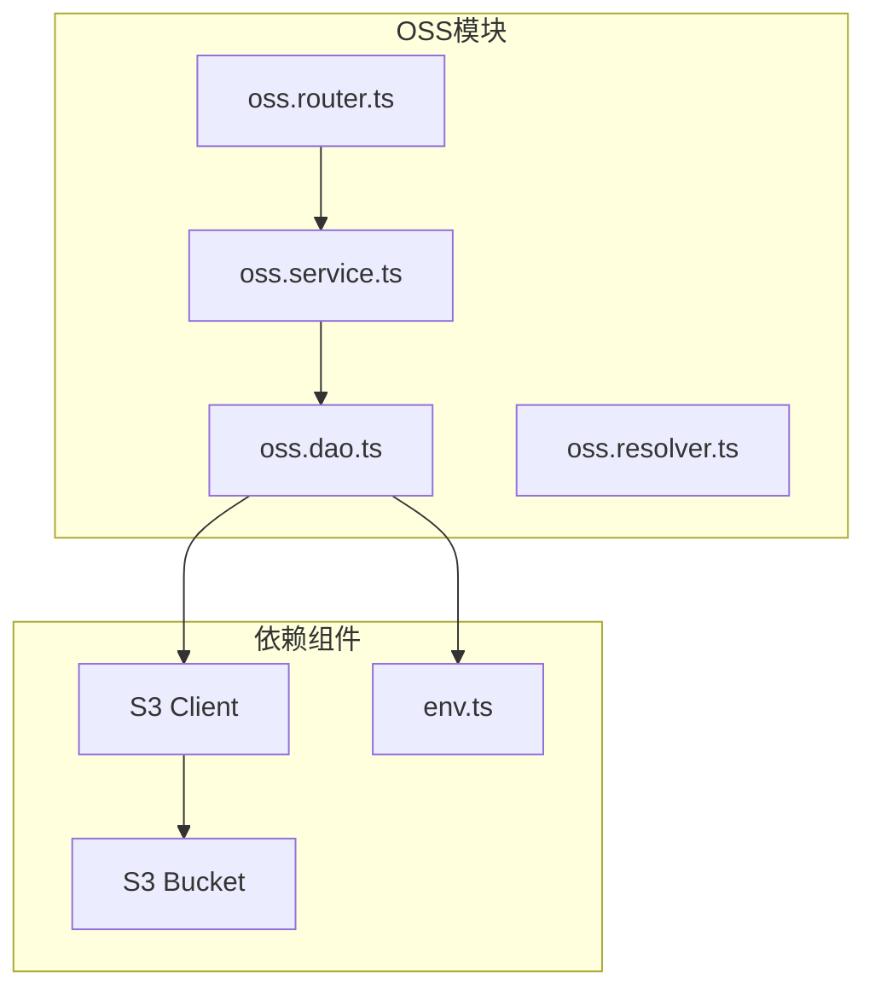
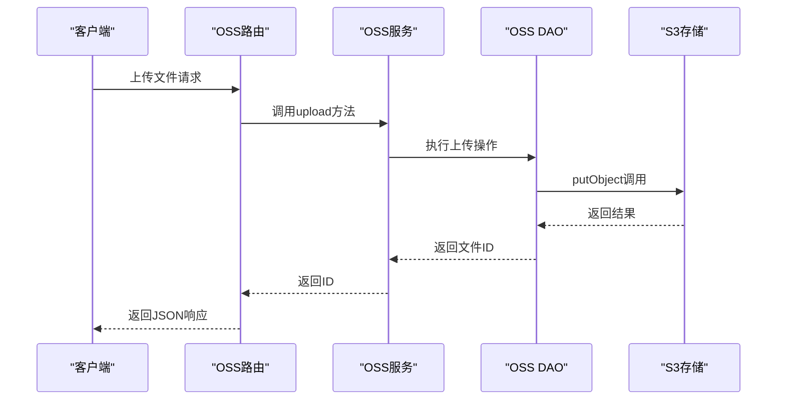
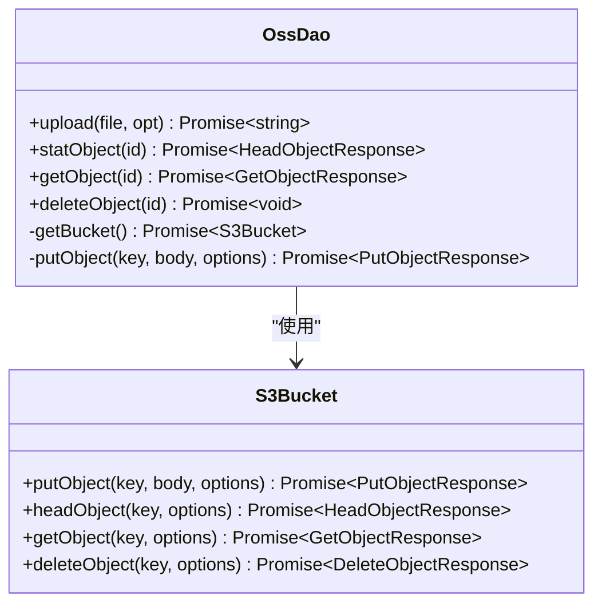
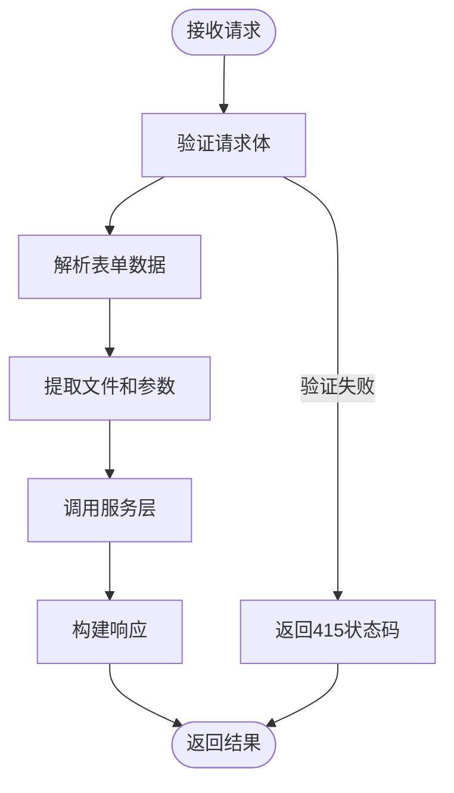
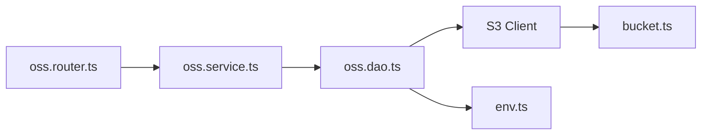

# OSS集成


**本文档引用的文件**  
- [oss.dao.ts](https://github.com/sail-sail/nest/blob/main/deno/lib/oss/oss.dao.ts)
- [oss.service.ts](https://github.com/sail-sail/nest/blob/main/deno/lib/oss/oss.service.ts)
- [oss.router.ts](https://github.com/sail-sail/nest/blob/main/deno/lib/oss/oss.router.ts)
- [oss.resolver.ts](https://github.com/sail-sail/nest/blob/main/deno/lib/oss/oss.resolver.ts)
- [oss.graphql.ts](https://github.com/sail-sail/nest/blob/main/deno/lib/oss/oss.graphql.ts)
- [mod.ts](https://github.com/sail-sail/nest/blob/main/deno/lib/S3/mod.ts)
- [client.ts](https://github.com/sail-sail/nest/blob/main/deno/lib/S3/client.ts)
- [bucket.ts](https://github.com/sail-sail/nest/blob/main/deno/lib/S3/bucket.ts)
- [env.ts](https://github.com/sail-sail/nest/blob/main/deno/lib/env.ts)


## 目录
1. [简介](#简介)
2. [项目结构](#项目结构)
3. [核心组件](#核心组件)
4. [架构概览](#架构概览)
5. [详细组件分析](#详细组件分析)
6. [依赖分析](#依赖分析)
7. [性能考虑](#性能考虑)
8. [故障排除指南](#故障排除指南)
9. [结论](#结论)

## 简介
本文档详细介绍了在Nest项目中集成对象存储服务（OSS）的实现方式。重点涵盖与AWS S3兼容的存储后端配置、文件上传下载、元数据管理、错误处理及性能优化策略。系统基于Deno运行时，采用模块化设计，通过S3协议与对象存储服务进行交互，支持多租户、权限控制和文件缓存功能。

## 项目结构
OSS功能模块位于`deno/lib/oss/`目录下，采用分层架构设计，包含DAO、服务、路由、解析器等组件。系统通过S3客户端与底层存储交互，配置信息从环境变量中读取。



**图示来源**  
- [oss.dao.ts](https://github.com/sail-sail/nest/blob/main/deno/lib/oss/oss.dao.ts)
- [oss.service.ts](https://github.com/sail-sail/nest/blob/main/deno/lib/oss/oss.service.ts)
- [oss.router.ts](https://github.com/sail-sail/nest/blob/main/deno/lib/oss/oss.router.ts)
- [mod.ts](https://github.com/sail-sail/nest/blob/main/deno/lib/S3/mod.ts)
- [env.ts](https://github.com/sail-sail/nest/blob/main/deno/lib/env.ts)

**章节来源**  
- [oss.dao.ts](https://github.com/sail-sail/nest/blob/main/deno/lib/oss/oss.dao.ts)
- [oss.service.ts](https://github.com/sail-sail/nest/blob/main/deno/lib/oss/oss.service.ts)

## 核心组件
OSS模块包含五个核心文件：DAO层负责与S3存储交互，服务层封装业务逻辑，路由层处理HTTP请求，解析器层支持GraphQL查询，环境配置层管理密钥和端点。

**章节来源**  
- [oss.dao.ts](https://github.com/sail-sail/nest/blob/main/deno/lib/oss/oss.dao.ts)
- [oss.service.ts](https://github.com/sail-sail/nest/blob/main/deno/lib/oss/oss.service.ts)
- [oss.router.ts](https://github.com/sail-sail/nest/blob/main/deno/lib/oss/oss.router.ts)

## 架构概览
系统采用典型的分层架构，从HTTP请求到S3存储的完整调用链路清晰。路由层接收请求，服务层协调业务逻辑，DAO层执行具体存储操作。



**图示来源**  
- [oss.router.ts](https://github.com/sail-sail/nest/blob/main/deno/lib/oss/oss.router.ts#L30-L80)
- [oss.service.ts](https://github.com/sail-sail/nest/blob/main/deno/lib/oss/oss.service.ts#L10-L30)
- [oss.dao.ts](https://github.com/sail-sail/nest/blob/main/deno/lib/oss/oss.dao.ts#L50-L100)

## 详细组件分析

### DAO层分析
DAO层直接与S3存储系统交互，封装了上传、下载、删除等基本操作。

#### 类图


**图示来源**  
- [oss.dao.ts](https://github.com/sail-sail/nest/blob/main/deno/lib/oss/oss.dao.ts#L20-L130)
- [bucket.ts](https://github.com/sail-sail/nest/blob/main/deno/lib/S3/bucket.ts#L50-L100)

**章节来源**  
- [oss.dao.ts](https://github.com/sail-sail/nest/blob/main/deno/lib/oss/oss.dao.ts)

### 服务层分析
服务层封装业务逻辑，为上层提供简洁的API接口。

#### 代码示例
```typescript
/**
 * 上传文件
 * @param {File} file
 */
export async function upload(
  file: File,
  opt?: {
    once?: number;
    is_public?: boolean;
    tenant_id?: string;
    db?: string;
    id?: string;
  },
) {
  const result = await ossDao.upload(file, opt);
  return result;
}
```

**章节来源**  
- [oss.service.ts](https://github.com/sail-sail/nest/blob/main/deno/lib/oss/oss.service.ts#L10-L30)

### 路由层分析
路由层处理HTTP请求，实现RESTful API接口。

#### 请求流程图


**图示来源**  
- [oss.router.ts](https://github.com/sail-sail/nest/blob/main/deno/lib/oss/oss.router.ts#L30-L60)

**章节来源**  
- [oss.router.ts](https://github.com/sail-sail/nest/blob/main/deno/lib/oss/oss.router.ts)

### 解析器层分析
解析器层支持GraphQL查询，批量获取文件元数据。

#### 代码示例
```typescript
export async function getStatsOss(
  ids: string[],
) {
  const statInfos = [ ];
  for (let i = 0; i < ids.length; i++) {
    const id = ids[i];
    let lbl = "";
    let stats = undefined;
    try {
      stats = await ossService.statObject(id);
    } catch (err0) {
      const err = err0 as Error;
      if ((err as any).code === "NotFound") {
        lbl = "";
      } else {
        throw err;
      }
    }
    // ... 处理逻辑
  }
  return statInfos;
}
```

**章节来源**  
- [oss.resolver.ts](https://github.com/sail-sail/nest/blob/main/deno/lib/oss/oss.resolver.ts)

## 依赖分析
OSS模块依赖S3客户端库和环境配置模块，形成清晰的依赖关系。



**图示来源**  
- [oss.router.ts](https://github.com/sail-sail/nest/blob/main/deno/lib/oss/oss.router.ts)
- [oss.service.ts](https://github.com/sail-sail/nest/blob/main/deno/lib/oss/oss.service.ts)
- [oss.dao.ts](https://github.com/sail-sail/nest/blob/main/deno/lib/oss/oss.dao.ts)
- [mod.ts](https://github.com/sail-sail/nest/blob/main/deno/lib/S3/mod.ts)
- [env.ts](https://github.com/sail-sail/nest/blob/main/deno/lib/env.ts)

**章节来源**  
- [oss.router.ts](https://github.com/sail-sail/nest/blob/main/deno/lib/oss/oss.router.ts)
- [oss.service.ts](https://github.com/sail-sail/nest/blob/main/deno/lib/oss/oss.service.ts)
- [oss.dao.ts](https://github.com/sail-sail/nest/blob/main/deno/lib/oss/oss.dao.ts)

## 性能考虑
系统在性能方面有以下优化措施：
- 使用连接池管理S3连接
- 实现图片缩略图缓存机制
- 支持HTTP 304缓存验证
- 异步处理文件操作

## 故障排除指南
常见问题及解决方案：

1. **文件上传失败**
   - 检查环境变量`oss_accesskey`、`oss_secretkey`、`oss_endpoint`是否正确配置
   - 确认S3服务端点可访问

2. **权限错误**
   - 检查租户ID是否匹配
   - 确认文件访问权限设置

3. **网络超时**
   - 检查网络连接
   - 增加请求超时时间

**章节来源**  
- [oss.dao.ts](https://github.com/sail-sail/nest/blob/main/deno/lib/oss/oss.dao.ts)
- [oss.router.ts](https://github.com/sail-sail/nest/blob/main/deno/lib/oss/oss.router.ts)

## 结论
OSS集成模块提供了完整的对象存储解决方案，支持文件上传、下载、删除和元数据管理。系统设计合理，层次分明，易于维护和扩展。通过S3协议兼容性，可对接多种存储后端，具有良好的通用性和灵活性。