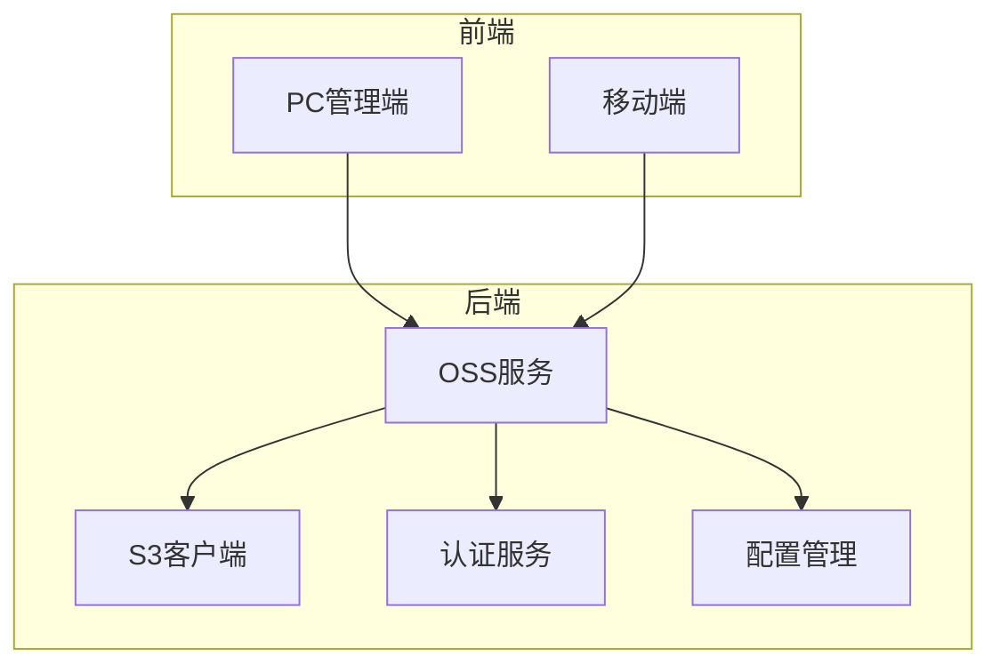
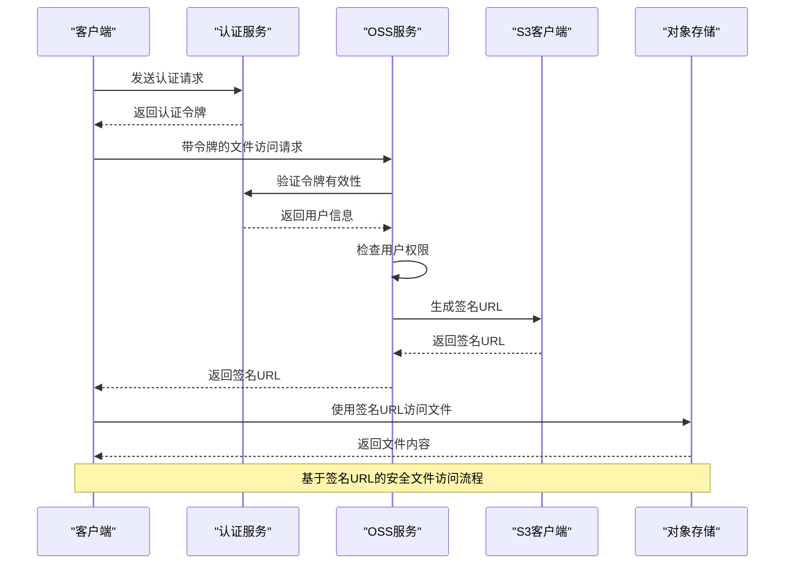
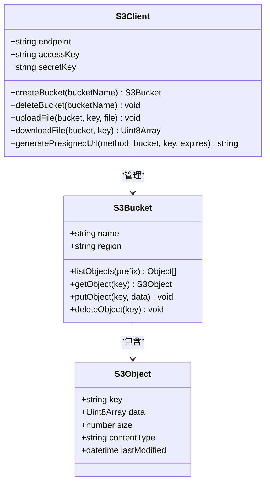
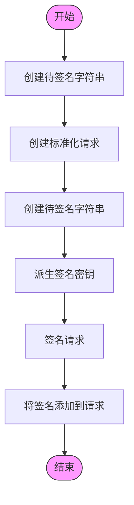
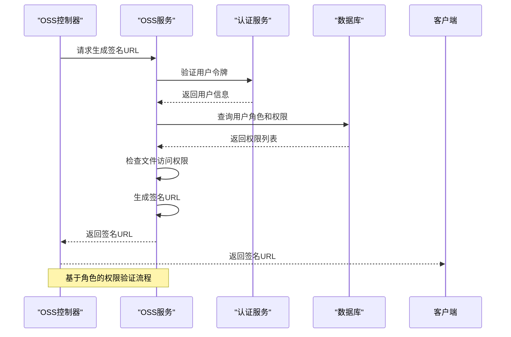
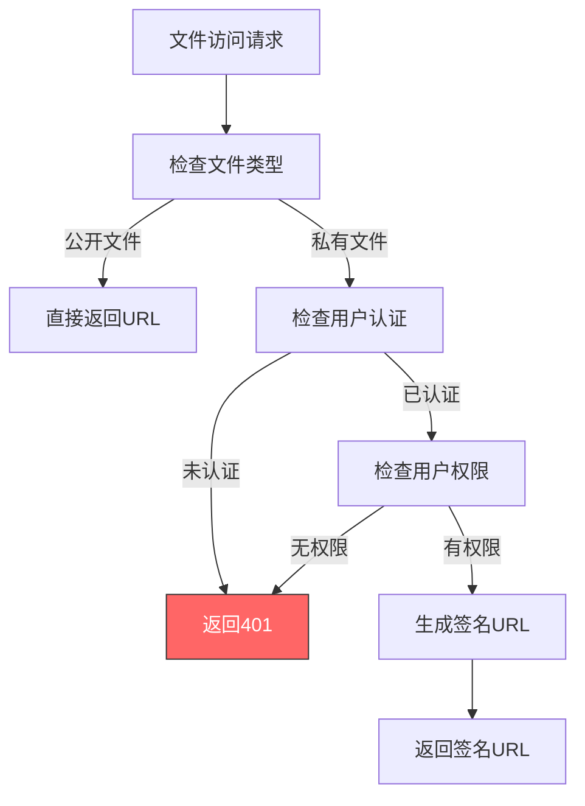
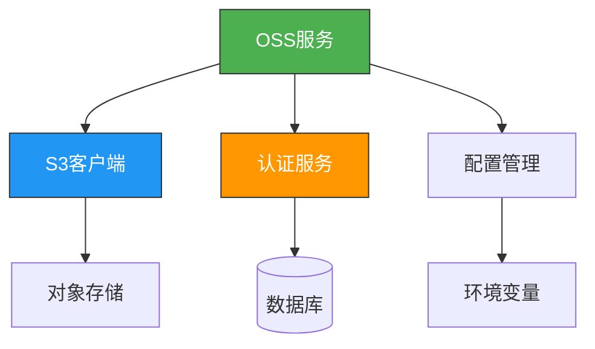

# 安全文件访问

**本文档引用的文件**   
- [client.ts](https://github.com/sail-sail/nest/blob/main/deno\lib\S3\client.ts)
- [request.ts](https://github.com/sail-sail/nest/blob/main/deno\lib\S3\request.ts)
- [signing.ts](https://github.com/sail-sail/nest/blob/main/deno\lib\S3\aws_sign_v4\signing.ts)
- [oss.service.ts](https://github.com/sail-sail/nest/blob/main/deno\lib\oss\oss.service.ts)
- [oss.router.ts](https://github.com/sail-sail/nest/blob/main/deno\lib\oss\oss.router.ts)
- [config.ts](https://github.com/sail-sail/nest/blob/main/codegen\src\lib\nest_config.ts)
- [build.ts](https://github.com/sail-sail/nest/blob/main/deno\lib\script\build.ts)
- [permit_scan.js](https://github.com/sail-sail/nest/blob/main/pc\src\utils\permit_scan.js)
- [auth.service.ts](https://github.com/sail-sail/nest/blob/main/deno\lib\auth\auth.service.ts)

## 目录
1. [简介](#简介)
2. [项目结构](#项目结构)
3. [核心组件](#核心组件)
4. [架构概述](#架构概述)
5. [详细组件分析](#详细组件分析)
6. [依赖分析](#依赖分析)
7. [性能考虑](#性能考虑)
8. [故障排除指南](#故障排除指南)
9. [结论](#结论)

## 简介
本文档详细阐述了基于签名URL机制的安全文件访问系统实现方案。系统采用AWS S3兼容的OSS（对象存储服务）作为底层存储，通过V4签名算法确保访问安全。文档重点介绍基于用户角色和权限的访问控制机制、私有与公开文件的区分管理策略，以及防止路径遍历、恶意上传等常见安全威胁的措施。系统集成了认证服务，确保所有文件操作都经过严格的身份验证和权限校验。

## 项目结构
项目采用分层架构设计，主要分为codegen（代码生成）、deno（运行时核心）、pc（管理前端）和uni（移动端）四个模块。安全文件访问的核心逻辑位于`deno/lib/oss`和`deno/lib/S3`目录下，其中`S3`模块提供了与对象存储交互的底层API，`oss`模块则封装了业务层面的文件访问控制逻辑。

**图示来源**
- [oss.service.ts](https://github.com/sail-sail/nest/blob/main/deno\lib\oss\oss.service.ts)
- [client.ts](https://github.com/sail-sail/nest/blob/main/deno\lib\S3\client.ts)

**本节来源**
- [oss.service.ts](https://github.com/sail-sail/nest/blob/main/deno\lib\oss\oss.service.ts)
- [client.ts](https://github.com/sail-sail/nest/blob/main/deno\lib\S3\client.ts)

## 核心组件
系统的核心组件包括S3客户端、OSS服务、认证服务和配置管理。S3客户端实现了与对象存储的通信，OSS服务封装了文件访问的业务逻辑，认证服务负责用户身份验证，配置管理则提供系统运行时的环境配置。

**本节来源**
- [client.ts](https://github.com/sail-sail/nest/blob/main/deno\lib\S3\client.ts)
- [oss.service.ts](https://github.com/sail-sail/nest/blob/main/deno\lib\oss\oss.service.ts)
- [auth.service.ts](https://github.com/sail-sail/nest/blob/main/deno\lib\auth\auth.service.ts)
- [config.ts](https://github.com/sail-sail/nest/blob/main/codegen\src\lib\nest_config.ts)

## 架构概述
系统采用微服务架构，通过RESTful API提供文件访问服务。所有文件操作请求首先经过认证中间件进行身份验证，然后由OSS服务根据用户权限生成相应的签名URL，最终通过S3客户端与对象存储进行交互。

**图示来源**
- [auth.service.ts](https://github.com/sail-sail/nest/blob/main/deno\lib\auth\auth.service.ts)
- [oss.service.ts](https://github.com/sail-sail/nest/blob/main/deno\lib\oss\oss.service.ts)
- [client.ts](https://github.com/sail-sail/nest/blob/main/deno\lib\S3\client.ts)

## 详细组件分析

### S3客户端分析
S3客户端是系统与对象存储交互的底层组件，实现了AWS S3 API的兼容接口。

#### 类图分析

**图示来源**
- [client.ts](https://github.com/sail-sail/nest/blob/main/deno\lib\S3\client.ts)
- [bucket.ts](https://github.com/sail-sail/nest/blob/main/deno\lib\S3\bucket.ts)

#### 签名算法分析
系统采用AWS Signature Version 4算法生成签名URL，确保请求的完整性和安全性。

**图示来源**
- [signing.ts](https://github.com/sail-sail/nest/blob/main/deno\lib\S3\aws_sign_v4\signing.ts)
- [request.ts](https://github.com/sail-sail/nest/blob/main/deno\lib\S3\request.ts)

**本节来源**
- [client.ts](https://github.com/sail-sail/nest/blob/main/deno\lib\S3\client.ts)
- [signing.ts](https://github.com/sail-sail/nest/blob/main/deno\lib\S3\aws_sign_v4\signing.ts)

### OSS服务分析
OSS服务是文件访问控制的核心业务逻辑层，负责权限验证和URL生成。

#### 权限验证流程

**图示来源**
- [oss.service.ts](https://github.com/sail-sail/nest/blob/main/deno\lib\oss\oss.service.ts)
- [auth.service.ts](https://github.com/sail-sail/nest/blob/main/deno\lib\auth\auth.service.ts)

#### 文件类型区分策略
系统通过配置区分私有文件和公开文件的管理策略：

**图示来源**
- [oss.service.ts](https://github.com/sail-sail/nest/blob/main/deno\lib\oss\oss.service.ts)
- [config.ts](https://github.com/sail-sail/nest/blob/main/codegen\src\lib\nest_config.ts)

**本节来源**
- [oss.service.ts](https://github.com/sail-sail/nest/blob/main/deno\lib\oss\oss.service.ts)
- [oss.router.ts](https://github.com/sail-sail/nest/blob/main/deno\lib\oss\oss.router.ts)

## 依赖分析
系统各组件之间的依赖关系清晰，遵循高内聚低耦合的设计原则。

**图示来源**
- [package.json](https://github.com/sail-sail/nest/blob/main/deno\package.json)
- [mod.ts](https://github.com/sail-sail/nest/blob/main/deno\mod.ts)

**本节来源**
- [oss.service.ts](https://github.com/sail-sail/nest/blob/main/deno\lib\oss\oss.service.ts)
- [auth.service.ts](https://github.com/sail-sail/nest/blob/main/deno\lib\auth\auth.service.ts)

## 性能考虑
系统在设计时充分考虑了性能优化，通过缓存机制、连接池和异步处理提高响应速度。签名URL的有效期设置合理，既保证了安全性又减少了频繁生成签名的开销。

## 故障排除指南
常见问题及解决方案：

1. **签名URL无效**：检查系统时间是否准确，AWS V4签名对时间敏感
2. **权限不足**：确认用户角色是否具有相应文件的访问权限
3. **文件上传失败**：检查OSS配置中的存储桶名称和访问密钥
4. **跨域问题**：确保CORS策略正确配置

**本节来源**
- [oss.service.ts](https://github.com/sail-sail/nest/blob/main/deno\lib\oss\oss.service.ts)
- [error.ts](https://github.com/sail-sail/nest/blob/main/deno\lib\S3\error.ts)

## 结论
本文档详细介绍了安全文件访问系统的实现方案。系统通过基于签名URL的访问模式、严格的权限验证机制和完善的配置管理，实现了安全可靠的文件访问控制。建议在生产环境中启用HTTPS、设置严格的CORS策略并实施速率限制，以进一步提升系统安全性。