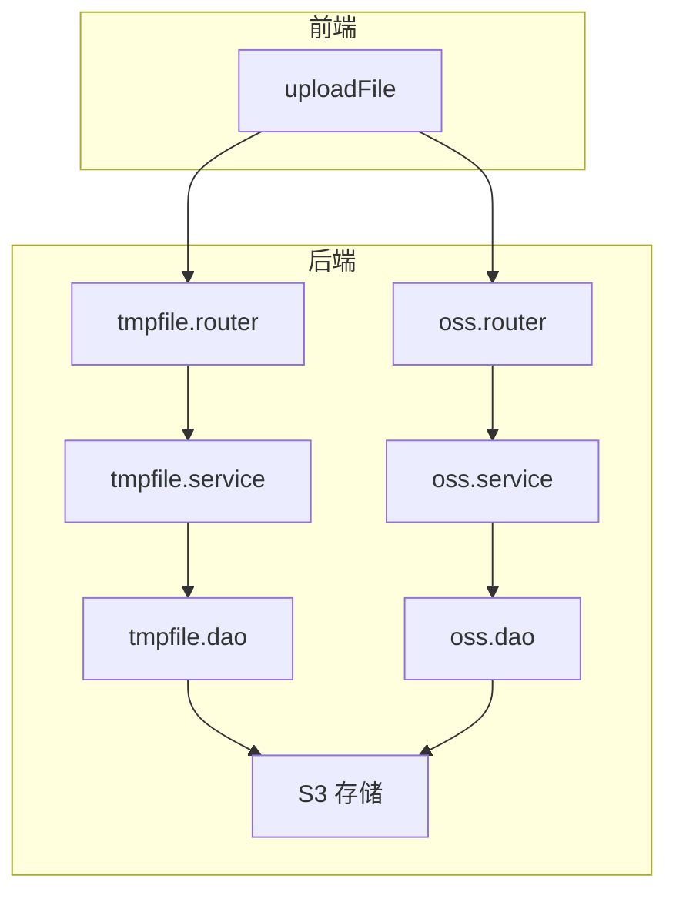
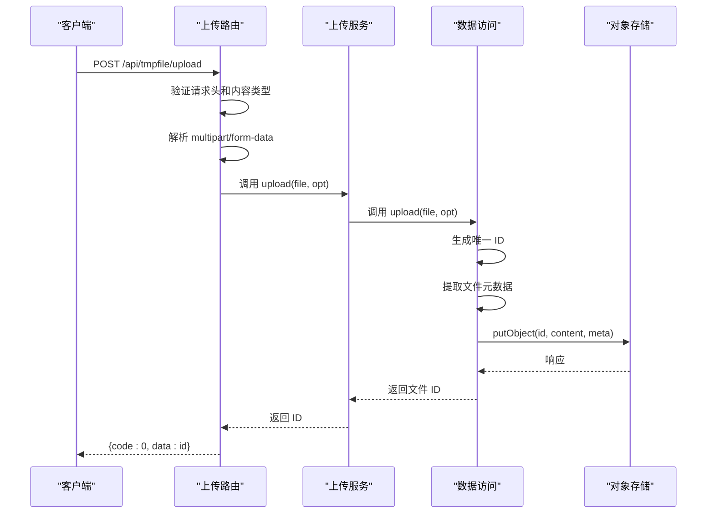
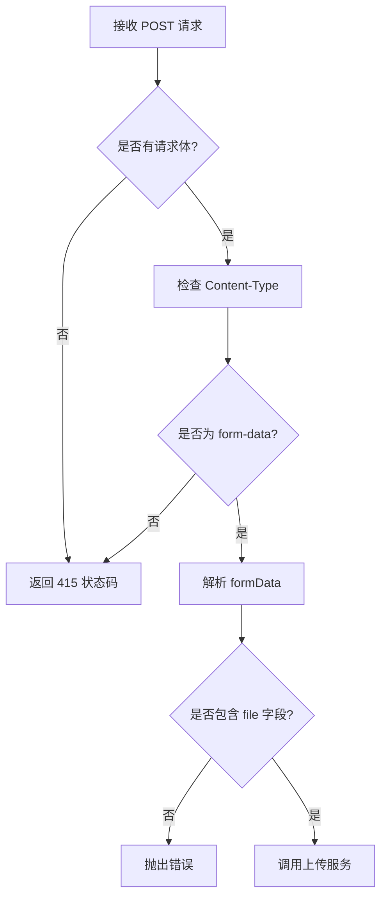
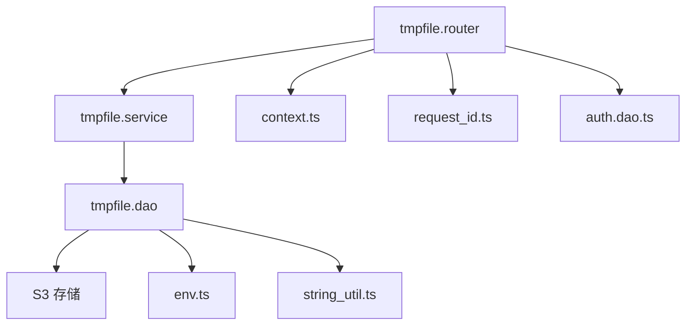

# 文件上传流程


**本文档引用文件**   
- [tmpfile.service.ts](https://github.com/sail-sail/nest/blob/main/deno/lib/tmpfile/tmpfile.service.ts)
- [tmpfile.dao.ts](https://github.com/sail-sail/nest/blob/main/deno/lib/tmpfile/tmpfile.dao.ts)
- [tmpfile.router.ts](https://github.com/sail-sail/nest/blob/main/deno/lib/tmpfile/tmpfile.router.ts)
- [oss.service.ts](https://github.com/sail-sail/nest/blob/main/deno/lib/oss/oss.service.ts)
- [oss.dao.ts](https://github.com/sail-sail/nest/blob/main/deno/lib/oss/oss.dao.ts)
- [oss.router.ts](https://github.com/sail-sail/nest/blob/main/deno/lib/oss/oss.router.ts)
- [request.ts](https://github.com/sail-sail/nest/blob/main/pc/src/utils/request.ts)


## 目录
1. [简介](#简介)
2. [项目结构](#项目结构)
3. [核心组件](#核心组件)
4. [架构概览](#架构概览)
5. [详细组件分析](#详细组件分析)
6. [依赖分析](#依赖分析)
7. [性能考虑](#性能考虑)
8. [故障排除指南](#故障排除指南)
9. [结论](#结论)

## 简介
本文档详细描述了基于 Nest.js 和 Deno 构建的文件上传系统，涵盖从客户端请求到文件持久化存储的完整处理流程。系统通过 `tmpfile` 和 `oss` 两个模块分别管理临时文件和永久文件的上传、存储与访问。文档重点分析了文件上传接口的请求处理逻辑、临时文件管理机制、元数据提取与存储、错误处理策略以及大文件优化方案。

## 项目结构
文件上传功能主要分布在 `deno/lib/tmpfile` 和 `deno/lib/oss` 两个目录中，分别处理临时文件和对象存储服务。前端通过 `pc/src/utils/request.ts` 提供的 `uploadFile` 方法发起上传请求。



**图示来源**
- [tmpfile.router.ts](https://github.com/sail-sail/nest/blob/main/deno/lib/tmpfile/tmpfile.router.ts)
- [oss.router.ts](https://github.com/sail-sail/nest/blob/main/deno/lib/oss/oss.router.ts)
- [request.ts](https://github.com/sail-sail/nest/blob/main/pc/src/utils/request.ts)

**本节来源**
- [tmpfile.router.ts](https://github.com/sail-sail/nest/blob/main/deno/lib/tmpfile/tmpfile.router.ts)
- [oss.router.ts](https://github.com/sail-sail/nest/blob/main/deno/lib/oss/oss.router.ts)

## 核心组件
系统由三大核心组件构成：路由层（Router）、服务层（Service）和数据访问层（DAO）。路由层负责接收 HTTP 请求并进行初步验证；服务层封装业务逻辑；DAO 层负责与 S3 兼容的对象存储进行交互。

**本节来源**
- [tmpfile.service.ts](https://github.com/sail-sail/nest/blob/main/deno/lib/tmpfile/tmpfile.service.ts)
- [tmpfile.dao.ts](https://github.com/sail-sail/nest/blob/main/deno/lib/tmpfile/tmpfile.dao.ts)
- [tmpfile.router.ts](https://github.com/sail-sail/nest/blob/main/deno/lib/tmpfile/tmpfile.router.ts)

## 架构概览
系统采用分层架构，客户端通过 RESTful API 与服务器通信，服务器将文件存储至 S3 兼容的对象存储系统。上传流程包含内容类型验证、元数据提取、唯一 ID 生成和对象存储写入。



**图示来源**
- [tmpfile.router.ts](https://github.com/sail-sail/nest/blob/main/deno/lib/tmpfile/tmpfile.router.ts#L0-L57)
- [tmpfile.service.ts](https://github.com/sail-sail/nest/blob/main/deno/lib/tmpfile/tmpfile.service.ts#L0-L36)
- [tmpfile.dao.ts](https://github.com/sail-sail/nest/blob/main/deno/lib/tmpfile/tmpfile.dao.ts#L0-L116)

## 详细组件分析

### 上传请求处理流程
上传接口首先验证请求是否包含 `form-data` 类型的请求体，然后解析表单数据获取文件对象。系统支持通过 URL 参数传递数据库标识（db）和租户信息。

#### 请求验证与解析


**图示来源**
- [tmpfile.router.ts](https://github.com/sail-sail/nest/blob/main/deno/lib/tmpfile/tmpfile.router.ts#L10-L45)

**本节来源**
- [tmpfile.router.ts](https://github.com/sail-sail/nest/blob/main/deno/lib/tmpfile/tmpfile.router.ts#L10-L45)

### 临时文件服务管理机制
`tmpfile` 模块专门管理临时文件的生命周期，包括创建、存储和自动清理。文件元数据中包含 `once` 标志位，用于指示文件是否为一次性使用。

#### 临时文件元数据结构
- **filename**: URL 编码的原始文件名
- **db**: 关联的数据库标识
- **is_public**: 是否公开访问（"0" 或 "1"）
- **tenant_id**: 租户标识
- **once**: 一次性使用标志（可选）

当文件以 `once=1` 上传时，系统在首次下载后自动删除该文件。

**本节来源**
- [tmpfile.dao.ts](https://github.com/sail-sail/nest/blob/main/deno/lib/tmpfile/tmpfile.dao.ts#L45-L55)

### 文件元数据提取与存储
系统在上传过程中自动提取并存储文件的多种元数据：
- **文件名**: 从 `File.name` 获取并进行 URL 编码
- **大小**: 通过 `file.arrayBuffer()` 获取
- **MIME 类型**: 从 `file.type` 获取
- **哈希值**: 由 S3 存储系统自动生成 ETag
- **自定义元数据**: 包括租户 ID、数据库标识等

```typescript
const meta: {
  filename?: string;
  db?: string;
  is_public: "0" | "1";
  tenant_id?: string;
} = {
  db,
  is_public,
  tenant_id,
};
if (file.name) {
  meta.filename = encodeURIComponent(file.name);
}
```

**本节来源**
- [tmpfile.dao.ts](https://github.com/sail-sail/nest/blob/main/deno/lib/tmpfile/tmpfile.dao.ts#L45-L55)

### 大文件上传优化方案
系统采用流式处理机制，避免将整个文件加载到内存中。通过 `request.body.formData()` 异步解析表单数据，支持大文件上传而不会导致内存溢出。

#### 内存使用控制
- 使用 `Uint8Array` 和 `ArrayBuffer` 进行二进制数据处理
- 通过 `ReadableStream` 实现流式传输
- 文件内容在处理完成后立即释放引用


**本节来源**
- [tmpfile.dao.ts](https://github.com/sail-sail/nest/blob/main/deno/lib/tmpfile/tmpfile.dao.ts#L35-L40)

### 错误处理最佳实践
系统实现了全面的错误处理机制，包括：
- **客户端验证**: 检查请求体和文件类型
- **服务端异常捕获**: 使用 try-catch 捕获 S3 操作异常
- **标准化错误响应**: 返回统一格式的错误信息

```typescript
catch(_err: unknown) {
  const err = _err as S3Error;
  error("oss.upload S3Error: " + err.response);
}
```

对于文件不存在的情况，系统抛出带有 `code: "NotFound"` 的错误对象，由路由层统一处理为 404 响应。

**本节来源**
- [tmpfile.dao.ts](https://github.com/sail-sail/nest/blob/main/deno/lib/tmpfile/tmpfile.dao.ts#L70-L75)
- [tmpfile.router.ts](https://github.com/sail-sail/nest/blob/main/deno/lib/tmpfile/tmpfile.router.ts#L100-L120)

## 依赖分析
系统依赖于多个核心模块和外部服务：



**图示来源**
- [tmpfile.router.ts](https://github.com/sail-sail/nest/blob/main/deno/lib/tmpfile/tmpfile.router.ts)
- [tmpfile.service.ts](https://github.com/sail-sail/nest/blob/main/deno/lib/tmpfile/tmpfile.service.ts)
- [tmpfile.dao.ts](https://github.com/sail-sail/nest/blob/main/deno/lib/tmpfile/tmpfile.dao.ts)

**本节来源**
- [tmpfile.router.ts](https://github.com/sail-sail/nest/blob/main/deno/lib/tmpfile/tmpfile.router.ts)
- [tmpfile.service.ts](https://github.com/sail-sail/nest/blob/main/deno/lib/tmpfile/tmpfile.service.ts)
- [tmpfile.dao.ts](https://github.com/sail-sail/nest/blob/main/deno/lib/tmpfile/tmpfile.dao.ts)

## 性能考虑
- **连接复用**: `getBucket()` 函数缓存 S3 存储桶实例，避免重复创建连接
- **异步处理**: 所有 I/O 操作均采用异步方式，提高并发处理能力
- **缓存机制**: `oss.router` 中的图片服务支持缩略图缓存，减少重复计算
- **ETag 支持**: 实现 HTTP 缓存验证，减少带宽消耗

## 故障排除指南
常见问题及解决方案：

| 问题现象 | 可能原因 | 解决方案 |
|--------|--------|--------|
| 返回 415 状态码 | 请求类型不是 form-data | 检查 Content-Type 头部 |
| 文件上传失败 | S3 配置错误 | 检查 tmpfile_accesskey、tmpfile_secretkey 等环境变量 |
| 文件无法下载 | 权限不足 | 确认租户 ID 匹配或设置为公开访问 |
| 文件名乱码 | 未正确编码 | 确保文件名经过 encodeURIComponent 处理 |

**本节来源**
- [tmpfile.router.ts](https://github.com/sail-sail/nest/blob/main/deno/lib/tmpfile/tmpfile.router.ts#L25-L30)
- [tmpfile.dao.ts](https://github.com/sail-sail/nest/blob/main/deno/lib/tmpfile/tmpfile.dao.ts#L6-L15)
- [env.ts](https://github.com/sail-sail/nest/blob/main/deno/lib/env.ts)

## 结论
本文件上传系统设计合理，具备完整的功能覆盖和良好的扩展性。通过分层架构实现了关注点分离，利用 S3 兼容存储确保了数据的可靠性和可扩展性。系统支持临时文件和永久文件的差异化管理，提供了完善的错误处理和性能优化机制，能够满足企业级应用的需求。