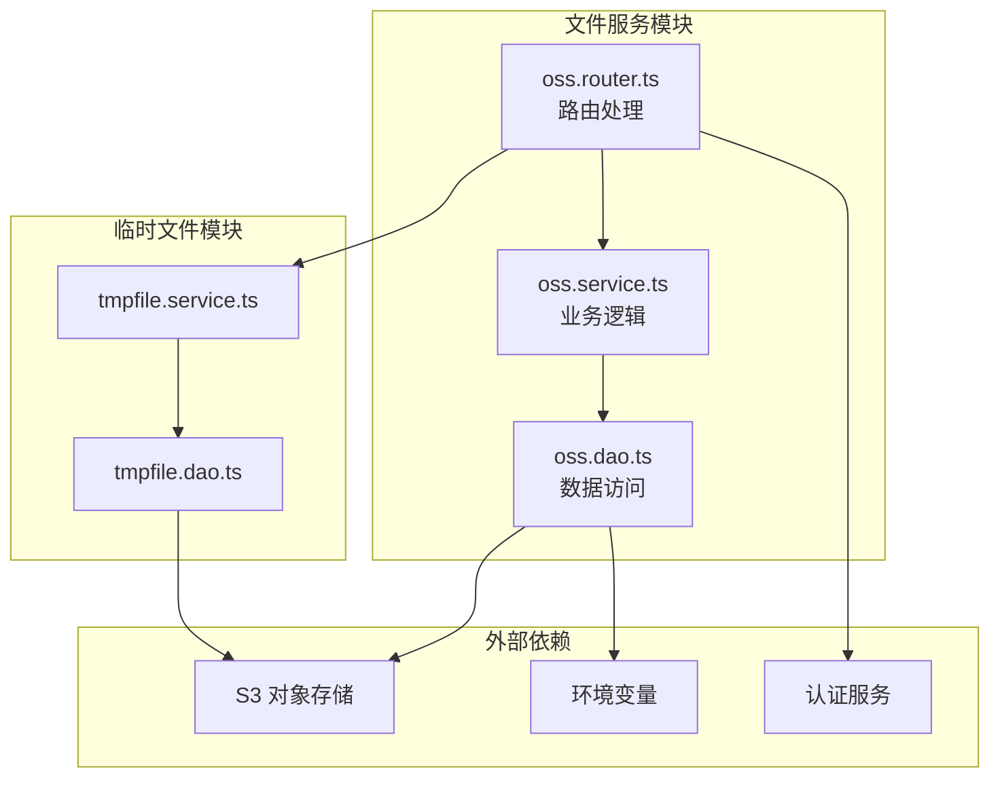
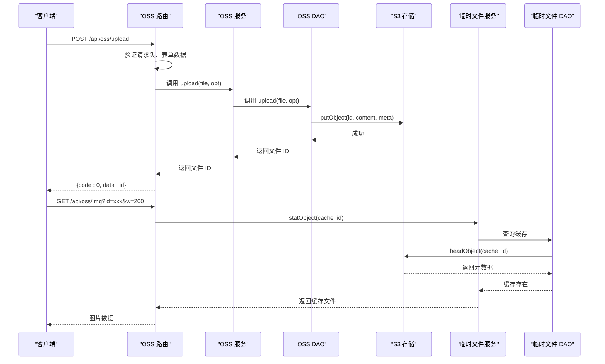
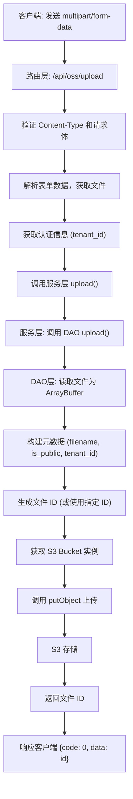
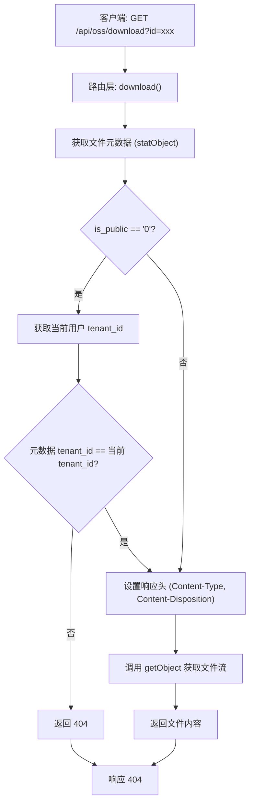
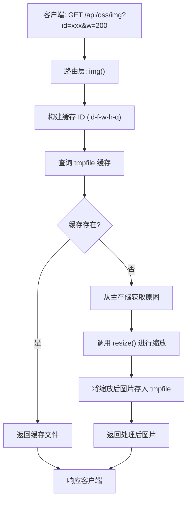
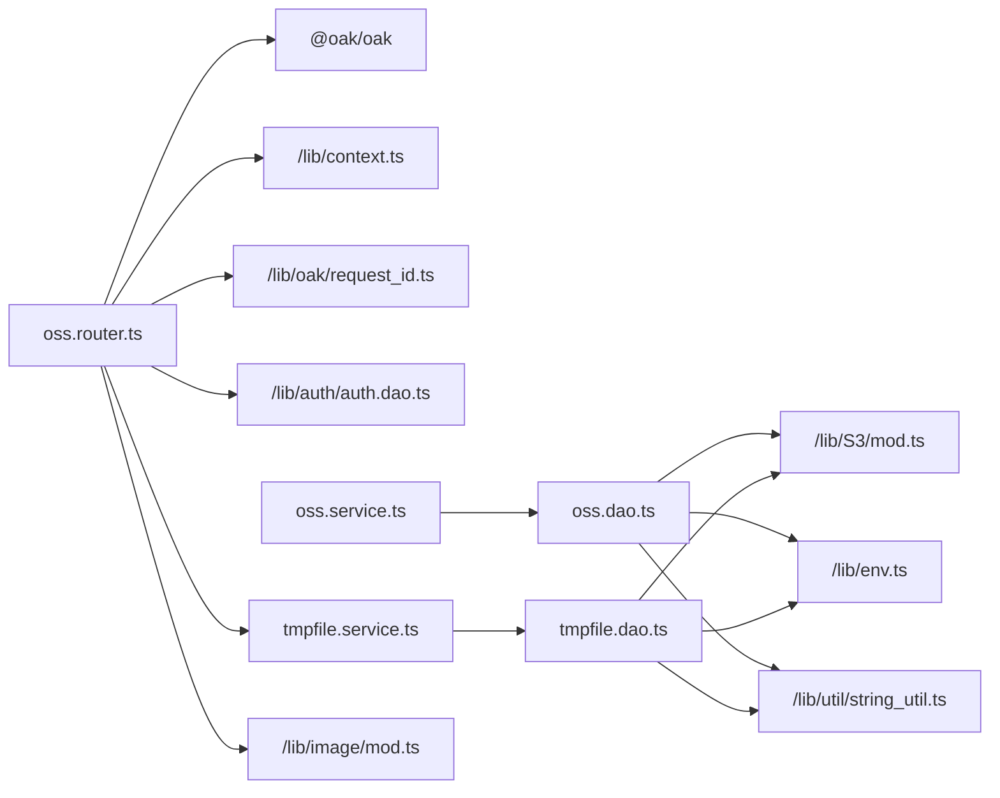

# 文件服务

**本文档引用文件**  
- [oss.dao.ts](https://github.com/sail-sail/nest/blob/main/deno\lib\oss\oss.dao.ts)
- [oss.service.ts](https://github.com/sail-sail/nest/blob/main/deno\lib\oss\oss.service.ts)
- [oss.router.ts](https://github.com/sail-sail/nest/blob/main/deno\lib\oss\oss.router.ts)
- [tmpfile.dao.ts](https://github.com/sail-sail/nest/blob/main/deno\lib\tmpfile\tmpfile.dao.ts)
- [tmpfile.service.ts](https://github.com/sail-sail/nest/blob/main/deno\lib\tmpfile\tmpfile.service.ts)

## 目录
1. [简介](#简介)
2. [项目结构](#项目结构)
3. [核心组件](#核心组件)
4. [架构概览](#架构概览)
5. [详细组件分析](#详细组件分析)
6. [依赖分析](#依赖分析)
7. [性能考虑](#性能考虑)
8. [故障排除指南](#故障排除指南)
9. [结论](#结论)

## 简介
本文档详细描述了基于 Nest 框架的文件服务实现方案，涵盖文件上传、存储、访问控制、安全机制及图像处理功能。系统通过集成 AWS S3 兼容的对象存储服务（OSS），实现了高效、安全的文件管理。文档重点解析了文件上传流程、权限控制机制、临时文件处理以及图片动态缩放与缓存策略，为开发者提供完整的扩展指导。

## 项目结构
文件服务相关代码位于 `deno/lib/oss` 和 `deno/lib/tmpfile` 目录下，采用分层架构设计，包含路由、服务、数据访问对象（DAO）三层。`oss` 模块负责主文件存储，`tmpfile` 模块用于缓存处理后的临时文件（如缩略图）。系统通过环境变量配置 OSS 连接参数，支持多租户隔离。

**图示来源**  
- [oss.router.ts](https://github.com/sail-sail/nest/blob/main/deno\lib\oss\oss.router.ts)
- [oss.service.ts](https://github.com/sail-sail/nest/blob/main/deno\lib\oss\oss.service.ts)
- [oss.dao.ts](https://github.com/sail-sail/nest/blob/main/deno\lib\oss\oss.dao.ts)
- [tmpfile.service.ts](https://github.com/sail-sail/nest/blob/main/deno\lib\tmpfile\tmpfile.service.ts)
- [tmpfile.dao.ts](https://github.com/sail-sail/nest/blob/main/deno\lib\tmpfile\tmpfile.dao.ts)

## 核心组件
文件服务的核心组件包括：
- **OSS DAO**：直接与 S3 存储交互，执行文件的上传、下载、元数据查询和删除操作。
- **OSS 服务**：封装业务逻辑，调用 DAO 层方法，提供统一的文件操作接口。
- **OSS 路由**：处理 HTTP 请求，验证权限，调用服务层，并返回响应。
- **临时文件模块**：用于缓存处理后的文件（如缩略图），避免重复计算。

**组件来源**  
- [oss.dao.ts](https://github.com/sail-sail/nest/blob/main/deno\lib\oss\oss.dao.ts)
- [oss.service.ts](https://github.com/sail-sail/nest/blob/main/deno\lib\oss\oss.service.ts)
- [oss.router.ts](https://github.com/sail-sail/nest/blob/main/deno\lib\oss\oss.router.ts)
- [tmpfile.dao.ts](https://github.com/sail-sail/nest/blob/main/deno\lib\tmpfile\tmpfile.dao.ts)

## 架构概览
系统采用典型的三层架构，前端通过 API 路由发起文件操作请求。路由层负责解析请求、验证身份和权限。服务层协调业务逻辑，DAO 层与底层 S3 存储进行实际的数据交互。对于图片处理，系统利用 `lib/image` 模块进行缩放，并将结果缓存到 `tmpfile` 存储桶中，实现高效访问。

**图示来源**  
- [oss.router.ts](https://github.com/sail-sail/nest/blob/main/deno\lib\oss\oss.router.ts)
- [oss.service.ts](https://github.com/sail-sail/nest/blob/main/deno\lib\oss\oss.service.ts)
- [oss.dao.ts](https://github.com/sail-sail/nest/blob/main/deno\lib\oss\oss.dao.ts)
- [tmpfile.service.ts](https://github.com/sail-sail/nest/blob/main/deno\lib\tmpfile\tmpfile.service.ts)

## 详细组件分析

### 文件上传流程分析
文件上传流程从客户端发起 POST 请求开始，经过路由、服务到 DAO 层，最终存储到 S3。

**图示来源**  
- [oss.router.ts](https://github.com/sail-sail/nest/blob/main/deno\lib\oss\oss.router.ts#L0-L63)
- [oss.service.ts](https://github.com/sail-sail/nest/blob/main/deno\lib\oss\oss.service.ts#L0-L30)
- [oss.dao.ts](https://github.com/sail-sail/nest/blob/main/deno\lib\oss\oss.dao.ts#L41-L99)

### 文件访问与权限控制分析
系统通过 `is_public` 标记和 `tenant_id` 实现文件访问控制。私有文件需要验证请求者的租户身份。

**图示来源**  
- [oss.router.ts](https://github.com/sail-sail/nest/blob/main/deno\lib\oss\oss.router.ts#L99-L144)
- [oss.dao.ts](https://github.com/sail-sail/nest/blob/main/deno\lib\oss\oss.dao.ts#L101-L120)

### 图片处理与缓存分析
系统支持动态图片缩放，并将结果缓存以提高性能。

**图示来源**  
- [oss.router.ts](https://github.com/sail-sail/nest/blob/main/deno\lib\oss\oss.router.ts#L181-L225)
- [tmpfile.service.ts](https://github.com/sail-sail/nest/blob/main/deno\lib\tmpfile\tmpfile.service.ts)

## 依赖分析
文件服务模块依赖于多个内部和外部组件。

**图示来源**  
- [oss.router.ts](https://github.com/sail-sail/nest/blob/main/deno\lib\oss\oss.router.ts)
- [oss.service.ts](https://github.com/sail-sail/nest/blob/main/deno\lib\oss\oss.service.ts)
- [oss.dao.ts](https://github.com/sail-sail/nest/blob/main/deno\lib\oss\oss.dao.ts)
- [tmpfile.service.ts](https://github.com/sail-sail/nest/blob/main/deno\lib\tmpfile\tmpfile.service.ts)
- [tmpfile.dao.ts](https://github.com/sail-sail/nest/blob/main/deno\lib\tmpfile\tmpfile.dao.ts)

## 性能考虑
- **缓存机制**：通过 `tmpfile` 模块缓存处理后的图片，避免重复的 CPU 密集型缩放操作。
- **ETag 支持**：在下载响应中设置 ETag，支持客户端 304 Not Modified 缓存，减少带宽消耗。
- **连接复用**：`getBucket()` 函数缓存 S3 Bucket 实例，避免重复创建连接。
- **流式处理**：文件上传和下载直接使用 ArrayBuffer 和流，避免内存中存储大文件。

## 故障排除指南
- **上传失败 (415)**：检查请求 Content-Type 是否为 `multipart/form-data`，确保文件字段名为 `file`。
- **访问私有文件失败 (404)**：确认请求者租户 (`tenant_id`) 与文件元数据中的 `tenant_id` 匹配。
- **S3 连接错误**：检查环境变量 `oss_accesskey`, `oss_secretkey`, `oss_endpoint`, `oss_bucket` 是否正确配置。
- **图片处理失败**：确保 `lib/image/mod.ts` 模块正确导入且 `resize` 函数可用。
- **缓存未生效**：检查 `tmpfile` 模块是否正常工作，确认 `tmpfile` 存储桶已创建。

**组件来源**  
- [oss.router.ts](https://github.com/sail-sail/nest/blob/main/deno\lib\oss\oss.router.ts)
- [oss.dao.ts](https://github.com/sail-sail/nest/blob/main/deno\lib\oss\oss.dao.ts)
- [oss.service.ts](https://github.com/sail-sail/nest/blob/main/deno\lib\oss\oss.service.ts)

## 结论
本文件服务实现了完整的文件上传、存储、访问控制和图片处理功能。通过与 AWS S3 兼容的 OSS 集成，确保了存储的可靠性和可扩展性。系统设计了清晰的权限模型和高效的缓存策略，能够满足多租户应用的需求。开发者可以基于此架构轻松扩展，例如添加病毒扫描、视频转码等处理环节。