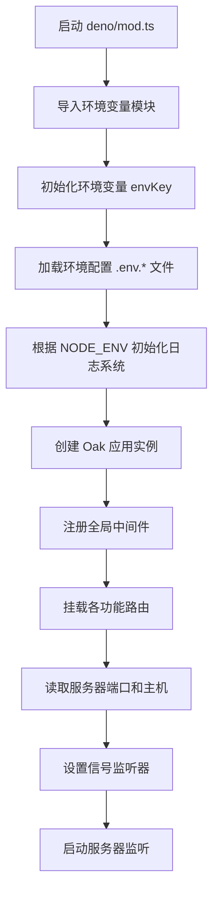
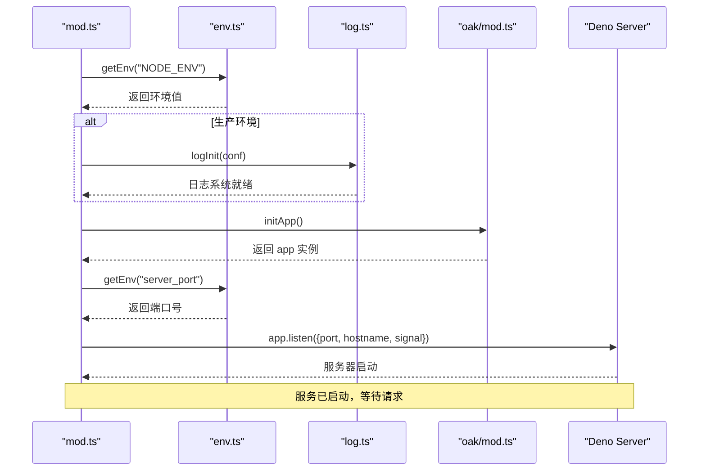
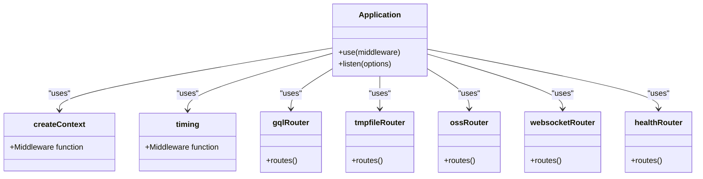
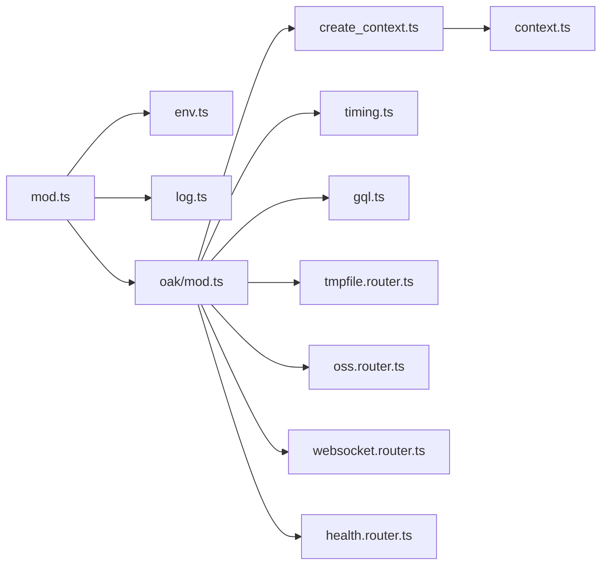

# 服务启动

**本文档引用文件**   
- [mod.ts](https://github.com/sail-sail/nest/blob/main/deno/mod.ts#L1-L48)
- [ecosystem.config.json](https://github.com/sail-sail/nest/blob/main/deno/ecosystem.config.json#L1-L14)
- [lib/env.ts](https://github.com/sail-sail/nest/blob/main/deno/lib/env.ts#L1-L115)
- [lib/oak/mod.ts](https://github.com/sail-sail/nest/blob/main/deno/lib/oak/mod.ts#L1-L26)
- [lib/util/log.ts](https://github.com/sail-sail/nest/blob/main/deno/lib/util/log.ts#L1-L80)
- [lib/oak/create_context.ts](https://github.com/sail-sail/nest/blob/main/deno/lib/oak/create_context.ts#L1-L45)

## 目录
1. [简介](#简介)
2. [项目结构](#项目结构)
3. [核心组件](#核心组件)
4. [架构概览](#架构概览)
5. [详细组件分析](#详细组件分析)
6. [依赖分析](#依赖分析)
7. [性能考虑](#性能考虑)
8. [故障排除指南](#故障排除指南)
9. [结论](#结论)

## 简介
本文档详细描述了基于 Deno 的 Nest 后端服务的启动流程。从 `deno/mod.ts` 入口文件开始，全面解析服务初始化的生命周期，包括环境变量加载、日志初始化、依赖注入、中间件注册、路由挂载以及服务器监听等关键步骤。同时，文档还说明了如何通过 `ecosystem.config.json` 配置 PM2 进程管理，为开发者提供清晰的启动机制理解与扩展指导。

## 项目结构
项目采用模块化分层结构，主要分为 `codegen`、`deno`、`pc` 和 `uni` 四个核心目录：
- `codegen`：代码生成工具及相关模板。
- `deno`：后端服务主目录，包含服务入口、核心逻辑、中间件和配置。
- `pc`：PC 端前端应用。
- `uni`：跨平台（UniApp）前端应用。

本服务启动流程聚焦于 `deno` 目录下的后端实现。

**Section sources**
- [mod.ts](https://github.com/sail-sail/nest/blob/main/deno/mod.ts#L1-L48)

## 核心组件
服务启动的核心组件包括：
- **`mod.ts`**：应用的主入口文件，负责协调整个启动流程。
- **`env.ts`**：环境变量管理模块，支持多环境配置（开发、生产等）。
- **`oak/mod.ts`**：基于 Oak 框架的应用初始化模块，负责构建请求处理管道。
- **`log.ts`**：日志系统初始化模块，支持日志文件的自动创建与过期清理。

**Section sources**
- [mod.ts](https://github.com/sail-sail/nest/blob/main/deno/mod.ts#L1-L48)
- [lib/env.ts](https://github.com/sail-sail/nest/blob/main/deno/lib/env.ts#L1-L115)
- [lib/oak/mod.ts](https://github.com/sail-sail/nest/blob/main/deno/lib/oak/mod.ts#L1-L26)
- [lib/util/log.ts](https://github.com/sail-sail/nest/blob/main/deno/lib/util/log.ts#L1-L80)

## 架构概览
服务启动遵循一个清晰的顺序流程，各组件协同工作以构建一个健壮的 Web 服务器。

**Diagram sources**
- [mod.ts](https://github.com/sail-sail/nest/blob/main/deno/mod.ts#L1-L48)
- [lib/env.ts](https://github.com/sail-sail/nest/blob/main/deno/lib/env.ts#L1-L115)
- [lib/oak/mod.ts](https://github.com/sail-sail/nest/blob/main/deno/lib/oak/mod.ts#L1-L26)

## 详细组件分析

### 入口文件分析 (mod.ts)
`deno/mod.ts` 是服务的唯一入口，其执行流程如下：

1.  **环境与工具导入**：首先导入 `env.ts` 和 `date_util.ts` 等基础模块。
2.  **日志系统初始化**：根据 `NODE_ENV` 环境变量决定是否初始化日志系统。在生产环境中，会读取 `log_path` 和 `log_expire_day` 环境变量来配置日志文件的存储路径和过期天数。
3.  **应用实例创建**：调用 `initApp()` 函数创建 Oak 应用实例。
4.  **端口与主机配置**：从环境变量 `server_port` 和 `server_host` 中读取服务器监听的端口和主机地址，并进行有效性校验。
5.  **信号监听**：为 `SIGINT` (Ctrl+C) 和非 Windows 系统的 `SIGTERM` 信号注册监听器，确保服务可以优雅地关闭。
6.  **启动监听**：最后，调用 `app.listen()` 方法，使用 `AbortController` 提供的信号来控制服务器的生命周期。

**Diagram sources**
- [mod.ts](https://github.com/sail-sail/nest/blob/main/deno/mod.ts#L1-L48)
- [lib/env.ts](https://github.com/sail-sail/nest/blob/main/deno/lib/env.ts#L1-L115)
- [lib/util/log.ts](https://github.com/sail-sail/nest/blob/main/deno/lib/util/log.ts#L1-L80)
- [lib/oak/mod.ts](https://github.com/sail-sail/nest/blob/main/deno/lib/oak/mod.ts#L1-L26)

### 环境变量管理 (env.ts)
`env.ts` 模块提供了强大的环境变量管理功能。

- **命令行参数解析**：支持通过 `-e` 或 `--env` 参数指定环境（如 `dev`, `prod`），通过 `-c` 或 `--cwd` 参数指定工作目录。
- **环境映射**：将 `dev` 映射为 `development`，`prod` 映射为 `production`，并相应地设置 `process.env.NODE_ENV`。
- **配置文件加载**：根据环境键自动加载对应的 `.env` 文件（如 `.env.dev`, `.env.prod`）。
- **变量获取**：`getEnv(key)` 函数优先从系统环境变量中读取，若不存在则从解析的 `.env` 文件中查找。

**Section sources**
- [lib/env.ts](https://github.com/sail-sail/nest/blob/main/deno/lib/env.ts#L1-L115)

### Oak 应用初始化 (oak/mod.ts)
该模块负责构建 Oak 框架的应用实例和请求处理管道。

- **应用创建**：使用 `new Application()` 创建核心应用对象。
- **中间件注册**：
  - `createContext()`：创建自定义上下文，是整个请求处理的基础。
  - `timing()`：记录请求处理时间的中间件。
- **路由挂载**：通过 `app.use(router.routes())` 方法，将 GraphQL API、临时文件服务、OSS 服务、WebSocket 和健康检查等路由挂载到应用上。

**Diagram sources**
- [lib/oak/mod.ts](https://github.com/sail-sail/nest/blob/main/deno/lib/oak/mod.ts#L1-L26)

### 上下文与错误处理 (create_context.ts)
`create_context.ts` 中间件是请求处理管道的关键一环。

- **GraphQL 特殊处理**：对于 `/graphql` 和 `/api/graphql` 路径的请求，直接调用 `next()`，将错误处理交给 GraphQL 层。
- **普通请求处理**：为其他所有请求创建一个新的上下文 (`newContext`)，并在一个异步钩子 (`runInAsyncHooks`) 中执行后续中间件。
- **统一错误捕获**：在 `try-catch` 块中捕获任何未处理的异常，记录错误日志，并向客户端返回标准化的错误响应 `{code: 1, msg: "error message"}`。

**Section sources**
- [lib/oak/create_context.ts](https://github.com/sail-sail/nest/blob/main/deno/lib/oak/create_context.ts#L1-L45)

## 依赖分析
服务启动流程中的主要依赖关系如下：

**Diagram sources**
- [mod.ts](https://github.com/sail-sail/nest/blob/main/deno/mod.ts#L1-L48)
- [lib/env.ts](https://github.com/sail-sail/nest/blob/main/deno/lib/env.ts#L1-L115)
- [lib/oak/mod.ts](https://github.com/sail-sail/nest/blob/main/deno/lib/oak/mod.ts#L1-L26)
- [lib/oak/create_context.ts](https://github.com/sail-sail/nest/blob/main/deno/lib/oak/create_context.ts#L1-L45)

## 性能考虑
- **日志性能**：日志系统在写入文件前会检查文件是否存在，并定期清理过期日志，避免了频繁的文件系统操作，对性能影响较小。
- **中间件开销**：`timing` 中间件会增加微小的性能开销，但在生产环境中对于监控和调试至关重要。
- **异步处理**：整个启动和请求处理流程均基于 Deno 的异步 I/O，保证了高并发下的性能表现。

## 故障排除指南
- **启动失败**：检查 `server_port` 环境变量是否正确，端口号必须大于 1024 且未被占用。
- **环境变量未加载**：确认 `.env` 文件存在于正确的路径下，并且文件名与 `-e` 参数匹配。
- **日志未生成**：检查 `log_path` 环境变量指定的目录是否有写入权限。
- **路由无法访问**：检查 `oak/mod.ts` 中是否正确挂载了对应的路由模块。

**Section sources**
- [mod.ts](https://github.com/sail-sail/nest/blob/main/deno/mod.ts#L1-L48)
- [lib/env.ts](https://github.com/sail-sail/nest/blob/main/deno/lib/env.ts#L1-L115)
- [lib/util/log.ts](https://github.com/sail-sail/nest/blob/main/deno/lib/util/log.ts#L1-L80)

## 结论
该 Nest 后端服务的启动流程设计清晰、模块化程度高。通过 `mod.ts` 统一入口，`env.ts` 管理配置，`oak/mod.ts` 构建应用管道，实现了从环境准备到服务器监听的完整生命周期管理。开发者可以轻松地通过修改 `.env` 文件或 `ecosystem.config.json` 来调整服务配置，并通过添加自定义中间件或路由来扩展功能。