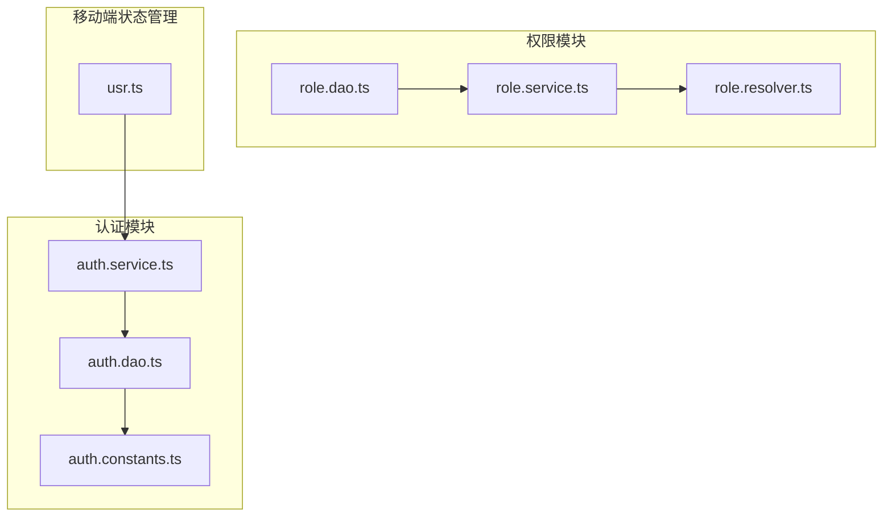
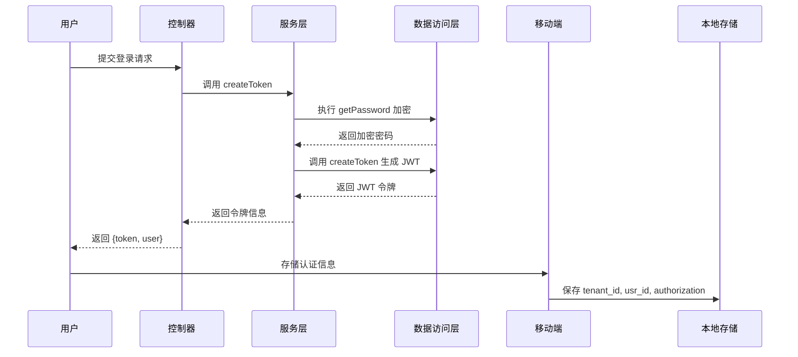
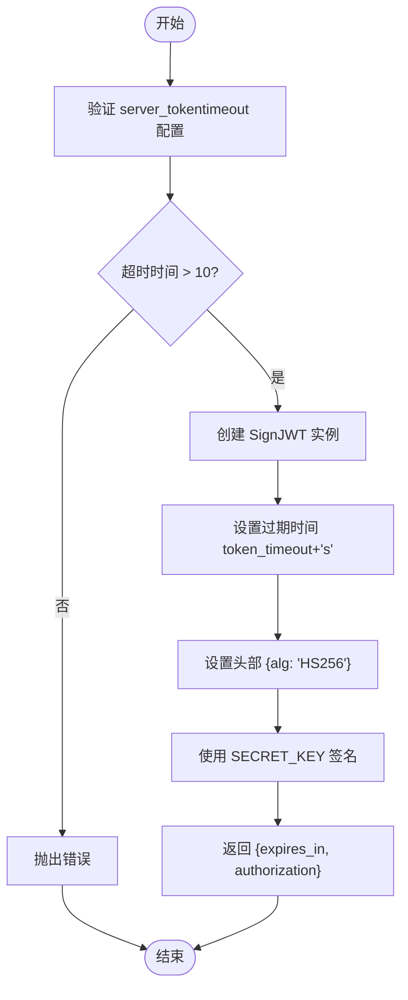
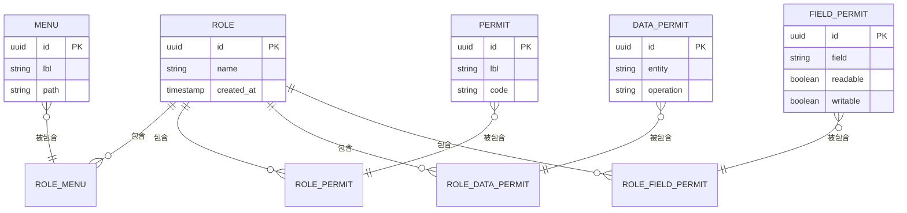
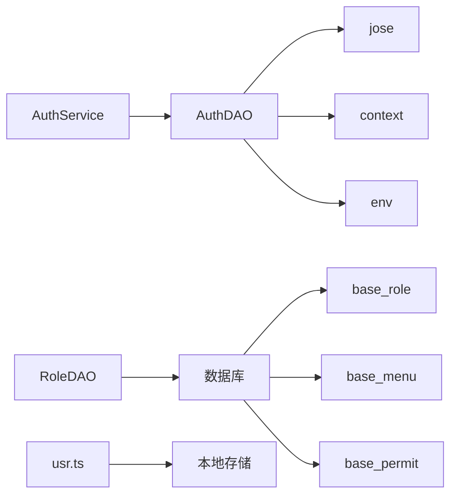

# 认证授权

**本文档引用的文件**  
- [auth.service.ts](https://github.com/sail-sail/nest/blob/main/deno/lib/auth/auth.service.ts)
- [auth.dao.ts](https://github.com/sail-sail/nest/blob/main/deno/lib/auth/auth.dao.ts)
- [auth.constants.ts](https://github.com/sail-sail/nest/blob/main/deno/lib/auth/auth.constants.ts)
- [role.dao.ts](https://github.com/sail-sail/nest/blob/main/deno/gen/base/role/role.dao.ts)
- [usr.ts](https://github.com/sail-sail/nest/blob/main/uni/src/store/usr.ts) - *新增租户ID管理功能*

## 更新摘要
**变更内容**  
- 在移动端用户状态管理中新增租户ID的获取与存储方法
- 更新相关文档以反映租户ID在认证流程中的作用
- 增加对移动端租户上下文管理的说明

## 目录
1. [简介](#简介)
2. [项目结构](#项目结构)
3. [核心组件](#核心组件)
4. [架构概览](#架构概览)
5. [详细组件分析](#详细组件分析)
6. [依赖分析](#依赖分析)
7. [性能考量](#性能考量)
8. [故障排除指南](#故障排除指南)
9. [结论](#结论)

## 简介
本文档全面解析基于 Nest 框架的认证授权机制，重点阐述 JWT 令牌管理、基于角色的访问控制（RBAC）以及安全存储策略。文档深入分析登录流程、权限验证中间件和会话管理机制，旨在为开发者提供清晰的安全体系架构理解。

## 项目结构
项目采用模块化设计，主要安全相关代码位于 `deno/lib/auth` 目录下，包含认证服务、数据访问对象和常量定义。权限管理相关逻辑分布在 `deno/gen/base/role` 等生成的模块中。移动端用户状态管理新增租户ID处理功能。

**图示来源**  
- [auth.service.ts](https://github.com/sail-sail/nest/blob/main/deno/lib/auth/auth.service.ts)
- [auth.dao.ts](https://github.com/sail-sail/nest/blob/main/deno/lib/auth/auth.dao.ts)
- [role.dao.ts](https://github.com/sail-sail/nest/blob/main/deno/gen/base/role/role.dao.ts)
- [usr.ts](https://github.com/sail-sail/nest/blob/main/uni/src/store/usr.ts)

## 核心组件
核心认证组件包括 `AuthService`、`AuthDAO` 和 `AuthConstants`，分别负责业务逻辑、数据操作和配置常量。权限管理通过角色与菜单、权限项的关联实现。移动端新增 `usr.ts` 状态管理模块，支持租户ID的存储与获取。

**组件来源**  
- [auth.service.ts](https://github.com/sail-sail/nest/blob/main/deno/lib/auth/auth.service.ts#L1-L53)
- [auth.dao.ts](https://github.com/sail-sail/nest/blob/main/deno/lib/auth/auth.dao.ts#L1-L219)
- [usr.ts](https://github.com/sail-sail/nest/blob/main/uni/src/store/usr.ts#L73-L95) - *新增租户ID管理*

## 架构概览
系统采用 JWT 进行无状态认证，结合 RBAC 模型实现细粒度权限控制。用户登录后生成 JWT 令牌，后续请求通过中间件验证令牌并提取用户身份信息。移动端通过 `usr.ts` 管理用户认证状态，包括租户ID的持久化存储。

**图示来源**  
- [auth.service.ts](https://github.com/sail-sail/nest/blob/main/deno/lib/auth/auth.service.ts#L15-L20)
- [auth.dao.ts](https://github.com/sail-sail/nest/blob/main/deno/lib/auth/auth.dao.ts#L170-L178)
- [usr.ts](https://github.com/sail-sail/nest/blob/main/uni/src/store/usr.ts#L1-L96)

## 详细组件分析

### JWT 令牌管理分析
系统使用 `jose` 库实现 JWT 的生成、验证和刷新。令牌包含用户 ID、租户 ID、组织 ID 和语言等声明信息。

#### 令牌生成流程

**图示来源**  
- [auth.dao.ts](https://github.com/sail-sail/nest/blob/main/deno/lib/auth/auth.dao.ts#L170-L178)

**组件来源**  
- [auth.dao.ts](https://github.com/sail-sail/nest/blob/main/deno/lib/auth/auth.dao.ts#L170-L178)

### 基于角色的访问控制（RBAC）分析
系统通过角色-菜单-权限的关联关系实现 RBAC。角色可以关联多个菜单和权限项，支持数据级和字段级权限控制。

#### 角色权限关联查询

**图示来源**  
- [role.dao.ts](https://github.com/sail-sail/nest/blob/main/deno/gen/base/role/role.dao.ts#L218-L277)

**组件来源**  
- [role.dao.ts](https://github.com/sail-sail/nest/blob/main/deno/gen/base/role/role.dao.ts#L218-L277)

## 依赖分析
认证模块依赖 `jose` 库进行 JWT 操作，依赖 `context.ts` 获取请求上下文，依赖 `env.ts` 读取环境配置。权限模块依赖数据库查询构建复杂的关联关系。移动端状态管理模块依赖本地存储实现认证信息持久化。

**图示来源**  
- [auth.dao.ts](https://github.com/sail-sail/nest/blob/main/deno/lib/auth/auth.dao.ts#L1-L10)
- [role.dao.ts](https://github.com/sail-sail/nest/blob/main/deno/gen/base/role/role.dao.ts#L218-L277)
- [usr.ts](https://github.com/sail-sail/nest/blob/main/uni/src/store/usr.ts#L1-L96)

**组件来源**  
- [auth.dao.ts](https://github.com/sail-sail/nest/blob/main/deno/lib/auth/auth.dao.ts#L1-L10)
- [role.dao.ts](https://github.com/sail-sail/nest/blob/main/deno/gen/base/role/role.dao.ts#L218-L277)
- [usr.ts](https://github.com/sail-sail/nest/blob/main/uni/src/store/usr.ts#L1-L96)

## 性能考量
- 令牌验证结果在请求上下文中缓存，避免重复解析
- 权限查询使用 JSON 聚合函数减少查询次数
- 密码加密使用两次 SHA-256 哈希，平衡安全性和性能
- 移动端采用本地存储减少重复认证请求

## 故障排除指南
常见问题包括令牌过期、签名验证失败和权限不足。系统通过 `ServiceException` 统一抛出认证相关异常，便于前端处理。移动端需注意租户ID的正确存储与传递。

**组件来源**  
- [auth.dao.ts](https://github.com/sail-sail/nest/blob/main/deno/lib/auth/auth.dao.ts#L50-L70)
- [auth.constants.ts](https://github.com/sail-sail/nest/blob/main/deno/lib/auth/auth.constants.ts#L1-L31)
- [usr.ts](https://github.com/sail-sail/nest/blob/main/uni/src/store/usr.ts#L73-L95)

## 结论
本系统实现了完整的认证授权机制，采用 JWT 进行无状态认证，结合 RBAC 模型提供灵活的权限控制。通过合理的缓存策略和数据库设计，保证了系统的安全性和性能。移动端新增租户ID管理功能，增强了多租户场景下的用户体验。