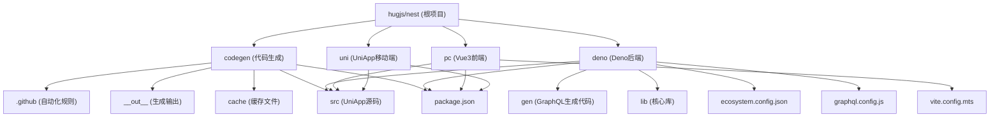
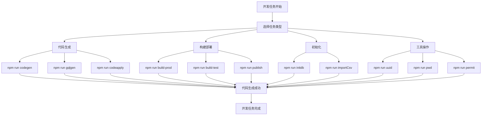
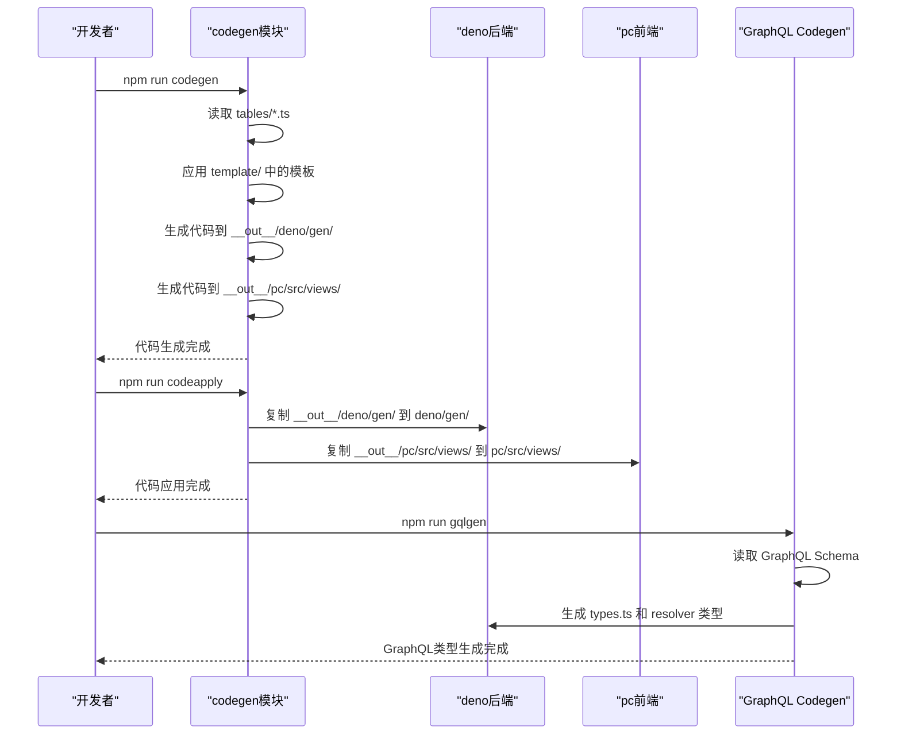
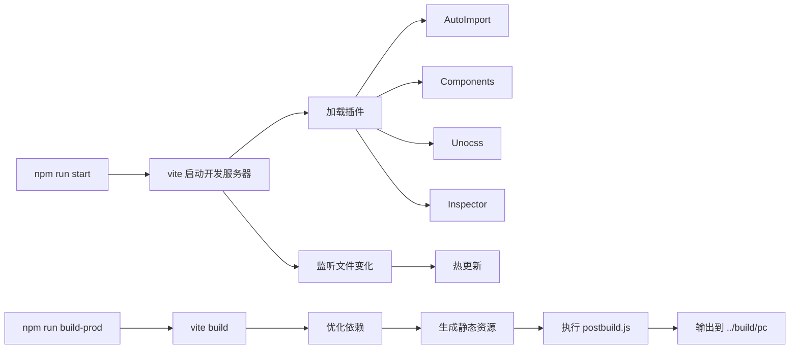
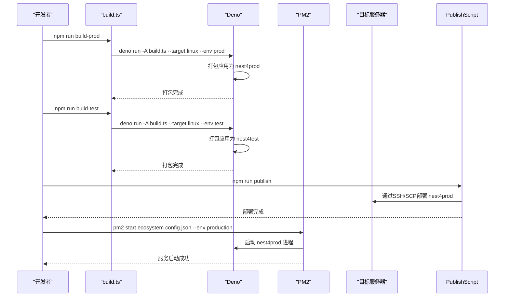
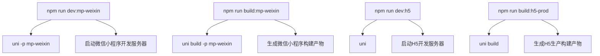
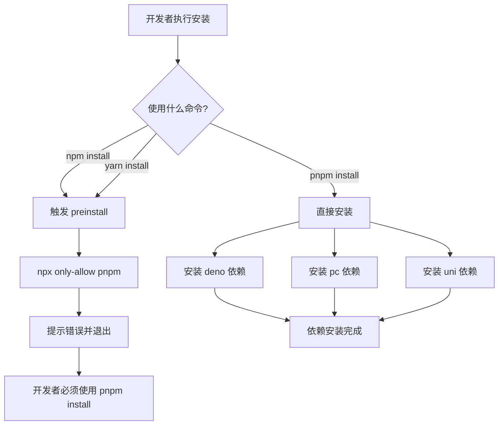
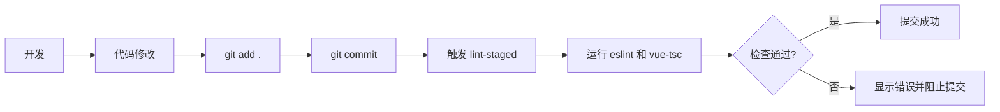

# 开发工作流


**本文档引用文件**  
- [package.json](https://github.com/sail-sail/nest/blob/main/package.json)
- [deno/package.json](https://github.com/sail-sail/nest/blob/main/deno/package.json)
- [pc/package.json](https://github.com/sail-sail/nest/blob/main/pc/package.json)
- [uni/package.json](https://github.com/sail-sail/nest/blob/main/uni/package.json)
- [deno/ecosystem.config.json](https://github.com/sail-sail/nest/blob/main/deno/ecosystem.config.json)
- [pc/vite.config.mts](https://github.com/sail-sail/nest/blob/main/pc/vite.config.mts)


## 目录
1. [项目结构](#项目结构)
2. [核心开发脚本](#核心开发脚本)
3. [代码生成机制](#代码生成机制)
4. [前端构建与配置](#前端构建与配置)
5. [后端服务部署](#后端服务部署)
6. [多端支持与构建](#多端支持与构建)
7. [依赖管理与安装](#依赖管理与安装)
8. [调试与测试](#调试与测试)
9. [配置文件详解](#配置文件详解)

## 项目结构

该项目采用多模块架构，主要分为四个核心子项目：`codegen`（代码生成器）、`deno`（后端服务）、`pc`（PC端前端）和`uni`（跨平台移动端应用）。整体结构清晰，职责分离明确。



**Diagram sources**
- [package.json](https://github.com/sail-sail/nest/blob/main/package.json)
- [deno/package.json](https://github.com/sail-sail/nest/blob/main/deno/package.json)
- [pc/package.json](https://github.com/sail-sail/nest/blob/main/pc/package.json)
- [uni/package.json](https://github.com/sail-sail/nest/blob/main/uni/package.json)

**Section sources**
- [package.json](https://github.com/sail-sail/nest/blob/main/package.json)

## 核心开发脚本

项目通过根目录的 `package.json` 中的 `scripts` 提供了统一的开发入口，简化了跨模块操作。

### 主要开发命令

**启动应用**
- `start`: 默认启动PC前端 (`cd pc && npm start`)
- `start:pc`: 显式启动PC前端
- `start:deno`: 启动Deno后端服务

**代码生成与同步**
- `codegen`: 执行代码生成流程
- `codeapply`: 应用生成的代码到项目
- `coderemove`: 移除生成的代码
- `gqlgen`: 重新生成GraphQL相关代码

**数据库与初始化**
- `initdb`: 初始化数据库
- `importCsv`: 从CSV导入数据
- `db_charset`: 设置数据库字符集
- `db_gen_crypto_key`: 生成数据库加密密钥

**构建与发布**
- `build-prod`: 构建生产环境后端
- `build-test`: 构建测试环境后端
- `publish`: 发布构建产物
- `upgrade`: 升级并重新生成代码

**工具类脚本**
- `uuid`: 生成短UUID
- `pwd`: 生成密码
- `permit`: 扫描权限配置
- `field_permit`: 处理字段权限



**Diagram sources**
- [package.json](https://github.com/sail-sail/nest/blob/main/package.json)

**Section sources**
- [package.json](https://github.com/sail-sail/nest/blob/main/package.json#L10-L50)

## 代码生成机制

代码生成是本项目的核心特性，由 `codegen` 模块驱动，实现了从数据库表结构到前后端代码的自动化生成。

### 代码生成流程

1. **定义数据模型**：在 `codegen/src/tables` 目录下定义SQL表结构和TypeScript模型。
2. **执行生成**：运行 `npm run codegen` 脚本，调用 `src/bin/codegen.ts`。
3. **生成输出**：代码被生成到 `__out__` 目录下的对应位置。
4. **应用代码**：运行 `npm run codeapply` 将生成的代码复制到 `deno/gen` 和 `pc/src/views` 等目标目录。
5. **GraphQL代码生成**：运行 `npm run gqlgen` 使用 `graphql-codegen` 工具基于GraphQL Schema生成TypeScript类型。

### 关键文件分析

- `codegen/src/bin/codegen.ts`: 主生成脚本，解析表定义并应用模板。
- `codegen/src/template/`: 存放代码生成模板，包括Deno后端、PC前端Vue组件等。
- `codegen/src/tables/`: 定义了所有数据库表的结构（SQL和TS）。
- `deno/lib/script/graphql_codegen_config.ts`: GraphQL代码生成的配置文件。



**Diagram sources**
- [codegen/src/bin/codegen.ts](https://github.com/sail-sail/nest/blob/main/codegen/src/bin/codegen.ts)
- [deno/lib/script/graphql_codegen_config.ts](https://github.com/sail-sail/nest/blob/main/deno/lib/script/graphql_codegen_config.ts)

**Section sources**
- [codegen/src/bin/codegen.ts](https://github.com/sail-sail/nest/blob/main/codegen/src/bin/codegen.ts)
- [codegen/src/template](https://github.com/sail-sail/nest/blob/main/codegen/src/template)

## 前端构建与配置

PC端前端基于Vue 3 + Vite构建，配置文件 `vite.config.mts` 定义了完整的构建流程和开发服务器设置。

### Vite核心配置

```typescript
// vite.config.mts 片段
export default defineConfig({
  plugins: [
    vue(),
    vueJsx(),
    AutoImport({ /* ... */ }), // 自动导入API
    Components({ /* ... */ }), // 自动注册组件
    Unocss({ /* ... */ }),     // 原子化CSS
    Inspector(),              // 开发者检查器
    // ...
  ],
  resolve: {
    alias: {
      "@": fileURLToPath(new URL("./src", import.meta.url)), // @ 指向 src
      "#": fileURLToPath(new URL("./src/typings", import.meta.url)), // # 指向 typings
    },
  },
  build: {
    outDir: "../build/pc", // 构建输出到根目录的 build/pc
    chunkSizeWarningLimit: 3000,
  },
  server: {
    port: 4000,
    proxy: {
      "/api": { target: "http://localhost:4001" }, // 代理API请求到后端
      "/graphql": { target: "http://localhost:4001" }, // 代理GraphQL请求
    },
  },
});
```

### 构建脚本

- `start`: 开发模式启动 (`vite`)
- `build-prod`: 生产环境构建，执行 `postbuild.js` 后处理
- `build-test`: 测试环境构建
- `typecheck`: 类型检查 (`vue-tsc --noEmit`)
- `lint`: 代码检查 (`eslint`)



**Diagram sources**
- [pc/vite.config.mts](https://github.com/sail-sail/nest/blob/main/pc/vite.config.mts)
- [pc/package.json](https://github.com/sail-sail/nest/blob/main/pc/package.json)

**Section sources**
- [pc/vite.config.mts](https://github.com/sail-sail/nest/blob/main/pc/vite.config.mts#L0-L331)
- [pc/package.json](https://github.com/sail-sail/nest/blob/main/pc/package.json#L15-L30)

## 后端服务部署

后端服务基于Deno构建，使用PM2进行进程管理，配置文件为 `ecosystem.config.json`。

### PM2配置分析

```json
// deno/ecosystem.config.json
{
  "apps": [{
    "name": "nest4{env}",           // 应用名称，环境变量注入
    "script": "./nest4{env}",       // 启动脚本
    "instances": 1,                 // 单实例
    "autorestart": true,            // 文件变化自动重启
    "watch": false,                 // 不监听文件变化（由外部控制）
    "env": {},                      // 默认环境变量
    "env_production": {},           // 生产环境变量
    "env_test": {}                  // 测试环境变量
  }]
}
```

### 构建与发布流程

1. **构建**：运行 `npm run build-prod` 或 `build-test`，调用 `lib/script/build.ts`。
2. **打包**：该脚本会使用Deno的打包功能生成可执行文件 `nest4prod` 或 `nest4test`。
3. **部署**：运行 `npm run publish`，执行 `lib/script/publish.js`，将构建产物部署到目标服务器。

### 后端启动脚本

- `start`: 执行 `node lib/script/mother.js`，该脚本负责启动Deno应用。
- `typecheck`: 运行 `deno check` 和 `deno lint` 进行类型检查和代码规范检查。



**Diagram sources**
- [deno/ecosystem.config.json](https://github.com/sail-sail/nest/blob/main/deno/ecosystem.config.json)
- [deno/package.json](https://github.com/sail-sail/nest/blob/main/deno/package.json)

**Section sources**
- [deno/ecosystem.config.json](https://github.com/sail-sail/nest/blob/main/deno/ecosystem.config.json#L0-L13)
- [deno/lib/script/build.ts](https://github.com/sail-sail/nest/blob/main/deno/lib/script/build.ts)
- [deno/lib/script/publish.js](https://github.com/sail-sail/nest/blob/main/deno/lib/script/publish.js)

## 多端支持与构建

项目支持多端部署，通过 `uni` 模块实现跨平台移动应用开发。

### UniApp构建命令

`uni/package.json` 中定义了丰富的构建脚本，支持多种平台：

- **H5**: `dev:h5` (开发), `build:h5-prod` (生产构建)
- **微信小程序**: `dev:mp-weixin` (开发), `build:mp-weixin` (构建)
- **App**: `dev:app` (开发), `build:app` (构建)
- **其他平台**: 支付宝、百度、QQ、头条等小程序。

### 构建环境变量

使用 `cross-env NODE_OPTIONS=--max-old-space-size=4096` 来增加Node.js内存限制，以应对大型项目的构建需求。



**Diagram sources**
- [uni/package.json](https://github.com/sail-sail/nest/blob/main/uni/package.json)

**Section sources**
- [uni/package.json](https://github.com/sail-sail/nest/blob/main/uni/package.json#L10-L50)

## 依赖管理与安装

项目统一使用 `pnpm` 作为包管理器，并通过 `preinstall` 钩子强制执行。

### 依赖管理策略

- **根目录 `package.json`**: 包含顶层的聚合脚本，不包含实际依赖。
- **子项目 `package.json`**: 各自管理自己的依赖。
  - `deno`: 依赖Deno生态库和Node.js兼容库。
  - `pc`: 依赖Vue3、Element Plus、UnoCSS等前端库。
  - `uni`: 依赖UniApp官方包和跨端UI库。
- **`postinstall` 钩子**: 在根目录的 `postinstall` 脚本中，会依次为 `deno`、`pc`、`uni` 三个子项目执行 `pnpm i`，确保所有依赖都被正确安装。

### 强制使用pnpm

```json
// 所有 package.json 中的 scripts
"preinstall": "npx only-allow pnpm"
```

此脚本会在任何 `npm install` 或 `yarn install` 执行前触发，强制开发者必须使用 `pnpm`。



**Diagram sources**
- [package.json](https://github.com/sail-sail/nest/blob/main/package.json)
- [deno/package.json](https://github.com/sail-sail/nest/blob/main/deno/package.json)
- [pc/package.json](https://github.com/sail-sail/nest/blob/main/pc/package.json)
- [uni/package.json](https://github.com/sail-sail/nest/blob/main/uni/package.json)

**Section sources**
- [package.json](https://github.com/sail-sail/nest/blob/main/package.json#L30-L32)
- [deno/package.json](https://github.com/sail-sail/nest/blob/main/deno/package.json#L50-L52)
- [pc/package.json](https://github.com/sail-sail/nest/blob/main/pc/package.json#L100-L102)
- [uni/package.json](https://github.com/sail-sail/nest/blob/main/uni/package.json#L114-L116)

## 调试与测试

项目提供了多种调试和测试手段。

### 前端调试

- **Vite Dev Server**: `npm run start` 启动开发服务器，支持热更新。
- **Vue Inspector**: 通过 `vite-plugin-vue-inspector` 可以在浏览器中直接点击组件进行源码跳转。
- **Turbo Console**: `unplugin-turbo-console` 插件可以自动移除生产环境的 `console.log`。

### 后端调试

- **Deno Check**: `npm run typecheck` 执行 `deno check` 进行静态类型检查。
- **日志**: 代码中应使用 `lib/util/log.ts` 进行日志记录。
- **PM2 Monitor**: 使用 `pm2 monit` 可以实时监控后端进程状态。

### 测试

- **PC前端**: 使用 `vitest` 进行单元测试 (`npm run test`)。
- **覆盖率**: `npm run coverage` 生成测试覆盖率报告。
- **Lint-Staged**: 在Git提交时运行 `lint-staged`，对暂存文件进行代码检查和格式化。



**Section sources**
- [pc/package.json](https://github.com/sail-sail/nest/blob/main/pc/package.json#L5-L10)
- [deno/package.json](https://github.com/sail-sail/nest/blob/main/deno/package.json#L10-L15)

## 配置文件详解

### ecosystem.config.json

此文件是PM2的配置文件，用于管理Deno后端应用的生命周期。其核心是通过 `{env}` 占位符动态生成应用名称和脚本路径，以区分生产、测试等不同环境。

### vite.config.mts

这是Vite的配置文件，关键点包括：
- **插件系统**: 集成了自动导入、组件自动注册、UnoCSS、图标等现代化开发插件。
- **路径别名**: `@` 指向 `src` 目录，方便模块导入。
- **代理配置**: 将 `/api` 和 `/graphql` 请求代理到本地后端 `http://localhost:4001`，解决开发时的跨域问题。
- **构建输出**: 明确指定输出目录为 `../build/pc`，便于与后端部署目录协同。

**Section sources**
- [deno/ecosystem.config.json](https://github.com/sail-sail/nest/blob/main/deno/ecosystem.config.json)
- [pc/vite.config.mts](https://github.com/sail-sail/nest/blob/main/pc/vite.config.mts)