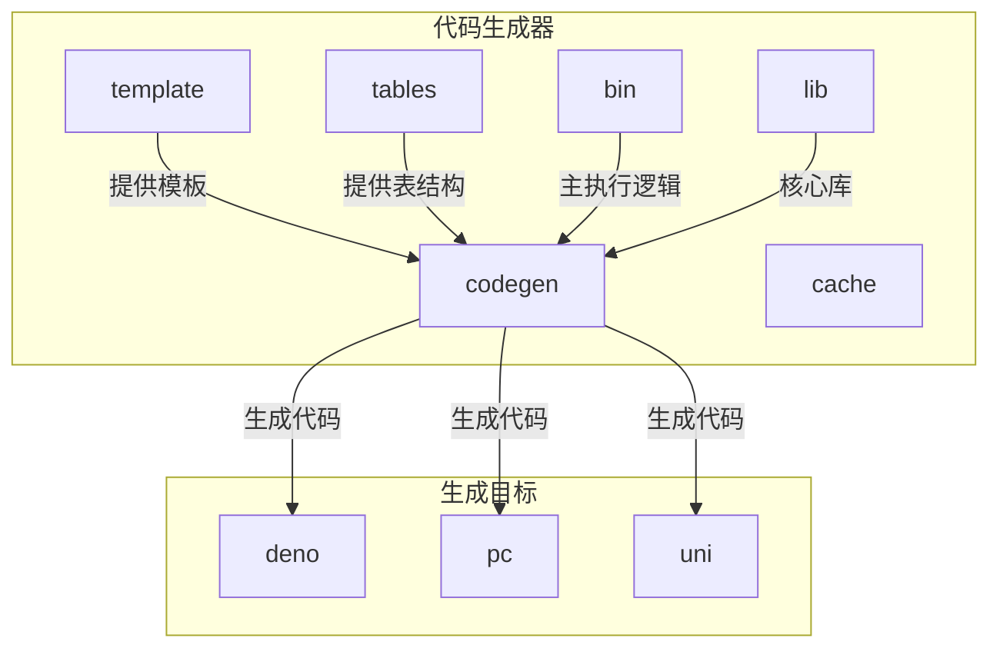
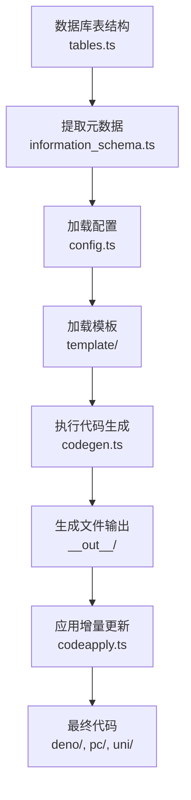
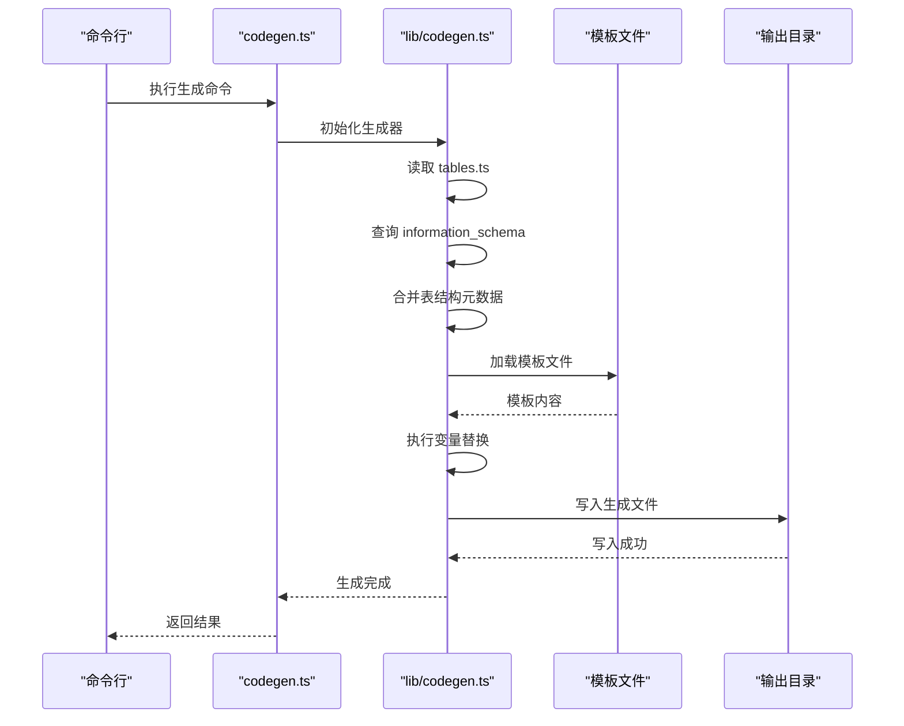
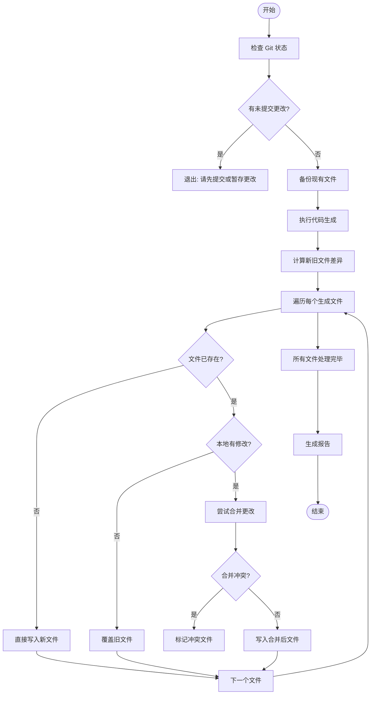
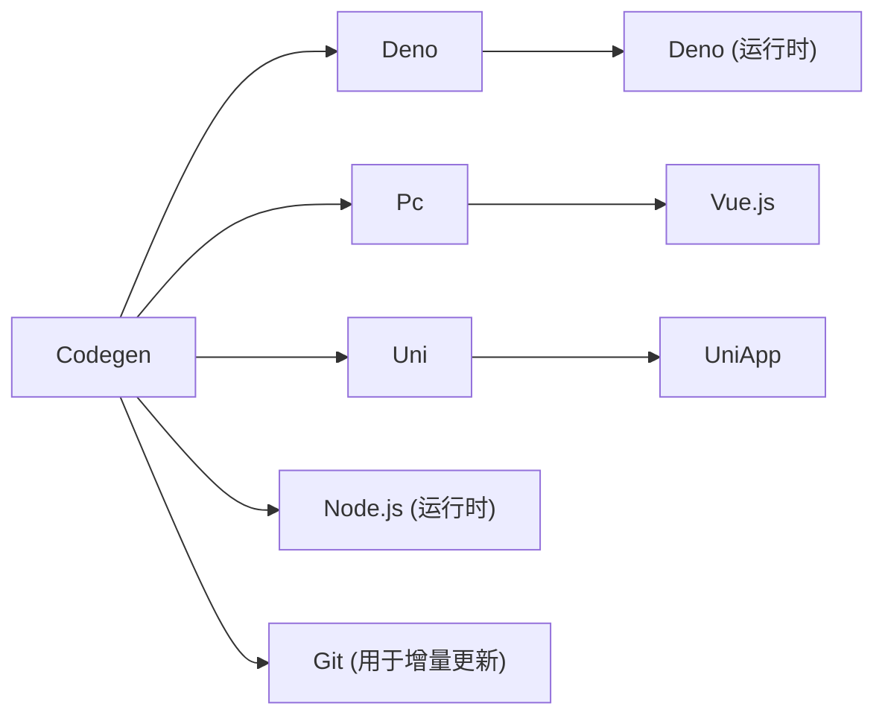

# 代码生成与应用


**本文档引用文件**  
- [codegen.ts](https://github.com/sail-sail/nest/blob/main/codegen/src/bin/codegen.ts)
- [codeapply.ts](https://github.com/sail-sail/nest/blob/main/codegen/src/bin/codeapply.ts)
- [codegen.ts](https://github.com/sail-sail/nest/blob/main/codegen/src/lib/codegen.ts)
- [config.ts](https://github.com/sail-sail/nest/blob/main/codegen/src/config.ts)
- [template](https://github.com/sail-sail/nest/blob/main/codegen/src/template)
- [tables.ts](https://github.com/sail-sail/nest/blob/main/codegen/src/tables/tables.ts)
- [information_schema.ts](https://github.com/sail-sail/nest/blob/main/codegen/src/lib/information_schema.ts)


## 目录
1. [简介](#简介)
2. [项目结构](#项目结构)
3. [核心组件](#核心组件)
4. [架构概览](#架构概览)
5. [详细组件分析](#详细组件分析)
6. [依赖分析](#依赖分析)
7. [性能考量](#性能考量)
8. [故障排除指南](#故障排除指南)
9. [结论](#结论)

## 简介
本文档深入解析基于 `codegen.ts` 的代码生成机制与 `codeapply.ts` 的增量更新流程。系统通过解析数据库结构，结合模板引擎生成全栈代码（包括 Deno 后端、Vue 前端等），并支持通过 Git 差异实现安全的代码增量更新。文档涵盖模板自定义、错误处理、日志分析等关键实践，旨在为开发者提供完整的代码自动化解决方案。

## 项目结构
项目采用模块化分层架构，核心代码生成逻辑位于 `codegen` 目录，生成目标分布于 `deno`、`pc`（Vue 前端）、`uni`（UniApp）等独立项目中。



**Diagram sources**
- [project_structure](https://github.com/sail-sail/nest/blob/main/#L1-L100)

**Section sources**
- [project_structure](https://github.com/sail-sail/nest/blob/main/#L1-L100)

## 核心组件
核心组件包括 `codegen.ts`（代码生成）、`codeapply.ts`（代码应用）和模板系统。`codegen.ts` 负责解析数据模型并填充模板，`codeapply.ts` 利用 Git 差异确保生成代码的修改得以保留。

**Section sources**
- [codegen.ts](https://github.com/sail-sail/nest/blob/main/codegen/src/bin/codegen.ts#L1-L50)
- [codeapply.ts](https://github.com/sail-sail/nest/blob/main/codegen/src/bin/codeapply.ts#L1-L30)

## 架构概览
系统工作流始于数据库表结构定义，通过信息模式（information_schema）提取元数据，经由配置文件（config.ts）和模板（template）驱动，最终生成目标代码。



**Diagram sources**
- [tables.ts](https://github.com/sail-sail/nest/blob/main/codegen/src/tables/tables.ts#L1-L20)
- [information_schema.ts](https://github.com/sail-sail/nest/blob/main/codegen/src/lib/information_schema.ts#L10-L50)
- [config.ts](https://github.com/sail-sail/nest/blob/main/codegen/src/config.ts#L5-L15)
- [template](https://github.com/sail-sail/nest/blob/main/codegen/src/template#L1-L10)
- [codegen.ts](https://github.com/sail-sail/nest/blob/main/codegen/src/bin/codegen.ts#L20-L40)
- [codeapply.ts](https://github.com/sail-sail/nest/blob/main/codegen/src/bin/codeapply.ts#L15-L35)

## 详细组件分析

### 代码生成机制分析
`codegen.ts` 是代码生成的入口，负责协调模板解析、变量替换和文件输出。

#### 代码生成流程


**Diagram sources**
- [codegen.ts](https://github.com/sail-sail/nest/blob/main/codegen/src/bin/codegen.ts#L15-L60)
- [codegen.ts](https://github.com/sail-sail/nest/blob/main/codegen/src/lib/codegen.ts#L20-L100)
- [information_schema.ts](https://github.com/sail-sail/nest/blob/main/codegen/src/lib/information_schema.ts#L5-L30)

**Section sources**
- [codegen.ts](https://github.com/sail-sail/nest/blob/main/codegen/src/bin/codegen.ts#L1-L100)
- [codegen.ts](https://github.com/sail-sail/nest/blob/main/codegen/src/lib/codegen.ts#L1-L150)

### 增量更新机制分析
`codeapply.ts` 的核心是利用 `git diff` 实现智能合并，避免覆盖手动修改。

#### 增量更新流程


**Diagram sources**
- [codeapply.ts](https://github.com/sail-sail/nest/blob/main/codegen/src/bin/codeapply.ts#L10-L80)

**Section sources**
- [codeapply.ts](https://github.com/sail-sail/nest/blob/main/codegen/src/bin/codeapply.ts#L1-L100)

### 模板自定义指南
模板位于 `codegen/src/template` 目录，使用简单的占位符语法（如 `{{table}}`, `[[mod_slash_table]]`）进行变量注入。

#### 模板结构示例
```mermaid
graph TD
TemplateRoot[template/]
TemplateRoot --> Deno[deno/]
TemplateRoot --> Pc[pc/src/]
TemplateRoot --> Uni[uni/src/]
Deno --> Gen[gen/]
Deno --> Script[lib\script/]
Gen --> Base[base/]
Gen --> Graphql[graphql.ts]
Base --> TableTemplate["[[table]].ts"]
Pc --> Router[router/]
Pc --> Views[views\[[mod_slash_table]]/]
Router --> GenTs[gen.ts]
Views --> IndexTs[index.ts]
Views --> EditTs[edit.ts]
Uni --> Pages[pages\[[table]]/]
Pages --> ApiTs[Api.ts]
Pages --> ModelTs[Model.ts]
```

**Diagram sources**
- [template](https://github.com/sail-sail/nest/blob/main/codegen/src/template#L1-L20)

**Section sources**
- [template](https://github.com/sail-sail/nest/blob/main/codegen/src/template#L1-L20)

## 依赖分析
系统依赖清晰，`codegen` 模块独立，通过文件系统与目标项目交互。



**Diagram sources**
- [package.json](https://github.com/sail-sail/nest/blob/main/codegen/package.json#L1-L10)
- [package.json](https://github.com/sail-sail/nest/blob/main/deno/package.json#L1-L10)
- [package.json](https://github.com/sail-sail/nest/blob/main/pc/package.json#L1-L10)

**Section sources**
- [package.json](https://github.com/sail-sail/nest/blob/main/codegen/package.json#L1-L20)

## 性能考量
- **缓存机制**：`codegen/cache` 目录缓存了表结构解析结果，避免重复查询数据库。
- **批量处理**：代码生成采用批量读写，减少 I/O 操作次数。
- **内存占用**：对于大型数据库，建议分模块生成以控制内存使用。

## 故障排除指南
常见问题及解决方案：

**Section sources**
- [codegen.ts](https://github.com/sail-sail/nest/blob/main/codegen/src/bin/codegen.ts#L50-L100)
- [codeapply.ts](https://github.com/sail-sail/nest/blob/main/codegen/src/bin/codeapply.ts#L60-L90)

### 生成失败
- **现象**：`codegen` 执行报错。
- **排查**：
  1. 检查 `tables.ts` 中的 SQL 语法是否正确。
  2. 确认数据库连接配置（`config.ts`）无误。
  3. 查看 `__out__` 目录权限是否足够。

### 增量更新冲突
- **现象**：`codeapply` 报告合并冲突。
- **解决**：
  1. 手动检查冲突文件（通常在 `__out__` 中标记）。
  2. 使用 Git 工具解决冲突。
  3. 将解决后的文件复制回目标目录（`deno/`, `pc/`）。

### 模板变量未替换
- **现象**：生成的文件中仍存在 `{{variable}}`。
- **原因**：模板变量名与数据模型中的键名不匹配。
- **解决**：检查 `lib/codegen.ts` 中的数据传递逻辑和模板中的占位符。

## 结论
该代码生成与应用系统通过自动化手段显著提升了开发效率。其核心价值在于：
1. **一致性**：确保全栈代码风格和接口定义统一。
2. **效率**：一键生成 CRUD 基础代码，减少重复劳动。
3. **安全性**：`codeapply` 的增量更新机制保护了手动修改。
通过深入理解 `codegen.ts` 和 `codeapply.ts` 的工作原理，并掌握模板自定义方法，开发者可以高效地维护和扩展此系统。