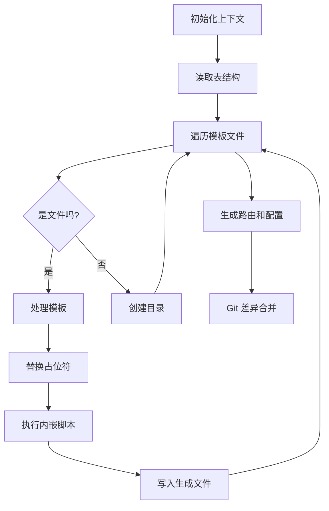
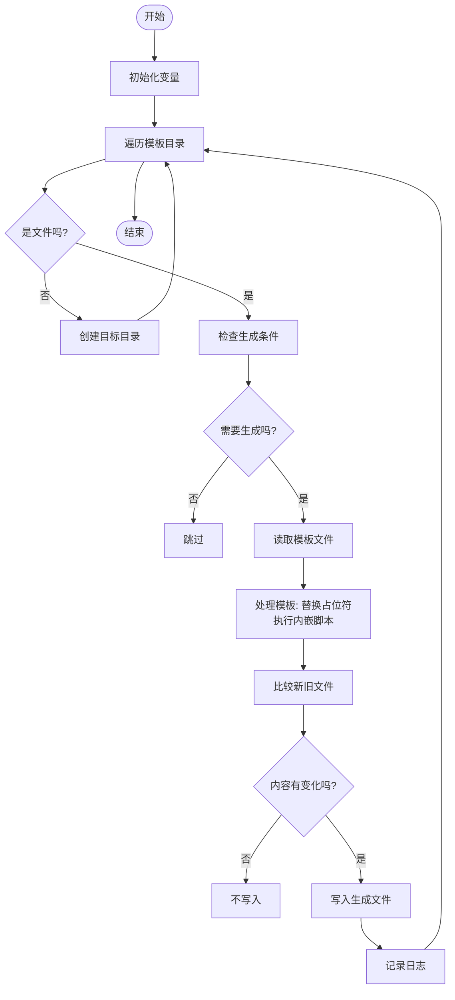
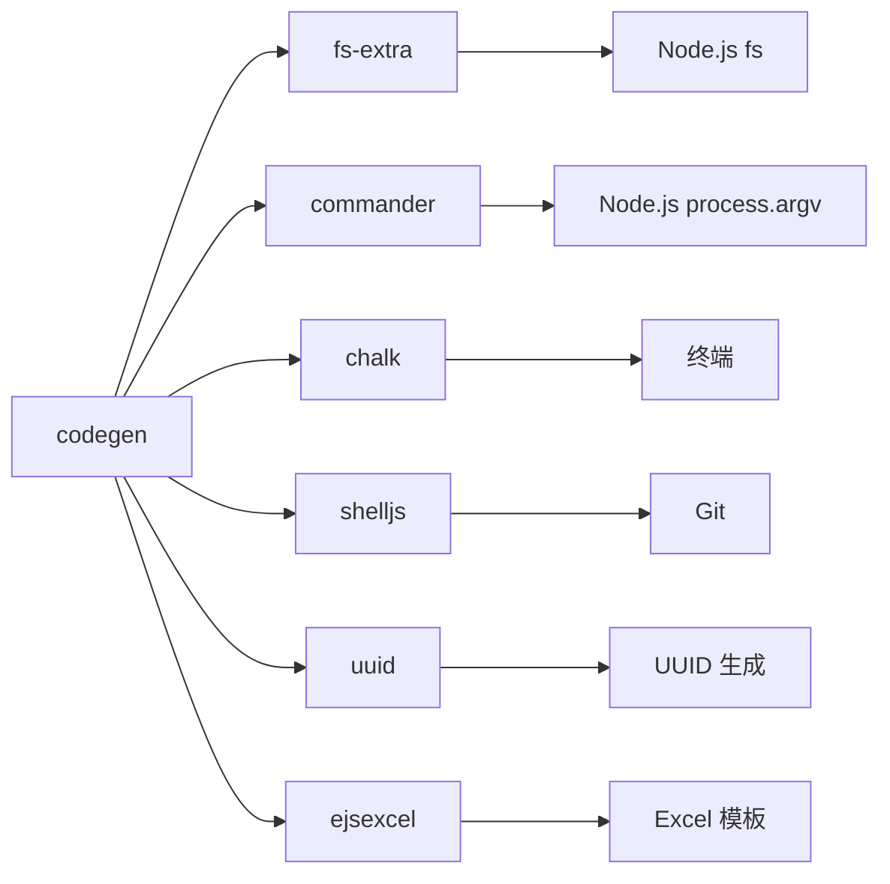

# 代码生成机制


**本文档引用的文件**  
- [codegen.ts](https://github.com/sail-sail/nest/blob/main/codegen\src\bin\codegen.ts)
- [codegen.ts](https://github.com/sail-sail/nest/blob/main/codegen\src\lib\codegen.ts)
- [tables.ts](https://github.com/sail-sail/nest/blob/main/codegen\src\tables\tables.ts)


## 目录
1. [简介](#简介)
2. [项目结构](#项目结构)
3. [核心组件](#核心组件)
4. [架构概览](#架构概览)
5. [详细组件分析](#详细组件分析)
6. [依赖分析](#依赖分析)
7. [性能考量](#性能考量)
8. [故障排除指南](#故障排除指南)
9. [结论](#结论)

## 简介
本项目是一个基于 TypeScript 的代码生成系统，旨在通过数据库表结构定义（Schema）自动生成全栈代码。系统支持 Deno、PC（前端）和 Uni（跨平台应用）等多种平台的代码生成，涵盖 GraphQL API、Vue 组件、路由配置、类型定义等。其核心逻辑位于 `codegen.ts` 文件中，利用模板引擎和 AST 分析技术，将数据库表结构映射为前后端代码。

## 项目结构
项目根目录包含 `codegen`、`deno`、`pc` 和 `uni` 四个主要模块。`codegen` 模块是代码生成器的核心，包含模板文件、配置和生成逻辑。`deno` 模块是后端服务，`pc` 模块是基于 Vue 的前端应用，`uni` 模块是跨平台移动应用。代码生成器读取 `tables` 目录下的表定义，结合模板文件，生成代码到 `__out__` 目录，最终通过 Git 差异合并到目标项目中。

**Section sources**
- [codegen.ts](https://github.com/sail-sail/nest/blob/main/codegen\src\bin\codegen.ts#L0-L124)
- [tables.ts](https://github.com/sail-sail/nest/blob/main/codegen\src\tables\tables.ts#L0-L100)

## 核心组件
核心组件包括 `codegen` 函数、`genRouter` 函数和模板引擎。`codegen` 函数负责解析表结构并生成具体文件，`genRouter` 函数负责生成路由和全局配置文件。模板引擎使用自定义的 `includeFtl` 函数处理模板中的占位符，如 `[[mod]]` 和 `[[table]]`，并执行内嵌的 JavaScript 代码来动态生成内容。

**Section sources**
- [codegen.ts](https://github.com/sail-sail/nest/blob/main/src\lib\codegen.ts#L100-L700)

## 架构概览
系统采用模板驱动的代码生成架构。首先，`initContext` 初始化数据库连接上下文。然后，`getSchema` 从数据库读取表结构信息。接着，`codegen` 函数遍历模板目录，对每个模板文件进行处理。模板文件中的占位符被替换为实际的表名、字段名等信息，并执行内嵌脚本生成最终代码。最后，`gitDiffOut` 将生成的代码合并到目标项目中。



**Diagram sources**
- [codegen.ts](https://github.com/sail-sail/nest/blob/main/src\lib\codegen.ts#L100-L700)

## 详细组件分析

### codegen 函数分析
`codegen` 函数是代码生成的核心。它接收 `Context` 和 `schema` 作为参数，遍历模板目录，对每个文件进行处理。函数使用 `treeDir` 递归遍历目录，对文件进行占位符替换和脚本执行。

#### 流程图


**Diagram sources**
- [codegen.ts](https://github.com/sail-sail/nest/blob/main/src\lib\codegen.ts#L100-L700)

### 模板引擎分析
模板引擎使用 `includeFtl` 函数解析模板。模板中使用 `[[expression]]` 语法进行变量插值，使用 `<# script #>` 语法嵌入 JavaScript 代码。例如，`[[table]]` 会被替换为实际的表名，`<# for (let col of columns) { #>` 会执行循环生成代码。

#### 示例
```typescript
// 模板片段
const tableUp = table.substring(0, 1).toUpperCase() + table.substring(1);
const Table_Up_IN = tableUp.split("_").map(function(item) {
  return item.substring(0, 1).toUpperCase() + item.substring(1);
}).join("");
```
此代码将表名转换为首字母大写的驼峰命名，用于生成类名。

**Section sources**
- [codegen.ts](https://github.com/sail-sail/nest/blob/main/src\lib\codegen.ts#L200-L300)

## 依赖分析
系统依赖 `fs-extra`、`commander`、`chalk` 等 npm 包。`fs-extra` 用于文件操作，`commander` 用于解析命令行参数，`chalk` 用于彩色日志输出。代码生成器与 `deno`、`pc`、`uni` 项目通过文件系统进行集成，生成的代码通过 Git 命令合并。



**Diagram sources**
- [codegen.ts](https://github.com/sail-sail/nest/blob/main/src\lib\codegen.ts#L1-L50)

## 性能考量
代码生成器在处理大型项目时可能会有性能瓶颈。建议在生成前清理 `__out__` 目录，并确保 Git 状态干净。系统通过比较文件大小和 MD5 值来避免不必要的文件写入，提高了生成效率。

## 故障排除指南
- **Git 有未暂存的文件**：运行 `git add -A` 将所有更改加入暂存区。
- **模板解析错误**：检查 `error.js` 文件，查看生成的脚本内容。
- **代码合并失败**：使用 `code --diff` 命令手动解决冲突。
- **缺少依赖**：确保安装了 Git 和 Node.js，并安装所有 npm 依赖。

**Section sources**
- [codegen.ts](https://github.com/sail-sail/nest/blob/main/src\lib\codegen.ts#L600-L700)

## 结论
该代码生成机制通过模板和脚本的结合，实现了从数据库表结构到全栈代码的自动化生成。它提高了开发效率，减少了手动编码的错误。通过深入理解其核心逻辑和模板语法，开发者可以轻松扩展和定制生成器，以满足特定项目的需求。