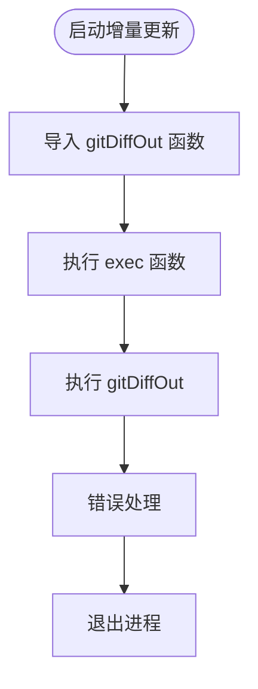
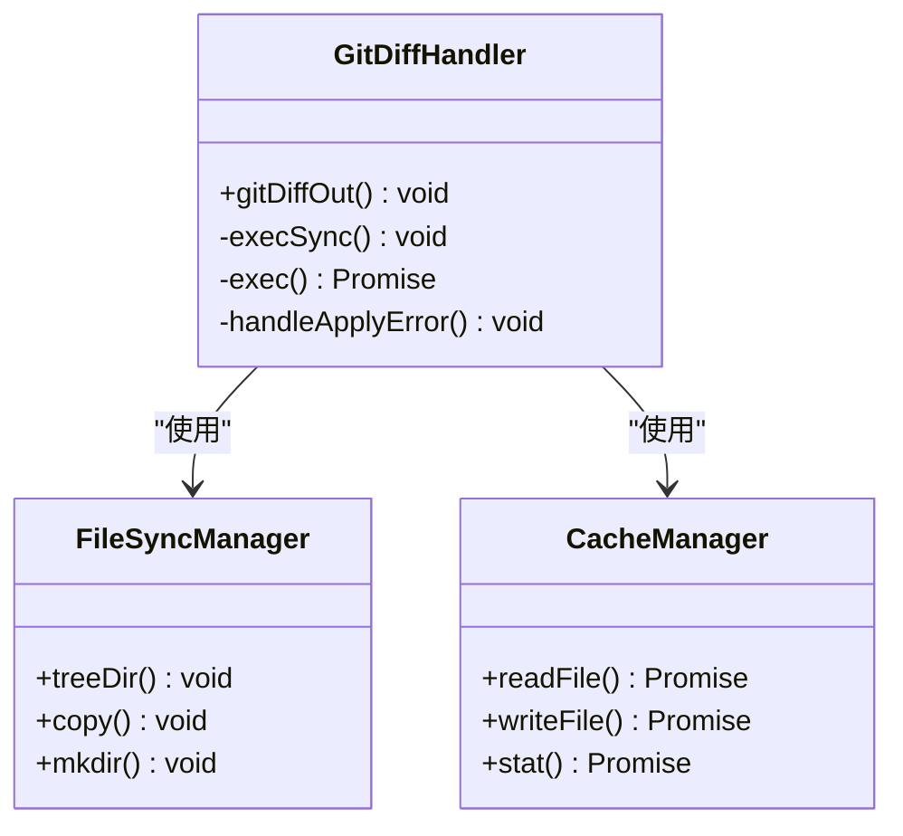
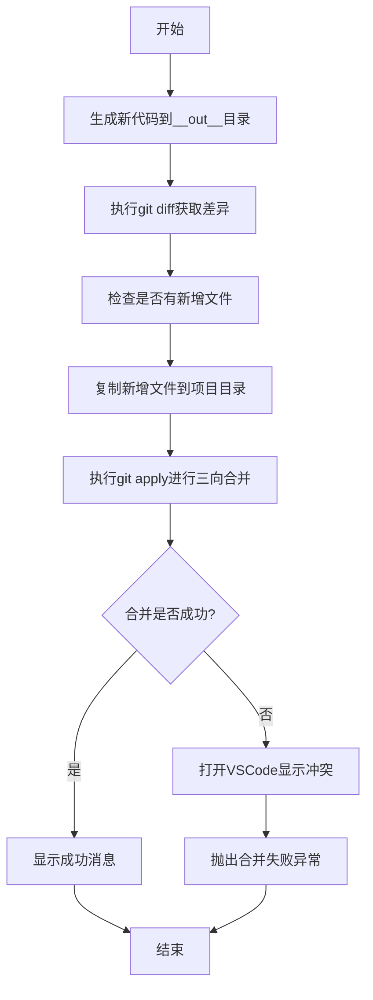
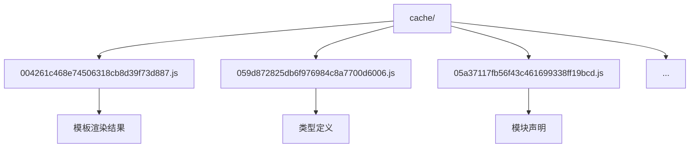
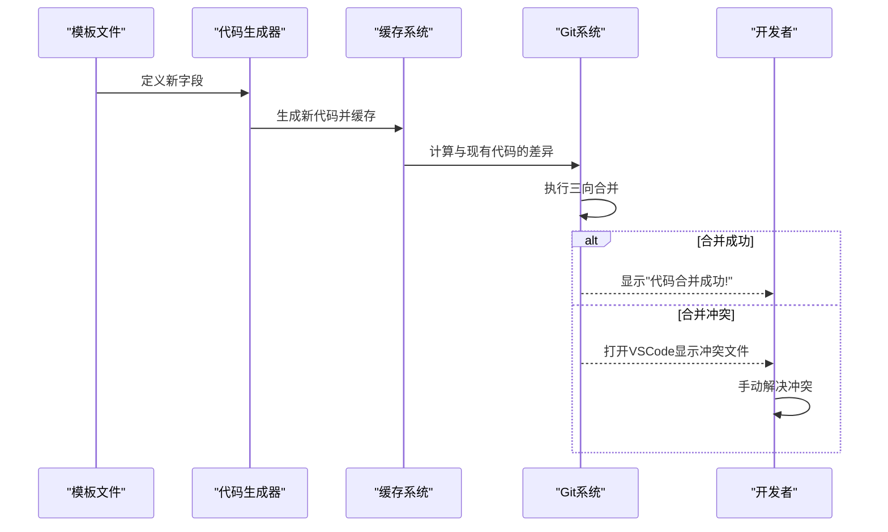
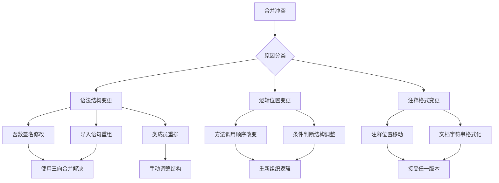

# 增量更新机制


**本文档引用文件**   
- [codeapply.ts](https://github.com/sail-sail/nest/blob/main/codegen/src/bin/codeapply.ts)
- [codegen.ts](https://github.com/sail-sail/nest/blob/main/codegen/src/lib/codegen.ts)
- [cache](https://github.com/sail-sail/nest/blob/main/codegen/cache)


## 目录
1. [简介](#简介)
2. [核心组件分析](#核心组件分析)
3. [增量更新流程](#增量更新流程)
4. [缓存机制](#缓存机制)
5. [冲突检测与解决](#冲突检测与解决)
6. [实际应用示例](#实际应用示例)
7. [常见问题排查](#常见问题排查)
8. [最佳实践](#最佳实践)

## 简介
本系统实现了一套完整的增量代码更新机制，通过结合Git差异分析、智能合并策略和缓存技术，确保代码生成过程既能反映最新模板变化，又能保留开发人员的手动修改。该机制主要由`codeapply.ts`入口文件驱动，利用`git diff`对比新旧代码生成结果，并通过智能合并策略处理潜在冲突。

**Section sources**
- [codeapply.ts](https://github.com/sail-sail/nest/blob/main/codegen/src/bin/codeapply.ts#L1-L15)

## 核心组件分析

### codeapply.ts 入口文件
作为增量更新机制的入口点，`codeapply.ts`文件负责启动整个代码应用流程。它通过调用`gitDiffOut`函数来执行核心的差异分析和代码合并操作。



**Diagram sources**
- [codeapply.ts](https://github.com/sail-sail/nest/blob/main/codegen/src/bin/codeapply.ts#L1-L15)

**Section sources**
- [codeapply.ts](https://github.com/sail-sail/nest/blob/main/codegen/src/bin/codeapply.ts#L1-L15)

### codegen.ts 核心逻辑
`codegen.ts`文件包含了增量更新机制的核心实现，包括Git差异分析、文件同步和冲突处理等关键功能。



**Diagram sources**
- [codegen.ts](https://github.com/sail-sail/nest/blob/main/codegen/src/lib/codegen.ts#L700-L748)

**Section sources**
- [codegen.ts](https://github.com/sail-sail/nest/blob/main/codegen/src/lib/codegen.ts#L700-L748)

## 增量更新流程

### 整体工作流程
增量更新机制的工作流程可以分为以下几个关键步骤：



**Diagram sources**
- [codegen.ts](https://github.com/sail-sail/nest/blob/main/codegen/src/lib/codegen.ts#L700-L748)

**Section sources**
- [codegen.ts](https://github.com/sail-sail/nest/blob/main/codegen/src/lib/codegen.ts#L700-L748)

### Git差异分析
系统通过执行`git diff --full-index`命令来获取生成代码与现有代码之间的差异。这个过程会将差异结果保存到临时文件中，以便后续处理。

```typescript
const diffFile = "__test__.diff";
const diffStr = `git diff --full-index ./* > ${projectPh}/${ diffFile }`;
execSync(diffStr, { cwd: projectPh });
```

该代码片段展示了如何生成差异文件，其中`--full-index`选项确保了完整的SHA-1哈希值被包含在输出中，这对于精确匹配文件变更至关重要。

**Section sources**
- [codegen.ts](https://github.com/sail-sail/nest/blob/main/codegen/src/lib/codegen.ts#L710-L715)

## 缓存机制

### 缓存目录结构
系统使用`codegen/cache`目录来存储历史生成结果，每个缓存文件以MD5哈希值命名，确保唯一性和可追溯性。



**Diagram sources**
- [cache](https://github.com/sail-sail/nest/blob/main/codegen/cache)

**Section sources**
- [cache](https://github.com/sail-sail/nest/blob/main/codegen/cache)

### 缓存使用策略
缓存机制主要用于支持增量计算，系统在生成新代码时会对比缓存中的历史版本，仅当内容发生变化时才进行文件写入操作。

```typescript
let stats: Stats | undefined;
try {
  stats = await stat(`${projectPh}/${dir2}`);
} catch (errTmp) { }
// 如果文件大小不一样，或者md5不一样，就写入文件
if (!stats || stats.size !== buffer2.length) {
  writeFnArr.push(async function() {
    await mkdir(dirname(`${projectPh}/${dir2}`), { recursive: true });
    await writeFile(`${projectPh}/${dir2}`, buffer2);
  });
} else {
  let buffer0: Buffer;
  try {
    buffer0 = await readFile(`${projectPh}/${dir2}`);
  } catch (errTmp) {
  }
  if (!buffer0 || createHash("md5").update(buffer2).digest("base64") !== createHash("md5").update(buffer0).digest("base64")) {
    writeFnArr.push(async function() {
      await mkdir(dirname(`${projectPh}/${dir2}`), { recursive: true });
      await writeFile(`${projectPh}/${dir2}`, buffer2);
    });
  }
}
```

上述代码展示了缓存比较的完整逻辑：首先检查文件是否存在和大小是否匹配，然后进行MD5哈希值比对，只有在内容确实发生变化时才会执行写入操作。

**Section sources**
- [codegen.ts](https://github.com/sail-sail/nest/blob/main/codegen/src/lib/codegen.ts#L200-L230)

## 冲突检测与解决

### 三向合并策略
系统采用Git的三向合并（three-way merge）策略来处理代码冲突，这比简单的双侧合并更加智能和安全。

```typescript
const applyRes = await new Promise<{
  err?: ExecException,
  stdout: string,
  stderr: string,
}>(resolve => {
  exec(
    `git apply ${ diffFile } --3way --ignore-space-change --binary --whitespace=nowarn`,
    {
      cwd: projectPh,
    },
    (err, stdout, stderr) => {
      resolve({ err, stdout, stderr });
    },
  );
});
```

关键参数说明：
- `--3way`: 启用三向合并，利用共同祖先版本进行更准确的合并
- `--ignore-space-change`: 忽略空白字符变化，减少不必要的冲突
- `--binary`: 正确处理二进制文件
- `--whitespace=nowarn`: 不警告空白字符问题

**Section sources**
- [codegen.ts](https://github.com/sail-sail/nest/blob/main/codegen/src/lib/codegen.ts#L725-L735)

### 冲突可视化
当合并失败时，系统会自动调用VSCode的差异查看器来帮助开发者直观地查看和解决冲突。

```typescript
if (applyErr) {
  if (applyErr.includes("error: patch failed:")) {
    applyHasErr = true;
    console.log("");
    const errArr = applyErr.split("\n");
    for (let item of errArr) {
      if (!item.startsWith("error: ") || !item.endsWith(": patch does not apply")) continue;
      item = item.substring("error: ".length, item.length - ": patch does not apply".length);
      // 打开vscode的diff
      const cmdTmp = `code --diff "${ out }/${ item }" "${ projectPh }/${ item }"`;
      applyErrMsg += cmdTmp + "\n";
      shelljs.exec(cmdTmp);
    }
    console.log("");
  }
}
```

这一设计极大地提升了冲突解决的效率，开发者可以直接在熟悉的IDE环境中查看新生成代码与现有代码的差异。

**Section sources**
- [codegen.ts](https://github.com/sail-sail/nest/blob/main/codegen/src/lib/codegen.ts#L737-L750)

## 实际应用示例

### 字段增删场景
当模板中添加或删除字段时，增量更新机制能够智能地处理这些变更：



**Diagram sources**
- [codegen.ts](https://github.com/sail-sail/nest/blob/main/codegen/src/lib/codegen.ts#L700-L748)

**Section sources**
- [codegen.ts](https://github.com/sail-sail/nest/blob/main/codegen/src/lib/codegen.ts#L700-L748)

### 接口修改场景
对于API接口的修改，系统能够保留开发者添加的自定义逻辑，同时更新接口签名和文档。

```typescript
// 假设这是缓存中的原始文件
function getUser(id: string): User {
  // 自定义业务逻辑
  console.log("获取用户信息");
  return db.find(id);
}

// 生成的新版本可能修改了参数类型
function getUser(id: UserId): User {
  // 保留的自定义业务逻辑
  console.log("获取用户信息");
  return db.find(id);
}
```

在这种情况下，三向合并能够识别出函数签名的变化，同时保留函数体内的自定义代码。

**Section sources**
- [codegen.ts](https://github.com/sail-sail/nest/blob/main/codegen/src/lib/codegen.ts#L700-L748)

## 常见问题排查

### 合并冲突常见原因
以下是导致合并冲突的常见情况及其解决方案：



**Diagram sources**
- [codegen.ts](https://github.com/sail-sail/nest/blob/main/codegen/src/lib/codegen.ts#L737-L750)

**Section sources**
- [codegen.ts](https://github.com/sail-sail/nest/blob/main/codegen/src/lib/codegen.ts#L737-L750)

### 调试技巧
当遇到难以解决的合并问题时，可以采用以下调试方法：

1. **检查差异文件**：查看生成的`__test__.diff`文件，了解具体的变更内容
2. **启用详细日志**：在执行脚本时添加`--verbose`参数获取更多调试信息
3. **分步执行**：将整个流程分解为独立步骤，逐个验证每个环节
4. **备份原始文件**：在执行合并前备份关键文件，以防需要回滚

**Section sources**
- [codegen.ts](https://github.com/sail-sail/nest/blob/main/codegen/src/lib/codegen.ts#L700-L748)

## 最佳实践

### 代码组织建议
为了最大化增量更新机制的效果，建议遵循以下代码组织原则：

- **分离生成代码与手动代码**：将自动生成的代码和手动编写的代码放在不同的文件或模块中
- **使用明确的注释标记**：在手动修改的代码周围添加特殊注释，便于识别和保护
- **避免在生成区域添加复杂逻辑**：尽量将业务逻辑放在生成代码之外的扩展文件中

### 版本控制策略
合理的版本控制策略能够显著减少合并冲突的发生：

- **定期提交更改**：频繁提交小的、专注的更改，便于追踪和合并
- **使用特性分支**：为重大修改创建独立分支，完成后再合并到主干
- **及时同步主干**：定期将主干的变更合并到特性分支，减少最终合并时的冲突

### 监控与维护
建立有效的监控和维护机制：

- **自动化测试**：为生成的代码编写单元测试，确保变更不会破坏现有功能
- **变更审计**：记录重要的代码生成事件，便于追溯和审查
- **性能监控**：监控代码生成和合并过程的性能，及时发现瓶颈

**Section sources**
- [codegen.ts](https://github.com/sail-sail/nest/blob/main/codegen/src/lib/codegen.ts#L700-L748)