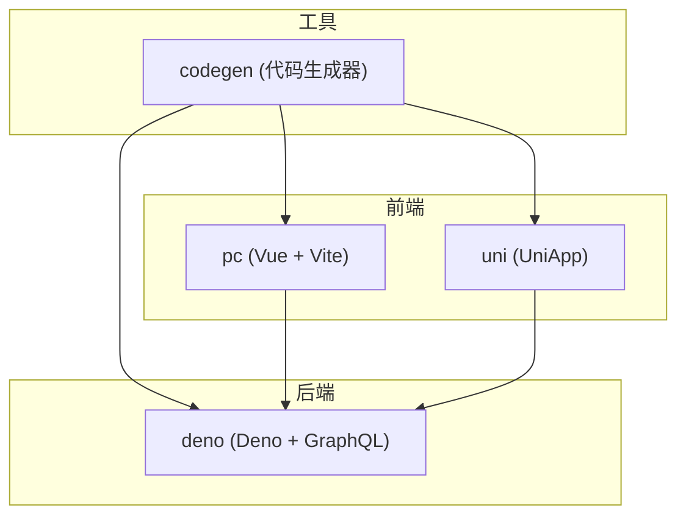
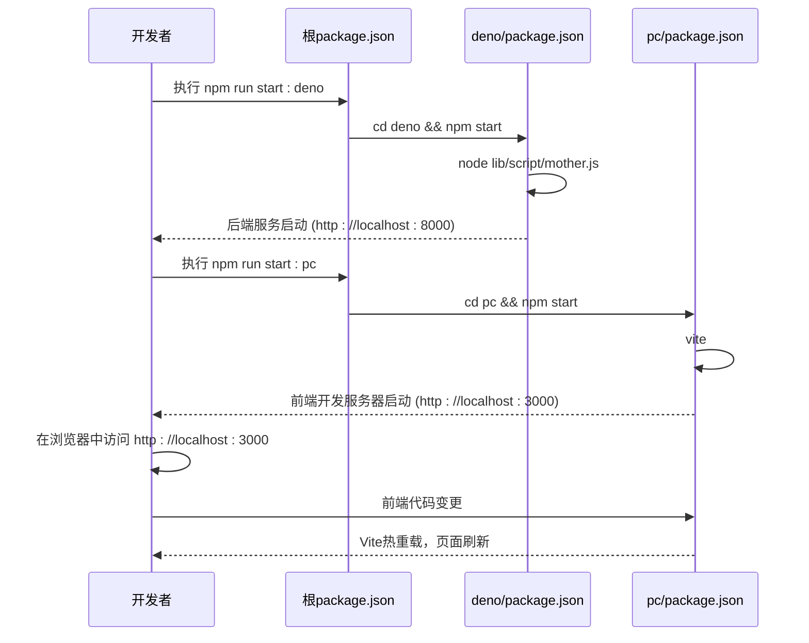
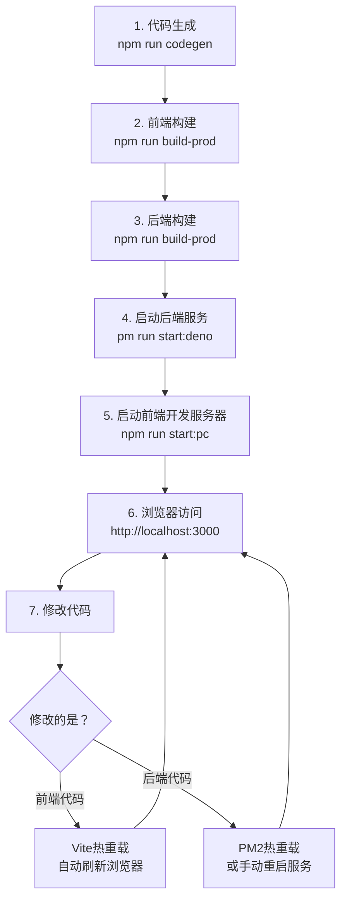

# 开发脚本与工作流


**本文档引用文件**  
- [package.json](https://github.com/sail-sail/nest/blob/main/package.json)
- [deno/package.json](https://github.com/sail-sail/nest/blob/main/deno/package.json)
- [pc/package.json](https://github.com/sail-sail/nest/blob/main/pc/package.json)
- [deno/ecosystem.config.json](https://github.com/sail-sail/nest/blob/main/deno/ecosystem.config.json)
- [deno/lib/script/build.ts](https://github.com/sail-sail/nest/blob/main/deno/lib/script/build.ts)
- [codegen/package.json](https://github.com/sail-sail/nest/blob/main/codegen/package.json)
- [uni/package.json](https://github.com/sail-sail/nest/blob/main/uni/package.json)


## 目录
1. [项目结构概览](#项目结构概览)
2. [核心脚本命令解析](#核心脚本命令解析)
3. [前后端服务协调机制](#前后端服务协调机制)
4. [PM2进程管理配置](#pm2进程管理配置)
5. [Vite构建配置差异](#vite构建配置差异)
6. [标准开发工作流](#标准开发工作流)
7. [环境变量与多环境部署](#环境变量与多环境部署)

## 项目结构概览

本项目采用模块化架构，主要包含以下核心目录：

- `codegen`：代码生成工具模块，负责根据数据库表结构自动生成前后端代码。
- `deno`：后端服务模块，基于Deno运行时构建，提供GraphQL API服务。
- `pc`：PC端前端模块，基于Vue 3与Vite构建。
- `uni`：移动端前端模块，使用UniApp框架支持多端发布。
- 根目录`package.json`：全局脚本调度中心，协调各子模块的执行流程。

该结构实现了前后端分离与职责解耦，便于独立开发与部署。



**图示来源**
- [project_structure](https://github.com/sail-sail/nest/blob/main/#L1-L500)

## 核心脚本命令解析

### 根目录package.json脚本

根目录的`package.json`文件定义了项目级的npm脚本，作为整个工作流的入口。

**Section sources**
- [package.json](https://github.com/sail-sail/nest/blob/main/package.json#L1-L32)

#### 开发与启动脚本
```json
"scripts": {
  "start": "cd pc && npm start",
  "start:pc": "cd pc && npm start",
  "start:deno": "cd deno && npm start",
  "dev:mp-weixin": "cd uni && npx uni -p mp-weixin",
  "dev:h5": "cd uni && npx uni"
}
```
- `start`：默认启动PC前端开发服务器。
- `start:pc` / `start:deno`：分别进入`pc`和`deno`目录并执行其`start`脚本，用于独立启动前后端服务。
- `dev:h5`：启动UniApp的H5开发服务器。
- `dev:mp-weixin`：启动微信小程序开发环境。

#### 代码生成与数据管理
```json
"scripts": {
  "codegen": "cd codegen && npm run codegen",
  "codeapply": "cd codegen && node -r ts-node/register src/bin/codeapply.ts",
  "coderemove": "cd codegen && node -r ts-node/register src/bin/coderemove.ts",
  "initdb": "cd codegen && node -r ts-node/register src/util/npmInitDB.ts",
  "importCsv": "cd codegen && node -r ts-node/register src/util/npmImportCsv.ts"
}
```
- `codegen`：执行代码生成流程，调用`codegen`模块的`codegen`脚本。
- `codeapply`：应用代码生成的变更。
- `coderemove`：移除已生成的代码。
- `initdb`：初始化数据库结构。
- `importCsv`：从CSV文件导入初始数据。

#### 构建与发布
```json
"scripts": {
  "build-prod": "cd deno && npm run build-prod",
  "build-test": "cd deno && npm run build-test",
  "publish": "cd deno && npm run publish",
  "upgrade": "cd codegen && npm run upgrade && npm run codegen"
}
```
- `build-prod` / `build-test`：分别构建生产环境和测试环境的后端可执行文件。
- `publish`：执行发布流程，通常与构建脚本配合使用。
- `upgrade`：升级代码生成器并重新生成代码。

### Deno模块package.json脚本

`deno/package.json`定义了后端服务的具体构建和运行逻辑。

**Section sources**
- [deno/package.json](https://github.com/sail-sail/nest/blob/main/deno/package.json#L1-L52)

```json
"scripts": {
  "start": "node lib/script/mother.js",
  "gqlgen": "npx graphql-codegen --config ./lib/script/graphql_codegen_config.ts",
  "build-prod": "deno run -A ./lib/script/build.ts --target linux --env prod",
  "build-test": "deno run -A ./lib/script/build.ts --target linux --env test",
  "publish": "node lib/script/publish.js",
  "db_gen_crypto_key": "deno run -A ./lib/script/db_gen_crypto_key.ts"
}
```
- `start`：启动后端服务，执行`mother.js`（可能是服务入口或PM2启动脚本）。
- `gqlgen`：使用GraphQL Codegen工具根据配置文件`graphql_codegen_config.ts`生成TypeScript类型和客户端代码。
- `build-prod` / `build-test`：调用`build.ts`脚本，指定目标平台（Linux）和环境（prod/test）进行编译打包。
- `publish`：执行发布脚本`publish.js`，可能涉及文件传输、服务重启等操作。
- `db_gen_crypto_key`：生成数据库加密密钥。

### PC模块package.json脚本

`pc/package.json`定义了PC前端的构建流程。

**Section sources**
- [pc/package.json](https://github.com/sail-sail/nest/blob/main/pc/package.json#L1-L102)

```json
"scripts": {
  "start": "vite",
  "build-prod": "set NODE_OPTIONS=--max-old-space-size=4096 && vite build --emptyOutDir && node src/utils/postbuild.js",
  "build-test": "set NODE_OPTIONS=--max-old-space-size=4096 && vite build --mode test --emptyOutDir && node src/utils/postbuild.js",
  "postinstall": "node src/utils/postinstall.js"
}
```
- `start`：使用Vite启动开发服务器。
- `build-prod` / `build-test`：设置Node.js内存限制，执行Vite构建，并在构建后运行`postbuild.js`进行额外处理（如文件优化、版本号注入等）。
- `postinstall`：在`pnpm install`后自动执行，可能用于初始化配置或生成文件。

## 前后端服务协调机制

项目的开发工作流通过精心设计的脚本依赖关系来协调前后端服务的启动顺序。

### 启动顺序逻辑

1.  **代码生成先行**：在启动任何服务之前，通常需要确保最新的代码已生成。`deno`模块的构建脚本`build.ts`在编译前会显式调用`codegen`和`gqlgen`。
2.  **后端服务为先**：前端应用（PC和移动端）依赖后端API。因此，最佳实践是先启动后端服务。
    -   手动启动：开发者应先执行 `npm run start:deno`，待后端服务就绪后，再执行 `npm run start:pc` 或 `npm run dev:h5`。
    -   自动化协调：虽然当前脚本未提供一键启动所有服务的命令，但可以通过编写新的npm脚本（如`dev:full`）来实现，该脚本后台启动Deno服务，再启动前端服务。
3.  **热重载支持**：
    -   **前端**：Vite和UniApp的开发服务器均内置热重载功能，修改前端代码后浏览器会自动刷新。
    -   **后端**：Deno本身支持文件变更时重新运行脚本。结合`PM2`的`watch`模式，可以实现后端代码的热重载。



**图示来源**
- [package.json](https://github.com/sail-sail/nest/blob/main/package.json#L1-L32)
- [deno/package.json](https://github.com/sail-sail/nest/blob/main/deno/package.json#L1-L52)
- [pc/package.json](https://github.com/sail-sail/nest/blob/main/pc/package.json#L1-L102)

## PM2进程管理配置

`deno`目录下的`ecosystem.config.json`文件是PM2的配置文件，用于在生产环境中管理后端应用进程。

**Section sources**
- [deno/ecosystem.config.json](https://github.com/sail-sail/nest/blob/main/deno/ecosystem.config.json#L1-L13)

```json
{
  "apps": [{
    "name": "nest4{env}",
    "script": "./nest4{env}",
    "instances": 1,
    "autorestart": true,
    "watch": false,
    "env": {},
    "env_production": {}
  }]
}
```

### 配置项详解

- **`name`**: `"nest4{env}"` 应用的名称。`{env}`是一个占位符，在构建时会被实际的环境变量（如`prod`、`test`）替换，以区分不同环境的进程。
- **`script`**: `"./nest4{env}"` 指定要执行的脚本文件。`nest4{env}`是通过`deno compile`命令生成的可执行文件名，同样`{env}`会被替换。
- **`instances`**: `1` 指定启动的应用实例数量。设置为1表示单实例运行。
- **`autorestart`**: `true` 启用自动重启。当应用崩溃或被终止时，PM2会自动将其重新启动，保证服务的高可用性。
- **`watch`**: `false` 禁用文件监视。在生产环境中，通常不希望代码变更自动触发重启，以避免意外。重启应通过明确的部署流程（如`pm2 reload`）来控制。
- **`env` / `env_production`**: 环境变量配置对象。当前为空，实际的环境变量（如数据库连接信息）应通过`.env`文件或PM2命令行参数注入。

### 构建时的配置处理

`deno/lib/script/build.ts`脚本在执行`copyEnv`函数时，会读取`ecosystem.config.json`文件，并将其中的`{env}`占位符替换为实际的环境值（`env`变量），然后将处理后的配置文件复制到构建输出目录。

```typescript
// deno/lib/script/build.ts 片段
async function copyEnv() {
  const ecosystemStr = await Deno.readTextFile(denoDir+"/ecosystem.config.json");
  const ecosystemStr2 = ecosystemStr.replaceAll("{env}", env); // 替换占位符
  await Deno.writeTextFile(`${ buildDir }/ecosystem.config.json`, ecosystemStr2);
}
```

## Vite构建配置差异

PC前端模块使用Vite进行构建，其`package.json`中的脚本通过`--mode`参数区分不同环境。

**Section sources**
- [pc/package.json](https://github.com/sail-sail/nest/blob/main/pc/package.json#L1-L102)

### 构建命令差异

- **生产环境构建 (`build-prod`)**:
  ```json
  "build-prod": "set NODE_OPTIONS=--max-old-space-size=4096 && vite build --emptyOutDir && node src/utils/postbuild.js"
  ```
  - `--emptyOutDir`: 在构建前清空输出目录（默认为`dist`），确保没有旧文件残留。
  - 未指定`--mode`，Vite默认使用`production`模式。此模式下会启用代码压缩、Tree Shaking等优化，生成最小化的生产包。

- **测试环境构建 (`build-test`)**:
  ```json
  "build-test": "set NODE_OPTIONS=--max-old-space-size=4096 && vite build --mode test --emptyOutDir && node src/utils/postbuild.js"
  ```
  - `--mode test`: 显式指定构建模式为`test`。
  - Vite会加载`.env.test`文件中的环境变量，并可能应用特定于测试环境的构建配置（如不同的API基础URL）。

### 移动端构建

移动端使用UniApp，其构建命令定义在`uni/package.json`中，与PC端独立。

```json
"scripts": {
  "build:h5-prod": "vite build --mode production",
  "build:h5-test": "vite build --mode test"
}
```
- 同样通过`--mode`参数区分环境，逻辑与PC端一致。

## 标准开发工作流

一个完整的标准开发工作流如下：

**Section sources**
- [package.json](https://github.com/sail-sail/nest/blob/main/package.json#L1-L32)
- [deno/lib/script/build.ts](https://github.com/sail-sail/nest/blob/main/deno/lib/script/build.ts#L1-L367)

### 1. 代码生成 → 2. 前端构建 → 3. 后端启动 → 4. 热重载调试



**图示来源**
- [package.json](https://github.com/sail-sail/nest/blob/main/package.json#L1-L32)
- [deno/lib/script/build.ts](https://github.com/sail-sail/nest/blob/main/deno/lib/script/build.ts#L1-L367)

1.  **代码生成 (`npm run codegen`)**:
    -   开发者定义数据库表结构或修改现有结构。
    -   执行此命令，`codegen`模块会根据最新的数据库元数据生成Deno后端的DAO、Resolver、Model代码，以及PC和UniApp前端的路由、视图和API调用代码。

2.  **前端构建 (可选，用于预览)**:
    -   如果需要在不启动开发服务器的情况下查看构建结果，可以执行`npm run build-prod`或`npm run build-test`。
    -   构建完成后，静态文件位于`pc/dist`目录，可直接通过HTTP服务器访问。

3.  **后端构建与发布**:
    -   执行`npm run build-prod`。该命令会：
        a. 进入`deno`目录。
        b. 执行`npm run build-prod`，调用`build.ts`脚本。
        c. `build.ts`脚本内部会自动执行`codegen`和`gqlgen`，确保代码是最新的。
        d. 调用`deno compile`将TypeScript代码编译成针对Linux平台的可执行文件`nest4prod`。
        e. 执行`npm run publish`，完成发布流程。

4.  **启动服务进行调试**:
    -   **开发阶段**：直接使用开发服务器，无需构建。
        -   启动后端：`npm run start:deno`
        -   启动前端：`npm run start:pc`
    -   **生产/测试阶段**：使用PM2管理编译后的可执行文件。
        -   `pm2 start ecosystem.config.json --env production`

5.  **热重载调试**:
    -   在开发服务器运行时，修改代码。
    -   前端修改会由Vite立即响应，浏览器自动刷新。
    -   后端修改，如果`PM2`的`watch`设置为`true`，则会自动重启；否则需手动重启`mother.js`。

## 环境变量与多环境部署

项目通过多种机制支持多环境配置。

### 环境变量管理

1.  **`.env`文件**:
    -   `deno`模块使用`.env.prod`、`.env.test`等文件存储不同环境的敏感信息（如数据库密码、OSS密钥）。
    -   `build.ts`脚本在构建时会将对应环境的`.env`文件复制到输出目录。

2.  **构建时注入**:
    -   `build.ts`脚本通过`--env`参数接收环境标识（`prod`或`test`），并在构建过程中使用该值替换配置文件中的占位符。

3.  **PM2环境配置**:
    -   `ecosystem.config.json`中的`env_production`等字段可用于定义环境变量，优先级高于`.env`文件。

### 多环境部署配置

部署流程由`build.ts`脚本统一协调：

```typescript
// deno/lib/script/build.ts 片段
const env = getArg("--env") || "prod"; // 获取环境参数，默认为prod
const commands = (getArg("--command") || "").split(",").filter((v) => v); // 获取要构建的模块

// 根据commands数组决定构建哪些部分
for (const command of commands) {
  if (command === "deno") { /* 编译后端 */ }
  else if (command === "pc") { /* 构建PC前端 */ }
  else if (command === "uni") { /* 构建移动端 */ }
}

// 最后执行发布
await publish();
```

**部署示例**:
-   **仅部署后端**：`npm run build-prod -- --command deno`
-   **部署PC前端和后端**：`npm run build-prod -- --command deno,pc`
-   **全量部署**：`npm run build-prod` (不指定`--command`时，默认构建所有模块)

此机制确保了不同环境（生产、测试）的部署过程一致且可复现。

**Section sources**
- [deno/lib/script/build.ts](https://github.com/sail-sail/nest/blob/main/deno/lib/script/build.ts#L1-L367)
- [deno/ecosystem.config.json](https://github.com/sail-sail/nest/blob/main/deno/ecosystem.config.json#L1-L13)
- [package.json](https://github.com/sail-sail/nest/blob/main/package.json#L1-L32)