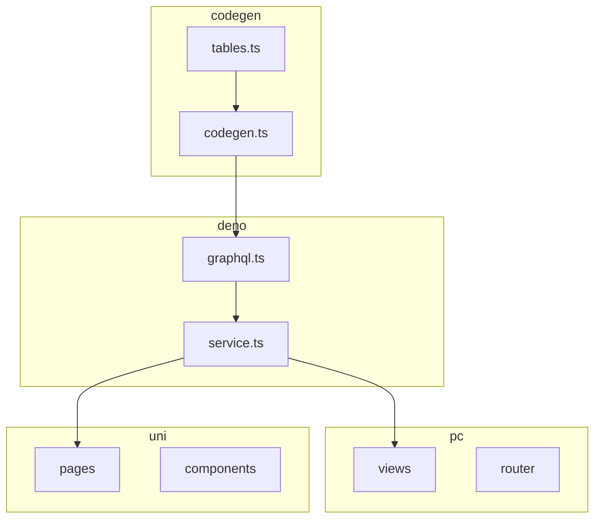
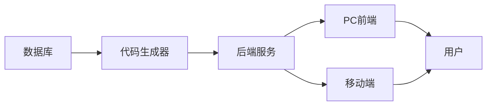
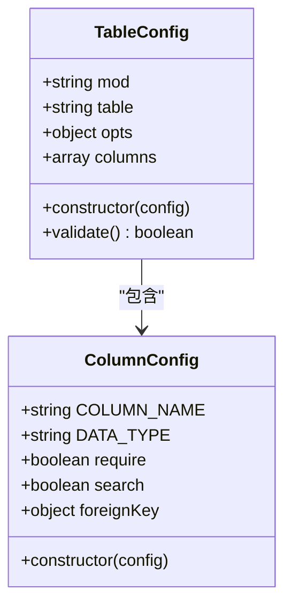
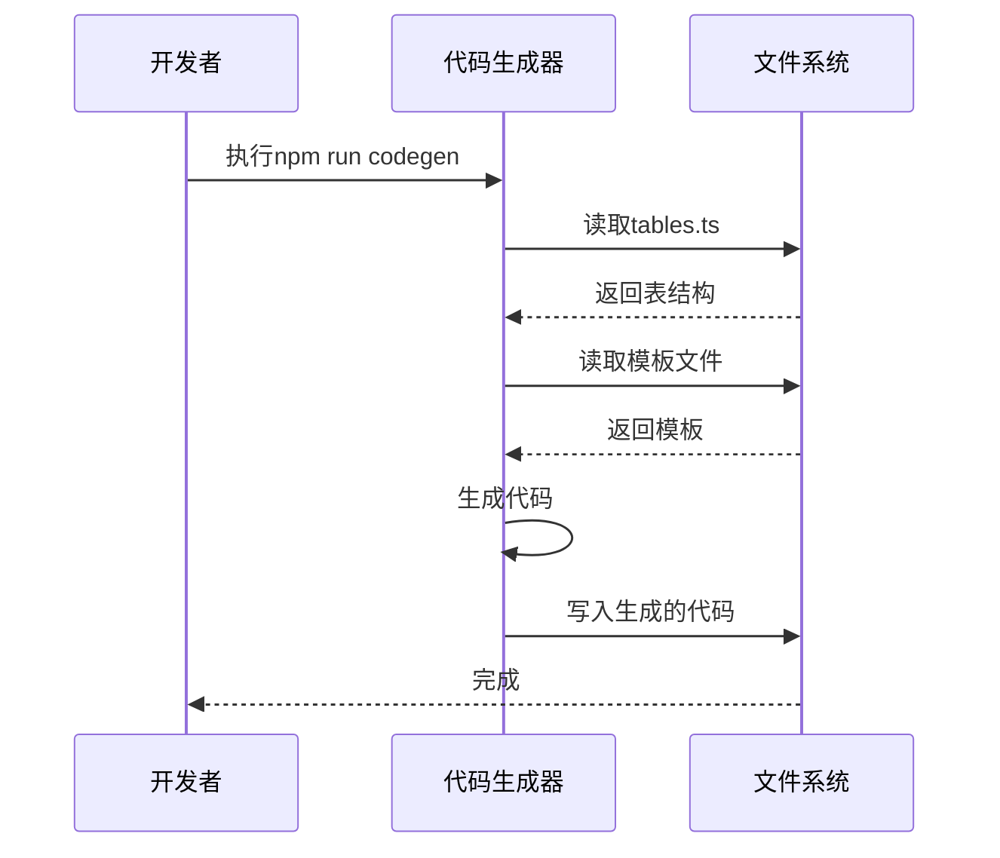
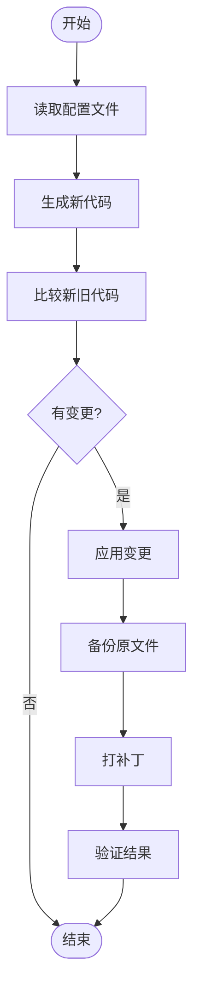
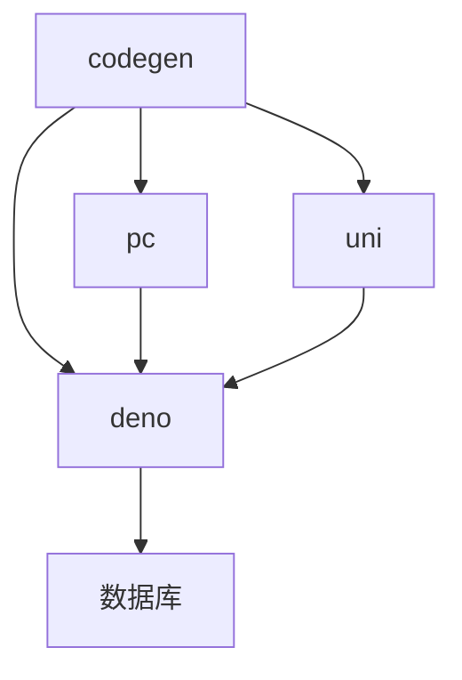

# 日常开发流程

**本文档中引用的文件**  
- [tables.ts](https://github.com/sail-sail/nest/blob/main/codegen\src\tables\tables.ts)
- [base.ts](https://github.com/sail-sail/nest/blob/main/codegen\src\tables\base\base.ts)
- [codegen.ts](https://github.com/sail-sail/nest/blob/main/codegen\src\bin\codegen.ts)
- [codegen.ts](https://github.com/sail-sail/nest/blob/main/codegen\src\lib\codegen.ts)
- [package.json](https://github.com/sail-sail/nest/blob/main/codegen\package.json)

## 目录
1. [简介](#简介)
2. [项目结构](#项目结构)
3. [核心组件](#核心组件)
4. [架构概览](#架构概览)
5. [详细组件分析](#详细组件分析)
6. [依赖分析](#依赖分析)
7. [性能考虑](#性能考虑)
8. [故障排除指南](#故障排除指南)
9. [结论](#结论)

## 简介
本文档详细描述了从需求分析到功能上线的完整开发周期。重点说明如何定义数据库表结构（参考tables.ts），使用代码生成器（codegen.ts）生成基础代码，以及如何进行手动修改和定制化开发。介绍项目中使用的npm脚本（package.json）及其执行顺序，包括代码生成、构建和启动服务等命令。阐述增量更新机制的工作原理，确保手动修改的代码在重新生成时不会丢失。提供实际操作示例，展示添加新功能模块的完整步骤。解释各开发阶段的协作流程，包括代码提交规范和分支管理策略。

## 项目结构
项目采用模块化设计，主要分为codegen、deno、pc和uni四个部分。codegen目录包含代码生成器及相关配置文件；deno目录存放后端服务代码；pc目录为PC端前端代码；uni目录为移动端前端代码。

**图示来源**
- [tables.ts](https://github.com/sail-sail/nest/blob/main/codegen\src\tables\tables.ts)
- [codegen.ts](https://github.com/sail-sail/nest/blob/main/codegen\src\bin\codegen.ts)

**本节来源**
- [tables.ts](https://github.com/sail-sail/nest/blob/main/codegen\src\tables\tables.ts)
- [codegen.ts](https://github.com/sail-sail/nest/blob/main/codegen\src\bin\codegen.ts)

## 核心组件
核心组件包括数据库表结构定义、代码生成器、增量更新机制等。通过tables.ts文件定义所有数据库表结构，codegen.ts实现代码自动生成，gitDiffOut函数确保手动修改的代码不会被覆盖。

**本节来源**
- [tables.ts](https://github.com/sail-sail/nest/blob/main/codegen\src\tables\tables.ts)
- [codegen.ts](https://github.com/sail-sail/nest/blob/main/codegen\src\lib\codegen.ts)

## 架构概览
系统采用前后端分离架构，后端基于Deno运行时提供GraphQL API，前端PC端使用Vue框架，移动端使用UniApp框架。代码生成器根据数据库表结构自动生成CRUD操作代码，提高开发效率。

**图示来源**
- [codegen.ts](https://github.com/sail-sail/nest/blob/main/codegen\src\bin\codegen.ts)
- [package.json](https://github.com/sail-sail/nest/blob/main/codegen\package.json)

## 详细组件分析
### 数据库表结构定义
通过tables.ts文件定义所有数据库表结构，每个表包含列定义、选项配置等信息。支持国际化、缓存、唯一性约束等功能。

**图示来源**
- [tables.ts](https://github.com/sail-sail/nest/blob/main/codegen\src\tables\tables.ts)
- [base.ts](https://github.com/sail-sail/nest/blob/main/codegen\src\tables\base\base.ts)

### 代码生成器
codegen.ts实现代码自动生成功能，读取数据库表结构，结合模板文件生成前后端代码。支持增量更新，只生成有变更的文件。

**图示来源**
- [codegen.ts](https://github.com/sail-sail/nest/blob/main/codegen\src\bin\codegen.ts)
- [codegen.ts](https://github.com/sail-sail/nest/blob/main/codegen\src\lib\codegen.ts)

### 增量更新机制
通过git diff比较生成前后代码差异，仅应用有变更的部分，保护手动修改的代码不被覆盖。

**图示来源**
- [codegen.ts](https://github.com/sail-sail/nest/blob/main/codegen\src\lib\codegen.ts)

**本节来源**
- [tables.ts](https://github.com/sail-sail/nest/blob/main/codegen\src\tables\tables.ts)
- [codegen.ts](https://github.com/sail-sail/nest/blob/main/codegen\src\bin\codegen.ts)
- [codegen.ts](https://github.com/sail-sail/nest/blob/main/codegen\src\lib\codegen.ts)

## 依赖分析
项目依赖关系清晰，codegen模块独立运行，生成的代码分别输出到deno、pc和uni模块。各前端模块通过GraphQL与后端通信。

**图示来源**
- [package.json](https://github.com/sail-sail/nest/blob/main/codegen\package.json)

**本节来源**
- [package.json](https://github.com/sail-sail/nest/blob/main/codegen\package.json)

## 性能考虑
代码生成过程采用异步IO操作，避免阻塞。生成的代码经过优化，减少不必要的计算和内存占用。建议定期清理缓存文件以保持最佳性能。

## 故障排除指南
常见问题包括代码生成失败、git冲突、依赖缺失等。解决方法包括检查配置文件语法、解决git冲突、重新安装依赖等。

**本节来源**
- [codegen.ts](https://github.com/sail-sail/nest/blob/main/codegen\src\lib\codegen.ts)

## 结论
本文档全面介绍了日常开发流程，从数据库设计到代码生成，再到部署上线的完整过程。通过自动化工具提高开发效率，同时保证代码质量和可维护性。建议开发人员熟悉代码生成机制，合理利用模板定制功能，提高开发效率。