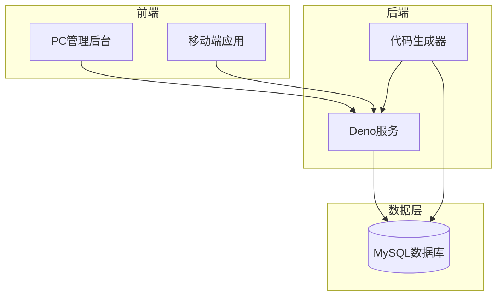
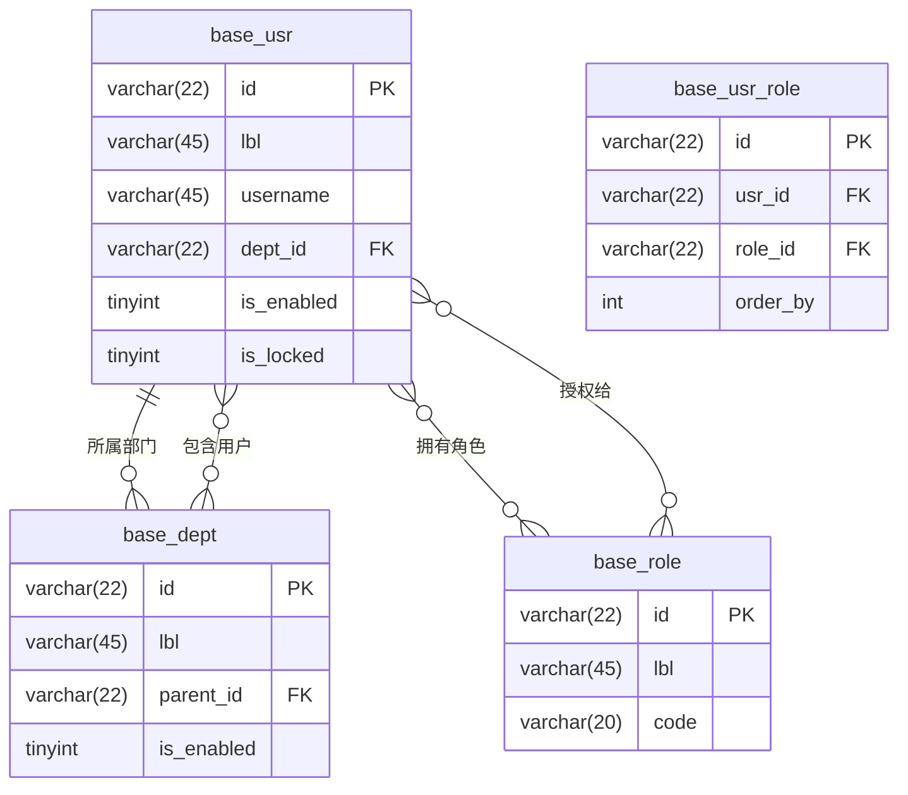
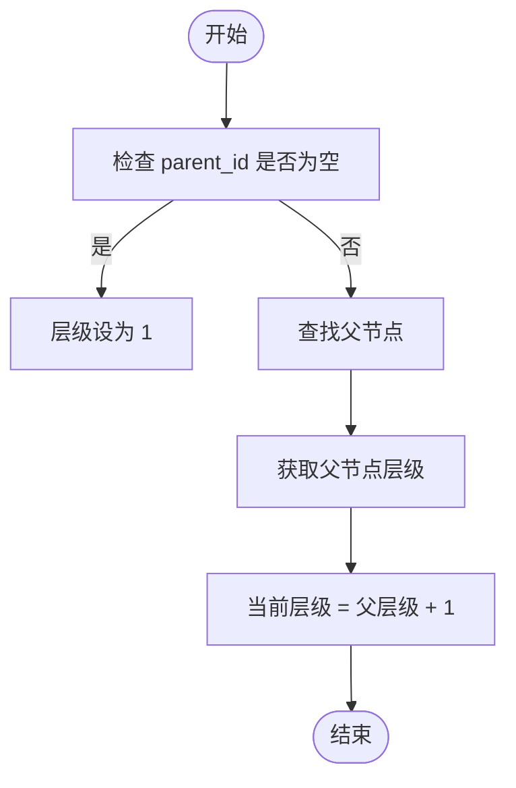
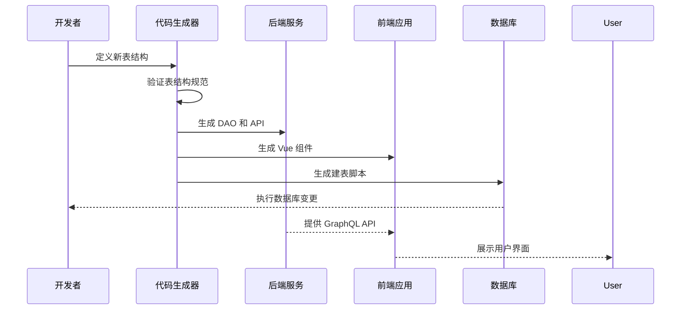

# 需求分析与表结构设计


**本文档引用文件**  
- [TABLE_RULES.md](https://github.com/sail-sail/nest/blob/main/codegen/.github/TABLE_RULES.md)
- [tables.ts](https://github.com/sail-sail/nest/blob/main/codegen/src/tables/tables.ts)
- [information_schema.ts](https://github.com/sail-sail/nest/blob/main/codegen/src/lib/information_schema.ts)
- [base.i18n.sql](https://github.com/sail-sail/nest/blob/main/codegen/src/tables/base/base.i18n.sql)
- [base.sql](https://github.com/sail-sail/nest/blob/main/codegen/src/tables/base/base.sql)
- [List.vue](https://github.com/sail-sail/nest/blob/main/pc/src/views/base/domain/List.vue)


## 目录
1. [引言](#引言)
2. [项目结构分析](#项目结构分析)
3. [核心组件分析](#核心组件分析)
4. [表结构设计规范](#表结构设计规范)
5. [数据建模实践案例](#数据建模实践案例)
6. [表间关系处理](#表间关系处理)
7. [表结构版本控制与代码生成](#表结构版本控制与代码生成)
8. [数据建模评审与优化](#数据建模评审与优化)

## 引言

本文档旨在详细阐述基于业务需求进行数据库模式设计的完整流程。通过分析现有代码库结构，重点介绍表结构定义规范、数据模型定义方法、表间关系处理机制以及代码生成协同工作原理。文档将结合实际案例，指导开发者如何从需求出发，完成高质量的数据建模工作。

## 项目结构分析

项目采用模块化架构设计，主要分为以下几个核心目录：

- `codegen`：代码生成器核心模块，包含表结构定义、模板引擎和配置文件
- `deno`：后端服务运行时，基于 Deno 构建的 GraphQL API 服务
- `pc`：前端管理后台，基于 Vue 3 + TypeScript 开发
- `uni`：移动端应用，使用 UniApp 框架开发

其中，`codegen/src/tables` 目录是数据模型定义的核心位置，`TABLE_RULES.md` 文件定义了完整的数据库建表规范。



**图示来源**  
- [TABLE_RULES.md](https://github.com/sail-sail/nest/blob/main/codegen/.github/TABLE_RULES.md)
- [tables.ts](https://github.com/sail-sail/nest/blob/main/codegen/src/tables/tables.ts)

## 核心组件分析

### 代码生成器核心组件

代码生成器的核心逻辑位于 `codegen` 目录下，主要包括：

- `src/tables/tables.ts`：数据模型主配置文件
- `src/lib/information_schema.ts`：数据库元信息处理工具
- `src/template`：代码模板目录
- `.github/TABLE_RULES.md`：建表规范文档

```typescript
// https://github.com/sail-sail/nest/blob/main/codegen/src/tables/tables.ts
import { defineConfig } from "../config.ts";
import base from "./base/base.ts";

/** 是否使用国际化 */
export const isUseI18n = false;

export default defineConfig({
  // 基础模块
  ...base,
});
```

该配置文件通过导入 `base` 模块，实现了基础数据模型的定义。`defineConfig` 函数用于验证和标准化表结构配置。

**组件来源**  
- [tables.ts](https://github.com/sail-sail/nest/blob/main/codegen/src/tables/tables.ts)
- [information_schema.ts](https://github.com/sail-sail/nest/blob/main/codegen/src/lib/information_schema.ts)

## 表结构设计规范

### 命名约定

#### 表名格式
- **格式**：`[模块名]_[表名]`
- **示例**：`base_usr`、`base_dept`、`base_role`
- **说明**：表名必须小写，使用下划线分隔

#### 字段命名规则
- **主键字段**：`id`（varchar(22)，存储 base64 编码的 UUID）
- **外键字段**：`[表名]_id`（如 `usr_id`）
- **显示标签**：`lbl`（主要显示字段）
- **系统字段**：`create_usr_id`、`update_time` 等审计字段

### 字段类型选择

#### 字符串类型
- `varchar(22)`：ID、外键
- `varchar(45)`：标签、名称
- `varchar(100)`：备注
- `varchar(200)`：详细地址
- `text`：大文本内容

#### 数值类型
- `tinyint unsigned`：布尔值、状态标志
- `int unsigned`：排序、计数
- `decimal(10,2)`：金额、价格

#### 日期类型
- `datetime`：时间戳
- `date`：日期
- `time`：时间

### 约束规则

#### 必填字段
- `id` - 主键
- `lbl` - 显示标签
- `create_usr_id` - 创建人
- `create_time` - 创建时间
- `update_usr_id` - 更新人
- `update_time` - 更新时间
- `is_deleted` - 删除标记

#### 可选字段
- `tenant_id` - 多租户隔离
- `org_id` - 多组织隔离
- `is_locked` - 锁定状态
- `is_enabled` - 启用状态
- `order_by` - 排序字段
- `rem` - 备注信息

### 索引策略

#### 主键索引
```sql
PRIMARY KEY (`id`)
```

#### 组合索引设计原则
- 包含 `org_id`、`tenant_id` 和 `is_deleted` 实现数据隔离
- 业务上有唯一性要求的字段组合才建立联合索引
- 常用查询条件字段建立索引

```sql
INDEX (`code`, `tenant_id`, `is_deleted`),
INDEX (`lbl`, `tenant_id`, `is_deleted`)
```

**规范来源**  
- [TABLE_RULES.md](https://github.com/sail-sail/nest/blob/main/codegen/.github/TABLE_RULES.md)
- [base.sql](https://github.com/sail-sail/nest/blob/main/codegen/src/tables/base/base.sql)

## 数据建模实践案例

### 用户管理模块设计

以用户管理模块为例，展示从需求到表结构的设计过程。

#### 部门表 (dept)
```sql
CREATE TABLE `base_dept` (
  `id` varchar(22) NOT NULL COMMENT 'ID',
  `lbl` varchar(45) NOT NULL DEFAULT '' COMMENT '名称',
  `parent_id` varchar(22) NOT NULL DEFAULT '' COMMENT '父级',
  `is_enabled` tinyint unsigned NOT NULL DEFAULT 1 COMMENT '启用,dict:is_enabled',
  `order_by` int unsigned NOT NULL DEFAULT 1 COMMENT '排序',
  `rem` varchar(100) NOT NULL DEFAULT '' COMMENT '备注',
  `tenant_id` varchar(22) NOT NULL DEFAULT '' COMMENT '租户',
  `create_usr_id` varchar(22) NOT NULL DEFAULT '' COMMENT '创建人',
  `create_time` datetime DEFAULT NULL COMMENT '创建时间',
  `update_usr_id` varchar(22) NOT NULL DEFAULT '' COMMENT '更新人',
  `update_time` datetime DEFAULT NULL COMMENT '更新时间',
  `is_deleted` tinyint unsigned NOT NULL DEFAULT 0 COMMENT '删除,dict:is_deleted',
  PRIMARY KEY (`id`)
) ENGINE=InnoDB DEFAULT CHARSET=utf8mb4 COLLATE=utf8mb4_bin COMMENT='部门';
```

#### 用户表 (usr)
```sql
CREATE TABLE `base_usr` (
  `id` varchar(22) NOT NULL COMMENT 'ID',
  `lbl` varchar(45) NOT NULL DEFAULT '' COMMENT '姓名',
  `username` varchar(45) NOT NULL DEFAULT '' COMMENT '用户名',
  `password` varchar(100) NOT NULL DEFAULT '' COMMENT '密码',
  `dept_id` varchar(22) NOT NULL DEFAULT '' COMMENT '部门',
  `dept_id_lbl` varchar(45) NOT NULL DEFAULT '' COMMENT '部门',
  `is_enabled` tinyint unsigned NOT NULL DEFAULT 1 COMMENT '启用,dict:is_enabled',
  `is_locked` tinyint unsigned NOT NULL DEFAULT 0 COMMENT '锁定,dict:is_locked',
  `rem` varchar(100) NOT NULL DEFAULT '' COMMENT '备注',
  `tenant_id` varchar(22) NOT NULL DEFAULT '' COMMENT '租户',
  `create_usr_id` varchar(22) NOT NULL DEFAULT '' COMMENT '创建人',
  `create_time` datetime DEFAULT NULL COMMENT '创建时间',
  `update_usr_id` varchar(22) NOT NULL DEFAULT '' COMMENT '更新人',
  `update_time` datetime DEFAULT NULL COMMENT '更新时间',
  `is_deleted` tinyint unsigned NOT NULL DEFAULT 0 COMMENT '删除,dict:is_deleted',
  PRIMARY KEY (`id`)
) ENGINE=InnoDB DEFAULT CHARSET=utf8mb4 COLLATE=utf8mb4_bin COMMENT='用户';
```

#### 角色表 (role)
```sql
CREATE TABLE `base_role` (
  `id` varchar(22) NOT NULL COMMENT 'ID',
  `lbl` varchar(45) NOT NULL DEFAULT '' COMMENT '名称',
  `code` varchar(20) NOT NULL DEFAULT '' COMMENT '编码',
  `rem` varchar(100) NOT NULL DEFAULT '' COMMENT '备注',
  `tenant_id` varchar(22) NOT NULL DEFAULT '' COMMENT '租户',
  `create_usr_id` varchar(22) NOT NULL DEFAULT '' COMMENT '创建人',
  `create_time` datetime DEFAULT NULL COMMENT '创建时间',
  `update_usr_id` varchar(22) NOT NULL DEFAULT '' COMMENT '更新人',
  `update_time` datetime DEFAULT NULL COMMENT '更新时间',
  `is_deleted` tinyint unsigned NOT NULL DEFAULT 0 COMMENT '删除,dict:is_deleted',
  PRIMARY KEY (`id`)
) ENGINE=InnoDB DEFAULT CHARSET=utf8mb4 COLLATE=utf8mb4_bin COMMENT='角色';
```

### 多对多关系实现

用户与角色的多对多关系通过中间表实现：

```sql
CREATE TABLE `base_usr_role` (
  `id` varchar(22) NOT NULL COMMENT 'ID',
  `usr_id` varchar(22) NOT NULL DEFAULT '' COMMENT '用户',
  `role_id` varchar(22) NOT NULL DEFAULT '' COMMENT '角色',
  `order_by` int unsigned NOT NULL DEFAULT 1 COMMENT '排序',
  `tenant_id` varchar(22) NOT NULL DEFAULT '' COMMENT '租户',
  `create_usr_id` varchar(22) NOT NULL DEFAULT '' COMMENT '创建人',
  `create_time` datetime DEFAULT NULL COMMENT '创建时间',
  `update_usr_id` varchar(22) NOT NULL DEFAULT '' COMMENT '更新人',
  `update_time` datetime DEFAULT NULL COMMENT '更新时间',
  `is_deleted` tinyint unsigned NOT NULL DEFAULT 0 COMMENT '删除,dict:is_deleted',
  `delete_time` datetime DEFAULT NULL COMMENT '删除时间',
  INDEX (`usr_id`, `role_id`, `tenant_id`, `is_deleted`),
  PRIMARY KEY (`id`)
) ENGINE=InnoDB DEFAULT CHARSET=utf8mb4 COLLATE=utf8mb4_bin COMMENT='用户角色';
```



**案例来源**  
- [TABLE_RULES.md](https://github.com/sail-sail/nest/blob/main/codegen/.github/TABLE_RULES.md)
- [base.sql](https://github.com/sail-sail/nest/blob/main/codegen/src/tables/base/base.sql)

## 表间关系处理

### 一对多关系

一对多关系通过外键实现，如部门与用户的关系：

- `base_dept` 表作为"一"方
- `base_usr` 表通过 `dept_id` 字段关联到部门表
- 同时包含 `dept_id_lbl` 冗余字段，避免频繁联表查询

### 多对多关系

多对多关系通过中间表实现，遵循以下规则：

- **中间表命名**：`[模块]_[表1名]_[表2名]`
- **字段命名**：`[表1名]_id` 和 `[表2名]_id`
- **索引设计**：在关联字段上建立组合索引
- **审计字段**：包含完整的创建、更新、删除审计信息

### 树形结构

通过 `parent_id` 字段实现树形结构，如部门的层级关系：

- `parent_id` 指向同一表的 `id` 字段
- 可通过递归查询实现树形遍历
- 前端组件支持树形展示和选择



**关系处理来源**  
- [TABLE_RULES.md](https://github.com/sail-sail/nest/blob/main/codegen/.github/TABLE_RULES.md)
- [information_schema.ts](https://github.com/sail-sail/nest/blob/main/codegen/src/lib/information_schema.ts)

## 表结构版本控制与代码生成

### 表结构定义流程

1. 在 `codegen/src/tables` 目录下创建新的表定义文件
2. 遵循 `TABLE_RULES.md` 规范设计表结构
3. 在 `tables.ts` 中导入新的表配置
4. 运行代码生成器生成相应代码

### 代码生成机制

代码生成器根据表结构自动生成以下内容：

- **后端代码**：DAO、Service、Resolver、GraphQL Schema
- **前端代码**：Vue 组件、API 调用、路由配置
- **数据库脚本**：建表 SQL、索引脚本

生成的前端列表组件会自动包含标准字段的展示：

```typescript
// https://github.com/sail-sail/nest/blob/main/pc/src/views/base/domain/List.vue
function getTableColumns(): ColumnType[] {
  return [
    {
      label: "名称",
      prop: "lbl",
      width: 280,
      align: "left",
      headerAlign: "center",
      showOverflowTooltip: true,
      fixed: "left",
    },
    {
      label: "启用",
      prop: "is_enabled_lbl",
      sortBy: "is_enabled",
      width: 85,
      align: "center",
      headerAlign: "center",
      showOverflowTooltip: false,
    },
    {
      label: "排序",
      prop: "order_by",
      width: 100,
      sortable: "custom",
      align: "right",
      headerAlign: "center",
      showOverflowTooltip: false,
    },
    {
      label: "创建人",
      prop: "create_usr_id_lbl",
      sortBy: "create_usr_id_lbl",
      width: 120,
      align: "center",
      headerAlign: "center",
      showOverflowTooltip: true,
    },
  ];
}
```

### 版本控制策略

- **表结构变更**：通过新增字段而非修改现有字段实现
- **向后兼容**：确保旧版本代码能正常访问新表结构
- **迁移脚本**：为结构变更编写数据迁移脚本
- **配置管理**：在代码库中版本化管理表结构定义



**代码生成来源**  
- [tables.ts](https://github.com/sail-sail/nest/blob/main/codegen/src/tables/tables.ts)
- [List.vue](https://github.com/sail-sail/nest/blob/main/pc/src/views/base/domain/List.vue)

## 数据建模评审与优化

### 评审检查清单

#### 结构完整性
- [x] 是否包含所有必填系统字段
- [x] 主键和索引设计是否合理
- [x] 外键关系是否正确定义
- [x] 字段类型和长度是否恰当

#### 业务合理性
- [x] 表结构是否满足业务需求
- [x] 字段命名是否清晰易懂
- [x] 是否考虑了数据增长和性能影响
- [x] 多租户和数据隔离是否正确实现

#### 规范遵循
- [x] 是否遵守 `TABLE_RULES.md` 规范
- [x] 字段注释是否完整准确
- [x] 是否包含必要的字典引用标注
- [x] 默认值设置是否合理

### 性能优化建议

#### 查询优化
- 为常用查询条件字段建立索引
- 避免过度索引影响写入性能
- 考虑使用覆盖索引减少回表查询

#### 存储优化
- 选择合适的数据类型，避免空间浪费
- 大文本字段考虑分离到单独表中
- 图片和附件使用对象存储，数据库只存引用

#### 设计模式
- **垂直分表**：将不常用的大字段分离
- **水平分表**：按时间或租户进行数据分区
- **读写分离**：对高并发场景考虑主从复制

### 常见问题与解决方案

#### 问题1：频繁的联表查询
**解决方案**：
- 适当使用冗余字段（如 `_lbl`）
- 引入缓存机制
- 使用 GraphQL 的批量加载器

#### 问题2：数据量快速增长
**解决方案**：
- 设计合理的数据归档策略
- 实现分库分表
- 优化索引策略

#### 问题3：多租户数据隔离
**解决方案**：
- 确保所有相关表都包含 `tenant_id` 字段
- 在查询中强制添加租户过滤条件
- 使用数据库视图实现租户隔离

**评审优化来源**  
- [TABLE_RULES.md](https://github.com/sail-sail/nest/blob/main/codegen/.github/TABLE_RULES.md)
- [information_schema.ts](https://github.com/sail-sail/nest/blob/main/codegen/src/lib/information_schema.ts)