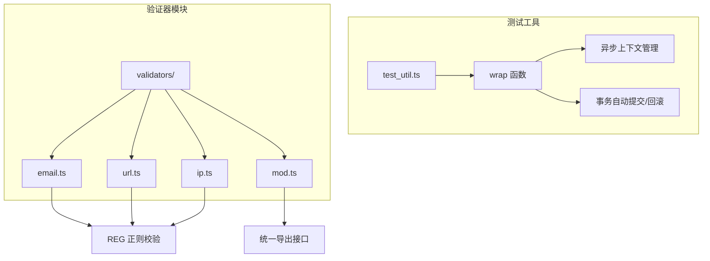
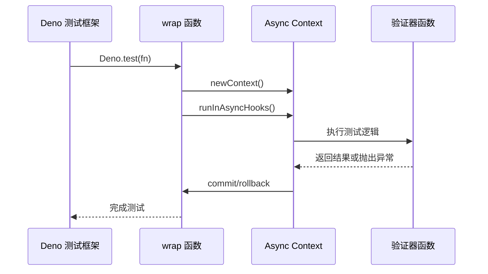
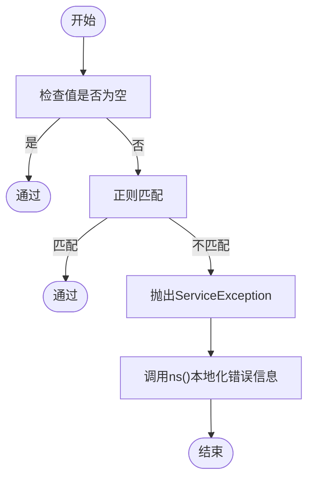
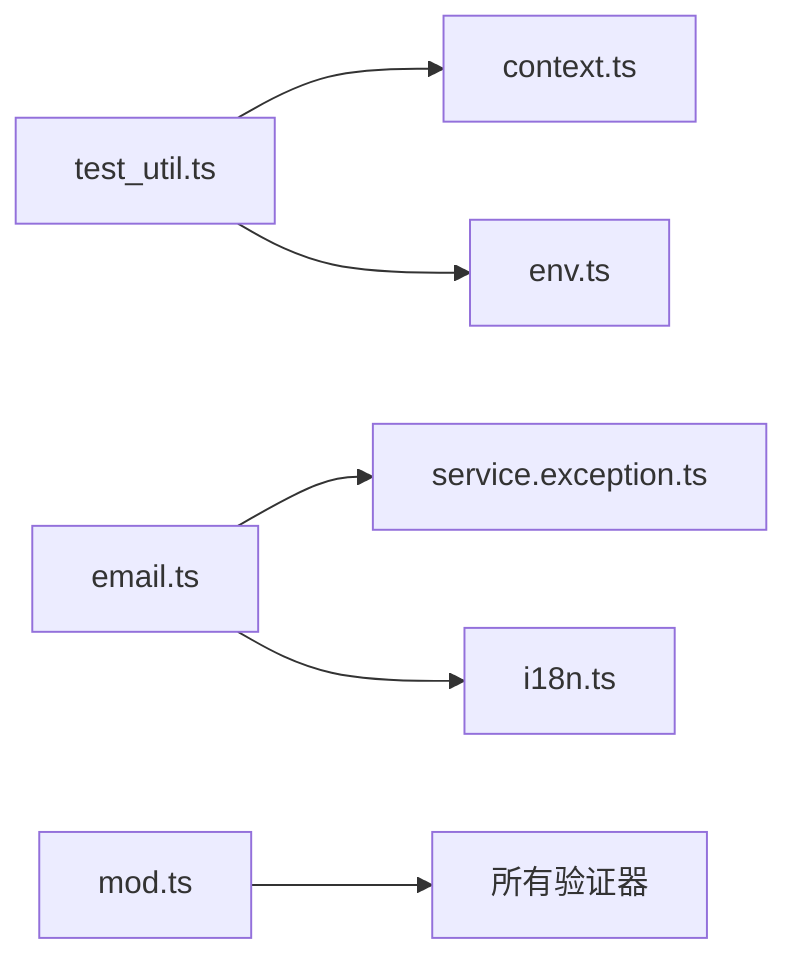

# 单元测试


**本文档中引用的文件**   
- [test_util.ts](https://github.com/sail-sail/nest/blob/main/deno/lib/util/test_util.ts)
- [email.ts](https://github.com/sail-sail/nest/blob/main/deno/lib/validators/email.ts)
- [url.ts](https://github.com/sail-sail/nest/blob/main/deno/lib/validators/url.ts)
- [mod.ts](https://github.com/sail-sail/nest/blob/main/deno/lib/validators/mod.ts)


## 目录
1. [简介](#简介)
2. [项目结构](#项目结构)
3. [核心组件](#核心组件)
4. [架构概述](#架构概述)
5. [详细组件分析](#详细组件分析)
6. [依赖分析](#依赖分析)
7. [性能考量](#性能考量)
8. [故障排除指南](#故障排除指南)
9. [结论](#结论)

## 简介
本文档旨在详细介绍如何使用 Deno 内置测试框架对核心函数进行单元测试。重点涵盖测试用例的编写规范、异步测试处理、测试覆盖率分析以及常见问题的解决方案。通过分析 `test_util.ts` 中的工具函数和 `validators` 目录下的验证器实现，展示如何为纯函数编写可维护、高覆盖率的测试代码。

## 项目结构
本项目采用模块化分层结构，测试相关代码主要分布在 `deno/lib/util` 和 `deno/lib/validators` 目录中。`util` 目录包含通用工具函数，如 `test_util.ts` 提供测试上下文封装；`validators` 目录则包含一系列数据验证函数，如邮箱、URL 格式校验等。



**图示来源**
- [test_util.ts](https://github.com/sail-sail/nest/blob/main/deno/lib/util/test_util.ts#L1-L35)
- [validators/email.ts](https://github.com/sail-sail/nest/blob/main/deno/lib/validators/email.ts#L1-L27)
- [validators/url.ts](https://github.com/sail-sail/nest/blob/main/deno/lib/validators/url.ts#L1-L27)

**本节来源**
- [test_util.ts](https://github.com/sail-sail/nest/blob/main/deno/lib/util/test_util.ts#L1-L35)
- [validators/email.ts](https://github.com/sail-sail/nest/blob/main/deno/lib/validators/email.ts#L1-L27)

## 核心组件
核心测试组件包括 `test_util.ts` 中的 `wrap` 函数和 `validators` 目录下的各类验证器。`wrap` 函数用于封装测试逻辑，自动管理数据库事务和上下文生命周期；验证器函数则实现具体的业务规则校验，返回标准化错误信息。

**本节来源**
- [test_util.ts](https://github.com/sail-sail/nest/blob/main/deno/lib/util/test_util.ts#L1-L35)
- [validators/email.ts](https://github.com/sail-sail/nest/blob/main/deno/lib/validators/email.ts#L1-L27)
- [validators/url.ts](https://github.com/sail-sail/nest/blob/main/deno/lib/validators/url.ts#L1-L27)

## 架构概述
系统采用 Deno 原生测试框架，结合自定义工具函数实现高效的单元测试。测试架构分为三层：测试入口层调用 Deno.test，逻辑封装层使用 `wrap` 函数管理上下文，验证实现层提供具体校验逻辑。



**图示来源**
- [test_util.ts](https://github.com/sail-sail/nest/blob/main/deno/lib/util/test_util.ts#L10-L30)
- [validators/email.ts](https://github.com/sail-sail/nest/blob/main/deno/lib/validators/email.ts#L15-L25)

## 详细组件分析

### test_util.ts 分析
`test_util.ts` 提供了 `wrap` 工具函数，用于简化异步测试中的上下文管理和事务控制。

```mermaid
classDiagram
class wrap {
+callback : () => Promise<void>
+context : Context
+runInAsyncHooks(context, fn)
+commit()
+rollback()
+close(context)
}
wrap : +wrap(callback) : () => Promise<void>
wrap : +自动处理事务提交与回滚
wrap : +支持异步钩子上下文
```

**图示来源**
- [test_util.ts](https://github.com/sail-sail/nest/blob/main/deno/lib/util/test_util.ts#L10-L30)

**本节来源**
- [test_util.ts](https://github.com/sail-sail/nest/blob/main/deno/lib/util/test_util.ts#L1-L35)

### 验证器模块分析
`validators` 模块提供标准化的数据校验功能，以 `email` 和 `url` 验证为例：



**图示来源**
- [email.ts](https://github.com/sail-sail/nest/blob/main/deno/lib/validators/email.ts#L10-L25)
- [url.ts](https://github.com/sail-sail/nest/blob/main/deno/lib/validators/url.ts#L10-L25)

**本节来源**
- [email.ts](https://github.com/sail-sail/nest/blob/main/deno/lib/validators/email.ts#L1-L27)
- [url.ts](https://github.com/sail-sail/nest/blob/main/deno/lib/validators/url.ts#L1-L27)

## 依赖分析
各组件间存在明确的依赖关系，`validators` 模块依赖 `exceptions` 和 `i18n` 模块提供错误处理和多语言支持。



**图示来源**
- [test_util.ts](https://github.com/sail-sail/nest/blob/main/deno/lib/util/test_util.ts#L3-L5)
- [email.ts](https://github.com/sail-sail/nest/blob/main/deno/lib/validators/email.ts#L3-L5)
- [mod.ts](https://github.com/sail-sail/nest/blob/main/deno/lib/validators/mod.ts#L1-L12)

**本节来源**
- [test_util.ts](https://github.com/sail-sail/nest/blob/main/deno/lib/util/test_util.ts#L1-L35)
- [validators/mod.ts](https://github.com/sail-sail/nest/blob/main/deno/lib/validators/mod.ts#L1-L12)

## 性能考量
- `wrap` 函数通过复用上下文减少初始化开销
- 正则表达式预编译提升验证效率
- 异步错误捕获避免资源泄漏

## 故障排除指南
- **测试超时**：检查异步操作是否正确 await
- **事务未回滚**：确保使用 `wrap` 函数封装测试
- **错误信息不显示**：确认 `ns()` 函数正确加载语言包
- **依赖注入失败**：检查模块路径是否正确

**本节来源**
- [test_util.ts](https://github.com/sail-sail/nest/blob/main/deno/lib/util/test_util.ts#L20-L30)
- [email.ts](https://github.com/sail-sail/nest/blob/main/deno/lib/validators/email.ts#L20-L25)

## 结论
通过合理使用 `test_util.ts` 的 `wrap` 函数和 `validators` 模块的标准化接口，可以构建稳定、可维护的单元测试套件。建议所有核心业务逻辑都遵循此模式进行测试覆盖，确保代码质量和系统稳定性。