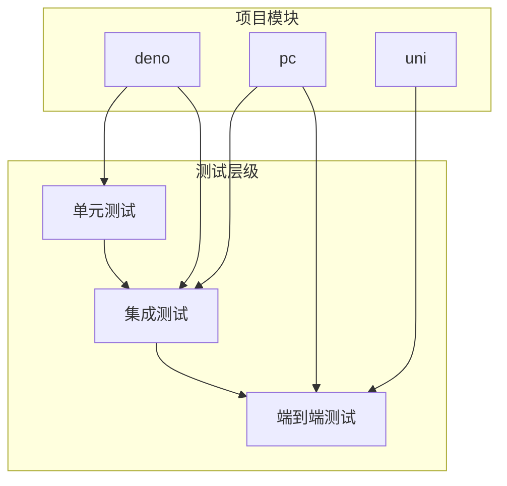
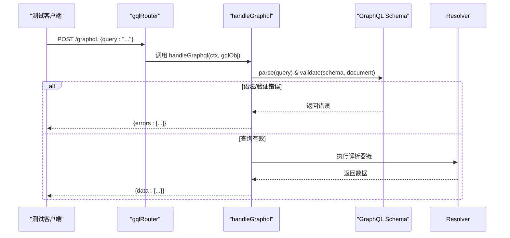
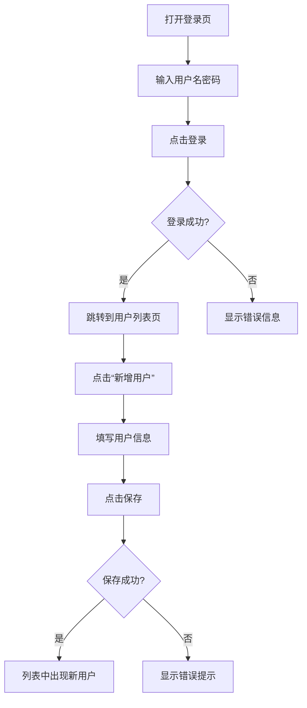

# 测试策略


**本文档引用文件**   
- [test_util.ts](https://github.com/sail-sail/nest/blob/main/deno/lib/util/test_util.ts)
- [encrypt.test.ts](https://github.com/sail-sail/nest/blob/main/deno/lib/script/encrypt.test.ts)
- [Test.test.ts](https://github.com/sail-sail/nest/blob/main/pc/src/test/Test.test.ts)
- [gql.ts](https://github.com/sail-sail/nest/blob/main/deno/lib/oak/gql.ts)
- [graphql.ts](https://github.com/sail-sail/nest/blob/main/pc/src/utils/graphql.ts)
- [graphql.config.js](https://github.com/sail-sail/nest/blob/main/pc/graphql.config.js)


## 目录
1. [引言](#引言)
2. [项目结构与测试布局](#项目结构与测试布局)
3. [单元测试规范与实现](#单元测试规范与实现)
4. [集成测试方法](#集成测试方法)
5. [端到端测试方案](#端到端测试方案)
6. [测试用例设计指南](#测试用例设计指南)
7. [测试工具与环境配置](#测试工具与环境配置)
8. [测试覆盖率与持续集成](#测试覆盖率与持续集成)

## 引言
本测试策略文档旨在为 `hugjs/nest` 项目建立完整的测试体系，确保系统功能的稳定性与可靠性。文档涵盖单元测试、集成测试和端到端测试的实施方法，提供测试用例设计、工具使用、环境配置及持续集成流程的详细说明。通过系统化的测试策略，提升代码质量，降低生产环境故障风险。

## 项目结构与测试布局
项目采用多模块架构，包含 `codegen`、`deno`（后端服务）、`pc`（前端管理界面）和 `uni`（跨平台应用）等核心模块。测试文件分布于各模块的 `test` 或 `__tests__` 目录中，如 `deno/lib/script/encrypt.test.ts` 和 `pc/src/test/Test.test.ts`。



**图示来源**
- [test_util.ts](https://github.com/sail-sail/nest/blob/main/deno/lib/util/test_util.ts)
- [Test.test.ts](https://github.com/sail-sail/nest/blob/main/pc/src/test/Test.test.ts)

## 单元测试规范与实现
单元测试聚焦于验证单个函数或类的逻辑正确性。本项目后端使用 Deno 内置测试框架，前端使用 Vitest。

### 核心测试工具
`test_util.ts` 提供了 `wrap` 函数，用于在数据库事务上下文中运行测试，确保测试数据的隔离与回滚。

```typescript
// deno/lib/util/test_util.ts
export function wrap(callback: () => Promise<void>) {
  return async () => {
    const context = newContext(undefined as any);
    context.notVerifyToken = true;
    context.is_tran = true;
    await runInAsyncHooks(context, async () => {
      try {
        await callback();
      } catch(err) {
        await rollback();
        throw err;
      } finally {
        await commit();
        await close(context);
      }
    });
  };
}
```
该函数创建一个异步上下文，开启事务，执行测试回调。若测试失败则回滚事务，成功则提交，最后关闭连接，保证了测试的原子性和数据清洁。

### 测试示例
`encrypt.test.ts` 展示了如何使用 Deno 进行加密功能的单元测试，验证 AES-CBC 加解密的正确性。
```typescript
// deno/lib/script/encrypt.test.ts
const encrypt = await crypto.subtle.encrypt({ name: "AES-CBC", iv }, key, encryptedData);
const decrypt = await crypto.subtle.decrypt({ name: "AES-CBC", iv }, key, decodeBase64(str2));
console.log(new TextDecoder().decode(decrypt)); // 应输出原始字符串
```

**测试规范**
- **命名约定**：测试文件以 `.test.ts` 或 `.spec.ts` 结尾。
- **独立性**：每个测试用例必须独立，不依赖其他用例的执行结果。
- **可重复性**：利用 `wrap` 函数确保数据库状态在每次测试后重置。
- **断言**：使用框架提供的断言库（如 Deno 的 `assertEquals`）进行结果验证。

**中文(测试规范)**
- **命名约定**：测试文件以 `.test.ts` 或 `.spec.ts` 结尾。
- **独立性**：每个测试用例必须独立，不依赖其他用例的执行结果。
- **可重复性**：利用 `wrap` 函数确保数据库状态在每次测试后重置。
- **断言**：使用框架提供的断言库（如 Deno 的 `assertEquals`）进行结果验证。

**节来源**
- [test_util.ts](https://github.com/sail-sail/nest/blob/main/deno/lib/util/test_util.ts#L1-L35)
- [encrypt.test.ts](https://github.com/sail-sail/nest/blob/main/deno/lib/script/encrypt.test.ts#L1-L55)

## 集成测试方法
集成测试用于验证模块间的交互，特别是 GraphQL API 端点与数据访问层的正确性。

### GraphQL API 测试
后端通过 `gql.ts` 中的 `handleGraphql` 函数处理所有 GraphQL 请求。集成测试需模拟 HTTP 请求，验证查询解析、执行和错误处理。



**关键点**
1.  **请求验证**：`gqlRouter.post("/graphql")` 首先检查请求体是否为 JSON。
2.  **查询解析与验证**：`handleGraphql` 函数解析查询字符串并使用 `validate` 函数对照 Schema 进行验证。
3.  **错误处理**：捕获并格式化所有错误，通过 `response.body.errors` 返回。

### 前端集成测试
前端 `pc` 和 `uni` 模块通过 `graphql.ts` 中的 `query` 和 `mutation` 函数与后端通信。集成测试可直接调用这些函数，传入真实的或模拟的 GraphQL 查询。

```typescript
// pc/src/utils/graphql.ts
export async function query(gqlArg: GqlArg, opt?: GqlOpt): Promise<any> {
  // ... 请求构建逻辑
  if (!gqlArg.query.startsWith("query")) {
    throw new Error("query must start with 'query'");
  }
  // ... 发送请求
}
```
测试时，可传入一个有效的查询对象，断言返回结果符合预期。

**节来源**
- [gql.ts](https://github.com/sail-sail/nest/blob/main/deno/lib/oak/gql.ts#L186-L380)
- [graphql.ts](https://github.com/sail-sail/nest/blob/main/pc/src/utils/graphql.ts#L89-L129)

## 端到端测试方案
端到端测试模拟真实用户操作，从 UI 层面验证整个应用流程。

### 测试范围
- **用户登录与认证**：验证登录流程、Token 生成与存储。
- **核心业务流程**：如创建、查询、修改、删除（CRUD）操作。
- **权限控制**：验证不同角色对数据的访问权限。
- **UI 交互**：验证表单提交、按钮点击、数据展示等。

### 实现方案
1.  **工具选择**：推荐使用 Playwright 或 Cypress 进行浏览器自动化测试。
2.  **环境配置**：使用 `graphql.config.js` 中的配置连接到测试环境的 GraphQL 服务。
    ```javascript
    // pc/graphql.config.js
    module.exports = {
      schema: [ "http://localhost:4001/graphql" ],
      extensions: {
        endpoints: {
          default: {
            url: "http://localhost:4001/graphql",
            headers: { /* 测试用 Token */ }
          }
        }
      }
    };
    ```
3.  **测试脚本**：编写脚本模拟用户打开页面、输入凭据、执行操作并验证结果。

### 示例流程（用户管理）


**节来源**
- [graphql.config.js](https://github.com/sail-sail/nest/blob/main/pc/graphql.config.js#L1-L13)
- [Test.test.ts](https://github.com/sail-sail/nest/blob/main/pc/src/test/Test.test.ts#L1-L11)

## 测试用例设计指南
高质量的测试用例是保障软件质量的关键。

### 边界条件
- **数值**：测试最小值、最大值、零值、负数。
- **字符串**：测试空字符串、超长字符串、特殊字符。
- **集合**：测试空数组、单元素数组、大量元素。
- **时间**：测试过去、现在、未来的日期。

### 异常处理
- **网络错误**：模拟网络超时、连接中断。
- **服务错误**：测试后端返回 5xx 错误码。
- **业务逻辑错误**：测试违反业务规则的操作（如删除被引用的数据）。
- **输入验证**：测试非法输入（如 `query` 不以 "query" 开头）。

### 性能测试
- **API 响应时间**：测量关键 API 的 P95、P99 延迟。
- **并发能力**：模拟多用户并发操作，测试系统吞吐量和稳定性。
- **资源消耗**：监控 CPU、内存使用情况。

## 测试工具与环境配置
### 工具栈
- **后端**：Deno 内置测试框架 (`Deno.test`)。
- **前端**：Vitest (基于 Vite)。
- **端到端**：Playwright / Cypress。
- **代码生成**：GraphQL Codegen (`@graphql-codegen/cli`)。

### 环境配置
1.  **测试数据库**：为测试使用独立的数据库实例，避免污染生产或开发数据。
2.  **测试配置**：在 `deno` 项目中，通过 `build-test` 脚本 (`deno run -A ./lib/script/build.ts --target linux --env test`) 指定测试环境。
3.  **依赖管理**：使用 `pnpm` 管理依赖，确保环境一致性。

### 运行测试套件
- **运行所有测试**：
  ```bash
  # 后端
  deno task test
  # 前端
  pnpm test
  ```
- **运行特定测试**：使用测试框架的过滤功能，如 `deno test --filter "encrypt"`。

**节来源**
- [package.json](https://github.com/sail-sail/nest/blob/main/deno/package.json#L1-L52)
- [npmGitCommit.js](https://github.com/sail-sail/nest/blob/main/codegen/src/util/npmGitCommit.js#L1-L32)

## 测试覆盖率与持续集成
### 测试覆盖率
- **目标**：核心业务逻辑的测试覆盖率应达到 80% 以上。
- **测量**：使用 Deno 的 `--coverage` 标志生成覆盖率报告。
- **监控**：在 CI/CD 流程中集成覆盖率检查，低于阈值则构建失败。

### 持续集成中的测试执行
1.  **触发**：代码推送到 `main` 或 `develop` 分支时触发 CI 流程。
2.  **流程**：
    - 拉取代码。
    - 安装依赖 (`pnpm install`)。
    - 构建项目 (`pnpm build`)。
    - **运行测试** (`pnpm test`)。
    - **生成覆盖率报告**。
    - （可选）部署到测试环境。
3.  **工具**：可使用 GitHub Actions、GitLab CI 或 Jenkins 实现。

**节来源**
- [codeapply.ts](https://github.com/sail-sail/nest/blob/main/codegen/src/bin/codeapply.ts#L1-L14)
- [codegen.ts](https://github.com/sail-sail/nest/blob/main/codegen/src/lib/codegen.ts#L590-L639)